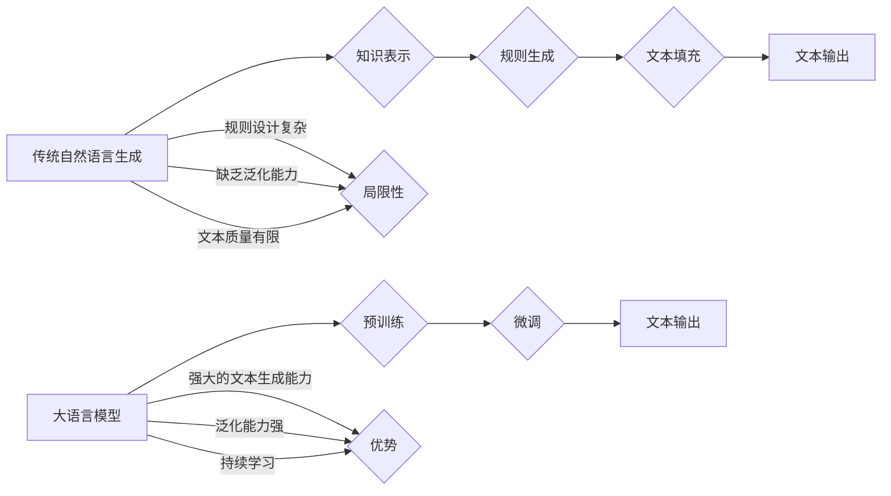

                 

## LLM与传统自然语言生成的对比

> 关键词：LLM, 自然语言生成, 传统方法, Transformer, BERT, GPT, 应用场景, 发展趋势

## 1. 背景介绍

自然语言生成 (Natural Language Generation, NLG) 作为人工智能领域的重要分支，旨在使机器能够以人类语言的形式生成文本。从早期基于规则的系统到如今的深度学习驱动的模型，NLG技术经历了长足发展。近年来，大语言模型 (Large Language Model, LLM) 的出现，以其强大的文本生成能力和泛化能力，彻底改变了自然语言生成领域的面貌。

传统自然语言生成方法主要依赖于规则和模板，需要人工设计复杂的语法规则和语义映射，难以处理复杂句式和多样化的文本内容。而LLM则通过学习海量文本数据，掌握了语言的复杂结构和语义关系，能够生成更流畅、更自然、更具创造性的文本。

## 2. 核心概念与联系

### 2.1 传统自然语言生成

传统自然语言生成方法通常采用以下步骤：

1. **知识表示:** 将待生成的文本内容转化为机器可理解的知识表示，例如逻辑表达式或概念图。
2. **规则生成:** 根据预先定义的语法规则和语义映射，生成文本结构和内容。
3. **文本填充:** 将知识表示填充到文本结构中，生成最终的文本输出。

传统方法的局限性在于：

* **规则设计复杂:** 需要人工设计复杂的语法规则和语义映射，难以处理复杂句式和多样化的文本内容。
* **缺乏泛化能力:** 难以应对从未见过的文本类型和场景。
* **文本质量有限:** 生成的文本往往缺乏自然流畅度和创造性。

### 2.2  大语言模型 (LLM)

LLM是一种基于深度学习的强大文本生成模型，其核心是Transformer架构。Transformer通过自注意力机制 (Self-Attention) 学习文本序列之间的长距离依赖关系，能够捕捉语言的复杂结构和语义关系。

LLM的训练过程主要包括以下步骤：

1. **预训练:** 在海量文本数据上进行预训练，学习语言的语法和语义知识。
2. **微调:** 在特定任务数据上进行微调，例如文本分类、机器翻译、文本摘要等。

LLM的优势在于：

* **强大的文本生成能力:** 能够生成流畅、自然、富有创造性的文本。
* **泛化能力强:** 能够应对各种文本类型和任务。
* **持续学习:** 可以通过不断学习新的数据来提升性能。

### 2.3  核心概念关系



## 3. 核心算法原理 & 具体操作步骤

### 3.1  算法原理概述

LLM的核心算法是Transformer架构，其主要特点是自注意力机制。自注意力机制能够学习文本序列中每个词与其他词之间的关系，从而捕捉语言的复杂结构和语义关系。

### 3.2  算法步骤详解

1. **词嵌入:** 将每个词转化为向量表示，例如Word2Vec或GloVe。
2. **多头自注意力:** 对每个词的向量表示进行多头自注意力计算，学习每个词与其他词之间的关系。
3. **前馈神经网络:** 对每个词的注意力输出进行前馈神经网络处理，进一步提取语义信息。
4. **位置编码:** 添加位置信息到词向量中，使模型能够理解词序信息。
5. **解码器:** 使用解码器生成目标文本序列，例如GPT的解码器结构。

### 3.3  算法优缺点

**优点:**

* 能够捕捉长距离依赖关系，生成更流畅、更自然的文本。
* 泛化能力强，能够应对各种文本类型和任务。
* 训练效率高，能够在海量数据上进行高效训练。

**缺点:**

* 计算复杂度高，需要大量的计算资源进行训练和推理。
* 训练数据量大，需要大量的文本数据进行预训练。
* 容易受到训练数据偏差的影响，生成文本可能存在偏见或错误。

### 3.4  算法应用领域

LLM在自然语言生成领域有着广泛的应用，例如：

* **机器翻译:** 将一种语言翻译成另一种语言。
* **文本摘要:** 生成文本的简短摘要。
* **对话系统:** 创建能够与人类进行自然对话的聊天机器人。
* **内容创作:** 生成新闻文章、故事、诗歌等各种文本内容。

## 4. 数学模型和公式 & 详细讲解 & 举例说明

### 4.1  数学模型构建

LLM的数学模型主要基于Transformer架构，其核心是自注意力机制。自注意力机制可以表示为以下公式：

$$
Attention(Q, K, V) = softmax(\frac{QK^T}{\sqrt{d_k}})V
$$

其中：

* $Q$：查询矩阵
* $K$：键矩阵
* $V$：值矩阵
* $d_k$：键向量的维度
* $softmax$：softmax函数

### 4.2  公式推导过程

自注意力机制的目的是学习每个词与其他词之间的关系。

1. 将每个词的向量表示分别作为查询矩阵 $Q$、键矩阵 $K$ 和值矩阵 $V$。
2. 计算查询矩阵 $Q$ 与键矩阵 $K$ 的点积，并进行归一化处理，得到注意力权重矩阵。
3. 将注意力权重矩阵与值矩阵 $V$ 进行加权求和，得到每个词的注意力输出。

### 4.3  案例分析与讲解

例如，在句子 "The cat sat on the mat" 中，每个词的注意力输出可以表示每个词与其他词之间的关系。

* "The" 的注意力输出会对 "cat" 和 "mat" 产生较高的权重，因为它们是 "The" 所指代的对象。
* "cat" 的注意力输出会对 "sat" 和 "on" 产生较高的权重，因为它们描述了 "cat" 的动作和位置。

## 5. 项目实践：代码实例和详细解释说明

### 5.1  开发环境搭建

* Python 3.7+
* PyTorch 或 TensorFlow
* CUDA 和 cuDNN (可选)

### 5.2  源代码详细实现

```python
import torch
import torch.nn as nn

class Transformer(nn.Module):
    def __init__(self, vocab_size, embedding_dim, num_heads, num_layers):
        super(Transformer, self).__init__()
        self.embedding = nn.Embedding(vocab_size, embedding_dim)
        self.transformer_layers = nn.ModuleList([
            nn.TransformerEncoderLayer(embedding_dim, num_heads)
            for _ in range(num_layers)
        ])
        self.linear = nn.Linear(embedding_dim, vocab_size)

    def forward(self, x):
        x = self.embedding(x)
        for layer in self.transformer_layers:
            x = layer(x)
        x = self.linear(x)
        return x
```

### 5.3  代码解读与分析

* `__init__` 方法初始化模型参数，包括词嵌入层、Transformer编码器层和线性输出层。
* `forward` 方法定义模型的正向传播过程，将输入序列经过词嵌入层、Transformer编码器层和线性输出层，最终得到输出序列。

### 5.4  运行结果展示

训练好的LLM模型可以用于各种自然语言生成任务，例如文本生成、机器翻译、文本摘要等。

## 6. 实际应用场景

LLM在各个领域都有着广泛的应用，例如：

* **教育:** 自动生成学习材料、提供个性化学习辅导。
* **医疗:** 辅助医生诊断疾病、生成医疗报告。
* **客服:** 自动回复客户咨询、提供24小时在线服务。
* **娱乐:** 生成故事、诗歌、剧本等创意内容。

### 6.4  未来应用展望

随着LLM技术的不断发展，其应用场景将更加广泛，例如：

* **代码生成:** 自动生成代码，提高开发效率。
* **科学研究:** 辅助科学家进行数据分析、模型构建。
* **艺术创作:** 与人类艺术家合作，创作新的艺术作品。

## 7. 工具和资源推荐

### 7.1  学习资源推荐

* **书籍:**
    * "Speech and Language Processing" by Jurafsky and Martin
    * "Deep Learning" by Goodfellow, Bengio, and Courville
* **课程:**
    * Stanford CS224N: Natural Language Processing with Deep Learning
    * MIT 6.S191: Introduction to Deep Learning

### 7.2  开发工具推荐

* **PyTorch:** 深度学习框架，支持GPU加速。
* **TensorFlow:** 深度学习框架，提供丰富的工具和资源。
* **Hugging Face Transformers:** 提供预训练的LLM模型和工具。

### 7.3  相关论文推荐

* "Attention Is All You Need" by Vaswani et al.
* "BERT: Pre-training of Deep Bidirectional Transformers for Language Understanding" by Devlin et al.
* "GPT-3: Language Models are Few-Shot Learners" by Brown et al.

## 8. 总结：未来发展趋势与挑战

### 8.1  研究成果总结

LLM技术取得了显著的进展，能够生成更流畅、更自然、更具创造性的文本。其应用场景也越来越广泛，对各个领域产生了深远的影响。

### 8.2  未来发展趋势

* **模型规模更大:** 训练更大的LLM模型，提升其性能和泛化能力。
* **多模态生成:** 将文本生成与其他模态（例如图像、音频）融合，实现多模态生成。
* **可解释性增强:** 研究LLM的决策机制，提高其可解释性和可控性。

### 8.3  面临的挑战

* **计算资源需求高:** 训练大型LLM模型需要大量的计算资源，成本较高。
* **数据偏见问题:** 训练数据可能存在偏见，导致生成的文本也存在偏见或错误。
* **伦理问题:** LLM的应用可能引发伦理问题，例如信息操纵、隐私泄露等。

### 8.4  研究展望

未来，LLM技术将继续发展，并应用于更多领域。研究者将致力于解决LLM面临的挑战，使其更加安全、可靠、可解释。


## 9. 附录：常见问题与解答

**Q1: LLM与传统自然语言生成方法相比，有哪些优势？**

**A1:** LLM相比传统方法，具有以下优势：

* 强大的文本生成能力：能够生成更流畅、更自然、更具创造性的文本。
* 泛化能力强：能够应对各种文本类型和任务。
* 持续学习：可以不断学习新的数据来提升性能。

**Q2: 如何训练一个LLM模型？**

**A2:** 训练LLM模型需要以下步骤：

1. 收集海量文本数据。
2. 使用预训练模型进行预训练，例如BERT或GPT。
3. 在特定任务数据上进行微调。

**Q3: LLM有哪些应用场景？**

**A3:** LLM的应用场景非常广泛，例如：

* 机器翻译
* 文本摘要
* 对话系统
* 内容创作
* 代码生成
* 科学研究
* 艺术创作

**Q4: LLM面临哪些挑战？**

**A4:** LLM面临以下挑战：

* 计算资源需求高
* 数据偏见问题
* 伦理问题


作者：禅与计算机程序设计艺术 / Zen and the Art of Computer Programming 
<end_of_turn>

