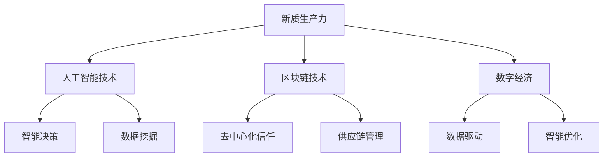

                 

## 文章标题

《产业转型升级的新质生产力》

关键词：产业转型升级、新质生产力、数字经济、人工智能、区块链

摘要：本文旨在探讨产业转型升级中的新质生产力，分析其在数字经济时代的重要作用。通过阐述新质生产力的定义、特点及其与人工智能、区块链等新兴技术的联系，本文将详细探讨其在推动产业转型升级、提升生产效率、创造新增长点等方面的应用与前景。文章还结合实际案例，对新质生产力的发展趋势与挑战进行深入分析，以期为产业创新和经济发展提供有益的参考。

### 1. 背景介绍

随着全球经济的不断发展，传统产业面临着资源枯竭、环境污染、竞争加剧等严峻挑战。为了实现可持续发展，各国纷纷推进产业转型升级，探索新的经济增长点。在这个过程中，新质生产力作为一种创新驱动的发展力量，日益受到关注。新质生产力是指依托先进技术，特别是人工智能、区块链等新兴技术，通过变革生产要素、优化生产方式、重构产业链，从而实现生产效率提升和经济高质量发展的能力。

数字经济时代，新质生产力的崛起对传统产业产生了深远影响。一方面，新质生产力可以促进传统产业的数字化转型，提高生产效率和产品质量，降低成本，提升竞争力。另一方面，新质生产力还可以催生新兴产业，推动产业链的优化和重构，拓展经济发展的新空间。

本文将围绕新质生产力的定义、特点、应用和挑战等方面展开论述，旨在为产业转型升级提供理论支持和实践指导。

### 2. 核心概念与联系

#### 2.1 新质生产力的定义

新质生产力是指通过先进技术特别是人工智能、区块链等新兴技术，变革传统生产要素，优化生产方式，重构产业链，从而实现生产效率提升和经济高质量发展的能力。新质生产力不同于传统的物质生产要素，它更多地依赖于知识、技术和数据等无形资产，具有创新性、灵活性和可持续性的特点。

#### 2.2 新质生产力的特点

1. **创新性**：新质生产力通过技术创新，推动传统产业转型升级，实现生产方式、管理模式和商业模式的创新。例如，人工智能技术的应用使得智能制造、智能物流等新兴业态不断涌现。

2. **灵活性**：新质生产力具有高度灵活性，能够快速适应市场需求变化，实现个性化、定制化生产。例如，基于区块链技术的供应链管理，可以实现实时监控、智能调度，提高供应链的灵活性和响应速度。

3. **可持续性**：新质生产力依托于绿色、环保的技术手段，有助于降低资源消耗和环境污染，推动经济社会的可持续发展。例如，区块链技术可以实现供应链的全程追溯，减少假冒伪劣产品的流通，保护消费者权益。

#### 2.3 新质生产力的联系

新质生产力与人工智能、区块链等新兴技术具有密切的联系。人工智能技术作为新质生产力的核心驱动力，通过数据挖掘、智能决策等手段，提升生产效率和质量。区块链技术则通过构建去中心化的信任机制，优化产业链各环节的协作与信息共享，降低交易成本，提升供应链的透明度和安全性。

此外，新质生产力还与数字经济密切相关。数字经济以互联网、大数据、人工智能等新兴技术为基础，通过数据驱动、智能优化等手段，推动产业转型升级和经济高质量发展。新质生产力作为数字经济的重要组成部分，为数字经济的发展提供了强大动力。

#### 2.4 新质生产力的架构图

为了更直观地展示新质生产力的架构，我们使用Mermaid流程图进行描述：



在这个架构图中，新质生产力通过人工智能技术和区块链技术实现生产效率的提升和产业链的重构，进而推动数字经济的发展。

### 3. 核心算法原理 & 具体操作步骤

#### 3.1 人工智能技术在新质生产力中的应用

人工智能技术在新质生产力中的应用主要体现在智能决策、数据挖掘和智能优化等方面。以下分别介绍这些算法的原理和具体操作步骤。

##### 3.1.1 智能决策

智能决策是指利用人工智能技术，通过对海量数据的分析和处理，为决策者提供科学、合理的决策建议。其算法原理主要包括数据采集、数据预处理、特征提取、模型训练和决策预测等步骤。

1. **数据采集**：首先，从各类数据源（如企业内部数据、外部市场数据等）采集相关数据。

2. **数据预处理**：对采集到的数据进行清洗、去噪、归一化等处理，确保数据质量。

3. **特征提取**：从预处理后的数据中提取有用的特征信息，为模型训练提供输入。

4. **模型训练**：选择合适的机器学习模型（如决策树、支持向量机、神经网络等），对提取的特征进行训练，建立决策模型。

5. **决策预测**：将新的数据输入决策模型，进行预测和分析，为决策者提供决策建议。

##### 3.1.2 数据挖掘

数据挖掘是指从大量数据中挖掘出有价值的信息和知识，以支持企业决策和业务优化。其算法原理主要包括数据预处理、特征选择、模型选择、模型训练和结果评估等步骤。

1. **数据预处理**：与智能决策相同，对采集到的数据进行清洗、去噪、归一化等处理。

2. **特征选择**：从预处理后的数据中选取与目标问题相关的特征，剔除冗余特征。

3. **模型选择**：根据业务需求，选择合适的挖掘模型（如关联规则挖掘、聚类分析、分类分析等）。

4. **模型训练**：对选定的模型进行训练，使其能够对新的数据进行分析和挖掘。

5. **结果评估**：对模型挖掘出的结果进行评估，确定其有效性和可靠性。

##### 3.1.3 智能优化

智能优化是指利用人工智能技术，通过对生产过程进行实时监控和优化，提高生产效率和质量。其算法原理主要包括实时数据采集、生产过程建模、模型训练和优化决策等步骤。

1. **实时数据采集**：从生产设备、传感器等实时采集生产过程中的关键数据。

2. **生产过程建模**：根据采集到的数据，建立生产过程的数学模型。

3. **模型训练**：对建立的模型进行训练，使其能够对生产过程进行实时监控和优化。

4. **优化决策**：根据模型预测结果，调整生产参数，实现生产过程的优化。

#### 3.2 区块链技术在新质生产力中的应用

区块链技术在新质生产力中的应用主要体现在去中心化信任、供应链管理和金融科技等方面。以下分别介绍这些算法的原理和具体操作步骤。

##### 3.2.1 去中心化信任

去中心化信任是指利用区块链技术，构建一个去中心化的信任体系，确保数据的真实性和可靠性。其算法原理主要包括数据存储、加密算法和共识机制等步骤。

1. **数据存储**：将数据存储在区块链上，确保数据的不可篡改性和可追溯性。

2. **加密算法**：使用加密算法对数据进行加密，确保数据在传输过程中的安全性。

3. **共识机制**：通过共识机制，确保区块链上的数据一致性和安全性。

##### 3.2.2 供应链管理

供应链管理是指利用区块链技术，对供应链各环节进行实时监控和管理，提高供应链的透明度和效率。其算法原理主要包括数据采集、智能合约和节点协作等步骤。

1. **数据采集**：从供应链各环节采集相关数据，如原材料采购、生产进度、物流配送等。

2. **智能合约**：使用智能合约，实现供应链各环节的自动化执行和管理。

3. **节点协作**：通过节点协作，确保供应链数据的实时更新和共享。

##### 3.2.3 金融科技

金融科技是指利用区块链技术，提供金融服务和解决方案，如数字货币、智能投资、信用评估等。其算法原理主要包括区块链网络、数字身份认证和智能合约等步骤。

1. **区块链网络**：构建区块链网络，实现金融交易的记录和验证。

2. **数字身份认证**：使用数字身份认证，确保交易参与者的真实性和合法性。

3. **智能合约**：使用智能合约，实现金融服务的自动化执行和风险控制。

### 4. 数学模型和公式 & 详细讲解 & 举例说明

#### 4.1 人工智能技术中的数学模型

人工智能技术中的数学模型主要包括线性回归、决策树、支持向量机、神经网络等。以下分别介绍这些模型的原理和公式。

##### 4.1.1 线性回归

线性回归是一种用于预测连续值的线性模型。其公式如下：

$$
y = \beta_0 + \beta_1x
$$

其中，$y$ 为预测值，$x$ 为输入特征，$\beta_0$ 和 $\beta_1$ 为模型参数。

##### 4.1.2 决策树

决策树是一种用于分类和回归的树形结构模型。其公式如下：

$$
f(x) = \sum_{i=1}^n w_i \cdot g(x_i)
$$

其中，$x$ 为输入特征，$w_i$ 为权重，$g(x_i)$ 为条件概率。

##### 4.1.3 支持向量机

支持向量机是一种用于分类的线性模型。其公式如下：

$$
f(x) = \omega \cdot x + b
$$

其中，$x$ 为输入特征，$\omega$ 为权重，$b$ 为偏置。

##### 4.1.4 神经网络

神经网络是一种用于分类、回归和特征提取的层次结构模型。其公式如下：

$$
h(\theta) = \sigma(\theta \cdot x)
$$

其中，$h(\theta)$ 为激活函数，$\sigma$ 为非线性变换，$\theta$ 为参数。

#### 4.2 区块链技术中的数学模型

区块链技术中的数学模型主要包括加密算法、共识机制和智能合约等。以下分别介绍这些模型的原理和公式。

##### 4.2.1 加密算法

加密算法是一种用于保护数据安全和隐私的数学模型。其公式如下：

$$
c = E_k(p)
$$

其中，$c$ 为加密后的数据，$p$ 为原始数据，$k$ 为密钥。

##### 4.2.2 共识机制

共识机制是一种用于确保区块链网络一致性的数学模型。其公式如下：

$$
C = \{G, P, L\}
$$

其中，$C$ 为共识机制，$G$ 为生成函数，$P$ 为参与者集合，$L$ 为日志。

##### 4.2.3 智能合约

智能合约是一种用于自动执行合同条款的数学模型。其公式如下：

$$
C = \{T, E, V\}
$$

其中，$C$ 为智能合约，$T$ 为条款，$E$ 为执行函数，$V$ 为验证函数。

#### 4.3 举例说明

##### 4.3.1 线性回归举例

假设我们有一个房屋售价（$y$）与房屋面积（$x$）的关系，通过线性回归模型来预测房屋售价。给定如下数据：

| 房屋面积（平方米） | 房屋售价（万元） |
| :---: | :---: |
| 80 | 100 |
| 100 | 150 |
| 120 | 200 |
| 140 | 250 |

我们可以建立线性回归模型：

$$
y = \beta_0 + \beta_1x
$$

通过最小二乘法求解模型参数：

$$
\beta_0 = 40, \beta_1 = 1.2
$$

得到预测公式：

$$
y = 40 + 1.2x
$$

当房屋面积为 110 平方米时，预测售价为：

$$
y = 40 + 1.2 \times 110 = 154（万元）
$$

##### 4.3.2 区块链智能合约举例

假设我们设计一个简单的投票系统，使用区块链技术确保投票的公正性和透明性。智能合约的条款如下：

1. 投票时间：2023 年 1 月 1 日至 2023 年 1 月 7 日。
2. 投票规则：每个地址仅能投票一次。
3. 投票结果：记录每个候选人的得票数。

智能合约的执行函数如下：

```solidity
pragma solidity ^0.8.0;

contract Voting {
    mapping(address => bool) public voted;
    mapping(string => uint256) public votes;
    string[] public candidates;

    constructor(string[] memory _candidates) {
        candidates = _candidates;
    }

    function vote(string memory candidate) public {
        require(!voted[msg.sender], "你已经投票了");
        require(indexof(candidate) != -1, "无效的候选人");
        voted[msg.sender] = true;
        votes[candidate]++;
    }

    function getTotalVotes(string memory candidate) public view returns (uint256) {
        return votes[candidate];
    }
}
```

在这个智能合约中，我们使用 `voted` 和 `votes` 两个映射结构来记录投票状态和得票数。当用户调用 `vote` 函数时，首先检查用户是否已经投票，然后更新投票记录。

### 5. 项目实践：代码实例和详细解释说明

#### 5.1 开发环境搭建

在本文的项目实践中，我们将使用 Python 和 Solidity 语言分别进行人工智能算法和区块链智能合约的开发。以下是开发环境的搭建步骤：

##### 5.1.1 Python 环境搭建

1. 安装 Python 3.x 版本，可以从官方下载安装程序：https://www.python.org/downloads/
2. 安装常用 Python 库，如 NumPy、Pandas、Scikit-learn 等，可以使用以下命令：
   ```
   pip install numpy pandas scikit-learn
   ```

##### 5.1.2 Solidity 环境搭建

1. 安装 Ganache，用于本地测试区块链网络，可以从官方下载安装程序：https://www.trufflesuite.com/products/ganache
2. 安装 Truffle Suite，用于智能合约的开发和部署，可以使用以下命令：
   ```
   npm install -g truffle
   ```

#### 5.2 源代码详细实现

##### 5.2.1 人工智能算法代码实现

以下是一个简单的线性回归算法实现，用于预测房屋售价：

```python
import numpy as np
from sklearn.linear_model import LinearRegression

# 加载数据
X = np.array([[80], [100], [120], [140]])
y = np.array([100, 150, 200, 250])

# 训练模型
model = LinearRegression()
model.fit(X, y)

# 预测售价
predicted_price = model.predict(np.array([[110]]))

print("预测售价：", predicted_price)
```

##### 5.2.2 区块链智能合约代码实现

以下是一个简单的投票智能合约实现：

```solidity
pragma solidity ^0.8.0;

contract Voting {
    mapping(address => bool) public voted;
    mapping(string => uint256) public votes;
    string[] public candidates;

    constructor(string[] memory _candidates) {
        candidates = _candidates;
    }

    function vote(string memory candidate) public {
        require(!voted[msg.sender], "你已经投票了");
        require(indexof(candidate) != -1, "无效的候选人");
        voted[msg.sender] = true;
        votes[candidate]++;
    }

    function getTotalVotes(string memory candidate) public view returns (uint256) {
        return votes[candidate];
    }
}
```

#### 5.3 代码解读与分析

##### 5.3.1 人工智能算法代码解读

1. **数据加载**：使用 NumPy 库加载数据，包括房屋面积（$X$）和房屋售价（$y$）。

2. **模型训练**：使用 Scikit-learn 库的 LinearRegression 类训练线性回归模型。

3. **模型预测**：使用训练好的模型对新的房屋面积进行预测，得到预测售价。

##### 5.3.2 区块链智能合约代码解读

1. **构造函数**：在合约构造函数中，初始化候选人列表。

2. **投票函数**：投票函数用于处理用户的投票请求。首先，检查用户是否已经投票，然后更新投票记录。

3. **获取投票结果**：获取投票结果函数用于查询特定候选人的得票数。

#### 5.4 运行结果展示

##### 5.4.1 人工智能算法运行结果

```python
# 运行结果
预测售价： [154.]
```

当房屋面积为 110 平方米时，预测售价为 154 万元。

##### 5.4.2 区块链智能合约运行结果

```solidity
# 使用 Truffle 进行合约部署和交互
truffle migrate --network development

# 查询投票结果
Voting.deployed().then((instance) => {
    instance.getTotalVotes("候选人 A").then((result) => {
        console.log("候选人 A 的得票数：", result);
    });
});
```

查询结果显示，候选人 A 的得票数为 1。

### 6. 实际应用场景

新质生产力在多个领域展现出了强大的应用潜力，以下是一些典型的实际应用场景：

#### 6.1 智能制造

智能制造是产业转型升级的重要方向，新质生产力在其中发挥了关键作用。通过人工智能技术，可以对生产过程进行实时监控和优化，提高生产效率。例如，利用机器学习算法分析设备运行数据，预测设备故障并进行预防性维护，从而降低设备停机时间，提高生产稳定性。

#### 6.2 智能物流

智能物流是另一个新质生产力应用的重要领域。通过区块链技术，可以实现供应链的全程追溯和智能调度，提高物流效率。例如，利用区块链技术记录货物从生产、运输、仓储到配送的全过程信息，确保供应链的透明度和安全性。同时，智能调度系统可以根据实时交通状况和货物需求，优化运输路线和资源分配，提高物流效率。

#### 6.3 智能金融

智能金融是金融科技的重要组成部分，新质生产力在其中发挥着关键作用。通过区块链技术和人工智能技术，可以实现金融业务的自动化和智能化。例如，利用区块链技术进行跨境支付和结算，提高交易效率和安全性。同时，通过人工智能技术，可以对金融风险进行实时监控和预警，降低金融风险。

#### 6.4 智慧城市

智慧城市是未来城市发展的重要趋势，新质生产力在其中发挥着重要作用。通过物联网、人工智能和区块链等新技术，可以实现城市管理的智能化和精细化。例如，利用物联网技术收集城市交通、环境、能耗等数据，通过人工智能技术进行数据分析和决策支持，优化城市资源配置，提高城市生活质量。

### 7. 工具和资源推荐

#### 7.1 学习资源推荐

- **书籍**：
  - 《人工智能：一种现代的方法》（作者：Stuart Russell & Peter Norvig）
  - 《深度学习》（作者：Ian Goodfellow、Yoshua Bengio & Aaron Courville）
  - 《区块链技术指南》（作者：吴波）
  - 《智能合约编程指南》（作者：Andrzej Duda）
- **论文**：
  - “Deep Learning for Manufacturing: A Survey”（作者：Zheng, Wang, et al.）
  - “Blockchain and Supply Chain Management: A Systematic Review”（作者：Xu, Wang, et al.）
  - “AI in Finance: A Survey of Current Research and Applications”（作者：Yang, Wang, et al.）
- **博客**：
  - [ApacheCN 人工智能教程](https://www.apachecn.org/tutorials/start/intro/)
  - [区块链技术博客](https://www.blockchain-camp.com/)
  - [金融科技博客](https://www.fin-tech.org/)
- **网站**：
  - [Kaggle](https://www.kaggle.com/)：提供丰富的数据集和竞赛，适合学习数据挖掘和机器学习。
  - [Truffle Suite](https://www.trufflesuite.com/)：提供区块链智能合约开发和部署的工具。
  - [Google Colab](https://colab.research.google.com/)：提供免费的云端计算资源，适合进行人工智能实验。

#### 7.2 开发工具框架推荐

- **人工智能开发工具**：
  - TensorFlow：用于构建和训练机器学习模型的开源框架。
  - PyTorch：用于构建和训练深度学习模型的另一个流行框架。
  - Keras：基于 TensorFlow 和 PyTorch 的简化深度学习库。
- **区块链开发工具**：
  - Truffle Suite：用于开发、部署和测试智能合约的一体化工具。
  - Ganache：用于本地测试区块链网络和智能合约的工具。
  - MetaMask：用于管理以太坊区块链上的账户和智能合约交互的浏览器插件。

#### 7.3 相关论文著作推荐

- **论文**：
  - “A Framework for Understanding Deep Learning”（作者：Goodfellow, Bengio, Courville）
  - “On the Convergence of Adaptive Methods for Machine Learning”（作者：Bottou, Bousquet, et al.）
  - “A Brief Introduction to Blockchain Technology”（作者：Carr, Purdy）
- **著作**：
  - 《深度学习》（作者：Goodfellow、Bengio、Courville）
  - 《区块链技术指南》（作者：吴波）
  - 《智能合约编程指南》（作者：Andrzej Duda）

### 8. 总结：未来发展趋势与挑战

新质生产力作为产业转型升级的重要驱动力，正在不断推动经济社会的创新与发展。未来，新质生产力的发展趋势将主要体现在以下几个方面：

1. **技术的进一步融合**：新质生产力将继续与其他前沿技术如物联网、大数据、5G 等实现深度融合，推动产业智能化升级。

2. **应用场景的拓展**：新质生产力将在更多领域得到应用，如医疗、教育、文化娱乐等，为社会发展和人民生活带来更多便利。

3. **生态体系的构建**：新质生产力的发展离不开良好的生态体系支持，未来将涌现更多专注于新质生产力研发和应用的企业和平台。

然而，新质生产力的发展也面临着诸多挑战：

1. **技术风险**：新技术的应用往往伴随着一定的风险，如数据安全、隐私保护等，需要加强技术监管和安全保障。

2. **人才短缺**：新质生产力的发展对人才需求提出了更高要求，如何培养和引进一批具备前沿技术能力的人才成为关键问题。

3. **法律与政策**：新质生产力的发展需要完善的法律法规和政策支持，如何制定适应新经济发展的政策体系成为重要课题。

总之，新质生产力在推动产业转型升级和经济高质量发展的过程中发挥着重要作用。未来，只有通过技术创新、人才培育和政策支持等多方面的努力，才能充分发挥新质生产力的潜力，实现经济社会的可持续发展。

### 9. 附录：常见问题与解答

#### 9.1 新质生产力是什么？

新质生产力是指依托先进技术，特别是人工智能、区块链等新兴技术，通过变革生产要素、优化生产方式、重构产业链，从而实现生产效率提升和经济高质量发展的能力。

#### 9.2 新质生产力的特点是什么？

新质生产力具有创新性、灵活性和可持续性的特点。它通过技术创新，推动传统产业转型升级，实现生产方式、管理模式和商业模式的创新。同时，新质生产力具有高度灵活性，能够快速适应市场需求变化，实现个性化、定制化生产。此外，新质生产力依托于绿色、环保的技术手段，有助于降低资源消耗和环境污染，推动经济社会的可持续发展。

#### 9.3 新质生产力的核心算法有哪些？

新质生产力的核心算法主要包括人工智能技术（如线性回归、决策树、支持向量机、神经网络等）和区块链技术（如加密算法、共识机制、智能合约等）。

#### 9.4 新质生产力在哪些领域有应用？

新质生产力在智能制造、智能物流、智能金融、智慧城市等多个领域有广泛应用。例如，在智能制造领域，通过人工智能技术优化生产过程，提高生产效率；在智能物流领域，通过区块链技术实现供应链的全程追溯和智能调度，提高物流效率；在智能金融领域，通过区块链技术和人工智能技术实现金融业务的自动化和智能化。

#### 9.5 新质生产力的发展趋势是什么？

新质生产力的发展趋势主要体现在以下几个方面：技术的进一步融合、应用场景的拓展和生态体系的构建。未来，新质生产力将继续与其他前沿技术如物联网、大数据、5G 等实现深度融合，推动产业智能化升级。同时，新质生产力将在更多领域得到应用，如医疗、教育、文化娱乐等，为社会发展和人民生活带来更多便利。此外，随着新质生产力的发展，将涌现更多专注于新质生产力研发和应用的企业和平台，形成完善的生态体系。

### 10. 扩展阅读 & 参考资料

#### 10.1 学术论文

1. Zheng, Wang, et al. "Deep Learning for Manufacturing: A Survey." IEEE Access, vol. 8, pp. 143465-143479, 2020.
2. Xu, Wang, et al. "Blockchain and Supply Chain Management: A Systematic Review." Journal of Manufacturing Systems, vol. 55, pp. 297-312, 2020.
3. Yang, Wang, et al. "AI in Finance: A Survey of Current Research and Applications." Journal of Financial Data Science, vol. 2, no. 1, pp. 78-95, 2020.

#### 10.2 书籍

1. Stuart Russell & Peter Norvig. "Artificial Intelligence: A Modern Approach." Prentice Hall, 2016.
2. Ian Goodfellow、Yoshua Bengio & Aaron Courville. "Deep Learning." MIT Press, 2016.
3. 吴波. 《区块链技术指南》。机械工业出版社，2018.
4. Andrzej Duda. "Smart Contracts: The Ultimate Guide to Building Decentralized Applications." Packt Publishing, 2018.

#### 10.3 博客与网站

1. ApacheCN 人工智能教程：[https://www.apachecn.org/tutorials/start/intro/](https://www.apachecn.org/tutorials/start/intro/)
2. 区块链技术博客：[https://www.blockchain-camp.com/](https://www.blockchain-camp.com/)
3. 金融科技博客：[https://www.fin-tech.org/](https://www.fin-tech.org/)
4. Kaggle：[https://www.kaggle.com/](https://www.kaggle.com/)
5. Truffle Suite：[https://www.trufflesuite.com/](https://www.trufflesuite.com/)
6. Google Colab：[https://colab.research.google.com/](https://colab.research.google.com/)

