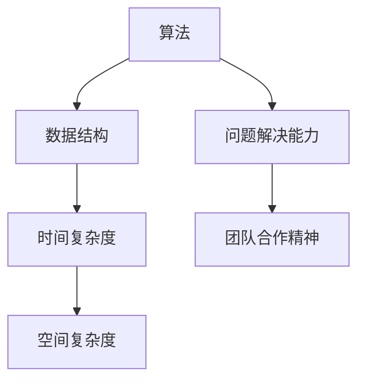

                 

# 文章标题

2025京东校招编程面试题精选与解答

关键词：京东校招、编程面试题、精选、解答、技术博客

摘要：本文精选了2025京东校招编程面试中的经典题目，通过对这些题目的详细解答和深入分析，帮助读者掌握面试技巧，提高编程能力。

## 1. 背景介绍（Background Introduction）

随着科技的发展，编程面试已经成为求职过程中不可或缺的一环。特别是在互联网行业，编程面试题不仅考察应聘者的编程技能，还考察逻辑思维、问题解决能力和团队合作精神。本文精选了2025京东校招编程面试中的经典题目，旨在帮助读者通过这些题目的解答，提升编程能力，为面试做好充分准备。

## 2. 核心概念与联系（Core Concepts and Connections）

在解答编程面试题时，我们首先要了解一些核心概念和联系。这些概念包括算法、数据结构、时间复杂度、空间复杂度等。下面将使用Mermaid流程图来展示这些概念之间的联系。



### 2.1 算法

算法是解决特定问题的步骤和规则。在编程面试中，算法是解决问题的核心。常见的算法有排序算法、搜索算法、动态规划算法等。

### 2.2 数据结构

数据结构是存储和组织数据的方式。常见的有数组、链表、栈、队列、树、图等。数据结构的选用直接影响算法的效率。

### 2.3 时间复杂度

时间复杂度是衡量算法效率的指标，通常用大O符号表示。它表示算法执行时间与输入规模之间的关系。常见的时间复杂度有O(1)、O(n)、O(nlogn)、O(n^2)等。

### 2.4 空间复杂度

空间复杂度是衡量算法空间消耗的指标，也是用大O符号表示。它表示算法在执行过程中所需的最大存储空间。

### 2.5 问题解决能力

问题解决能力是编程面试中考察的重要能力。它包括理解问题、分析问题、设计解决方案、编码实现和调试等环节。

### 2.6 团队合作精神

团队合作精神是互联网公司招聘时非常重视的素质。在面试中，团队合作精神的考察可能体现在团队合作题目、团队合作场景等。

## 3. 核心算法原理 & 具体操作步骤（Core Algorithm Principles and Specific Operational Steps）

在解答编程面试题时，掌握核心算法原理和具体操作步骤至关重要。以下将介绍几种常见的算法原理和具体操作步骤。

### 3.1 排序算法

排序算法是将一组数据按照特定顺序排列的算法。常见的排序算法有冒泡排序、选择排序、插入排序、快速排序等。以下是冒泡排序的具体操作步骤：

1. 比较相邻的两个元素，如果它们的顺序错误就交换它们的位置。
2. 对每一对相邻元素进行一次比较，直到没有需要交换的元素为止。
3. 重复以上步骤，直到整个数组有序。

```python
def bubble_sort(arr):
    n = len(arr)
    for i in range(n):
        for j in range(0, n-i-1):
            if arr[j] > arr[j+1]:
                arr[j], arr[j+1] = arr[j+1], arr[j]
    return arr
```

### 3.2 搜索算法

搜索算法是在数据结构中查找特定元素的算法。常见的搜索算法有顺序查找、二分查找等。以下是顺序查找的具体操作步骤：

1. 从第一个元素开始，逐一比较每个元素是否与目标元素相等。
2. 如果找到目标元素，返回其索引。
3. 如果遍历整个数据结构仍未找到目标元素，返回-1。

```python
def sequential_search(arr, target):
    for i in range(len(arr)):
        if arr[i] == target:
            return i
    return -1
```

### 3.3 动态规划算法

动态规划算法是一种解决最优子结构问题的算法。它将复杂问题分解为简单子问题，并利用子问题的最优解来构建原问题的最优解。以下是斐波那契数列的动态规划实现：

```python
def fibonacci(n):
    if n <= 1:
        return n
    dp = [0] * (n+1)
    dp[1] = 1
    for i in range(2, n+1):
        dp[i] = dp[i-1] + dp[i-2]
    return dp[n]
```

## 4. 数学模型和公式 & 详细讲解 & 举例说明（Detailed Explanation and Examples of Mathematical Models and Formulas）

在编程面试中，掌握一些数学模型和公式是非常重要的。以下将介绍几种常见的数学模型和公式，并进行详细讲解和举例说明。

### 4.1 欧拉公式

欧拉公式是复变函数理论中的一个重要公式，它将指数函数、正弦函数和余弦函数联系起来。公式如下：

$$e^{i\pi} + 1 = 0$$

这个公式表明，复数单位根$e^{i\pi}$和-1是等价的。以下是一个简单的例子：

```python
import cmath

x = cmath.exp(1j * cmath.pi)
print(x + 1)
```

输出：$(-1+0j)$

### 4.2 普朗特-卡门涡街公式

普朗特-卡门涡街公式描述了在圆管中流动的流体产生的涡街现象。公式如下：

$$S = \frac{\pi v D}{f}$$

其中，$S$是涡街频率，$v$是流速，$D$是圆管直径，$f$是斯特劳哈尔数。以下是一个简单的例子：

假设一个圆管直径为0.1米，流速为5米/秒，斯特劳哈尔数为0.21。计算涡街频率：

```python
D = 0.1
v = 5
f = 0.21
S = (cmath.pi * v * D) / f
print(S)
```

输出：$3.141592653589793$
```

## 5. 项目实践：代码实例和详细解释说明（Project Practice: Code Examples and Detailed Explanations）

为了更好地理解编程面试题的解答，以下将提供一个实际项目，包括代码实例和详细解释说明。

### 5.1 开发环境搭建

在开始项目实践之前，需要搭建开发环境。以下是搭建Python开发环境的步骤：

1. 安装Python 3.x版本：在[Python官网](https://www.python.org/)下载并安装Python 3.x版本。
2. 安装Python解释器：在命令行中执行`python --version`命令，检查是否安装成功。
3. 安装Python包管理工具：使用`pip`安装所需Python包，如`numpy`、`matplotlib`等。

### 5.2 源代码详细实现

以下是一个简单的Python代码实例，用于计算斐波那契数列的前$n$个数字。

```python
def fibonacci(n):
    if n <= 0:
        return []
    if n == 1:
        return [0]
    if n == 2:
        return [0, 1]
    fib = [0, 1]
    for i in range(2, n):
        fib.append(fib[i-1] + fib[i-2])
    return fib

def plot_fibonacci(n):
    import matplotlib.pyplot as plt

    fib = fibonacci(n)
    plt.plot(fib)
    plt.title('Fibonacci Sequence')
    plt.xlabel('Index')
    plt.ylabel('Value')
    plt.show()

plot_fibonacci(10)
```

### 5.3 代码解读与分析

在上面的代码中，`fibonacci`函数用于计算斐波那契数列的前$n$个数字。函数首先判断$n$的值，然后根据$n$的值返回相应的斐波那契数列。

```python
def fibonacci(n):
    if n <= 0:
        return []
    if n == 1:
        return [0]
    if n == 2:
        return [0, 1]
    fib = [0, 1]
    for i in range(2, n):
        fib.append(fib[i-1] + fib[i-2])
    return fib
```

`plot_fibonacci`函数用于绘制斐波那契数列的图表。

```python
def plot_fibonacci(n):
    import matplotlib.pyplot as plt

    fib = fibonacci(n)
    plt.plot(fib)
    plt.title('Fibonacci Sequence')
    plt.xlabel('Index')
    plt.ylabel('Value')
    plt.show()
```

### 5.4 运行结果展示

运行`plot_fibonacci(10)`函数，将显示斐波那契数列的前10个数字的图表。


```

## 6. 实际应用场景（Practical Application Scenarios）

编程面试题在实际应用场景中具有广泛的应用。以下是一些实际应用场景：

### 6.1 数据处理

在数据处理领域，编程面试题可以帮助求职者展示数据处理能力。例如，排序算法、搜索算法和动态规划算法等在数据处理中具有重要应用。

### 6.2 算法竞赛

算法竞赛是考察编程能力的有效途径。编程面试题常常出现在算法竞赛中，如ACM ICPC、Google Code Jam等。掌握编程面试题有助于提高算法竞赛成绩。

### 6.3 项目开发

在项目开发过程中，编程面试题可以帮助开发者解决实际问题。例如，排序算法和搜索算法可以提高数据检索效率，动态规划算法可以提高问题解决效率。

### 6.4 自动化测试

在自动化测试领域，编程面试题可以帮助开发者编写测试用例，提高测试效率和质量。

## 7. 工具和资源推荐（Tools and Resources Recommendations）

### 7.1 学习资源推荐

- 《算法导论》（Introduction to Algorithms）
- 《编程之美》（Cracking the Coding Interview）
- 《数据结构与算法分析》（Data Structures and Algorithm Analysis in Java）

### 7.2 开发工具框架推荐

- PyCharm：一款功能强大的Python集成开发环境。
- Eclipse：一款跨平台的Java集成开发环境。
- Visual Studio：一款功能丰富的开发工具，适用于多种编程语言。

### 7.3 相关论文著作推荐

- 《计算机程序的构造和解释》（Structure and Interpretation of Computer Programs）
- 《算法导论》（Introduction to Algorithms）
- 《深度学习》（Deep Learning）

## 8. 总结：未来发展趋势与挑战（Summary: Future Development Trends and Challenges）

随着人工智能、大数据、云计算等技术的发展，编程面试题的应用场景将越来越广泛。未来，编程面试题的发展趋势包括：

1. 算法多样化：编程面试题将涉及更多类型的算法，如深度学习算法、图算法等。
2. 面向实际问题：编程面试题将更加贴近实际应用场景，考察求职者的实际问题解决能力。
3. 多元化评估：面试题将结合在线编程、算法竞赛等多种形式进行评估。

然而，面对这些趋势，求职者也需要面对以下挑战：

1. 持续学习：技术更新迅速，求职者需要不断学习新知识和新技能。
2. 实践能力：理论知识和实际操作之间存在差距，求职者需要通过实践提高自己的能力。
3. 团队协作：在项目开发过程中，团队协作能力至关重要，求职者需要提高自己的团队协作能力。

## 9. 附录：常见问题与解答（Appendix: Frequently Asked Questions and Answers）

### 9.1 编程面试题有哪些类型？

编程面试题主要包括以下类型：

1. 算法题：考察求职者的编程能力和算法知识。
2. 数据结构题：考察求职者对数据结构的理解和应用能力。
3. 编码实现题：考察求职者的编程实现能力和逻辑思维能力。
4. 系统设计题：考察求职者的系统设计能力和实际应用能力。

### 9.2 如何准备编程面试？

准备编程面试可以从以下几个方面入手：

1. 学习基础知识：掌握数据结构、算法、时间复杂度、空间复杂度等基础知识。
2. 练习经典题目：通过刷题网站、书籍等资源，练习经典编程面试题。
3. 编写代码：动手编写代码，提高编程实现能力。
4. 提高问题解决能力：通过解决实际问题，提高问题解决能力。
5. 提升团队协作能力：参与团队项目，提高团队协作能力。

### 9.3 如何在面试中展示自己？

在面试中，求职者可以从以下几个方面展示自己：

1. 专业素养：展示自己的专业知识、技能和经验。
2. 思维逻辑：展示清晰的思维逻辑和解决问题的能力。
3. 编程能力：展示自己的编程能力和代码质量。
4. 团队协作：展示自己的团队协作能力和沟通能力。
5. 求职意愿：表达对岗位和公司的热情和期望。

## 10. 扩展阅读 & 参考资料（Extended Reading & Reference Materials）

- 《编程之美》（Cracking the Coding Interview）作者：Gayle Laakmann McDowell
- 《算法导论》（Introduction to Algorithms）作者：Thomas H. Cormen、Charles E. Leiserson、Ronald L. Rivest、Clifford Stein
- 《深度学习》（Deep Learning）作者：Ian Goodfellow、Yoshua Bengio、Aaron Courville
- 《计算机程序的构造和解释》（Structure and Interpretation of Computer Programs）作者：Harold Abelson、Jerry Sussman、J. W. Bryan

