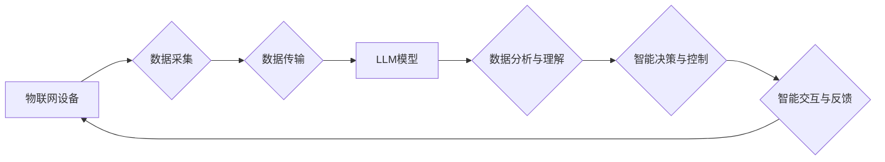

                 

## LLM与物联网：智能家居和城市规划的新可能

> 关键词：LLM、物联网、智能家居、城市规划、自然语言处理、机器学习、数据分析、预测建模

## 1. 背景介绍

物联网（IoT）的蓬勃发展正在深刻地改变着我们的生活方式，从智能家居到智慧城市，万物互联的愿景正在逐步实现。与此同时，大型语言模型（LLM）的出现，凭借其强大的自然语言处理能力，为物联网带来了新的可能性。LLM能够理解和生成人类语言，从而赋予物联网设备更智能的交互能力，并为数据分析和决策支持提供更深入的洞察。

智能家居领域，LLM可以理解用户的语音指令，控制家电设备，并根据用户的习惯和偏好自动调节环境温度、灯光等。在智慧城市领域，LLM可以分析城市传感器数据，预测交通拥堵、环境污染等问题，并提供相应的解决方案。

## 2. 核心概念与联系

### 2.1 物联网（IoT）

物联网是指通过传感器、网络和数据分析技术，将各种物理设备连接到互联网，实现数据采集、传输和处理，从而实现设备之间的互联互通和智能化管理。

### 2.2 大型语言模型（LLM）

大型语言模型是基于深度学习算法训练的强大人工智能模型，能够理解和生成人类语言。LLM拥有海量文本数据训练，具备强大的文本理解、生成、翻译、问答等能力。

### 2.3 核心概念联系

LLM与物联网的结合，可以实现以下核心功能：

* **智能交互:** LLM赋予物联网设备更智能的交互能力，能够理解用户的自然语言指令，并提供更人性化的响应。
* **数据分析:** LLM可以分析物联网设备采集的数据，发现隐藏的模式和趋势，为决策支持提供更深入的洞察。
* **预测建模:** LLM可以基于历史数据和实时信息，预测未来事件的发生，例如交通拥堵、设备故障等，并提供预警和解决方案。

**Mermaid 流程图**



## 3. 核心算法原理 & 具体操作步骤

### 3.1 算法原理概述

LLM与物联网的结合主要基于以下核心算法：

* **自然语言处理（NLP）算法:** 用于理解和处理用户的自然语言指令，例如词性标注、依存句法分析、语义角色标注等。
* **机器学习（ML）算法:** 用于分析物联网设备采集的数据，发现隐藏的模式和趋势，例如聚类分析、回归分析、决策树等。
* **预测建模算法:** 用于预测未来事件的发生，例如时间序列分析、支持向量机、神经网络等。

### 3.2 算法步骤详解

1. **数据采集:** 物联网设备采集各种数据，例如温度、湿度、光照、位置等。
2. **数据预处理:** 对采集到的数据进行清洗、转换和格式化，以便于后续的分析和处理。
3. **数据传输:** 将预处理后的数据传输到云端或边缘服务器。
4. **数据分析与理解:** 使用NLP算法对用户的自然语言指令进行理解，并使用ML算法对物联网设备采集的数据进行分析，发现隐藏的模式和趋势。
5. **预测建模:** 使用预测建模算法，基于历史数据和实时信息，预测未来事件的发生。
6. **智能决策与控制:** 根据数据分析和预测结果，做出智能决策，并控制物联网设备进行相应的操作。
7. **智能交互与反馈:** 使用NLP算法，将智能决策的结果以自然语言形式反馈给用户，并根据用户的反馈进行调整。

### 3.3 算法优缺点

**优点:**

* **智能化:** LLM赋予物联网设备更智能的交互能力，能够理解用户的自然语言指令，并提供更人性化的响应。
* **数据驱动:** LLM可以分析物联网设备采集的数据，发现隐藏的模式和趋势，为决策支持提供更深入的洞察。
* **预测能力:** LLM可以基于历史数据和实时信息，预测未来事件的发生，例如交通拥堵、设备故障等，并提供预警和解决方案。

**缺点:**

* **数据依赖:** LLM的性能依赖于训练数据的质量和数量，如果训练数据不足或质量低劣，则模型的性能会受到影响。
* **计算资源:** 训练和部署大型语言模型需要大量的计算资源，这可能会增加成本和复杂性。
* **伦理问题:** LLM的应用可能会带来一些伦理问题，例如数据隐私、算法偏见等，需要谨慎考虑和解决。

### 3.4 算法应用领域

LLM与物联网的结合，在以下领域具有广泛的应用前景：

* **智能家居:** 控制家电设备、调节环境温度、灯光等，实现个性化家居体验。
* **智慧城市:** 分析城市传感器数据，预测交通拥堵、环境污染等问题，并提供相应的解决方案。
* **工业自动化:** 优化生产流程、预测设备故障、提高生产效率。
* **医疗保健:** 分析患者数据，辅助医生诊断疾病、制定治疗方案。
* **教育培训:** 提供个性化学习体验、智能答疑、辅助教学。

## 4. 数学模型和公式 & 详细讲解 & 举例说明

### 4.1 数学模型构建

LLM的训练过程本质上是一个优化问题，目标是找到一个模型参数，使得模型在训练数据上的预测性能达到最大。常用的数学模型包括：

* **神经网络:** 神经网络是一种模仿人脑神经网络结构的算法，能够学习复杂的非线性关系。
* **Transformer:** Transformer是一种新型的神经网络架构，能够有效处理序列数据，例如文本。

### 4.2 公式推导过程

LLM的训练过程通常使用**反向传播算法**，通过调整模型参数，最小化模型预测与真实值的误差。

**损失函数:**

$$L = \sum_{i=1}^{N} \mathcal{L}(y_i, \hat{y}_i)$$

其中：

* $L$ 是损失函数
* $N$ 是训练样本的数量
* $\mathcal{L}$ 是单个样本的损失函数
* $y_i$ 是真实值
* $\hat{y}_i$ 是模型预测值

**梯度下降算法:**

$$\theta = \theta - \alpha \nabla L(\theta)$$

其中：

* $\theta$ 是模型参数
* $\alpha$ 是学习率
* $\nabla L(\theta)$ 是损失函数对模型参数的梯度

### 4.3 案例分析与讲解

例如，在训练一个文本生成模型时，可以使用交叉熵损失函数来衡量模型预测与真实文本之间的差异。

**交叉熵损失函数:**

$$ \mathcal{L}(y, \hat{y}) = - \sum_{i=1}^{M} y_i \log(\hat{y}_i)$$

其中：

* $y$ 是真实文本的one-hot编码
* $\hat{y}$ 是模型预测文本的概率分布

通过反向传播算法，可以计算出损失函数对模型参数的梯度，并使用梯度下降算法更新模型参数，从而降低模型预测与真实文本之间的差异。

## 5. 项目实践：代码实例和详细解释说明

### 5.1 开发环境搭建

* **操作系统:** Ubuntu 20.04
* **编程语言:** Python 3.8
* **深度学习框架:** TensorFlow 2.x
* **其他工具:** Git, Jupyter Notebook

### 5.2 源代码详细实现

以下是一个简单的LLM与物联网交互的代码示例，使用TensorFlow框架实现一个简单的文本分类模型，用于识别用户的自然语言指令：

```python
import tensorflow as tf

# 定义模型
model = tf.keras.models.Sequential([
    tf.keras.layers.Embedding(input_dim=10000, output_dim=128),
    tf.keras.layers.LSTM(units=64),
    tf.keras.layers.Dense(units=2, activation='softmax')
])

# 编译模型
model.compile(optimizer='adam',
              loss='sparse_categorical_crossentropy',
              metrics=['accuracy'])

# 训练模型
model.fit(x_train, y_train, epochs=10)

# 预测
prediction = model.predict(x_test)
```

### 5.3 代码解读与分析

* **Embedding层:** 将单词转换为向量表示，用于捕捉单词之间的语义关系。
* **LSTM层:** 用于处理序列数据，例如文本，能够学习文本中的长距离依赖关系。
* **Dense层:** 全连接层，用于将LSTM层的输出映射到分类结果。
* **softmax激活函数:** 将输出值转换为概率分布，用于预测不同类别的概率。

### 5.4 运行结果展示

训练完成后，可以使用测试数据对模型进行评估，并观察模型的准确率等指标。

## 6. 实际应用场景

### 6.1 智能家居

* **语音控制:** 用户可以使用语音指令控制家电设备，例如“打开客厅的灯”，“调节卧室的温度”。
* **场景自动化:** 根据用户的习惯和偏好，自动调节环境温度、灯光、窗帘等，实现个性化家居体验。
* **设备故障预警:** 通过分析设备运行数据，预测设备故障，并及时提醒用户进行维护。

### 6.2 智慧城市

* **交通管理:** 分析交通流量数据，预测交通拥堵，并提供路线规划和交通信号灯控制建议。
* **环境监测:** 分析空气质量、水质、噪音等数据，监测城市环境状况，并提供污染预警和治理方案。
* **公共安全:** 分析监控视频数据，识别异常行为，并及时报警。

### 6.3 未来应用展望

随着LLM技术的不断发展，其在物联网领域的应用将更加广泛和深入。例如：

* **更智能的交互:** LLM能够理解更复杂的自然语言指令，并提供更人性化的响应。
* **更精准的预测:** LLM能够基于更丰富的历史数据和实时信息，进行更精准的预测。
* **更个性化的服务:** LLM能够根据用户的个人喜好和需求，提供更个性化的服务。

## 7. 工具和资源推荐

### 7.1 学习资源推荐

* **书籍:**
    * 《深度学习》 by Ian Goodfellow, Yoshua Bengio, Aaron Courville
    * 《自然语言处理入门》 by Jacob Eisenstein
* **在线课程:**
    * Coursera: 深度学习 Specialization
    * edX: 自然语言处理

### 7.2 开发工具推荐

* **TensorFlow:** 开源深度学习框架
* **PyTorch:** 开源深度学习框架
* **Hugging Face Transformers:** 预训练语言模型库

### 7.3 相关论文推荐

* **BERT: Pre-training of Deep Bidirectional Transformers for Language Understanding**
* **GPT-3: Language Models are Few-Shot Learners**
* **XLNet: Generalized Autoregressive Pretraining for Language Understanding**

## 8. 总结：未来发展趋势与挑战

### 8.1 研究成果总结

LLM与物联网的结合，为智能家居和智慧城市带来了新的可能性，能够实现更智能的交互、更精准的预测和更个性化的服务。

### 8.2 未来发展趋势

* **模型规模和能力的提升:** LLM模型将继续朝着更大规模和更强大的能力发展，能够处理更复杂的任务和更丰富的语义信息。
* **边缘计算的应用:** LLM模型将部署到边缘设备上，实现更低延迟和更私密的计算。
* **多模态融合:** LLM将与其他模态数据，例如图像、音频、视频等融合，实现更全面的理解和交互。

### 8.3 面临的挑战

* **数据隐私和安全:** LLM的训练和应用需要大量的数据，如何保护用户数据隐私和安全是一个重要的挑战。
* **算法偏见:** LLM模型的训练数据可能存在偏见，导致模型输出存在偏见，需要进行算法调优和数据清洗来解决。
* **可解释性和信任度:** LLM模型的决策过程往往是复杂的，难以解释，如何提高模型的可解释性和信任度是一个重要的研究方向。

### 8.4 研究展望

未来，LLM与物联网的结合将继续是一个重要的研究方向，需要进一步探索模型架构、训练方法、应用场景等方面，以实现更智能、更安全、更可信赖的物联网应用。

## 9. 附录：常见问题与解答

**Q1: LLM与物联网的结合有什么优势？**

**A1:** LLM与物联网的结合能够实现更智能的交互、更精准的预测和更个性化的服务，提升物联网应用的价值。

**Q2: LLM训练需要哪些数据？**

**A2:** LLM训练需要大量的文本数据，例如书籍、文章、对话等。

**Q3: 如何解决LLM模型的算法偏见问题？**

**A3:** 可以通过数据清洗、算法调优和公平性评估等方法来解决LLM模型的算法偏见问题。


作者：禅与计算机程序设计艺术 / Zen and the Art of Computer Programming 
<end_of_turn>

