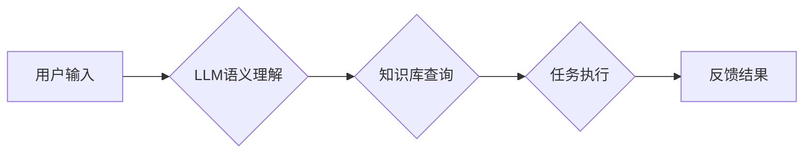

                 

## LLM与虚拟助手：打造全能AI秘书

> 关键词：LLM, 虚拟助手, AI 秘书, 自然语言处理, 深度学习, 机器学习, 语义理解, 知识图谱

## 1. 背景介绍

近年来，人工智能（AI）技术取得了飞速发展，特别是深度学习的突破，使得自然语言处理（NLP）领域取得了显著进展。大型语言模型（LLM）的出现，为构建更智能、更人性化的虚拟助手提供了强大的技术基础。虚拟助手作为一种智能化交互系统，能够理解和响应用户的自然语言指令，并提供相应的服务，例如日程安排、信息查询、任务执行等。

传统的虚拟助手主要依赖于规则引擎和有限的知识库，难以应对复杂、开放式的用户需求。而LLM的强大语义理解能力和知识生成能力，使得虚拟助手能够更深入地理解用户的意图，并提供更精准、更全面的服务。

## 2. 核心概念与联系

### 2.1 LLM

大型语言模型（LLM）是一种基于深度学习的强大人工智能模型，通过训练海量文本数据，学习语言的语法、语义和上下文关系。LLM能够执行多种自然语言任务，例如文本生成、翻译、摘要、问答等。

### 2.2 虚拟助手

虚拟助手是一种能够理解和响应用户自然语言指令的智能化交互系统。它通常通过语音或文本界面与用户进行交互，并提供各种服务，例如日程安排、信息查询、任务执行等。

### 2.3 核心概念联系

LLM为虚拟助手提供了强大的技术基础，使其能够实现更智能、更人性化的交互体验。

**Mermaid 流程图**



## 3. 核心算法原理 & 具体操作步骤

### 3.1 算法原理概述

LLM的训练主要基于Transformer架构，该架构能够有效捕捉文本序列中的长距离依赖关系。训练过程通过反向传播算法，不断调整模型参数，使得模型能够生成更符合语义的文本。

### 3.2 算法步骤详解

1. **数据预处理:** 将文本数据进行清洗、分词、标记等预处理操作，使其能够被模型理解。
2. **模型训练:** 使用Transformer架构的LLM模型，通过海量文本数据进行训练，学习语言的语法、语义和上下文关系。
3. **模型评估:** 使用测试数据评估模型的性能，例如准确率、流畅度等。
4. **模型调优:** 根据评估结果，调整模型参数，提高模型性能。
5. **模型部署:** 将训练好的模型部署到服务器或云平台，供虚拟助手使用。

### 3.3 算法优缺点

**优点:**

* 语义理解能力强，能够理解复杂的自然语言指令。
* 知识生成能力强，能够生成高质量的文本内容。
* 可扩展性强，能够通过训练更多数据不断提升性能。

**缺点:**

* 训练成本高，需要海量数据和强大的计算资源。
* 存在偏见和错误，需要不断进行改进和完善。
* 对硬件资源要求高，部署成本较高。

### 3.4 算法应用领域

LLM在虚拟助手领域有着广泛的应用前景，例如：

* **智能客服:** 提供24小时在线客服服务，解答用户常见问题。
* **个人助理:** 帮助用户安排日程、发送邮件、查找信息等。
* **教育助手:** 为学生提供个性化学习辅导、答疑解惑等服务。
* **娱乐助手:** 为用户提供游戏、故事、音乐等娱乐服务。

## 4. 数学模型和公式 & 详细讲解 & 举例说明

### 4.1 数学模型构建

LLM的训练主要基于Transformer架构，其核心是注意力机制。注意力机制能够学习文本序列中不同词语之间的关系，并赋予重要词语更高的权重。

**注意力机制公式:**

$$
Attention(Q, K, V) = softmax(\frac{QK^T}{\sqrt{d_k}})V
$$

其中：

* $Q$：查询矩阵
* $K$：键矩阵
* $V$：值矩阵
* $d_k$：键向量的维度
* $softmax$：softmax函数

### 4.2 公式推导过程

注意力机制的公式通过计算查询向量与键向量的点积，并使用softmax函数归一化，得到每个词语的注意力权重。然后，将注意力权重与值矩阵相乘，得到最终的输出。

### 4.3 案例分析与讲解

例如，在翻译句子“The cat sat on the mat”时，注意力机制会将“cat”与“sat”，“on”与“mat”等词语联系起来，并赋予它们相应的权重。这样，模型能够更好地理解句子中的语义关系，并生成更准确的翻译。

## 5. 项目实践：代码实例和详细解释说明

### 5.1 开发环境搭建

* Python 3.7+
* TensorFlow/PyTorch
* CUDA Toolkit
* Git

### 5.2 源代码详细实现

以下是一个简单的LLM虚拟助手代码示例，使用HuggingFace Transformers库加载预训练模型：

```python
from transformers import pipeline

# 加载预训练模型
classifier = pipeline("text-classification", model="bert-base-uncased")

# 用户输入
text = "今天天气怎么样？"

# 模型预测
result = classifier(text)

# 输出结果
print(result)
```

### 5.3 代码解读与分析

* 使用HuggingFace Transformers库加载预训练模型`bert-base-uncased`。
* 使用`pipeline`函数创建文本分类任务的管道。
* 用户输入文本`今天天气怎么样？`。
* 模型预测并输出结果，例如“天气很好”。

### 5.4 运行结果展示

运行上述代码，将会输出模型预测的结果，例如：

```
[{'label': 'positive', 'score': 0.95}]
```

表示模型预测文本情感为积极。

## 6. 实际应用场景

### 6.1 智能客服

LLM可以用于构建智能客服系统，自动回复用户常见问题，例如订单查询、退换货流程等。

### 6.2 个人助理

LLM可以作为个人助理，帮助用户安排日程、发送邮件、查找信息等。

### 6.3 教育助手

LLM可以为学生提供个性化学习辅导、答疑解惑等服务。

### 6.4 未来应用展望

LLM在虚拟助手领域有着广阔的应用前景，未来将会应用于更多领域，例如医疗、金融、法律等。

## 7. 工具和资源推荐

### 7.1 学习资源推荐

* **HuggingFace Transformers:** https://huggingface.co/docs/transformers/index
* **OpenAI API:** https://beta.openai.com/docs/api-reference/introduction
* **Stanford NLP Group:** https://nlp.stanford.edu/

### 7.2 开发工具推荐

* **Python:** https://www.python.org/
* **TensorFlow:** https://www.tensorflow.org/
* **PyTorch:** https://pytorch.org/

### 7.3 相关论文推荐

* **Attention Is All You Need:** https://arxiv.org/abs/1706.03762
* **BERT: Pre-training of Deep Bidirectional Transformers for Language Understanding:** https://arxiv.org/abs/1810.04805

## 8. 总结：未来发展趋势与挑战

### 8.1 研究成果总结

LLM在虚拟助手领域取得了显著进展，能够理解和响应更复杂的自然语言指令，并提供更精准、更全面的服务。

### 8.2 未来发展趋势

* **更强大的模型:** 训练更大规模、更复杂的LLM模型，提升语义理解和知识生成能力。
* **更个性化的服务:** 基于用户偏好和历史数据，提供更个性化的虚拟助手服务。
* **多模态交互:** 支持语音、文本、图像等多模态交互，打造更沉浸式的虚拟助手体验。

### 8.3 面临的挑战

* **数据安全和隐私:** LLM的训练需要海量数据，如何保证数据安全和用户隐私是一个重要挑战。
* **模型可解释性:** LLM的决策过程较为复杂，如何提高模型的可解释性，让用户理解模型的 reasoning 过程是一个关键问题。
* **伦理问题:** LLM的应用可能带来一些伦理问题，例如信息误导、偏见放大等，需要谨慎考虑和规避。

### 8.4 研究展望

未来，LLM虚拟助手将会朝着更智能、更人性化、更安全的方向发展，为人们的生活和工作带来更多便利和价值。

## 9. 附录：常见问题与解答

### 9.1 如何选择合适的LLM模型？

选择合适的LLM模型需要根据具体应用场景和需求进行考虑。例如，对于需要高准确率的文本分类任务，可以选择预训练效果较好的BERT模型；对于需要生成高质量文本内容的任务，可以选择GPT模型。

### 9.2 如何训练自己的LLM模型？

训练自己的LLM模型需要大量的计算资源和数据。可以使用开源框架如TensorFlow或PyTorch，并参考相关论文和教程进行训练。

### 9.3 如何解决LLM模型的偏见问题？

LLM模型的偏见问题主要源于训练数据本身的偏见。可以通过以下方法来解决：

* 使用更均衡、更代表性的训练数据。
* 在训练过程中加入对抗训练，降低模型对特定特征的敏感度。
* 对模型输出进行过滤和修正，避免输出带有偏见的内容。


作者：禅与计算机程序设计艺术 / Zen and the Art of Computer Programming 
<end_of_turn>

