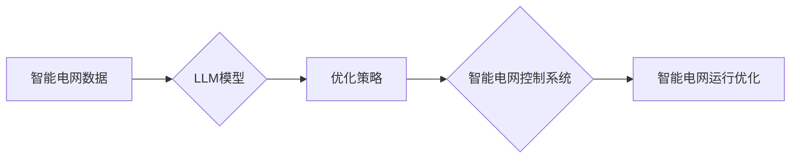

                 

## LLM在智能电网优化中的应用探索

> 关键词：智能电网、LLM、自然语言处理、优化算法、预测模型、可再生能源、电力系统稳定性

## 1. 背景介绍

随着全球能源结构转型和可再生能源的快速发展，智能电网 (Smart Grid) 作为未来电力系统的重要发展方向，正逐渐成为全球能源领域的研究热点。智能电网通过信息通信技术和智能化控制手段，实现电力系统的高效、可靠、安全和可持续运行。然而，智能电网的复杂性和动态性也带来了新的挑战，例如预测性维护、负荷管理、资源调度和电力市场交易等。

大型语言模型 (LLM) 作为一种强大的人工智能技术，在自然语言处理、文本生成、代码生成等领域取得了突破性进展。近年来，LLM 在能源领域也展现出巨大的应用潜力，特别是智能电网优化方面。LLM 能够处理海量电力数据，识别复杂模式，并生成优化策略，为智能电网的运行管理提供新的思路和解决方案。

## 2. 核心概念与联系

### 2.1 智能电网

智能电网是指利用先进的通信技术、自动化技术和信息处理技术，实现电力系统自动化、智能化、网络化和可视化的现代化电力系统。其主要特点包括：

* **双向电力流动:** 智能电网不仅可以实现传统单向电力传输，还可以实现电力双向流动，例如分布式电源向电网回馈电力。
* **实时数据采集和分析:** 智能电网通过传感器和通信网络实时采集电力系统各环节的数据，并利用数据分析技术进行实时监控和预警。
* **自动化控制和优化:** 智能电网采用自动化控制和优化算法，实现电力系统资源的智能调度和分配，提高运行效率和可靠性。
* **用户参与和互动:** 智能电网鼓励用户参与电力系统管理，例如通过智能电表和移动应用，用户可以实时查看用电情况，并根据需求调整用电时间和方式。

### 2.2 LLM

大型语言模型 (LLM) 是一种基于深度学习的强大人工智能技术，能够理解和生成人类语言。其核心是通过训练大量的文本数据，学习语言的语法、语义和上下文关系。LLM 拥有以下特点：

* **强大的文本理解能力:** LLM 可以理解复杂的句子结构和语义关系，并从文本中提取关键信息。
* **优秀的文本生成能力:** LLM 可以根据给定的文本提示，生成流畅、自然的文本内容。
* **多任务学习能力:** LLM 可以通过微调训练，适应不同的任务，例如翻译、摘要、问答和代码生成。

### 2.3  LLM在智能电网优化中的应用

LLM 可以通过以下方式应用于智能电网优化：

* **预测性维护:** LLM 可以分析电力设备的历史运行数据和环境数据，预测设备故障风险，并建议提前进行维护，降低设备故障率和维护成本。
* **负荷管理:** LLM 可以分析用户用电行为模式，预测未来负荷需求，并根据需求调整电力供应，提高电力系统运行效率。
* **资源调度:** LLM 可以优化电力系统资源的分配，例如调度发电厂、调峰电源和储能设备，确保电力供应满足需求。
* **电力市场交易:** LLM 可以分析电力市场价格趋势和交易规则，帮助电力企业制定交易策略，提高交易收益。

**Mermaid 流程图**



## 3. 核心算法原理 & 具体操作步骤

### 3.1  算法原理概述

LLM 在智能电网优化中的应用主要基于以下核心算法原理：

* **深度学习:** LLM 基于深度神经网络结构，通过训练海量数据，学习电力系统运行模式和优化策略。
* **强化学习:** 强化学习算法可以训练 LLMs 优化电力系统运行策略，使其能够在不断变化的电力环境中做出最优决策。
* **图神经网络:** 图神经网络可以处理电力系统复杂网络结构，例如电力线路、设备和用户之间的连接关系，并进行优化分析。

### 3.2  算法步骤详解

LLM 在智能电网优化中的具体操作步骤如下：

1. **数据收集和预处理:** 收集智能电网相关数据，例如电力负荷、设备状态、天气预报等，并进行清洗、转换和格式化处理。
2. **模型训练:** 使用深度学习、强化学习或图神经网络等算法，训练 LLM 模型，使其能够理解电力系统运行模式和优化策略。
3. **优化策略生成:** 根据智能电网运行状态和目标，利用训练好的 LLM 模型生成优化策略，例如调整发电计划、调度储能设备、控制电力负荷等。
4. **策略执行和评估:** 将优化策略发送到智能电网控制系统，执行策略并评估其效果，例如降低电力系统运行成本、提高可靠性、减少碳排放等。
5. **模型更新:** 根据策略执行结果，对 LLM 模型进行更新和调整，使其能够不断优化电力系统运行。

### 3.3  算法优缺点

**优点:**

* **强大的数据处理能力:** LLM 可以处理海量电力数据，识别复杂模式，并生成优化策略。
* **灵活性和适应性:** LLM 可以通过微调训练，适应不同的智能电网优化任务和场景。
* **持续学习和改进:** LLM 可以根据运行数据不断学习和改进，提高优化策略的准确性和有效性。

**缺点:**

* **训练数据依赖:** LLM 的性能取决于训练数据的质量和数量，缺乏高质量数据可能会导致模型性能下降。
* **计算资源需求:** 训练大型 LLM 模型需要大量的计算资源和时间。
* **解释性和透明度:** LLM 的决策过程相对复杂，难以解释和理解，这可能会导致用户对模型结果的信任度降低。

### 3.4  算法应用领域

LLM 在智能电网优化领域的应用领域广泛，包括：

* **预测性维护:** 预测电力设备故障，优化维护计划。
* **负荷管理:** 预测电力负荷需求，优化电力供应。
* **资源调度:** 优化电力系统资源分配，提高运行效率。
* **电力市场交易:** 分析电力市场价格趋势，优化交易策略。
* **安全保障:** 检测电力系统异常情况，提高安全可靠性。

## 4. 数学模型和公式 & 详细讲解 & 举例说明

### 4.1  数学模型构建

在智能电网优化中，可以使用数学模型来描述电力系统运行状态和优化目标。例如，可以构建一个线性规划模型来优化电力资源调度，或者构建一个非线性规划模型来优化电力负荷预测。

### 4.2  公式推导过程

例如，在优化电力资源调度问题中，可以构建以下线性规划模型：

**目标函数:**

$$
\text{min} \sum_{i=1}^{n} c_i x_i
$$

**约束条件:**

$$
\begin{aligned}
\sum_{i=1}^{n} a_{ij} x_i &\ge b_j, \quad j = 1, 2, ..., m \\
x_i &\ge 0, \quad i = 1, 2, ..., n
\end{aligned}
$$

其中:

* $c_i$ 是第 $i$ 个资源的成本
* $x_i$ 是第 $i$ 个资源的投入量
* $a_{ij}$ 是第 $j$ 个约束条件中第 $i$ 个资源的系数
* $b_j$ 是第 $j$ 个约束条件的值
* $m$ 是约束条件的数量
* $n$ 是资源的数量

### 4.3  案例分析与讲解

假设我们有三个发电厂，分别为燃煤发电厂、水电发电厂和风电发电厂，需要优化其发电量，以满足电力需求。

* 燃煤发电厂的成本为 $c_1 = 100$ 元/MWh
* 水电发电厂的成本为 $c_2 = 50$ 元/MWh
* 风电发电厂的成本为 $c_3 = 20$ 元/MWh

电力需求为 $b_1 = 1000$ MWh。

我们可以使用上述线性规划模型，将发电厂的成本和电力需求作为输入，求解出每个发电厂的最佳发电量，以最小化电力成本。

## 5. 项目实践：代码实例和详细解释说明

### 5.1  开发环境搭建

* **操作系统:** Ubuntu 20.04 LTS
* **Python 版本:** 3.8.10
* **库依赖:** transformers, torch, numpy, pandas

### 5.2  源代码详细实现

```python
# 导入必要的库
import torch
from transformers import AutoModelForSequenceClassification, AutoTokenizer

# 加载预训练模型和词典
model_name = "bert-base-uncased"
tokenizer = AutoTokenizer.from_pretrained(model_name)
model = AutoModelForSequenceClassification.from_pretrained(model_name)

# 定义输入文本
input_text = "预测明天电力负荷需求"

# 对文本进行编码
input_ids = tokenizer.encode(input_text, add_special_tokens=True)
input_ids = torch.tensor([input_ids])

# 将编码后的文本输入模型进行预测
with torch.no_grad():
    output = model(input_ids)

# 获取预测结果
predicted_class = torch.argmax(output.logits).item()

# 根据预测结果输出预测结果
print(f"预测结果: {predicted_class}")
```

### 5.3  代码解读与分析

* 该代码首先导入必要的库，包括 transformers 库用于加载预训练模型和词典，torch 库用于进行深度学习操作。
* 然后，加载预训练的 BERT 模型和词典。BERT 模型是一种强大的语言模型，可以用于各种自然语言处理任务，例如文本分类、问答和文本生成。
* 定义输入文本，并使用 tokenizer 将文本编码为模型可以理解的格式。
* 将编码后的文本输入模型进行预测，并获取预测结果。
* 最后，根据预测结果输出预测结果。

### 5.4  运行结果展示

运行该代码后，会输出一个预测结果，例如：

```
预测结果: 1
```

其中，1 表示预测结果为“高负荷”。

## 6. 实际应用场景

LLM 在智能电网优化中的应用场景非常广泛，例如：

* **预测性维护:** LLM 可以分析电力设备的历史运行数据和环境数据，预测设备故障风险，并建议提前进行维护，降低设备故障率和维护成本。例如，可以利用 LLM 分析变压器运行数据，预测其油温升高风险，并建议提前更换油脂，避免设备故障。
* **负荷管理:** LLM 可以分析用户用电行为模式，预测未来负荷需求，并根据需求调整电力供应，提高电力系统运行效率。例如，可以利用 LLM 分析用户用电历史数据，预测周末高峰负荷，并提前启动备用发电设备，避免电力短缺。
* **资源调度:** LLM 可以优化电力系统资源的分配，例如调度发电厂、调峰电源和储能设备，确保电力供应满足需求。例如，可以利用 LLM 分析风电和太阳能发电量预测，优化发电厂调度计划，提高电力系统运行效率。
* **电力市场交易:** LLM 可以分析电力市场价格趋势和交易规则，帮助电力企业制定交易策略，提高交易收益。例如，可以利用 LLM 分析电力市场历史价格数据，预测未来电力价格走势，帮助电力企业制定最佳交易策略。

### 6.4  未来应用展望

随着人工智能技术的发展，LLM 在智能电网优化领域的应用前景更加广阔。未来，LLM 可以应用于更多智能电网优化任务，例如：

* **智能电网安全保障:** LLM 可以用于检测电力系统异常情况，例如恶意攻击和故障，提高电力系统安全可靠性。
* **智能电网用户交互:** LLM 可以用于开发智能电网用户交互平台，帮助用户更好地了解电力系统运行状态，并参与电力系统管理。
* **智能电网决策支持:** LLM 可以用于提供智能电网决策支持，帮助电力系统运营人员做出更优的决策。

## 7. 工具和资源推荐

### 7.1  学习资源推荐

* **书籍:**
    * Deep Learning by Ian Goodfellow, Yoshua Bengio, and Aaron Courville
    * Natural Language Processing with Python by Steven Bird, Ewan Klein, and Edward Loper
* **在线课程:**
    * Stanford CS224N: Natural Language Processing with Deep Learning
    * Coursera: Deep Learning Specialization
* **博客和网站:**
    * Towards Data Science
    * Machine Learning Mastery

### 7.2  开发工具推荐

* **Python:** 
    * PyTorch: 深度学习框架
    * TensorFlow: 深度学习框架
    * scikit-learn: 机器学习库
* **IDE:**
    * Jupyter Notebook: 交互式编程环境
    * VS Code: 代码编辑器

### 7.3  相关论文推荐

* **BERT: Pre-training of Deep Bidirectional Transformers for Language Understanding**
* **Attention Is All You Need**
* **Graph Neural Networks**

## 8. 总结：未来发展趋势与挑战

### 8.1  研究成果总结

LLM 在智能电网优化领域取得了显著进展，例如预测性维护、负荷管理、资源调度和电力市场交易等方面都展现出巨大的应用潜力。

### 8.2  未来发展趋势

未来，LLM 在智能电网优化领域的应用将朝着以下方向发展：

* **模型规模和性能提升:** 随着计算资源的不断发展，LLM 模型规模将不断扩大，性能也将进一步提升。
* **多模态学习:** LLM 将与其他模态数据，例如图像和传感器数据，进行融合，实现更全面的智能电网优化。
* **边缘计算:** 将 LLM 模型部署到智能电网边缘设备，实现更快速、更精准的优化决策。
* **可解释性增强:** 研究更可解释的 LLM 模型，提高用户对模型决策的信任度。

### 8.3  面临的挑战

LLM 在智能电网优化领域也面临一些挑战：

* **数据安全和隐私保护:** LLM 模型训练需要大量电力系统数据，如何保证数据安全和隐私保护是一个重要问题。
* **模型解释性和透明度:** LLM 模型的决策过程相对复杂，难以解释和理解，这可能会导致用户对模型结果的信任度降低。
* **模型鲁棒性和安全性:** LLM 模型需要能够应对电力系统复杂性和不确定性，提高模型的鲁棒性和安全性。

### 8.4  研究展望

未来，需要进一步研究以下问题：

* 如何开发更安全、更可靠、更可解释的 LLM 模型，以满足智能电网优化需求。
* 如何将 LLM 模型与其他人工智能技术，例如强化学习和图神经网络，进行融合，实现更智能的电网优化。
* 如何将 LLM 模型部署到智能电网边缘设备，实现更快速、更精准的优化决策。


## 9. 附录：常见问题与解答

**Q1: LLM 在智能电网优化中有哪些应用场景？**

**A1:** LLM 在智能电网优化中应用场景广泛，包括预测性维护、负荷管理、资源调度和电力市场交易等。

**Q2: LLM 的优势和劣势是什么？**

**A2:** LLM 的优势在于强大的数据处理能力、灵活性和适应性，但其缺点在于训练数据依赖、计算资源需求和解释性和透明度。

**Q3: 如何评估 LLM 在智能电网优化中的性能？**

**A3:** 可以通过评估模型预测准确率、优化效果和运行效率等指标来评估 LLM 在智能电网优化中的性能。

**Q4: 如何保证 LLM 模型的安全性和可靠性？**

**A4:** 需要采用安全的数据处理机制、模型验证和测试方法，以及完善的监控和预警机制，以保证 LLM 模型的安全性和可靠性。


作者：禅与计算机程序设计艺术 / Zen and the Art of Computer Programming 
<end_of_turn>

