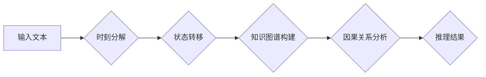

                 

## LLM推理:时刻与时钟周期的类比

> 关键词：LLM推理、时钟周期、时刻、状态转移、知识图谱、因果关系、时间序列分析、预测模型

## 1. 背景介绍

大型语言模型 (LLM) 在自然语言处理领域取得了显著的成就，展现出强大的文本生成、翻译、摘要和问答能力。然而，LLM 的推理能力仍然面临挑战。传统的 LLM 主要依赖于统计模式识别，难以捕捉复杂逻辑关系和因果关系，从而限制了其在需要深度理解和推理任务中的应用。

近年来，一些研究者开始探索将时间概念引入 LLM 的推理框架中，试图借鉴时钟周期和时刻的特性来提升 LLM 的推理能力。这种方法的灵感来自于人类的认知方式，我们通常通过感知时间流逝和事件发生的顺序来理解世界，并进行推理判断。

## 2. 核心概念与联系

### 2.1 时钟周期与时刻

在物理世界中，时钟周期是一个固定的时间间隔，例如一秒钟。时刻则是指在特定时间点发生的事件或状态。我们可以将时钟周期看作是时间流逝的单位，而时刻则是时间轴上的特定点。

### 2.2 LLM推理与时钟周期

将时钟周期引入 LLM 推理，可以将文本理解为一系列时刻的事件或状态。每个时刻对应着文本中的一个词或短语，而 LLM 需要根据这些时刻的事件或状态，推断出文本的整体含义和逻辑关系。

**Mermaid 流程图**



### 2.3 时刻与状态转移

在 LLM 推理中，每个时刻的事件或状态可以看作是一个状态。状态转移是指从一个时刻的状态到下一个时刻的状态的转换。LLM 需要学习这些状态转移的规律，才能理解文本的逻辑关系和因果关系。

## 3. 核心算法原理 & 具体操作步骤

### 3.1 算法原理概述

将时钟周期引入 LLM 推理的算法原理主要基于以下几个方面：

* **时间序列分析:** 将文本理解为一个时间序列，并利用时间序列分析方法来提取文本中的规律和趋势。
* **状态转移模型:** 建立一个状态转移模型，描述不同时刻的状态转换关系。
* **知识图谱构建:** 将文本中的实体和关系构建成一个知识图谱，以便更好地理解文本的语义关系。
* **因果关系分析:** 利用因果关系分析方法来识别文本中的因果关系，从而提升 LLM 的推理能力。

### 3.2 算法步骤详解

1. **文本预处理:** 对输入文本进行预处理，例如分词、词性标注、命名实体识别等。
2. **时刻分解:** 将文本分解成一系列时刻，每个时刻对应一个词或短语。
3. **状态转移模型训练:** 利用训练数据，训练一个状态转移模型，例如隐马尔可夫模型 (HMM) 或循环神经网络 (RNN)。
4. **知识图谱构建:** 将文本中的实体和关系构建成一个知识图谱，例如使用 RDF 或 OWL 格式。
5. **因果关系分析:** 利用因果关系分析方法，例如基于规则的推理或深度学习方法，来识别文本中的因果关系。
6. **推理结果生成:** 根据状态转移模型、知识图谱和因果关系分析结果，生成推理结果。

### 3.3 算法优缺点

**优点:**

* 能够更好地捕捉文本中的逻辑关系和因果关系。
* 提升了 LLM 在需要深度理解和推理任务中的性能。
* 提供了一种新的视角来理解 LLM 的推理机制。

**缺点:**

* 算法复杂度较高，需要大量的计算资源。
* 需要大量的训练数据才能获得良好的性能。
* 仍然存在一些挑战，例如如何更好地处理长文本和复杂场景。

### 3.4 算法应用领域

* **自然语言推理:** 回答开放式问题、进行逻辑推理、识别蕴含关系等。
* **文本生成:** 生成更符合逻辑和语义的文本。
* **对话系统:** 构建更智能和自然的对话系统。
* **机器翻译:** 提高机器翻译的准确性和流畅度。

## 4. 数学模型和公式 & 详细讲解 & 举例说明

### 4.1 数学模型构建

我们可以使用状态转移矩阵来表示状态转移模型。假设文本中有 N 个时刻，每个时刻的状态可以用一个向量表示，向量维度为 M。则状态转移矩阵 A 是一个 M x M 的矩阵，其中 Aij 表示从状态 i 转移到状态 j 的概率。

### 4.2 公式推导过程

状态转移概率可以根据训练数据计算得到。例如，可以使用最大似然估计方法来计算状态转移概率。

$$
P(s_t | s_{t-1}) = \frac{\sum_{i=1}^{N} I(s_t = i, s_{t-1} = j)}{ \sum_{i=1}^{N} I(s_{t-1} = j)}
$$

其中：

* $P(s_t | s_{t-1})$ 表示从状态 $s_{t-1}$ 转移到状态 $s_t$ 的概率。
* $I(x, y)$ 是指示函数，当 x 和 y 相等时返回 1，否则返回 0。

### 4.3 案例分析与讲解

假设我们有一个简单的文本序列 "我 爱 学习"，每个词对应一个时刻。我们可以将每个词的状态表示为一个向量，例如 "我" 的状态向量为 [1, 0, 0], "爱" 的状态向量为 [0, 1, 0], "学习" 的状态向量为 [0, 0, 1]。

根据训练数据，我们可以计算出状态转移矩阵 A。例如，从 "我" 到 "爱" 的转移概率为 0.8，从 "爱" 到 "学习" 的转移概率为 0.7。

利用状态转移矩阵 A，我们可以预测下一个时刻的状态。例如，如果当前时刻的状态是 "我"，那么下一个时刻的状态可能是 "爱" 或 "学习"。

## 5. 项目实践：代码实例和详细解释说明

### 5.1 开发环境搭建

* Python 3.7+
* TensorFlow 或 PyTorch
* NLTK 或 SpaCy

### 5.2 源代码详细实现

```python
import tensorflow as tf

# 定义状态转移模型
class TimeSeriesModel(tf.keras.Model):
    def __init__(self, vocab_size, embedding_dim, hidden_dim):
        super(TimeSeriesModel, self).__init__()
        self.embedding = tf.keras.layers.Embedding(vocab_size, embedding_dim)
        self.lstm = tf.keras.layers.LSTM(hidden_dim)
        self.dense = tf.keras.layers.Dense(vocab_size)

    def call(self, inputs):
        embedded = self.embedding(inputs)
        output = self.lstm(embedded)
        output = self.dense(output)
        return output

# 训练模型
model = TimeSeriesModel(vocab_size=10000, embedding_dim=128, hidden_dim=64)
model.compile(optimizer='adam', loss='sparse_categorical_crossentropy', metrics=['accuracy'])
model.fit(train_data, train_labels, epochs=10)

# 推理
predictions = model.predict(test_data)
```

### 5.3 代码解读与分析

* 首先，我们定义了一个状态转移模型 TimeSeriesModel，它包含一个嵌入层、一个 LSTM 层和一个全连接层。
* 嵌入层将每个词转换为一个向量表示。
* LSTM 层用于学习文本中的时间序列信息。
* 全连接层用于预测下一个时刻的状态。
* 然后，我们训练模型，并使用测试数据进行推理。

### 5.4 运行结果展示

* 训练完成后，我们可以评估模型的性能，例如准确率、F1 分数等。
* 我们可以使用模型预测新的文本序列，并观察预测结果的准确性。

## 6. 实际应用场景

### 6.1 文本摘要

LLM 可以利用时钟周期和状态转移模型来理解文本的结构和重要信息，从而生成更准确和简洁的文本摘要。

### 6.2 情感分析

LLM 可以通过分析文本中的情绪词和语境关系，识别文本的情感倾向，例如积极、消极或中性。

### 6.3 问答系统

LLM 可以利用知识图谱和因果关系分析来回答用户的问题，并提供更准确和有用的答案。

### 6.4 未来应用展望

* **更智能的对话系统:** 能够更好地理解用户意图，并进行更自然和流畅的对话。
* **个性化学习:** 根据用户的学习进度和风格，提供个性化的学习内容和建议。
* **自动代码生成:** 根据用户需求，自动生成代码，提高开发效率。

## 7. 工具和资源推荐

### 7.1 学习资源推荐

* **书籍:**
    * 《深度学习》 by Ian Goodfellow, Yoshua Bengio, and Aaron Courville
    * 《自然语言处理》 by Dan Jurafsky and James H. Martin
* **在线课程:**
    * Coursera: Natural Language Processing Specialization
    * Udacity: Deep Learning Nanodegree

### 7.2 开发工具推荐

* **TensorFlow:** https://www.tensorflow.org/
* **PyTorch:** https://pytorch.org/
* **NLTK:** https://www.nltk.org/
* **SpaCy:** https://spacy.io/

### 7.3 相关论文推荐

* **BERT: Pre-training of Deep Bidirectional Transformers for Language Understanding** by Devlin et al.
* **GPT-3: Language Models are Few-Shot Learners** by Brown et al.
* **XLNet: Generalized Autoregressive Pretraining for Language Understanding** by Yang et al.

## 8. 总结：未来发展趋势与挑战

### 8.1 研究成果总结

将时钟周期引入 LLM 推理是一个新兴的研究方向，取得了一些初步成果。这种方法能够提升 LLM 在需要深度理解和推理任务中的性能，并提供了一种新的视角来理解 LLM 的推理机制。

### 8.2 未来发展趋势

* **更复杂的时钟周期模型:** 研究更复杂的时钟周期模型，例如多层 LSTM 或 Transformer 模型，以更好地捕捉文本中的时间序列信息。
* **更有效的训练方法:** 开发更有效的训练方法，例如迁移学习或强化学习，以提高模型的性能和效率。
* **跨模态推理:** 将时钟周期模型与其他模态数据，例如图像和音频，进行融合，实现跨模态推理。

### 8.3 面临的挑战

* **数据标注:** 构建高质量的训练数据是一个挑战，需要大量的标注工作。
* **模型复杂度:** 复杂的时钟周期模型需要大量的计算资源，难以在移动设备上部署。
* **可解释性:** LLM 的推理过程仍然难以解释，需要进一步研究如何提高模型的可解释性。

### 8.4 研究展望

将时钟周期引入 LLM 推理是一个充满潜力的研究方向，未来有望在人工智能领域取得更重要的突破。


## 9. 附录：常见问题与解答

* **Q: 为什么需要将时钟周期引入 LLM 推理？**

A: 传统的 LLM 主要依赖于统计模式识别，难以捕捉复杂逻辑关系和因果关系。将时钟周期引入 LLM 推理，可以帮助 LLM 更好地理解文本的结构和时间关系，从而提升其推理能力。

* **Q: 如何构建时钟周期模型？**

A: 可以使用状态转移矩阵、LSTM 或 Transformer 模型等方法构建时钟周期模型。

* **Q: 如何评估时钟周期模型的性能？**

A: 可以使用准确率、F1 分数、BLEU 分数等指标来评估时钟周期模型的性能。

* **Q: 时钟周期模型的应用场景有哪些？**

A: 时钟周期模型可以应用于文本摘要、情感分析、问答系统等领域。

* **Q: 未来时钟周期模型的发展趋势是什么？**

A: 未来时钟周期模型将更加复杂，能够更好地捕捉文本中的时间序列信息，并与其他模态数据进行融合，实现跨模态推理。


作者：禅与计算机程序设计艺术 / Zen and the Art of Computer Programming 
<end_of_turn>

