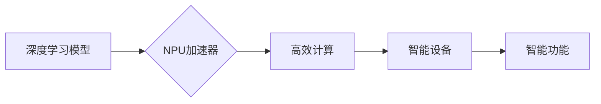

                 

## NPU加速器：AI芯片在智能设备中的应用

> 关键词：NPU、AI芯片、深度学习、加速器、智能设备、边缘计算、计算机视觉、自然语言处理

## 1. 背景介绍

随着人工智能（AI）技术的飞速发展，深度学习算法在图像识别、自然语言处理、语音识别等领域取得了突破性进展。然而，深度学习模型的训练和推理过程对计算资源需求极高，传统的CPU和GPU架构难以满足其实时性和效率要求。为了解决这一瓶颈，专门设计的AI芯片——神经网络处理器（NPU）应运而生。

NPU加速器专为深度学习算法优化设计，其结构和指令集与深度学习模型的计算模式相匹配，能够大幅提升模型的训练和推理速度。相较于通用处理器，NPU拥有以下优势：

* **更高的计算效率:** NPU采用并行计算架构，能够同时处理多个数据点，显著提高计算吞吐量。
* **更低的功耗:** NPU针对深度学习算法的计算特点进行优化，能够在更低的功耗下完成计算任务。
* **更小的芯片面积:** NPU的结构设计更加紧凑，能够在更小的芯片面积内实现更高的计算能力。

随着智能设备的普及，对AI功能的需求不断增长，NPU加速器在智能设备中的应用前景广阔。

## 2. 核心概念与联系

### 2.1 NPU架构

NPU的架构通常由以下几个主要部分组成：

* **计算单元:** 负责执行深度学习算法的计算操作，例如矩阵乘法、激活函数计算等。
* **数据存储单元:** 用于存储模型参数和输入数据。
* **控制单元:** 管理计算单元和数据存储单元的运作，并调度计算任务。
* **接口单元:** 与外部设备进行数据交换。

NPU的计算单元通常采用并行计算架构，例如 systolic array 或 tensor core，能够高效地处理深度学习算法的密集计算。

### 2.2 NPU与深度学习的关系

深度学习算法的核心是多层神经网络，其计算过程可以看作是大量矩阵运算和激活函数计算的组合。NPU的架构和指令集正是针对这些计算模式进行优化的，能够大幅提升深度学习模型的训练和推理速度。

### 2.3 NPU与智能设备的关系

智能设备，例如智能手机、智能手表、智能家居设备等，通常具有有限的计算资源和功耗预算。NPU加速器能够有效地提升智能设备的AI处理能力，使其能够运行更复杂的AI模型，提供更智能化的功能体验。

**Mermaid 流程图**



## 3. 核心算法原理 & 具体操作步骤

### 3.1 算法原理概述

NPU加速器通常采用以下几种核心算法原理：

* **矩阵乘法加速:** NPU利用并行计算架构，将矩阵乘法运算分解成多个子任务，并行执行，大幅提升计算效率。
* **激活函数加速:** NPU针对不同类型的激活函数，设计专门的硬件加速单元，能够快速高效地执行激活函数计算。
* **数据流优化:** NPU通过优化数据传输路径和数据缓存机制，减少数据传输时间，提高计算效率。

### 3.2 算法步骤详解

NPU加速器的工作流程可以概括为以下步骤：

1. **数据预处理:** 将输入数据转换为NPU能够识别的格式。
2. **数据加载:** 将预处理后的数据加载到NPU的内存中。
3. **模型加载:** 将深度学习模型的参数加载到NPU的内存中。
4. **计算执行:** NPU根据模型结构和输入数据，执行矩阵乘法、激活函数计算等操作，完成深度学习模型的推理过程。
5. **结果输出:** 将推理结果从NPU的内存中读取，并转换为用户可理解的格式。

### 3.3 算法优缺点

**优点:**

* 计算效率高
* 功耗低
* 芯片面积小

**缺点:**

* 针对性强，难以处理非深度学习算法
* 开发成本较高
* 芯片定制周期长

### 3.4 算法应用领域

NPU加速器广泛应用于以下领域:

* **计算机视觉:** 图像识别、物体检测、人脸识别、图像分割等
* **自然语言处理:** 语音识别、机器翻译、文本生成、情感分析等
* **智能家居:** 语音控制、场景识别、设备联动等
* **自动驾驶:** 路况识别、目标跟踪、路径规划等

## 4. 数学模型和公式 & 详细讲解 & 举例说明

### 4.1 数学模型构建

深度学习模型的核心是神经网络，其结构可以表示为多层神经元组成的网络。每个神经元接收多个输入信号，经过加权求和和激活函数处理后输出信号。

**神经网络模型数学表示:**

* **输入层:** $x_1, x_2, ..., x_n$
* **隐藏层:** $h_1, h_2, ..., h_m$
* **输出层:** $y_1, y_2, ..., y_k$

**激活函数:** $f(x)$

**权重:** $w_{ij}$

**偏置:** $b_j$

**前向传播公式:**

* 隐藏层输出: $h_j = f(\sum_{i=1}^{n} w_{ij}x_i + b_j)$
* 输出层输出: $y_k = f(\sum_{j=1}^{m} w_{jk}h_j + b_k)$

### 4.2 公式推导过程

NPU加速器通过优化矩阵乘法和激活函数计算等操作，提高深度学习模型的训练和推理速度。

**矩阵乘法加速:**

NPU利用并行计算架构，将矩阵乘法运算分解成多个子任务，并行执行。例如，可以使用 systolic array 架构，将矩阵乘法运算分解成多个数据流的并行计算。

**激活函数加速:**

NPU针对不同类型的激活函数，设计专门的硬件加速单元，例如ReLU激活函数的加速单元可以利用逐元素加法和比较操作，快速高效地执行激活函数计算。

### 4.3 案例分析与讲解

**举例说明:**

假设我们有一个简单的深度学习模型，其输入层有10个神经元，隐藏层有5个神经元，输出层有2个神经元。

NPU加速器可以将模型的矩阵乘法运算分解成多个子任务，并行执行。例如，可以将隐藏层输入矩阵和权重矩阵分别分解成多个子矩阵，并行计算每个子矩阵的乘积。

激活函数计算也可以利用NPU的专用加速单元进行加速。例如，如果模型使用ReLU激活函数，NPU的加速单元可以利用逐元素加法和比较操作，快速高效地执行激活函数计算。

## 5. 项目实践：代码实例和详细解释说明

### 5.1 开发环境搭建

NPU加速器的开发环境通常需要包含以下软件：

* **深度学习框架:** TensorFlow、PyTorch等
* **NPU SDK:** 提供NPU硬件接口和算法库
* **编译工具:** GCC、Clang等

### 5.2 源代码详细实现

以下是一个简单的NPU加速器代码示例，使用TensorFlow框架和NPU SDK，实现一个简单的卷积神经网络模型的推理过程:

```python
import tensorflow as tf
import npu_sdk

# 加载模型
model = tf.keras.models.load_model('my_model.h5')

# 创建NPU上下文
npu_context = npu_sdk.create_context()

# 将模型部署到NPU
npu_model = npu_sdk.deploy_model(model, npu_context)

# 预处理输入数据
input_data = ...

# 推理过程
output_data = npu_model.predict(input_data)

# 释放资源
npu_context.close()
```

### 5.3 代码解读与分析

* **加载模型:** 使用TensorFlow框架加载预训练的卷积神经网络模型。
* **创建NPU上下文:** 使用NPU SDK创建NPU运行环境。
* **部署模型:** 将TensorFlow模型部署到NPU硬件上。
* **预处理输入数据:** 将输入数据转换为NPU能够识别的格式。
* **推理过程:** 使用部署到NPU的模型进行推理，得到输出结果。
* **释放资源:** 关闭NPU运行环境。

### 5.4 运行结果展示

运行结果展示取决于具体的模型和输入数据。NPU加速器能够显著提升模型的推理速度，并降低功耗。

## 6. 实际应用场景

### 6.1 智能手机

NPU加速器可以嵌入到智能手机中，提升手机的AI处理能力，例如：

* **人脸识别:** 更快速、更准确的人脸识别功能，用于解锁手机、支付等场景。
* **语音助手:** 更流畅、更自然的语音交互体验，例如语音搜索、语音控制等。
* **图像识别:** 更智能的图像识别功能，例如识别物体、场景、文字等。

### 6.2 智能家居

NPU加速器可以嵌入到智能家居设备中，提升设备的智能化程度，例如：

* **智能音箱:** 更精准的语音识别和理解能力，能够更好地理解用户的指令。
* **智能摄像头:** 更智能的图像识别功能，例如人脸识别、物体检测、异常行为检测等。
* **智能机器人:** 更强大的AI处理能力，能够更好地感知环境、理解指令、执行任务。

### 6.3 自动驾驶

NPU加速器可以用于自动驾驶汽车，提升车辆的感知和决策能力，例如：

* **路况识别:** 更快速、更准确地识别道路状况，例如车道线、交通信号灯、行人等。
* **目标跟踪:** 更精准地跟踪周围车辆和行人，避免碰撞事故。
* **路径规划:** 更智能地规划行驶路径，避免拥堵、提高效率。

### 6.4 未来应用展望

随着NPU技术的不断发展，其应用场景将更加广泛，例如：

* **边缘计算:** 将AI推理能力部署到边缘设备，实现更低延迟、更私密的数据处理。
* **工业自动化:** 提升工业设备的智能化程度，例如机器视觉、过程控制等。
* **医疗诊断:** 辅助医生进行疾病诊断，提高诊断准确率。

## 7. 工具和资源推荐

### 7.1 学习资源推荐

* **书籍:**
    * 《深度学习》by Ian Goodfellow, Yoshua Bengio, Aaron Courville
    * 《动手学深度学习》by Aurélien Géron
* **在线课程:**
    * Coursera: Deep Learning Specialization
    * Udacity: Deep Learning Nanodegree
* **博客和论坛:**
    * TensorFlow Blog
    * PyTorch Blog
    * Stack Overflow

### 7.2 开发工具推荐

* **深度学习框架:** TensorFlow、PyTorch、Keras
* **NPU SDK:** 各家芯片厂商提供的NPU SDK，例如华为HiAI、英伟达TensorRT等
* **编译工具:** GCC、Clang

### 7.3 相关论文推荐

* **《AlexNet: Image Classification with Deep Convolutional Neural Networks》**
* **《ImageNet Classification with Deep Convolutional Neural Networks》**
* **《Deep Residual Learning for Image Recognition》**

## 8. 总结：未来发展趋势与挑战

### 8.1 研究成果总结

NPU加速器在深度学习领域的应用取得了显著成果，能够大幅提升模型的训练和推理速度，降低功耗，并为智能设备的AI功能发展提供了强大的支持。

### 8.2 未来发展趋势

* **更强大的计算能力:** NPU的计算能力将继续提升，能够处理更复杂的深度学习模型。
* **更低的功耗:** NPU的功耗将进一步降低，能够更好地满足智能设备的低功耗需求。
* **更广泛的应用场景:** NPU将应用于更多领域，例如边缘计算、工业自动化、医疗诊断等。
* **更智能的算法:** NPU将与更智能的深度学习算法相结合，实现更强大的AI功能。

### 8.3 面临的挑战

* **算法优化:** 如何进一步优化深度学习算法，使其能够更好地利用NPU的计算能力。
* **硬件设计:** 如何设计更高效、更低功耗的NPU芯片。
* **软件开发:** 如何开发更易于使用的NPU开发工具和框架。
* **生态建设:** 如何构建完善的NPU生态系统，包括硬件、软件、算法、应用等。

### 8.4 研究展望

未来，NPU加速器将继续朝着更强大、更智能、更广泛的方向发展，为人工智能技术的普及和应用做出更大的贡献。


## 9. 附录：常见问题与解答

**Q1: NPU和GPU相比，有什么优势？**

**A1:** NPU专为深度学习算法优化设计，其计算效率和功耗比GPU更低，更适合嵌入到智能设备中。

**Q2: 如何选择合适的NPU加速器？**

**A2:** 选择NPU加速器需要考虑模型类型、计算需求、功耗预算、开发成本等因素。

**Q3: 如何开发NPU加速器应用？**

**A3:** 需要学习深度学习框架、NPU SDK、编译工具等相关知识，并根据具体应用场景进行开发。


作者：禅与计算机程序设计艺术 / Zen and the Art of Computer Programming 
<end_of_turn>

