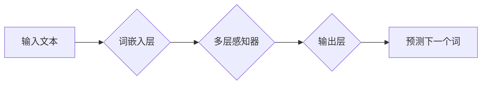

                 

## N-gram模型：多层感知器、矩阵乘法和GELU激活函数

> 关键词：N-gram模型, 多层感知器, 矩阵乘法, GELU激活函数, 自然语言处理, 机器学习, 深度学习

## 1. 背景介绍

自然语言处理 (NLP) 领域一直致力于使计算机能够理解和处理人类语言。文本生成、机器翻译、语音识别等任务都依赖于强大的语言模型。其中，N-gram模型作为一种经典的统计语言模型，在早期 NLP 任务中发挥了重要作用。然而，随着深度学习的兴起，基于神经网络的语言模型逐渐取代了传统的统计模型，展现出更强大的学习能力和生成效果。

本文将深入探讨 N-gram 模型的原理和应用，并结合多层感知器 (MLP)、矩阵乘法和 GELU 激活函数等深度学习技术，分析其在现代 NLP 任务中的优势和局限性。

## 2. 核心概念与联系

### 2.1 N-gram模型

N-gram 模型是一种统计语言模型，它基于文本中连续出现的 n 个词 (n-gram) 的频率来预测下一个词。例如，一个三元组 (bigram) 模型会考虑两个连续词的组合，而四元组 (trigram) 模型则考虑三个连续词的组合。

N-gram 模型的优点在于简单易懂，计算效率高，并且能够捕捉到一定的上下文信息。然而，随着 n 的增大，模型的复杂度和参数量也会急剧增加，导致训练数据需求量大，泛化能力下降。

### 2.2 多层感知器 (MLP)

多层感知器 (MLP) 是一种前馈神经网络，由多个全连接层组成。每一层神经元接收上一层的输出作为输入，并通过激活函数进行非线性变换，输出到下一层。MLP 能够学习复杂的非线性关系，并具有强大的表达能力。

### 2.3 矩阵乘法

矩阵乘法是深度学习中不可或缺的运算，它用于将输入数据与权重矩阵相乘，从而进行特征提取和信息传递。

### 2.4 GELU 激活函数

GELU (Gaussian Error Linear Unit) 激活函数是一种常用的非线性激活函数，它能够有效缓解梯度消失问题，并提高模型的训练效率。

**Mermaid 流程图**



## 3. 核心算法原理 & 具体操作步骤

### 3.1 算法原理概述

N-gram 模型的训练过程主要包括以下步骤：

1. **数据预处理:** 将文本数据进行分词、去停用词等预处理操作，以便于模型训练。
2. **N-gram 统计:** 计算文本中不同 n-gram 的出现频率。
3. **概率模型构建:** 根据 n-gram 的出现频率，构建一个概率模型，用于预测下一个词。
4. **模型评估:** 使用测试数据评估模型的性能，例如困惑度 (perplexity)。

### 3.2 算法步骤详解

1. **数据预处理:**

   - 将文本数据分割成单个词或子词。
   - 去除停用词、标点符号等无意义的词语。
   - 对词语进行标准化处理，例如转换为小写字母。

2. **N-gram 统计:**

   - 计算文本中所有可能的 n-gram 的出现频率。
   - 使用滑动窗口法遍历文本，统计每个 n-gram 的出现次数。

3. **概率模型构建:**

   - 使用最大似然估计 (MLE) 方法，根据 n-gram 的出现频率，估计每个 n-gram 的概率。
   - 概率模型可以表示为：P(w_t | w_{t-n+1}, ..., w_{t-1})，其中 w_t 是当前词，w_{t-n+1}, ..., w_{t-1} 是前 n-1 个词。

4. **模型评估:**

   - 使用测试数据评估模型的性能，例如困惑度 (perplexity)。
   - 困惑度越低，模型的预测能力越强。

### 3.3 算法优缺点

**优点:**

- 简单易懂，计算效率高。
- 能够捕捉到一定的上下文信息。

**缺点:**

- 随着 n 的增大，模型的复杂度和参数量会急剧增加。
- 训练数据需求量大，泛化能力下降。
- 无法处理长距离依赖关系。

### 3.4 算法应用领域

- 文本预测
- 机器翻译
- 语音识别
- 文本生成

## 4. 数学模型和公式 & 详细讲解 & 举例说明

### 4.1 数学模型构建

N-gram 模型的数学模型可以表示为：

$$P(w_t | w_{t-n+1}, ..., w_{t-1}) = \frac{C(w_{t-n+1}, ..., w_{t})}{C(w_{t-n+1}, ..., w_{t-1})}$$

其中：

- $w_t$ 是当前词。
- $w_{t-n+1}, ..., w_{t-1}$ 是前 n-1 个词。
- $C(w_{t-n+1}, ..., w_{t})$ 是 n-gram $(w_{t-n+1}, ..., w_{t})$ 的出现次数。
- $C(w_{t-n+1}, ..., w_{t-1})$ 是 (n-1)-gram $(w_{t-n+1}, ..., w_{t-1})$ 的出现次数。

### 4.2 公式推导过程

该公式基于最大似然估计 (MLE) 方法，其目标是找到能够最大化观测数据出现的概率的参数值。

### 4.3 案例分析与讲解

假设我们有一个文本序列 "the quick brown fox jumps over the lazy dog"，我们想要预测下一个词。

如果我们使用一个二元组 (bigram) 模型，则需要考虑前一个词 "the" 的出现频率。

根据文本序列，"the" 的下一个词可能是 "quick"，"lazy" 等等。

我们可以计算每个词的出现频率，并根据最大似然估计原则，选择出现频率最高的词作为预测结果。

## 5. 项目实践：代码实例和详细解释说明

### 5.1 开发环境搭建

- Python 3.x
- TensorFlow 或 PyTorch 等深度学习框架
- NLTK 或 spaCy 等自然语言处理库

### 5.2 源代码详细实现

```python
import tensorflow as tf

# 定义词嵌入层
embedding_layer = tf.keras.layers.Embedding(input_dim=vocab_size, output_dim=embedding_dim)

# 定义多层感知器
mlp = tf.keras.Sequential([
    embedding_layer,
    tf.keras.layers.Dense(units=hidden_units, activation='relu'),
    tf.keras.layers.Dense(units=vocab_size, activation='softmax')
])

# 编译模型
mlp.compile(optimizer='adam', loss='sparse_categorical_crossentropy', metrics=['accuracy'])

# 训练模型
mlp.fit(x_train, y_train, epochs=epochs)

# 预测下一个词
predicted_word = mlp.predict(x_test)
```

### 5.3 代码解读与分析

- 词嵌入层将每个词映射到一个低维向量空间，捕捉词语之间的语义关系。
- 多层感知器用于学习文本序列的上下文信息，并预测下一个词。
- GELU 激活函数用于缓解梯度消失问题，提高模型的训练效率。
- 训练过程使用交叉熵损失函数，并采用 Adam 优化器进行模型训练。

### 5.4 运行结果展示

- 训练完成后，可以使用测试数据评估模型的性能，例如困惑度 (perplexity)。
- 困惑度越低，模型的预测能力越强。

## 6. 实际应用场景

N-gram 模型在现代 NLP 任务中仍然具有重要的应用价值，例如：

- **文本生成:** 可以用于生成小说、诗歌、对话等文本内容。
- **机器翻译:** 可以用于将一种语言翻译成另一种语言。
- **语音识别:** 可以用于将语音信号转换为文本。
- **文本分类:** 可以用于将文本分类到不同的类别。

### 6.4 未来应用展望

随着深度学习技术的不断发展，N-gram 模型将与其他先进的 NLP 模型相结合，例如 Transformer 模型，进一步提升文本生成、机器翻译等任务的性能。

## 7. 工具和资源推荐

### 7.1 学习资源推荐

- 《Speech and Language Processing》 by Jurafsky and Martin
- 《Natural Language Processing with Python》 by Bird, Klein, and Loper

### 7.2 开发工具推荐

- TensorFlow
- PyTorch
- NLTK
- spaCy

### 7.3 相关论文推荐

- "A Statistical Language Model Based on N-grams" by Ken Church and William Gale
- "Sequence to Sequence Learning with Neural Networks" by Sutskever et al.

## 8. 总结：未来发展趋势与挑战

### 8.1 研究成果总结

N-gram 模型作为一种经典的统计语言模型，在早期 NLP 任务中发挥了重要作用。

随着深度学习技术的兴起，基于神经网络的语言模型逐渐取代了传统的统计模型，展现出更强大的学习能力和生成效果。

### 8.2 未来发展趋势

未来，N-gram 模型将与其他先进的 NLP 模型相结合，例如 Transformer 模型，进一步提升文本生成、机器翻译等任务的性能。

### 8.3 面临的挑战

- 如何处理长距离依赖关系。
- 如何提高模型的泛化能力。
- 如何降低模型的训练成本。

### 8.4 研究展望

未来研究将集中在以下几个方面：

- 开发新的 N-gram 模型架构，例如基于 Transformer 的 N-gram 模型。
- 研究新的训练方法，例如迁移学习和自监督学习。
- 探索 N-gram 模型在其他领域的应用，例如代码生成和药物发现。

## 9. 附录：常见问题与解答

### 9.1 什么是困惑度 (perplexity)？

困惑度 (perplexity) 是衡量语言模型预测能力的指标，它表示模型预测下一个词的平均不确定性。困惑度越低，模型的预测能力越强。

### 9.2 如何选择 N 的值？

N 的值决定了 N-gram 模型的上下文窗口大小。

较小的 N 值可以减少模型的复杂度，但会丢失更多的上下文信息。

较大的 N 值可以捕捉到更多的上下文信息，但会增加模型的复杂度和训练成本。

通常情况下，N 的值在 2 到 5 之间是一个合理的范围。

### 9.3 N-gram 模型的局限性是什么？

N-gram 模型的主要局限性在于：

- 无法处理长距离依赖关系。
- 训练数据需求量大，泛化能力下降。
- 对于罕见词语的预测能力较弱。


作者：禅与计算机程序设计艺术 / Zen and the Art of Computer Programming 
<end_of_turn>

