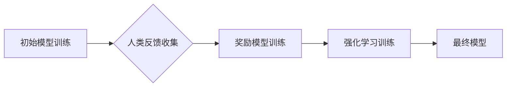

                 

## RLHF：利用人类反馈

> 关键词：强化学习、人类反馈、模型训练、AI安全、自然语言处理

### 1. 背景介绍

近年来，深度学习在人工智能领域取得了令人瞩目的成就，尤其是在自然语言处理领域，模型的性能不断提升，例如GPT-3、LaMDA等。然而，这些模型的训练主要依赖于海量文本数据，缺乏对人类反馈的有效利用。这导致模型生成的文本有时会出现偏差、不准确甚至有害的情况。

为了解决这个问题，强化学习人类反馈 (RLHF) 应运而生。RLHF 是一种训练大语言模型的新方法，它将人类反馈纳入模型的训练过程中，引导模型生成更符合人类期望的输出。

### 2. 核心概念与联系

RLHF 的核心思想是利用人类对模型输出的评价来优化模型的奖励函数。传统的强化学习算法依赖于环境反馈，而 RLHF 将人类反馈作为奖励信号，引导模型学习生成更符合人类偏好的文本。

**RLHF 的流程可以概括为以下步骤：**

1. **初始模型训练:** 使用大量文本数据训练一个初始的语言模型。
2. **人类反馈收集:** 让人类对模型生成的文本进行评价，例如打分、标注、修改等。
3. **奖励模型训练:** 使用收集到的人类反馈训练一个奖励模型，该模型能够预测人类对文本的评价。
4. **强化学习训练:** 使用奖励模型作为奖励信号，通过强化学习算法训练最终的语言模型。

**RLHF 架构流程图:**



### 3. 核心算法原理 & 具体操作步骤

#### 3.1 算法原理概述

RLHF 的核心算法是基于强化学习的策略梯度算法。策略梯度算法通过最大化奖励函数的期望值来优化模型的策略。在 RLHF 中，奖励函数由奖励模型预测，奖励模型根据人类反馈学习预测人类对文本的评价。

#### 3.2 算法步骤详解

1. **初始化:** 初始化一个语言模型参数 θ，以及一个奖励模型参数 φ。
2. **数据收集:** 使用初始模型生成一系列文本样本，并收集人类对这些文本的反馈。
3. **奖励模型训练:** 使用收集到的文本样本和人类反馈训练奖励模型 φ。
4. **策略梯度更新:** 使用策略梯度算法更新语言模型参数 θ，目标是最大化奖励模型预测的奖励值。
5. **重复步骤 2-4:** 重复上述步骤，直到模型性能达到预期水平。

#### 3.3 算法优缺点

**优点:**

* 可以有效地利用人类反馈，引导模型生成更符合人类期望的文本。
* 可以训练出更安全、更可靠的 AI 模型。

**缺点:**

* 需要大量的标注数据，收集和标注数据成本较高。
* 奖励模型的训练也需要大量的计算资源。

#### 3.4 算法应用领域

RLHF 广泛应用于自然语言处理领域，例如：

* **对话系统:** 训练更自然、更流畅的对话系统。
* **文本生成:** 生成更符合人类语义和风格的文本。
* **机器翻译:** 提高机器翻译的准确性和流畅度。
* **文本摘要:** 生成更准确、更简洁的文本摘要。

### 4. 数学模型和公式 & 详细讲解 & 举例说明

#### 4.1 数学模型构建

在 RLHF 中，我们使用一个策略网络 π(a|s; θ) 来表示语言模型，其中 a 是模型生成的文本，s 是模型的输入，θ 是模型的参数。奖励模型 R(a, s; φ) 用于预测人类对文本 a 的评价，其中 φ 是奖励模型的参数。

#### 4.2 公式推导过程

策略梯度算法的目标是最大化奖励函数的期望值：

$$
J(θ) = E_{s, a} [R(a, s; φ)]
$$

其中 E 表示期望值。

策略梯度算法的更新公式为：

$$
θ = θ + α \nabla_{θ} J(θ)
$$

其中 α 是学习率，∇θJ(θ) 是奖励函数 J(θ) 对模型参数 θ 的梯度。

#### 4.3 案例分析与讲解

假设我们训练一个文本生成模型，目标是生成符合人类语义的句子。我们可以使用 RLHF 的方法来训练这个模型。

1. **初始模型训练:** 使用大量的文本数据训练一个初始的语言模型。
2. **人类反馈收集:** 让人类对模型生成的句子进行评价，例如打分或标注。
3. **奖励模型训练:** 使用收集到的句子和人类反馈训练一个奖励模型，该模型能够预测人类对句子的评价。
4. **强化学习训练:** 使用奖励模型作为奖励信号，通过策略梯度算法训练最终的语言模型。

通过反复迭代上述步骤，最终的语言模型能够生成更符合人类语义的句子。

### 5. 项目实践：代码实例和详细解释说明

#### 5.1 开发环境搭建

为了实现 RLHF，我们需要搭建一个开发环境，包括以下软件：

* Python 3.x
* PyTorch 或 TensorFlow
* 其他必要的库，例如 transformers、gym 等。

#### 5.2 源代码详细实现

以下是一个简单的 RLHF 代码示例，使用 PyTorch 和 transformers 库：

```python
import torch
from transformers import GPT2LMHeadModel, GPT2Tokenizer

# 加载预训练模型和词典
model = GPT2LMHeadModel.from_pretrained("gpt2")
tokenizer = GPT2Tokenizer.from_pretrained("gpt2")

# 定义奖励模型
class RewardModel(torch.nn.Module):
    def __init__(self):
        super(RewardModel, self).__init__()
        # 定义奖励模型的网络结构

    def forward(self, text):
        # 计算奖励值
        return reward

# 训练奖励模型
# ...

# 训练强化学习模型
# ...
```

#### 5.3 代码解读与分析

* 首先，我们加载预训练的 GPT-2 模型和词典。
* 然后，我们定义一个奖励模型，该模型能够预测人类对文本的评价。
* 接下来，我们训练奖励模型，并使用它作为奖励信号来训练强化学习模型。

#### 5.4 运行结果展示

训练完成后，我们可以使用强化学习模型生成文本，并评估其质量。

### 6. 实际应用场景

RLHF 在许多实际应用场景中取得了成功，例如：

* **对话系统:** 使用 RLHF 训练的对话系统能够生成更自然、更流畅的对话，并能够更好地理解用户的意图。
* **文本生成:** 使用 RLHF 训练的文本生成模型能够生成更符合人类语义和风格的文本，例如新闻报道、小说、诗歌等。
* **机器翻译:** 使用 RLHF 训练的机器翻译模型能够提高翻译的准确性和流畅度，并能够更好地处理复杂的语义关系。

### 6.4 未来应用展望

RLHF 作为一种新兴的 AI 训练方法，未来应用前景广阔。随着人类反馈技术的不断发展，RLHF 将能够应用于更多领域，例如：

* **自动驾驶:** 使用 RLHF 训练的自动驾驶系统能够更好地理解道路环境和人类驾驶行为，从而提高安全性。
* **医疗诊断:** 使用 RLHF 训练的医疗诊断系统能够更好地理解患者的症状和病史，从而提高诊断准确率。
* **教育:** 使用 RLHF 训练的教育系统能够更好地理解学生的学习需求，从而提供个性化的学习体验。

### 7. 工具和资源推荐

#### 7.1 学习资源推荐

* **论文:**
    * "Language Models are Few-Shot Learners" (Brown et al., 2020)
    * "Reinforcement Learning from Human Feedback" (Amodei et al., 2020)
* **博客文章:**
    * OpenAI Blog: https://openai.com/blog/
    * DeepMind Blog: https://deepmind.com/blog/

#### 7.2 开发工具推荐

* **PyTorch:** https://pytorch.org/
* **TensorFlow:** https://www.tensorflow.org/
* **Hugging Face Transformers:** https://huggingface.co/transformers/

#### 7.3 相关论文推荐

* "Training Language Models to Follow Instructions with Human Feedback" (Raffel et al., 2020)
* "Reward Modeling for Reinforcement Learning from Human Feedback" (Chen et al., 2021)

### 8. 总结：未来发展趋势与挑战

#### 8.1 研究成果总结

RLHF 是一种有效的训练大语言模型的新方法，它能够利用人类反馈来引导模型学习生成更符合人类期望的文本。RLHF 在许多实际应用场景中取得了成功，并展现出巨大的潜力。

#### 8.2 未来发展趋势

未来，RLHF 将朝着以下方向发展：

* **更有效的奖励模型设计:** 开发更准确、更鲁棒的奖励模型，能够更好地捕捉人类反馈的复杂信息。
* **更强大的强化学习算法:** 研究更先进的强化学习算法，能够更高效地利用人类反馈进行模型训练。
* **更广泛的应用场景:** 将 RLHF 应用于更多领域，例如自动驾驶、医疗诊断、教育等。

#### 8.3 面临的挑战

RLHF 还面临一些挑战：

* **数据标注成本:** 收集和标注高质量的人类反馈成本较高。
* **奖励模型偏差:** 奖励模型可能会受到训练数据偏差的影响，导致模型生成偏向的文本。
* **安全性和伦理问题:** RLHF 训练的模型可能会生成有害或不道德的文本，需要加强安全性和伦理方面的研究。

#### 8.4 研究展望

未来，我们需要继续研究 RLHF 的理论基础、算法设计和应用场景，以更好地利用人类反馈，训练出更安全、更可靠、更智能的 AI 模型。

### 9. 附录：常见问题与解答

**Q1: RLHF 与监督学习有什么区别？**

**A1:** 监督学习使用标注数据直接训练模型，而 RLHF 使用人类反馈作为奖励信号，引导模型学习生成更符合人类期望的输出。

**Q2: RLHF 的训练过程需要多长时间？**

**A2:** RLHF 的训练时间取决于模型大小、数据量和硬件资源等因素，通常需要几天到几周的时间。

**Q3: RLHF 是否能够解决所有 AI 安全问题？**

**A3:** RLHF 可以帮助缓解一些 AI 安全问题，例如生成有害文本的风险，但不能完全解决所有问题。

**作者：禅与计算机程序设计艺术 / Zen and the Art of Computer Programming**


<end_of_turn>

