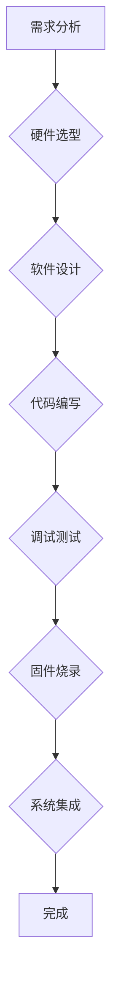

                 

## STM32单片机应用开发

> 关键词：STM32, 单片机, 微控制器, C语言,  嵌入式系统,  硬件驱动,  外设

## 1. 背景介绍

随着物联网、智能家居、工业自动化等领域的蓬勃发展，嵌入式系统需求量持续增长。STM32作为一款功能强大、性价比高的32位微控制器，凭借其丰富的外设、灵活的架构和完善的生态系统，成为了嵌入式开发的首选之一。本文将深入探讨STM32单片机应用开发的各个方面，从核心概念到实际应用，帮助读者全面理解STM32开发流程，掌握核心技术，并激发其在嵌入式领域的创新探索。

## 2. 核心概念与联系

### 2.1  单片机概述

单片机(Microcontroller)是一种集微处理器、存储器和外设于一体的集成电路，它能够独立完成特定的任务。与微处理器相比，单片机体积更小、功耗更低，并且内置了丰富的外部接口，可以直接控制各种传感器、执行器等硬件设备。

### 2.2  STM32架构

STM32属于ARM Cortex-M系列微控制器，其架构主要包括以下部分：

* **CPU核心:**  基于ARM Cortex-M内核，提供高性能和低功耗。
* **内存:**  内置SRAM和Flash存储器，用于程序存储和数据缓存。
* **外设:**  提供丰富的外设接口，例如定时器、ADC、DAC、UART、SPI、I2C等，用于与外部设备进行通信和控制。
* **中断系统:**  支持多级中断，能够快速响应外部事件。

### 2.3  开发流程

STM32单片机应用开发流程通常包括以下步骤：

1. **需求分析:**  明确开发目标和功能需求。
2. **硬件选型:**  根据需求选择合适的STM32型号和外设。
3. **软件设计:**  设计软件架构、算法和数据结构。
4. **代码编写:**  使用C语言编写程序代码。
5. **调试测试:**  使用调试工具进行代码调试和测试。
6. **固件烧录:**  将编译好的程序代码烧录到单片机FLASH中。
7. **系统集成:**  将单片机与其他硬件设备集成，形成完整的系统。

### 2.4  Mermaid 流程图



## 3. 核心算法原理 & 具体操作步骤

### 3.1  算法原理概述

在嵌入式系统开发中，算法是实现特定功能的核心逻辑。常见的算法包括：

* **数字信号处理算法:**  用于处理模拟信号，例如滤波、调制、解调等。
* **控制算法:**  用于控制系统行为，例如PID控制、模糊控制等。
* **数据结构算法:**  用于组织和处理数据，例如排序、查找、树结构等。

### 3.2  算法步骤详解

具体算法的步骤详解取决于具体的算法类型和应用场景。例如，PID控制算法的步骤包括：

1. **测量误差:**  获取系统实际值和目标值的差值。
2. **计算控制量:**  根据误差值和PID参数计算控制量。
3. **执行控制:**  将控制量应用于系统，调节系统状态。
4. **反馈循环:**  重复以上步骤，直到系统达到目标状态。

### 3.3  算法优缺点

不同的算法具有不同的优缺点，需要根据实际应用场景选择合适的算法。例如，PID控制算法简单易实现，但对参数调整较为敏感；模糊控制算法能够处理非线性系统，但计算量较大。

### 3.4  算法应用领域

算法广泛应用于各种嵌入式系统领域，例如：

* **工业自动化:**  控制电机、传感器、执行器等设备。
* **消费电子:**  实现图像处理、语音识别、人机交互等功能。
* **医疗设备:**  监测生命体征、控制医疗仪器等。

## 4. 数学模型和公式 & 详细讲解 & 举例说明

### 4.1  数学模型构建

数学模型是描述系统行为的抽象表示，它可以帮助我们理解系统工作原理，预测系统输出，并进行优化设计。

### 4.2  公式推导过程

公式推导过程是建立数学模型的关键步骤，它需要根据系统物理特性和数学原理进行推导。例如，PID控制算法的控制量计算公式如下：

$$u(t) = K_p e(t) + K_i \int e(t) dt + K_d \frac{de(t)}{dt}$$

其中：

* $u(t)$: 控制量
* $e(t)$: 误差值
* $K_p$: 比例系数
* $K_i$: 积分系数
* $K_d$: 微分系数

### 4.3  案例分析与讲解

通过案例分析，我们可以更深入地理解数学模型和公式的应用。例如，假设我们需要控制一个温度传感器，使其输出温度值保持在25℃。我们可以使用PID控制算法，并根据实际情况调整PID参数，使系统能够稳定地控制温度。

## 5. 项目实践：代码实例和详细解释说明

### 5.1  开发环境搭建

STM32单片机开发环境通常包括：

* **开发工具:**  例如Keil MDK、IAR Embedded Workbench、STM32CubeIDE等。
* **仿真器:**  用于模拟单片机运行环境。
* **下载器:**  用于将程序代码烧录到单片机FLASH中。

### 5.2  源代码详细实现

以下是一个简单的STM32 LED闪烁程序代码示例：

```c
#include "stm32f10x.h"

int main(void)
{
    // 使能GPIOA时钟
    RCC->APB2ENR |= RCC_APB2ENR_IOPAEN;

    // 设置PA5为输出
    GPIOA->CRL &= ~(GPIO_CRL_MODE5);
    GPIOA->CRL |= GPIO_CRL_MODE5_0;

    while (1)
    {
        // 点亮LED
        GPIOA->ODR |= GPIO_ODR_OD5;

        // 延时1秒
        for (int i = 0; i < 1000000; i++);

        // 熄灭LED
        GPIOA->ODR &= ~(GPIO_ODR_OD5);

        // 延时1秒
        for (int i = 0; i < 1000000; i++);
    }
}
```

### 5.3  代码解读与分析

* `#include "stm32f10x.h"`: 包含STM32F10x系列芯片的寄存器定义文件。
* `RCC->APB2ENR |= RCC_APB2ENR_IOPAEN;`: 使能GPIOA时钟。
* `GPIOA->CRL &= ~(GPIO_CRL_MODE5);`: 清除PA5引脚模式。
* `GPIOA->CRL |= GPIO_CRL_MODE5_0;`: 设置PA5引脚为输出模式。
* `GPIOA->ODR |= GPIO_ODR_OD5;`: 点亮LED。
* `GPIOA->ODR &= ~(GPIO_ODR_OD5);`: 熄灭LED。
* `for (int i = 0; i < 1000000; i++);`: 延时1秒。

### 5.4  运行结果展示

程序运行后，连接到STM32单片机上的LED灯将周期性地闪烁。

## 6. 实际应用场景

STM32单片机广泛应用于各种实际场景，例如：

* **智能家居:**  控制灯光、窗帘、空调等设备。
* **工业自动化:**  控制电机、传感器、执行器等设备。
* **医疗设备:**  监测生命体征、控制医疗仪器等。
* **无人机:**  控制飞行姿态、电机转速等。

### 6.4  未来应用展望

随着物联网、人工智能等技术的快速发展，STM32单片机的应用场景将更加广泛，例如：

* **智慧城市:**  实现交通管理、环境监测、公共安全等功能。
* **工业4.0:**  实现智能制造、数据分析、自动化控制等功能。
* **可穿戴设备:**  实现健康监测、运动追踪、人机交互等功能。

## 7. 工具和资源推荐

### 7.1  学习资源推荐

* **STM32官方网站:**  https://www.st.com/en/microcontrollers/stm32.html
* **STM32CubeMX:**  https://www.st.com/en/development-tools/stm32cubemx.html
* **Keil MDK:**  https://www.keil.com/
* **IAR Embedded Workbench:**  https://www.iar.com/iar-embedded-workbench/

### 7.2  开发工具推荐

* **J-Link:**  https://www.segger.com/products/debug-probes/j-link/
* **ST-LINK:**  https://www.st.com/en/development-tools/st-link.html

### 7.3  相关论文推荐

* **STM32微控制器应用研究**
* **基于STM32的嵌入式系统设计**
* **STM32单片机在物联网中的应用**

## 8. 总结：未来发展趋势与挑战

### 8.1  研究成果总结

STM32单片机应用开发取得了显著成果，其功能强大、性价比高、生态系统完善的特点使其成为嵌入式开发的首选之一。

### 8.2  未来发展趋势

未来，STM32单片机应用将朝着以下趋势发展：

* **更强大的性能:**  STM32芯片将继续提升性能，支持更高频率、更多外设。
* **更低的功耗:**  STM32芯片将更加注重功耗优化，支持更长的电池续航时间。
* **更丰富的功能:**  STM32芯片将集成更多人工智能、物联网等功能，支持更复杂的应用场景。

### 8.3  面临的挑战

STM32单片机应用开发也面临一些挑战：

* **软件开发复杂度:**  嵌入式软件开发需要考虑硬件资源限制、实时性要求等因素，开发难度较高。
* **安全问题:**  嵌入式系统面临着安全威胁，需要采取措施保障系统安全。
* **成本问题:**  高性能、高功能的STM32芯片成本较高，需要考虑成本控制问题。

### 8.4  研究展望

未来，STM32单片机应用开发将继续深入研究，探索更先进的算法、更有效的开发方法，并解决安全、成本等问题，推动嵌入式系统技术的发展。

## 9. 附录：常见问题与解答

### 9.1  常见问题

* **如何选择合适的STM32型号？**
* **如何使用STM32CubeMX进行芯片配置？**
* **如何调试STM32程序？**
* **如何烧录程序到STM32单片机？**

### 9.2  解答

* 选择合适的STM32型号需要根据具体应用场景考虑性能、功耗、外设等因素。
* STM32CubeMX是一个图形化配置工具，可以方便地配置芯片外设、中断、定时器等。
* STM32程序调试可以使用仿真器、单片机调试器等工具。
* 程序烧录到STM32单片机可以使用ST-LINK、J-Link等下载器。


作者：禅与计算机程序设计艺术 / Zen and the Art of Computer Programming 
<end_of_turn>

