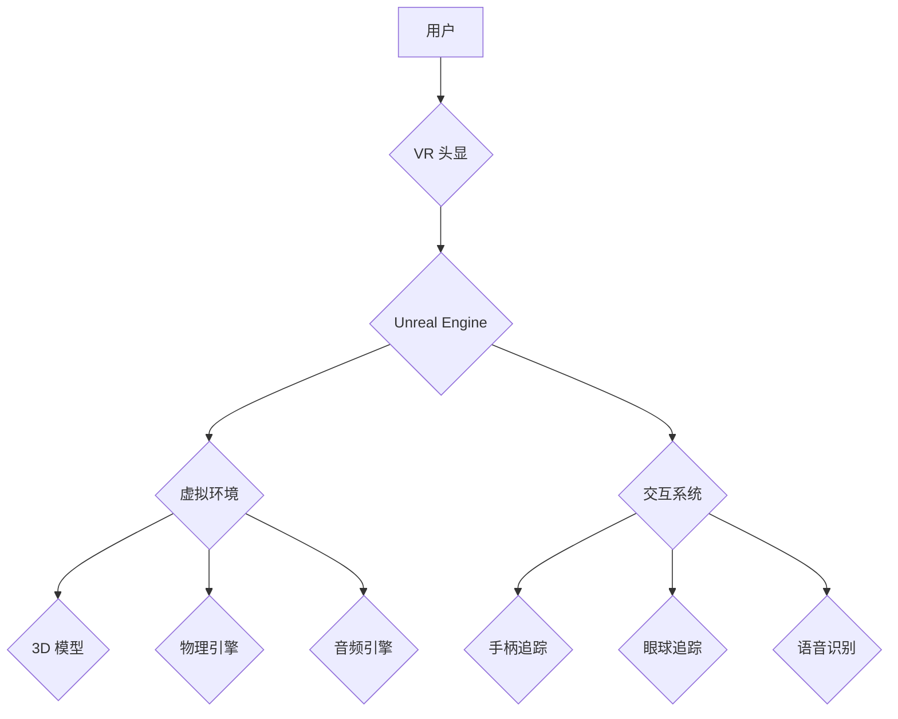

                 

## Unreal Engine VR游戏开发

> 关键词：Unreal Engine, VR游戏开发, 虚拟现实, 3D图形,  C++,  游戏引擎,  交互设计

## 1. 背景介绍

虚拟现实 (VR) 技术近年来发展迅速，为游戏开发带来了前所未有的沉浸式体验。Unreal Engine 作为一款功能强大、易于使用的游戏引擎，凭借其逼真的图形渲染、强大的物理引擎和完善的开发工具，成为了 VR 游戏开发的首选平台之一。

VR 游戏开发与传统游戏开发存在着显著差异。它需要考虑用户在虚拟环境中的感知、交互方式以及生理舒适度等因素。Unreal Engine 提供了丰富的 VR 开发工具和功能，帮助开发者克服这些挑战，打造出令人惊叹的 VR 游戏体验。

## 2. 核心概念与联系

### 2.1 VR 游戏开发的核心概念

* **虚拟环境 (Virtual Environment):** VR 游戏的核心是构建一个逼真的虚拟环境，让用户能够身临其境地体验。
* **交互 (Interaction):** 用户与虚拟环境的交互是 VR 游戏体验的关键。Unreal Engine 提供了多种交互方式，例如手柄追踪、眼球追踪、语音识别等。
* **沉浸感 (Immersion):** 沉浸感是指用户能够完全融入虚拟环境的感觉。这取决于虚拟环境的逼真程度、交互方式的自然性和用户体验的流畅度。
* **舒适度 (Comfort):** VR 游戏需要考虑用户的生理舒适度，避免引起眩晕、恶心等不适感。

### 2.2 Unreal Engine VR 开发架构



**图 2.1 Unreal Engine VR 开发架构**

## 3. 核心算法原理 & 具体操作步骤

### 3.1 算法原理概述

VR 游戏开发涉及多种核心算法，例如 3D 图形渲染、物理模拟、路径规划、人工智能等。这些算法共同作用，为用户提供逼真的虚拟环境和流畅的交互体验。

* **3D 图形渲染:** 渲染虚拟环境的关键算法，包括光线追踪、阴影计算、纹理贴图等。Unreal Engine 使用先进的渲染技术，能够生成逼真的 3D 图形。
* **物理模拟:** 模拟虚拟环境中的物理现象，例如物体运动、碰撞、重力等。Unreal Engine 的物理引擎能够实现逼真的物理效果，增强游戏的沉浸感。
* **路径规划:** 算法用于计算虚拟角色在虚拟环境中移动的路径，避免碰撞和障碍。
* **人工智能:** 为虚拟角色赋予智能行为，例如决策、学习、反应等。Unreal Engine 提供了 AI 开发工具，帮助开发者创建智能的虚拟角色。

### 3.2 算法步骤详解

以 3D 图形渲染为例，其基本步骤如下：

1. **建模:** 使用 3D 建模软件创建虚拟场景的 3D 模型。
2. **材质贴图:** 为模型添加材质和纹理，赋予模型外观和质感。
3. **灯光设置:** 设置虚拟场景中的灯光，模拟真实的光照效果。
4. **渲染:** 使用渲染引擎将 3D 模型、材质、灯光等信息组合起来，生成最终的图像。

### 3.3 算法优缺点

* **优点:** 能够生成逼真的虚拟环境，提供沉浸式的游戏体验。
* **缺点:** 计算量大，对硬件性能要求高。

### 3.4 算法应用领域

VR 游戏开发、虚拟旅游、医学模拟、军事训练等。

## 4. 数学模型和公式 & 详细讲解 & 举例说明

### 4.1 数学模型构建

VR 游戏开发中，需要使用数学模型来描述虚拟环境中的物体、光线、运动等。例如，可以使用向量和矩阵来表示物体的位置、方向和旋转。

### 4.2 公式推导过程

以 3D 物体的位置变换为例，可以使用以下公式：

$$
\mathbf{T} = \mathbf{R} \mathbf{P} + \mathbf{T}_0
$$

其中：

* $\mathbf{T}$ 是物体最终的位置向量。
* $\mathbf{R}$ 是物体旋转的旋转矩阵。
* $\mathbf{P}$ 是物体在旋转前的位置向量。
* $\mathbf{T}_0$ 是物体在旋转后的平移向量。

### 4.3 案例分析与讲解

假设一个物体初始位置为 (1, 2, 3)，需要绕 Y 轴旋转 90 度，然后平移 2 个单位到 X 方向。

1. 旋转矩阵：绕 Y 轴旋转 90 度的旋转矩阵为：

$$
\mathbf{R} = \begin{bmatrix}
0 & 0 & 1 \\
0 & 1 & 0 \\
-1 & 0 & 0
\end{bmatrix}
$$

2. 计算旋转后的位置：

$$
\mathbf{P}' = \mathbf{R} \mathbf{P} = \begin{bmatrix}
0 & 0 & 1 \\
0 & 1 & 0 \\
-1 & 0 & 0
\end{bmatrix} \begin{bmatrix}
1 \\
2 \\
3
\end{bmatrix} = \begin{bmatrix}
3 \\
2 \\
-1
\end{bmatrix}
$$

3. 计算最终位置：

$$
\mathbf{T} = \mathbf{P}' + \mathbf{T}_0 = \begin{bmatrix}
3 \\
2 \\
-1
\end{bmatrix} + \begin{bmatrix}
2 \\
0 \\
0
\end{bmatrix} = \begin{bmatrix}
5 \\
2 \\
-1
\end{bmatrix}
$$

因此，物体最终的位置为 (5, 2, -1)。

## 5. 项目实践：代码实例和详细解释说明

### 5.1 开发环境搭建

* 安装 Unreal Engine 5.0 或更高版本。
* 安装必要的开发工具，例如 Visual Studio。
* 设置 VR 头显设备，例如 Oculus Rift、HTC Vive 等。

### 5.2 源代码详细实现

以下是一个简单的 VR 游戏代码示例，展示了如何使用 Unreal Engine 的 VR 开发工具创建虚拟球体：

```cpp
// SphereActor.cpp

#include "SphereActor.h"
#include "Components/SphereComponent.h"
#include "GameFramework/Actor.h"

// Sets default values
ASphereActor::ASphereActor()
{
 	// Set this actor to call Tick() every frame.  You can turn this off to improve performance if you don't need it.
	PrimaryActorTick.bCanEverTick = true;

	// 创建球体组件
	SphereComponent = CreateDefaultSubobject<USphereComponent>(TEXT("SphereComponent"));
	RootComponent = SphereComponent;

	// 设置球体半径
	SphereComponent->SetSphereRadius(50.0f);
}

// Called when the game starts or when spawned
void ASphereActor::BeginPlay()
{
	Super::BeginPlay();
	
}

// Called every frame
void ASphereActor::Tick(float DeltaTime)
{
	Super::Tick(DeltaTime);

}
```

### 5.3 代码解读与分析

* `ASphereActor` 类定义了一个虚拟球体的 Actor。
* `SphereComponent` 是球体组件，用于表示球体的形状和碰撞检测。
* `RootComponent` 设置了球体的根组件，用于定位和旋转球体。
* `SetSphereRadius()` 方法设置了球体的半径。

### 5.4 运行结果展示

运行代码后，将在虚拟环境中生成一个半径为 50.0f 的球体。

## 6. 实际应用场景

VR 游戏开发的应用场景非常广泛，例如：

* **娱乐游戏:** VR 游戏能够提供沉浸式的游戏体验，例如射击游戏、动作冒险游戏、角色扮演游戏等。
* **教育培训:** VR 技术可以用于模拟真实场景，例如手术模拟、飞行模拟、建筑设计等，帮助用户进行沉浸式的学习和培训。
* **医疗保健:** VR 可以用于治疗恐惧症、焦虑症等心理疾病，也可以用于康复训练，帮助患者恢复肢体功能。
* **工业设计:** VR 可以用于虚拟原型设计和测试，帮助工程师快速迭代和优化产品设计。

### 6.4 未来应用展望

随着 VR 技术的不断发展，其应用场景将会更加广泛。未来，VR 将可能应用于以下领域：

* **元宇宙:** VR 将成为构建元宇宙的重要技术之一，为用户提供沉浸式的虚拟世界体验。
* **远程协作:** VR 可以帮助用户在虚拟环境中进行远程协作，例如远程会议、远程设计等。
* **虚拟旅游:** VR 可以让用户体验身临其境的虚拟旅游，无需出家门即可游览世界各地。

## 7. 工具和资源推荐

### 7.1 学习资源推荐

* **Unreal Engine 官方文档:** https://docs.unrealengine.com/
* **Unreal Engine VR 开发指南:** https://docs.unrealengine.com/5.0/en-US/vr-development-overview/
* **VR 开发社区:** https://forums.unrealengine.com/

### 7.2 开发工具推荐

* **Unreal Engine:** https://www.unrealengine.com/
* **Visual Studio:** https://visualstudio.microsoft.com/
* **Oculus Rift:** https://www.oculus.com/rift/
* **HTC Vive:** https://www.vive.com/

### 7.3 相关论文推荐

* **A Survey of Virtual Reality (VR) Applications in Education:** https://ieeexplore.ieee.org/document/9054431
* **Virtual Reality for Medical Training and Simulation:** https://www.ncbi.nlm.nih.gov/pmc/articles/PMC6490577/

## 8. 总结：未来发展趋势与挑战

### 8.1 研究成果总结

VR 游戏开发技术取得了长足的进步，为用户提供了更加沉浸式的游戏体验。Unreal Engine 提供了强大的开发工具和功能，帮助开发者打造出高质量的 VR 游戏。

### 8.2 未来发展趋势

* **更逼真的图形渲染:** 未来 VR 游戏将采用更先进的渲染技术，例如光线追踪、实时阴影计算等，使虚拟环境更加逼真。
* **更自然的交互方式:** 未来 VR 游戏将支持更自然的交互方式，例如手部追踪、眼球追踪、语音识别等，使用户与虚拟环境的交互更加流畅。
* **更丰富的应用场景:** 未来 VR 技术将应用于更多领域，例如教育、医疗、工业设计等，为用户提供更加广泛的应用体验。

### 8.3 面临的挑战

* **硬件性能限制:** VR 游戏对硬件性能要求较高，未来需要开发更强大的硬件设备，才能满足更高质量 VR 游戏的需求。
* **内容创作成本:** VR 游戏的开发成本较高，需要专业的开发团队和技术支持，这限制了 VR 游戏内容的丰富度。
* **用户体验问题:** VR 游戏可能会引起用户眩晕、恶心等不适感，需要不断改进算法和技术，提高用户体验。

### 8.4 研究展望

未来 VR 游戏开发的研究方向包括：

* **更先进的渲染技术:** 研究更逼真的图形渲染技术，例如基于神经网络的渲染、实时光线追踪等。
* **更自然的交互方式:** 研究更自然的交互方式，例如脑机接口、触觉反馈等。
* **更沉浸式的体验:** 研究如何增强用户沉浸感，例如利用多感官刺激、虚拟现实与增强现实的结合等。

## 9. 附录：常见问题与解答

* **如何设置 VR 头显设备？**

   请参考 Unreal Engine 官方文档中的 VR 头显设置指南。

* **如何创建虚拟球体？**

   请参考 5.2 节中的代码示例。

* **如何解决 VR 游戏中的眩晕问题？**

   可以通过调整游戏设置、降低游戏帧率、使用稳定化技术等方法来解决眩晕问题。


作者：禅与计算机程序设计艺术 / Zen and the Art of Computer Programming 
<end_of_turn>

