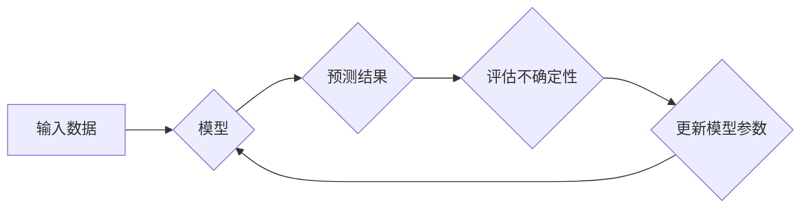

                 

## 不确定性:机器学习面临的普遍挑战

> 关键词：机器学习、不确定性、概率论、贝叶斯推理、深度学习、鲁棒性、解释性

## 1. 背景介绍

机器学习 (Machine Learning) 近年来取得了令人瞩目的成就，在图像识别、自然语言处理、语音识别等领域展现出强大的能力。然而，机器学习模型的成功依赖于大量数据和精心设计的算法，而现实世界充满了不确定性。

不确定性是指在面对未知情况时，无法完全确定结果的可能性。在机器学习领域，不确定性可以表现为以下几种形式：

* **数据不确定性:**  训练数据可能存在噪声、缺失值或偏差，导致模型学习到的规律不完全准确。
* **模型不确定性:** 不同的模型架构、参数设置或训练方法可能会导致不同的预测结果，反映了模型本身对问题的理解存在差异。
* **环境不确定性:**  现实世界是动态变化的，模型在面对新的数据或环境时可能无法准确预测结果。

不确定性对机器学习模型的性能和可靠性构成重大挑战。如果模型无法正确评估自身的不确定性，可能会导致错误的决策，甚至带来灾难性的后果。

## 2. 核心概念与联系

### 2.1 概率论与贝叶斯推理

概率论是处理不确定性的数学框架，它提供了一种量化不确定性的方法。贝叶斯推理是概率论的一种应用，它通过更新先验知识来获得后验概率，从而对不确定性进行建模和推理。

**Mermaid 流程图:**



### 2.2 不确定性量化方法

为了量化机器学习模型的不确定性，可以使用多种方法，例如：

* **概率预测:**  模型输出预测结果的概率分布，而不是单个点估计。
* **置信区间:**  给定置信水平，计算预测结果的范围。
* **不确定性度量:**  使用数学公式计算模型预测的不确定性程度，例如熵、互信息等。

## 3. 核心算法原理 & 具体操作步骤

### 3.1 算法原理概述

贝叶斯推理是一种基于概率论的推理方法，它可以用来量化机器学习模型的不确定性。贝叶斯推理的核心思想是利用先验知识和新的数据来更新对未知事件的信念。

### 3.2 算法步骤详解

1. **定义先验概率:**  根据现有知识或经验，对未知事件的可能性进行初始估计。
2. **收集数据:**  收集与未知事件相关的观测数据。
3. **计算似然概率:**  根据观测数据，计算未知事件发生的可能性。
4. **更新后验概率:**  利用贝叶斯公式，将先验概率和似然概率结合起来，得到对未知事件的更新后的信念。
5. **预测结果:**  根据后验概率分布，预测未知事件的结果。

### 3.3 算法优缺点

**优点:**

* 可以利用先验知识，提高模型的预测精度。
* 可以量化模型的不确定性，提供更可靠的预测结果。
* 可以进行在线学习，随着新数据的到来不断更新模型。

**缺点:**

* 需要定义先验概率，这可能是一个主观的过程。
* 计算复杂度较高，特别是当数据量较大时。

### 3.4 算法应用领域

贝叶斯推理广泛应用于以下领域:

* **医学诊断:**  根据患者的症状和检查结果，预测疾病的可能性。
* **金融风险管理:**  评估投资风险和预测市场波动。
* **自然语言处理:**  理解文本语义和进行情感分析。
* **计算机视觉:**  识别物体和场景，并估计识别结果的不确定性。

## 4. 数学模型和公式 & 详细讲解 & 举例说明

### 4.1 数学模型构建

贝叶斯推理的核心是贝叶斯公式，它描述了如何根据先验知识和新证据更新对未知事件的信念。

**贝叶斯公式:**

$$P(A|B) = \frac{P(B|A)P(A)}{P(B)}$$

其中:

* $P(A|B)$ 是事件 A 在已知事件 B 发生的条件下的概率，即后验概率。
* $P(B|A)$ 是事件 B 在已知事件 A 发生的条件下的概率，即似然概率。
* $P(A)$ 是事件 A 的先验概率。
* $P(B)$ 是事件 B 的概率。

### 4.2 公式推导过程

贝叶斯公式的推导过程基于概率论的基本定理，即全概率公式和条件概率公式。

**全概率公式:**

$$P(B) = \sum_i P(B|A_i)P(A_i)$$

**条件概率公式:**

$$P(A|B) = \frac{P(A \cap B)}{P(B)}$$

通过将这些公式结合起来，可以推导出贝叶斯公式。

### 4.3 案例分析与讲解

**例子:**

假设我们有一个疾病检测模型，它可以根据患者的症状和检查结果预测是否患有某种疾病。

* **先验概率:**  根据流行病学数据，我们知道该疾病的患病率为 1%。
* **似然概率:**  模型根据患者的症状和检查结果，预测患病概率为 80%。

**使用贝叶斯公式计算后验概率:**

$$P(\text{患病}|\text{症状和检查结果}) = \frac{0.8 \times 0.01}{P(\text{症状和检查结果})}$$

为了计算 $P(\text{症状和检查结果})$，我们需要考虑患者既患病又出现症状和检查结果的概率，以及患者未患病但出现症状和检查结果的概率。

## 5. 项目实践：代码实例和详细解释说明

### 5.1 开发环境搭建

* Python 3.x
* NumPy
* Scikit-learn
* Matplotlib

### 5.2 源代码详细实现

```python
from sklearn.datasets import load_iris
from sklearn.model_selection import train_test_split
from sklearn.naive_bayes import GaussianNB
from sklearn.metrics import accuracy_score

# 加载鸢尾花数据集
iris = load_iris()
X = iris.data
y = iris.target

# 将数据划分为训练集和测试集
X_train, X_test, y_train, y_test = train_test_split(X, y, test_size=0.2, random_state=42)

# 创建朴素贝叶斯模型
model = GaussianNB()

# 训练模型
model.fit(X_train, y_train)

# 预测测试集结果
y_pred = model.predict(X_test)

# 计算模型准确率
accuracy = accuracy_score(y_test, y_pred)
print(f"模型准确率: {accuracy}")

# 获取模型预测的不确定性度量
probabilities = model.predict_proba(X_test)
```

### 5.3 代码解读与分析

* 代码首先加载鸢尾花数据集，并将其划分为训练集和测试集。
* 然后，创建朴素贝叶斯模型，并使用训练集训练模型。
* 训练完成后，使用测试集预测结果，并计算模型的准确率。
* 此外，代码还获取了模型预测的概率分布，可以用来量化模型的不确定性。

### 5.4 运行结果展示

运行代码后，会输出模型的准确率以及每个样本的预测概率分布。

## 6. 实际应用场景

### 6.1 医疗诊断

在医疗诊断领域，贝叶斯推理可以帮助医生根据患者的症状、检查结果和病史，评估患某种疾病的概率。

### 6.2 金融风险管理

在金融风险管理领域，贝叶斯推理可以用来评估投资风险和预测市场波动。

### 6.3 自然语言处理

在自然语言处理领域，贝叶斯推理可以用于文本分类、情感分析和机器翻译等任务。

### 6.4 未来应用展望

随着机器学习技术的不断发展，贝叶斯推理将在更多领域得到应用，例如自动驾驶、机器人控制和个性化推荐等。

## 7. 工具和资源推荐

### 7.1 学习资源推荐

* **书籍:**

    * "Probabilistic Graphical Models: Principles and Techniques" by Daphne Koller and Nir Friedman
    * "Pattern Recognition and Machine Learning" by Christopher M. Bishop

* **在线课程:**

    * Coursera: "Machine Learning" by Andrew Ng
    * edX: "Probabilistic Reasoning" by Stanford University

### 7.2 开发工具推荐

* **Python:**  一个广泛使用的编程语言，拥有丰富的机器学习库。
* **Scikit-learn:**  一个用于机器学习的 Python 库，包含了各种算法和工具。
* **TensorFlow:**  一个用于深度学习的开源框架。

### 7.3 相关论文推荐

* "A Tutorial on Bayesian Networks" by Judea Pearl
* "Probabilistic Machine Learning" by Kevin Murphy

## 8. 总结：未来发展趋势与挑战

### 8.1 研究成果总结

近年来，机器学习领域取得了令人瞩目的成就，贝叶斯推理作为一种重要的推理方法，在处理不确定性方面发挥了重要作用。

### 8.2 未来发展趋势

未来，贝叶斯推理将在以下方面得到进一步发展:

* **更强大的计算能力:**  随着计算能力的提升，贝叶斯推理模型可以处理更大规模的数据，并进行更复杂的推理。
* **新的算法和方法:**  研究人员将继续开发新的贝叶斯推理算法和方法，以提高模型的效率和准确性。
* **更广泛的应用:**  贝叶斯推理将在更多领域得到应用，例如自动驾驶、机器人控制和个性化推荐等。

### 8.3 面临的挑战

尽管贝叶斯推理在处理不确定性方面具有优势，但它也面临一些挑战:

* **先验知识的定义:**  定义先验概率是一个主观的过程，可能会影响模型的性能。
* **计算复杂度:**  贝叶斯推理模型的计算复杂度较高，特别是当数据量较大时。
* **解释性:**  贝叶斯推理模型的决策过程可能难以解释，这可能会阻碍其在一些领域中的应用。

### 8.4 研究展望

未来，研究人员将继续努力解决这些挑战，并推动贝叶斯推理技术的进一步发展。


## 9. 附录：常见问题与解答

**问题 1:**  贝叶斯推理和深度学习有什么区别？

**答案:**  贝叶斯推理是一种基于概率论的推理方法，它可以量化模型的不确定性。深度学习是一种基于神经网络的机器学习方法，它可以学习复杂的特征表示。

**问题 2:**  如何选择合适的先验概率？

**答案:**  先验概率的选择是一个主观的过程，需要根据领域知识和经验进行判断。

**问题 3:**  贝叶斯推理模型的计算复杂度如何解决？

**答案:**  可以通过使用近似算法、变分推理等方法来降低贝叶斯推理模型的计算复杂度。


作者：禅与计算机程序设计艺术 / Zen and the Art of Computer Programming 
<end_of_turn>

