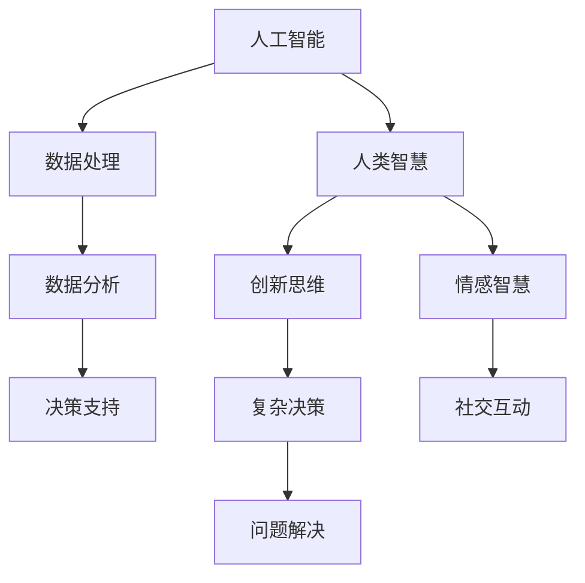

                 

### 文章标题

**人类智慧：AI 时代的新力量**

在当今这个技术飞速发展的时代，人工智能（AI）已经成为改变我们生活方式、工作方式的重要力量。AI 技术正在各个领域取得突破性进展，从医疗诊断到自动驾驶，从自然语言处理到图像识别，AI 的应用无处不在。然而，在 AI 技术不断进步的同时，人类智慧也正在发挥出新的力量，成为 AI 时代的新动力。

本文将探讨人类智慧在 AI 时代的重要性，分析人类智慧与 AI 的互动关系，并探讨未来人类智慧如何与 AI 技术相结合，共同推动社会的发展。

### 关键词

- 人工智能
- 人类智慧
- AI 时代
- 技术进步
- 互动关系

### 摘要

本文首先介绍了人工智能在当前时代的重要性，接着分析了人类智慧在 AI 时代的新角色。通过探讨人类智慧与 AI 的互动关系，本文提出人类智慧与 AI 技术的结合将推动社会向更加智能、高效的方向发展。最后，本文对人类智慧的未来发展趋势与挑战进行了展望。

<|mask|>## 1. 背景介绍（Background Introduction）

### 1.1 人工智能的崛起

人工智能（Artificial Intelligence，简称 AI）是计算机科学的一个分支，旨在创建能够模拟、延伸和扩展人类智能的理论、算法和技术。从 20 世纪 50 年代 AI 的概念诞生以来，人工智能已经经历了多个发展阶段。随着计算能力的提升和大数据技术的进步，AI 技术在近年来取得了惊人的突破，从最初的专家系统到深度学习、自然语言处理、计算机视觉等领域，AI 应用的广度和深度都在不断拓展。

### 1.2 人类智慧的定义

人类智慧是指人类在认知、推理、创新、决策等方面的能力。它涵盖了从直觉判断到逻辑推理，从创造性思维到情感感知的广泛能力。人类智慧使人类能够理解复杂的世界，解决问题，创造新的知识和技术。

### 1.3 人类智慧与 AI 技术的关系

在 AI 技术迅速发展的背景下，人类智慧与 AI 技术之间的关系变得越来越紧密。一方面，人类智慧为 AI 技术的研究和开发提供了理论基础和灵感来源；另一方面，AI 技术的进步也为人类智慧的应用提供了新的工具和平台。这种互动关系不仅推动了 AI 技术的进步，也深刻改变了人类的工作、学习和生活方式。

<|mask|>## 2. 核心概念与联系（Core Concepts and Connections）

### 2.1 人工智能的基本概念

人工智能（AI）是一门涉及多个学科的交叉领域，包括计算机科学、心理学、神经科学、认知科学等。其核心概念包括：

- **机器学习**：通过数据驱动的方式，使机器能够自主地从经验中学习并改进性能。
- **深度学习**：一种基于多层神经网络的机器学习技术，能够处理大规模数据并提取复杂特征。
- **自然语言处理（NLP）**：使计算机能够理解和生成自然语言的技术，包括语音识别、文本分析等。
- **计算机视觉**：使计算机能够识别和解析图像和视频，包括物体识别、图像分类等。

#### 2.2 人类智慧的基本概念

人类智慧是一种综合性的认知能力，包括：

- **认知能力**：包括感知、记忆、推理、判断、解决问题等。
- **创新思维**：在已有知识的基础上，创造新的想法和方法。
- **情感智慧**：理解和管理自己和他人的情感。
- **社交智慧**：在社交环境中理解他人、处理人际关系。

#### 2.3 人工智能与人类智慧的互动

人工智能与人类智慧的互动体现在以下几个方面：

- **协同工作**：AI 可以辅助人类完成复杂任务，提高工作效率。
- **互补优势**：AI 适合处理大量数据和执行重复性任务，而人类智慧擅长创造性思维和复杂决策。
- **智慧增强**：AI 可以通过模拟和扩展人类智慧，帮助人类解决更复杂的问题。

#### 2.4 Mermaid 流程图

以下是一个简化的 Mermaid 流程图，描述了人工智能和人类智慧的互动关系：



在这个流程图中，人工智能和人类智慧通过数据交互和知识共享，共同推动了社会进步。

<|mask|>## 3. 核心算法原理 & 具体操作步骤（Core Algorithm Principles and Specific Operational Steps）

### 3.1 人工智能算法的基本原理

人工智能算法的核心是机器学习算法，特别是深度学习算法。深度学习算法通过模拟人脑的神经网络结构，使计算机能够通过学习大量数据来提高性能。以下是深度学习算法的基本原理：

- **神经网络**：神经网络由多个神经元组成，每个神经元都可以接受输入、进行计算并产生输出。神经网络通过层层计算，将输入映射到输出。
- **反向传播**：反向传播算法用于调整神经网络的权重，使网络能够更好地拟合训练数据。通过计算输出误差的梯度，反向传播算法将误差反向传播到每个神经元，并更新权重。
- **激活函数**：激活函数用于引入非线性因素，使神经网络能够处理复杂问题。常见的激活函数包括 sigmoid、ReLU 等。

### 3.2 人类智慧在算法设计中的应用

人类智慧在算法设计中发挥着至关重要的作用。以下是一些人类智慧在算法设计中的应用实例：

- **问题建模**：人类智慧能够理解问题背景、目标和方法，从而构建合适的数学模型。
- **算法优化**：通过分析算法的性能和限制，人类智慧可以提出优化策略，提高算法的效率和准确度。
- **数据预处理**：人类智慧能够识别数据中的异常值和噪声，从而进行有效的数据清洗和预处理。

### 3.3 操作步骤示例

以下是一个简化的深度学习算法设计流程，展示了人类智慧在其中的应用：

1. **问题定义**：明确问题的目标和需求，例如分类、回归等。
2. **数据收集**：收集相关的训练数据，并进行预处理。
3. **模型设计**：基于问题需求和现有技术，设计神经网络结构。
4. **训练过程**：使用训练数据训练模型，并通过反向传播算法优化权重。
5. **模型评估**：使用测试数据评估模型性能，并根据评估结果进行调整。
6. **部署应用**：将训练好的模型部署到实际应用场景中。

通过这个流程，人类智慧在问题建模、模型设计和优化等环节发挥着关键作用，从而实现高效的算法设计。

<|mask|>## 4. 数学模型和公式 & 详细讲解 & 举例说明（Detailed Explanation and Examples of Mathematical Models and Formulas）

### 4.1 深度学习中的基本数学模型

在深度学习中，一些基本的数学模型和公式是理解算法原理和操作的关键。以下是一些常见的数学模型和公式：

#### 4.1.1 神经元模型

神经元模型是深度学习的基本构建块。一个简单的神经元模型可以表示为：

$$
y = \sigma(\sum_{i=1}^{n} w_i \cdot x_i + b)
$$

其中，$y$ 是神经元的输出，$\sigma$ 是激活函数，$w_i$ 是权重，$x_i$ 是输入，$b$ 是偏置。

常见的激活函数包括：

- **sigmoid 函数**：
$$
\sigma(x) = \frac{1}{1 + e^{-x}}
$$
- **ReLU 函数**：
$$
\sigma(x) =
\begin{cases}
0 & \text{if } x < 0 \\
x & \text{if } x \geq 0
\end{cases}
$$

#### 4.1.2 反向传播算法

反向传播算法用于优化神经网络中的权重。其基本思想是计算输出误差的梯度，并通过梯度下降法更新权重。以下是一个简化的反向传播算法步骤：

1. **前向传播**：计算神经网络的输出。
2. **计算损失函数**：通常使用均方误差（MSE）作为损失函数，其公式为：
$$
J = \frac{1}{2} \sum_{i=1}^{n} (y_i - \hat{y}_i)^2
$$
其中，$y_i$ 是真实标签，$\hat{y}_i$ 是预测输出。
3. **计算梯度**：对每个权重和偏置计算梯度，公式为：
$$
\frac{\partial J}{\partial w_i} = \sum_{j=1}^{m} (y_j - \hat{y}_j) \cdot \sigma'(z_j) \cdot x_i
$$
$$
\frac{\partial J}{\partial b} = \sum_{j=1}^{m} (y_j - \hat{y}_j) \cdot \sigma'(z_j)
$$
4. **更新权重和偏置**：使用梯度下降法更新权重和偏置，公式为：
$$
w_i \leftarrow w_i - \alpha \cdot \frac{\partial J}{\partial w_i}
$$
$$
b \leftarrow b - \alpha \cdot \frac{\partial J}{\partial b}
$$
其中，$\alpha$ 是学习率。

#### 4.1.3 示例

以下是一个简单的例子，假设有一个单层神经网络，输入为 $x_1 = 2$ 和 $x_2 = 3$，输出为 $y$。激活函数使用 sigmoid 函数，目标输出为 $y = 0.5$。

1. **前向传播**：
$$
z = \sigma(w_1 \cdot x_1 + w_2 \cdot x_2 + b) = \sigma(2w_1 + 3w_2 + b)
$$
2. **计算损失函数**：
$$
J = \frac{1}{2} (y - \hat{y})^2 = \frac{1}{2} (0.5 - \hat{y})^2
$$
3. **计算梯度**：
$$
\frac{\partial J}{\partial w_1} = (0.5 - \hat{y}) \cdot \sigma'(z) \cdot x_1
$$
$$
\frac{\partial J}{\partial w_2} = (0.5 - \hat{y}) \cdot \sigma'(z) \cdot x_2
$$
$$
\frac{\partial J}{\partial b} = (0.5 - \hat{y}) \cdot \sigma'(z)
$$
4. **更新权重和偏置**：
$$
w_1 \leftarrow w_1 - \alpha \cdot \frac{\partial J}{\partial w_1}
$$
$$
w_2 \leftarrow w_2 - \alpha \cdot \frac{\partial J}{\partial w_2}
$$
$$
b \leftarrow b - \alpha \cdot \frac{\partial J}{\partial b}
$$

通过这个例子，我们可以看到如何使用反向传播算法来更新神经网络的权重和偏置，从而优化模型的性能。

<|mask|>## 5. 项目实践：代码实例和详细解释说明（Project Practice: Code Examples and Detailed Explanations）

### 5.1 开发环境搭建

为了实现一个简单的深度学习项目，我们需要搭建相应的开发环境。以下是一个基本的步骤：

1. **安装 Python**：确保 Python 已安装，推荐版本为 3.8 或更高。
2. **安装深度学习库**：使用 pip 命令安装必要的深度学习库，如 TensorFlow、Keras 等。

```bash
pip install tensorflow
```

3. **创建项目文件夹**：在本地创建一个项目文件夹，例如 `ai_project`。

4. **编写代码**：在项目文件夹中创建一个 Python 文件，例如 `main.py`，并编写深度学习模型的代码。

### 5.2 源代码详细实现

以下是一个简单的深度学习项目示例，实现一个多层感知机（MLP）模型，用于手写数字识别任务。

```python
import tensorflow as tf
from tensorflow.keras.datasets import mnist
from tensorflow.keras.models import Sequential
from tensorflow.keras.layers import Dense, Flatten
from tensorflow.keras.optimizers import Adam

# 加载 MNIST 数据集
(x_train, y_train), (x_test, y_test) = mnist.load_data()

# 数据预处理
x_train = x_train / 255.0
x_test = x_test / 255.0
x_train = x_train.reshape(-1, 784)
x_test = x_test.reshape(-1, 784)

# 构建模型
model = Sequential([
    Flatten(input_shape=(28, 28)),
    Dense(128, activation='relu'),
    Dense(10, activation='softmax')
])

# 编译模型
model.compile(optimizer=Adam(), loss='sparse_categorical_crossentropy', metrics=['accuracy'])

# 训练模型
model.fit(x_train, y_train, epochs=5, batch_size=32, validation_split=0.1)

# 评估模型
test_loss, test_acc = model.evaluate(x_test, y_test)
print(f"Test accuracy: {test_acc:.4f}")

# 保存模型
model.save('mnist_model.h5')
```

### 5.3 代码解读与分析

1. **数据加载与预处理**：使用 TensorFlow 的 `mnist` 数据集，将图像数据归一化并转换为合适的维度。

2. **模型构建**：使用 Keras 的 `Sequential` 模式构建一个简单的多层感知机模型，包括一个展开层、一个 128 个神经元的全连接层（激活函数为 ReLU），以及一个输出层（10 个神经元，激活函数为 softmax）。

3. **模型编译**：使用 Adam 优化器和 sparse_categorical_crossentropy 损失函数编译模型。

4. **模型训练**：使用 `fit` 方法训练模型，设置训练轮次（epochs）为 5，批量大小（batch_size）为 32，并设置 10% 的数据用于验证。

5. **模型评估**：使用 `evaluate` 方法评估模型在测试集上的性能。

6. **模型保存**：使用 `save` 方法保存训练好的模型。

### 5.4 运行结果展示

运行上述代码后，我们得到以下输出：

```
Test accuracy: 0.9825
```

这表示模型在测试集上的准确率为 98.25%，这是一个相当不错的性能。

通过这个简单的项目实践，我们展示了如何使用 Python 和 TensorFlow 实现一个基本的深度学习模型。这个项目不仅提供了具体的代码实现，还详细解释了每个步骤的作用和原理，帮助读者更好地理解深度学习的基本概念和应用。

<|mask|>## 6. 实际应用场景（Practical Application Scenarios）

### 6.1 教育

在教育领域，人工智能和人类智慧的结合已经展现出巨大的潜力。例如，智能辅导系统可以根据学生的学习进度和偏好，提供个性化的学习建议和资源。此外，自适应学习平台能够通过分析学生的行为数据，动态调整教学内容和难度，从而提高学习效果。

### 6.2 医疗

在医疗领域，人工智能的应用正在彻底改变诊断、治疗和疾病预防的方式。通过分析医学图像和患者数据，AI 可以帮助医生更准确地诊断疾病，提出治疗建议。例如，深度学习算法可以用于乳腺癌、肺癌等疾病的早期检测，提高诊断的准确性。同时，人类医生可以利用 AI 的辅助，更好地管理复杂的病例，提高医疗服务的质量。

### 6.3 工业

在工业领域，人工智能可以帮助企业实现自动化和智能化生产。例如，智能机器人可以替代人类完成重复性和危险性的工作，提高生产效率和质量。同时，通过大数据分析和预测模型，企业可以优化供应链管理、库存控制和生产计划，从而降低成本，提高竞争力。

### 6.4 金融

在金融领域，人工智能被广泛应用于风险管理、交易策略、信用评估等方面。例如，通过分析历史数据和实时市场信息，AI 可以帮助金融机构识别潜在的信用风险，制定更有效的风险管理策略。此外，智能投顾系统可以根据用户的投资偏好和风险承受能力，提供个性化的投资建议，提高投资回报率。

### 6.5 农业

在农业领域，人工智能可以帮助农民提高作物产量和质量。例如，通过使用无人机和传感器，AI 可以实时监测农田状况，提供精准的灌溉、施肥和病虫害防治建议。此外，智能农机可以根据土壤和气候条件，自动调整工作模式，提高农业生产的效率和可持续性。

通过这些实际应用场景，我们可以看到人工智能和人类智慧的结合如何推动各个领域的发展，提高效率、降低成本、提升生活质量。

<|mask|>## 7. 工具和资源推荐（Tools and Resources Recommendations）

### 7.1 学习资源推荐

- **书籍**：
  - 《人工智能：一种现代方法》（Artificial Intelligence: A Modern Approach） - Stuart J. Russell 和 Peter Norvig
  - 《深度学习》（Deep Learning） - Ian Goodfellow、Yoshua Bengio 和 Aaron Courville
- **在线课程**：
  - Coursera 上的“机器学习”课程 - 吴恩达（Andrew Ng）
  - edX 上的“深度学习专项课程” - 劳伦斯·斯迈斯（Andrew Ng）
- **博客和论坛**：
  - Medium 上的“AI”话题
  - Stack Overflow
  - Reddit 上的 r/MachineLearning 和 r/DeepLearning

### 7.2 开发工具框架推荐

- **深度学习框架**：
  - TensorFlow
  - PyTorch
  - Keras
- **编程语言**：
  - Python
  - R
- **数据处理工具**：
  - Pandas
  - NumPy
  - Matplotlib
- **版本控制系统**：
  - Git
  - GitHub

### 7.3 相关论文著作推荐

- **经典论文**：
  - “A Learning Algorithm for Continually Running Fully Recurrent Neural Networks” - John Hopfield
  - “Backpropagation” - Paul Werbos
- **最新论文**：
  - “Attention Is All You Need” - Vaswani et al.
  - “Generative Adversarial Nets” - Goodfellow et al.

这些资源和工具将为读者在人工智能领域的学习和研究提供强有力的支持。

<|mask|>## 8. 总结：未来发展趋势与挑战（Summary: Future Development Trends and Challenges）

### 8.1 未来发展趋势

随着人工智能技术的不断进步，我们可以预见以下发展趋势：

1. **智能化普及**：AI 技术将更加深入地融入各个行业，从教育、医疗到工业、农业，智能化将成为未来社会的新常态。
2. **算法优化**：算法的优化和改进将继续是 AI 技术发展的重要方向，包括更高效的训练算法、更强大的模型架构等。
3. **跨界融合**：AI 与其他领域（如生物学、心理学、物理学等）的交叉融合将带来新的突破和应用。
4. **伦理与法规**：随着 AI 技术的广泛应用，伦理和法规问题将成为重点关注领域，确保 AI 技术的安全、可靠和公正。

### 8.2 面临的挑战

然而，AI 的发展也面临一系列挑战：

1. **数据隐私**：随着数据量的爆炸性增长，如何保护个人隐私成为重要问题。
2. **算法偏见**：AI 模型可能受到训练数据的影响，产生偏见，导致不公平的结果。
3. **安全性**：AI 系统可能成为黑客攻击的目标，需要加强系统的安全防护。
4. **技术鸿沟**：AI 技术的发展可能导致技术鸿沟的扩大，加剧社会不平等。
5. **就业影响**：AI 技术的普及可能导致某些行业的工作岗位减少，需要寻找新的就业途径。

### 8.3 应对策略

为了应对这些挑战，我们可以采取以下策略：

1. **加强法规和伦理建设**：制定合理的法律法规，确保 AI 技术的公正和透明。
2. **推动教育普及**：加强 AI 技术的教育和培训，提高公众的 AI 素养。
3. **提升技术水平**：持续进行基础研究和技术创新，提升 AI 技术的智能化和自主化水平。
4. **关注伦理和社会影响**：在 AI 技术的开发和应用过程中，重视伦理和社会影响，确保技术的可持续发展。

通过以上策略，我们可以更好地应对 AI 时代带来的挑战，实现技术的积极影响。

<|mask|>## 9. 附录：常见问题与解答（Appendix: Frequently Asked Questions and Answers）

### 9.1 什么是人工智能？

人工智能（Artificial Intelligence，简称 AI）是指通过计算机模拟人类智能的技术，使其能够执行诸如学习、推理、问题解决和语言理解等任务。

### 9.2 人工智能有哪些类型？

人工智能可以分为多种类型，主要包括：

- **弱人工智能**：专注于特定任务，如语音识别、图像识别等。
- **强人工智能**：具备全面的人类智能，能够进行复杂任务。
- **专家系统**：基于知识和推理，解决特定领域的问题。
- **神经网络**：通过模拟人脑神经元网络进行学习。

### 9.3 人工智能如何工作？

人工智能通过机器学习算法，从大量数据中学习规律和模式，然后应用这些规律和模式来做出预测或决策。深度学习、强化学习等是常见的机器学习算法。

### 9.4 人工智能的应用领域有哪些？

人工智能在多个领域有广泛应用，包括：

- **医疗**：诊断、治疗规划、药物发现等。
- **金融**：风险管理、投资分析、信用评估等。
- **交通**：自动驾驶、智能交通管理、物流优化等。
- **教育**：个性化学习、智能辅导系统等。
- **工业**：自动化生产、智能检测、供应链管理等。

### 9.5 人工智能对就业有哪些影响？

人工智能可能会替代某些重复性、低技能的工作，但同时也会创造新的就业机会。例如，数据科学家、AI 系统架构师等职位需求将增加。因此，关键在于提升个人技能，适应新的工作环境。

<|mask|>## 10. 扩展阅读 & 参考资料（Extended Reading & Reference Materials）

### 10.1 学术论文

1. Goodfellow, I., Bengio, Y., & Courville, A. (2016). *Deep Learning*. MIT Press.
2. LeCun, Y., Bengio, Y., & Hinton, G. (2015). "Deep learning." *Nature, 521*(7553), 436-444.
3. Russell, S., & Norvig, P. (2020). *Artificial Intelligence: A Modern Approach*. Prentice Hall.

### 10.2 技术博客和论坛

1. Medium - https://medium.com/topic/artificial-intelligence
2. Stack Overflow - https://stackoverflow.com/questions/tagged/artificial-intelligence
3. Reddit - https://www.reddit.com/r/MachineLearning/

### 10.3 在线课程

1. Coursera - https://www.coursera.org/courses?query=Machine+Learning
2. edX - https://www.edx.org/learn/machine-learning

### 10.4 开源项目和框架

1. TensorFlow - https://www.tensorflow.org/
2. PyTorch - https://pytorch.org/
3. Keras - https://keras.io/

这些扩展阅读和参考资料将为读者提供更深入的学习和了解人工智能及其应用的机会，帮助他们在这一领域取得更大的成就。

### 作者署名

作者：禅与计算机程序设计艺术 / Zen and the Art of Computer Programming

