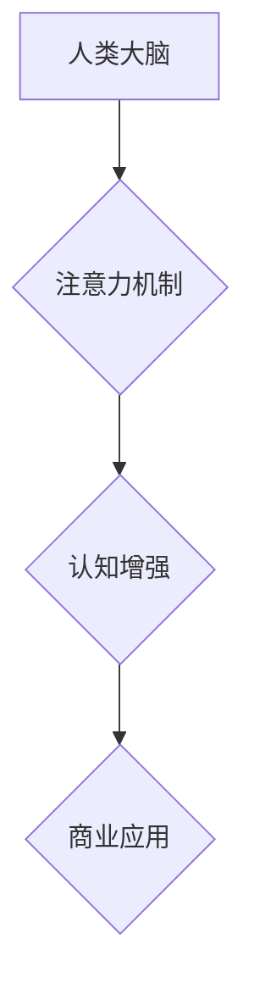

                 

## 人类注意力增强：提升专注力和注意力在商业中的技巧

> 关键词：注意力、专注力、深度学习、神经网络、认知增强、商业应用、脑机接口、可穿戴设备

## 1. 背景介绍

在当今信息爆炸的时代，人类的注意力面临着前所未有的挑战。来自社交媒体、电子邮件、新闻推送等各种信息源的不断轰炸，使得我们难以集中精力完成任务，保持深度思考。注意力力的下降不仅影响着个人生活，也严重阻碍着商业发展。

商业领域对专注力和注意力有极高的需求。无论是决策制定、创意迸发、团队协作还是客户服务，都需要高度的集中力和持续的注意力才能取得成功。然而，注意力力的下降正在成为企业面临的一大难题。员工难以专注于工作，效率低下，决策错误，创新能力下降，最终影响着企业的竞争力。

因此，如何提升人类的注意力，增强专注力，在商业领域发挥更大的作用，成为一个亟待解决的问题。

## 2. 核心概念与联系

**2.1 注意力机制**

注意力机制是一种模仿人类认知过程的机器学习技术，它能够帮助模型聚焦于输入数据中最重要的部分，从而提高学习效率和准确性。

**2.2 认知增强**

认知增强是指通过技术手段提升人类认知能力，包括注意力、记忆、学习、决策等方面的能力。

**2.3 商业应用**

注意力增强技术在商业领域有着广泛的应用前景，例如：

* **提高员工工作效率:** 通过注意力训练和辅助工具，帮助员工集中注意力，提高工作效率。
* **增强决策能力:** 通过注意力分析和预测，帮助企业决策者做出更明智的决策。
* **提升客户体验:** 通过注意力感知和个性化推荐，提升客户体验，增强客户忠诚度。
* **促进创新:** 通过注意力引导和灵感激发，促进企业创新。

**2.4 架构图**



## 3. 核心算法原理 & 具体操作步骤

**3.1 算法原理概述**

注意力机制的核心原理是通过一个加权机制，将输入数据中的重要部分赋予更高的权重，而忽略不重要的部分。

**3.2 算法步骤详解**

1. **输入数据:** 将需要处理的数据输入到注意力机制模型中。
2. **特征提取:** 使用神经网络等方法提取数据的特征表示。
3. **注意力计算:** 计算每个特征对模型输出的贡献度，并将其作为权重。
4. **加权求和:** 根据计算出的权重，对特征进行加权求和，得到最终的输出。

**3.3 算法优缺点**

**优点:**

* 可以有效地聚焦于输入数据中最重要的部分，提高模型的学习效率和准确性。
* 可以处理长序列数据，例如文本和音频。
* 可以解释模型的决策过程，提高模型的可解释性。

**缺点:**

* 计算复杂度较高，训练时间较长。
* 需要大量的训练数据才能达到最佳效果。

**3.4 算法应用领域**

注意力机制在机器学习领域有着广泛的应用，例如：

* **自然语言处理:** 机器翻译、文本摘要、问答系统等。
* **计算机视觉:** 图像识别、目标检测、图像分割等。
* **语音识别:** 语音转文本、语音合成等。

## 4. 数学模型和公式 & 详细讲解 & 举例说明

**4.1 数学模型构建**

注意力机制的数学模型通常基于一个加权求和操作。

**4.2 公式推导过程**

假设我们有一个输入序列 $x = (x_1, x_2, ..., x_n)$，以及一个查询向量 $q$。

注意力权重 $a_{ij}$ 表示输入序列中第 $i$ 个元素 $x_i$ 对查询向量 $q$ 的重要程度。

注意力权重计算公式如下：

$$a_{ij} = \frac{exp(score(x_i, q))}{\sum_{k=1}^{n} exp(score(x_k, q))}$$

其中，$score(x_i, q)$ 是 $x_i$ 和 $q$ 之间的相似度得分，可以使用点积或其他相似度度量方法计算。

**4.3 案例分析与讲解**

例如，在机器翻译任务中，输入序列是源语言文本，查询向量是目标语言的词嵌入。注意力机制可以计算每个源语言词对目标语言词的注意力权重，从而确定翻译过程中哪些词语更重要。

**4.4 公式应用**

$$
\begin{aligned}
x &= (x_1, x_2, x_3) \\
q &= (q_1, q_2, q_3) \\
a_{11} &= \frac{exp(score(x_1, q))}{exp(score(x_1, q)) + exp(score(x_2, q)) + exp(score(x_3, q))} \\
a_{12} &= \frac{exp(score(x_2, q))}{exp(score(x_1, q)) + exp(score(x_2, q)) + exp(score(x_3, q))} \\
a_{13} &= \frac{exp(score(x_3, q))}{exp(score(x_1, q)) + exp(score(x_2, q)) + exp(score(x_3, q))}
\end{aligned}
$$

## 5. 项目实践：代码实例和详细解释说明

**5.1 开发环境搭建**

* Python 3.6+
* TensorFlow 2.0+
* PyTorch 1.0+

**5.2 源代码详细实现**

```python
import tensorflow as tf

# 定义注意力机制模型
class Attention(tf.keras.layers.Layer):
    def __init__(self, units):
        super(Attention, self).__init__()
        self.W1 = tf.keras.layers.Dense(units)
        self.W2 = tf.keras.layers.Dense(units)
        self.V = tf.keras.layers.Dense(1)

    def call(self, inputs):
        # inputs: (batch_size, seq_len, units)
        query = self.W1(inputs)
        key = self.W2(inputs)
        score = self.V(tf.math.multiply(query, key, transpose_b=True))
        attention_weights = tf.nn.softmax(score, axis=-1)
        context = tf.math.multiply(attention_weights, inputs)
        context = tf.reduce_sum(context, axis=-2)
        return context, attention_weights

# 使用注意力机制模型
model = tf.keras.Sequential([
    tf.keras.layers.Embedding(input_dim=10000, output_dim=128),
    Attention(units=128),
    tf.keras.layers.Dense(units=10, activation='softmax')
])

# 训练模型
model.compile(optimizer='adam', loss='sparse_categorical_crossentropy', metrics=['accuracy'])
model.fit(x_train, y_train, epochs=10)
```

**5.3 代码解读与分析**

* 该代码实现了一个简单的注意力机制模型，用于文本分类任务。
* 模型首先使用 Embedding 层将单词转换为词向量。
* 然后使用 Attention 层计算每个单词对分类结果的注意力权重。
* 最后使用 Dense 层进行分类。

**5.4 运行结果展示**

* 训练完成后，可以使用模型对测试数据进行预测，并评估模型的性能。

## 6. 实际应用场景

**6.1 提升员工工作效率**

* **注意力训练软件:** 通过游戏化和个性化训练，帮助员工提高专注力，减少分心。
* **专注力辅助工具:** 使用噪音屏蔽、番茄工作法等技术，帮助员工集中注意力，提高工作效率。

**6.2 增强决策能力**

* **注意力分析工具:** 分析员工的注意力分布，识别潜在的决策风险。
* **数据可视化工具:** 使用注意力机制生成可视化的决策支持信息，帮助决策者做出更明智的决策。

**6.3 提升客户体验**

* **个性化推荐系统:** 使用注意力机制分析用户的行为数据，提供更精准的个性化推荐。
* **智能客服系统:** 使用注意力机制理解用户的需求，提供更有效的客户服务。

**6.4 未来应用展望**

* **脑机接口:** 通过脑机接口技术，直接读取用户的注意力信息，实现更精准的注意力控制。
* **增强现实:** 使用增强现实技术，将注意力引导到特定物体或信息上，提升用户体验。

## 7. 工具和资源推荐

**7.1 学习资源推荐**

* **书籍:**
    * 《深度学习》
    * 《Attention Is All You Need》
* **在线课程:**
    * Coursera: 深度学习
    * Udacity: 自然语言处理

**7.2 开发工具推荐**

* **TensorFlow:** 开源深度学习框架
* **PyTorch:** 开源深度学习框架
* **Keras:** 高级深度学习API

**7.3 相关论文推荐**

* 《Attention Is All You Need》
* 《BERT: Pre-training of Deep Bidirectional Transformers for Language Understanding》

## 8. 总结：未来发展趋势与挑战

**8.1 研究成果总结**

注意力机制在机器学习领域取得了显著的成果，并在自然语言处理、计算机视觉等领域取得了突破性进展。

**8.2 未来发展趋势**

* **更强大的注意力机制:** 研究更有效的注意力机制，提高模型的学习能力和泛化能力。
* **注意力机制的应用扩展:** 将注意力机制应用到更多领域，例如机器人、自动驾驶等。
* **注意力机制的可解释性:** 研究注意力机制的决策过程，提高模型的可解释性。

**8.3 面临的挑战**

* **计算复杂度:** 训练复杂的注意力机制模型需要大量的计算资源。
* **数据需求:** 训练有效的注意力机制模型需要大量的训练数据。
* **可解释性:** 注意力机制的决策过程相对复杂，难以解释。

**8.4 研究展望**

未来，注意力机制将继续是机器学习领域的重要研究方向，并将在更多领域发挥重要作用。


## 9. 附录：常见问题与解答

**9.1 如何提高注意力？**

* **冥想:** 练习冥想可以帮助你训练专注力。
* **番茄工作法:** 将工作时间分成25分钟的间隔，中间休息5分钟，可以帮助你集中注意力。
* **避免分心:** 关闭手机、社交媒体等干扰，创造一个专注的工作环境。

**9.2 注意力机制与深度学习的关系？**

注意力机制是一种深度学习技术，它可以帮助深度学习模型更好地理解和处理数据。

**9.3 注意力机制有哪些应用场景？**

注意力机制在机器学习领域有着广泛的应用，例如自然语言处理、计算机视觉、语音识别等。

**9.4 注意力机制的未来发展趋势？**

未来，注意力机制将继续是机器学习领域的重要研究方向，并将在更多领域发挥重要作用。


作者：禅与计算机程序设计艺术 / Zen and the Art of Computer Programming 
<end_of_turn>

