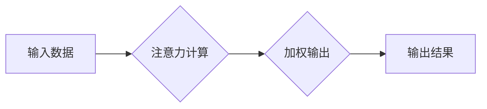

                 

## 人类注意力增强：提升专注力和注意力在商业中的未来发展

> 关键词：注意力增强、专注力、深度学习、神经网络、脑机接口、商业应用、未来趋势

## 1. 背景介绍

在当今信息爆炸的时代，人类面临着前所未有的注意力挑战。社交媒体、电子邮件、新闻推送等信息源不断地涌入，分散着我们的注意力，降低了我们的专注力。这不仅影响着我们的日常生活，也严重阻碍了工作效率和学习成果。

注意力是认知的核心能力之一，它指我们对特定信息或任务的集中和选择性关注。专注力则是持续保持对目标的注意力，不受干扰的能力。良好的注意力和专注力对于学习、工作、创造力和决策等方面至关重要。然而，现代社会的信息环境和生活节奏却不断侵蚀着我们的注意力资源。

## 2. 核心概念与联系

### 2.1 注意力机制

注意力机制是近年来深度学习领域取得的重要突破，它能够帮助模型模拟人类的注意力机制，专注于输入数据中最重要的部分。

注意力机制的核心思想是通过一个加权机制，将输入数据中的不同部分赋予不同的权重，从而突出重要信息，抑制无关信息。

**Mermaid 流程图:**



### 2.2 注意力增强技术

注意力增强技术旨在通过技术手段提升人类的注意力和专注力。这些技术可以分为以下几类：

* **脑机接口技术:** 通过脑电波或其他生物信号，直接与大脑进行交互，监测和调节大脑活动，从而增强注意力和专注力。
* **软件和应用程序:** 利用算法和人工智能技术，开发软件和应用程序，帮助用户集中注意力、过滤干扰信息、提高工作效率。
* **硬件设备:** 设计特殊的耳机、眼镜或其他硬件设备，通过声音、光线或振动等刺激，帮助用户集中注意力。

## 3. 核心算法原理 & 具体操作步骤

### 3.1 算法原理概述

注意力机制的核心算法是**自注意力机制 (Self-Attention)**。它通过计算每个输入数据元素与所有其他元素之间的相关性，来确定每个元素的重要性权重。

**具体步骤:**

1. **计算查询 (Query)、键 (Key) 和值 (Value) 向量:** 将输入数据转换为三个向量，分别代表查询、键和值。
2. **计算注意力分数:** 计算每个查询向量与所有键向量的相似度，得到注意力分数。
3. **归一化注意力分数:** 将注意力分数进行归一化处理，使其总和为1。
4. **加权求和:** 将每个值向量与对应的注意力分数进行加权求和，得到最终的输出向量。

### 3.2 算法步骤详解

**1. 查询、键和值向量的计算:**

* 查询向量 (Query) 代表当前元素想要关注的信息。
* 键向量 (Key) 代表其他元素的信息。
* 值向量 (Value) 代表其他元素的实际内容。

这些向量通常通过线性变换和激活函数来计算。

**2. 注意力分数的计算:**

注意力分数通常使用点积 (Dot Product) 或其他相似度度量来计算。

**3. 注意力分数的归一化:**

使用softmax函数将注意力分数归一化，使其总和为1，从而得到每个元素的注意力权重。

**4. 加权求和:**

将每个值向量与对应的注意力权重进行加权求和，得到最终的输出向量。

### 3.3 算法优缺点

**优点:**

* 可以有效地捕捉输入数据中的长距离依赖关系。
* 可以学习到不同元素之间的复杂关系。
* 在许多自然语言处理任务中取得了优异的性能。

**缺点:**

* 计算复杂度较高，训练时间较长。
* 对输入数据长度敏感，处理长序列数据时性能会下降。

### 3.4 算法应用领域

自注意力机制在自然语言处理、计算机视觉、语音识别等领域都有广泛的应用。

* **机器翻译:** 捕捉句子中的语义关系，提高翻译质量。
* **文本摘要:** 识别重要信息，生成简洁的文本摘要。
* **图像识别:** 关注图像中的关键区域，提高识别精度。

## 4. 数学模型和公式 & 详细讲解 & 举例说明

### 4.1 数学模型构建

自注意力机制的数学模型可以表示为以下公式:

$$
\text{Attention}(Q, K, V) = \text{softmax}\left(\frac{Q K^T}{\sqrt{d_k}}\right) V
$$

其中:

* $Q$ 是查询矩阵。
* $K$ 是键矩阵。
* $V$ 是值矩阵。
* $d_k$ 是键向量的维度。
* $\text{softmax}$ 是归一化函数。

### 4.2 公式推导过程

1. **点积计算:** $QK^T$ 计算查询向量与每个键向量的点积，得到一个注意力分数矩阵。

2. **缩放:** 将点积结果除以 $\sqrt{d_k}$，可以防止梯度爆炸。

3. **softmax归一化:** 使用softmax函数将注意力分数矩阵归一化，得到每个元素的注意力权重。

4. **加权求和:** 将值向量与对应的注意力权重进行加权求和，得到最终的输出向量。

### 4.3 案例分析与讲解

假设我们有一个句子 "The cat sat on the mat"，我们想使用自注意力机制来计算每个词语与其他词语之间的注意力关系。

* $Q$、$K$ 和 $V$ 矩阵分别代表每个词语的查询、键和值向量。
* 通过计算 $QK^T$，我们可以得到每个词语与其他词语之间的注意力分数。
* 例如，"cat" 与 "sat" 的注意力分数可能较高，因为它们在语义上相关。
* 通过softmax归一化，我们可以得到每个词语的注意力权重。
* 最后，将值向量与注意力权重进行加权求和，可以得到每个词语的最终表示，其中包含了它与其他词语之间的关系信息。

## 5. 项目实践：代码实例和详细解释说明

### 5.1 开发环境搭建

* Python 3.6+
* TensorFlow 或 PyTorch 深度学习框架
* Jupyter Notebook 或其他代码编辑器

### 5.2 源代码详细实现

```python
import tensorflow as tf

# 定义自注意力机制层
class SelfAttention(tf.keras.layers.Layer):
    def __init__(self, embed_dim, num_heads):
        super(SelfAttention, self).__init__()
        self.embed_dim = embed_dim
        self.num_heads = num_heads
        self.head_dim = embed_dim // num_heads

        # 线性变换矩阵
        self.query = tf.keras.layers.Dense(embed_dim)
        self.key = tf.keras.layers.Dense(embed_dim)
        self.value = tf.keras.layers.Dense(embed_dim)

    def call(self, inputs):
        # 分割输入数据
        batch_size = tf.shape(inputs)[0]
        query = self.query(inputs)
        key = self.key(inputs)
        value = self.value(inputs)

        # 重塑数据
        query = tf.reshape(query, (batch_size, -1, self.num_heads, self.head_dim))
        key = tf.reshape(key, (batch_size, -1, self.num_heads, self.head_dim))
        value = tf.reshape(value, (batch_size, -1, self.num_heads, self.head_dim))

        # 计算注意力分数
        attention_scores = tf.matmul(query, key, transpose_b=True) / tf.math.sqrt(tf.cast(self.head_dim, tf.float32))

        # 归一化注意力分数
        attention_weights = tf.nn.softmax(attention_scores, axis=-1)

        # 加权求和
        output = tf.matmul(attention_weights, value)

        # 合并输出
        output = tf.reshape(output, (batch_size, -1, self.embed_dim))

        return output
```

### 5.3 代码解读与分析

* 该代码实现了自注意力机制层，其中包含查询、键和值向量的计算、注意力分数的计算、归一化和加权求和等步骤。
* `embed_dim` 参数表示词向量的维度，`num_heads` 参数表示注意力头的数量。
* `call` 方法接收输入数据，并返回经过自注意力机制处理后的输出数据。

### 5.4 运行结果展示

运行该代码可以将输入数据经过自注意力机制处理，得到每个词语的最终表示，其中包含了它与其他词语之间的关系信息。

## 6. 实际应用场景

### 6.1 商业应用

* **个性化推荐:** 利用自注意力机制分析用户的行为数据，推荐更符合用户兴趣的商品或服务。
* **内容创作辅助:** 帮助作家、记者等内容创作者生成更优质、更吸引人的内容。
* **客户服务自动化:** 利用自注意力机制分析客户的咨询内容，自动回复客户问题，提高客户服务效率。

### 6.2 未来应用展望

* **脑机接口:** 利用自注意力机制与脑机接口技术结合，实现对大脑活动的精准控制，增强人类的注意力和专注力。
* **虚拟现实和增强现实:** 利用自注意力机制模拟人类的视觉注意力机制，打造更沉浸式的虚拟现实和增强现实体验。
* **教育领域:** 利用自注意力机制开发个性化学习系统，帮助学生提高学习效率和专注力。

## 7. 工具和资源推荐

### 7.1 学习资源推荐

* **书籍:**
    * "Attention Is All You Need" (Vaswani et al., 2017)
    * "Deep Learning" (Goodfellow et al., 2016)
* **在线课程:**
    * Coursera: "Deep Learning Specialization"
    * Udacity: "Deep Learning Nanodegree"

### 7.2 开发工具推荐

* **TensorFlow:** https://www.tensorflow.org/
* **PyTorch:** https://pytorch.org/
* **Jupyter Notebook:** https://jupyter.org/

### 7.3 相关论文推荐

* "Attention Is All You Need" (Vaswani et al., 2017)
* "BERT: Pre-training of Deep Bidirectional Transformers for Language Understanding" (Devlin et al., 2018)
* "XLNet: Generalized Autoregressive Pretraining for Language Understanding" (Yang et al., 2019)

## 8. 总结：未来发展趋势与挑战

### 8.1 研究成果总结

近年来，注意力机制在深度学习领域取得了显著的进展，为自然语言处理、计算机视觉等领域带来了革命性的改变。自注意力机制的提出，使得模型能够更有效地捕捉输入数据中的长距离依赖关系，提高了模型的性能。

### 8.2 未来发展趋势

* **更强大的注意力机制:** 研究更强大的注意力机制，例如多头注意力、自回归注意力等，以提高模型的表达能力和泛化能力。
* **注意力机制的应用扩展:** 将注意力机制应用到更多领域，例如时间序列分析、图像生成、药物发现等。
* **注意力机制与其他技术的融合:** 将注意力机制与其他技术，例如强化学习、生成对抗网络等，进行融合，开发更智能、更强大的人工智能系统。

### 8.3 面临的挑战

* **计算复杂度:** 自注意力机制的计算复杂度较高，在处理长序列数据时性能会下降。
* **参数量:** 自注意力机制的参数量较大，需要大量的训练数据才能达到最佳性能。
* **可解释性:** 自注意力机制的内部机制较为复杂，难以解释模型的决策过程。

### 8.4 研究展望

未来，注意力机制的研究将继续朝着更强大、更通用、更可解释的方向发展。随着技术的进步，注意力机制将发挥越来越重要的作用，推动人工智能的发展。

## 9. 附录：常见问题与解答

* **什么是注意力机制?**

注意力机制是一种模仿人类注意力机制的技术，它能够帮助模型专注于输入数据中最重要的部分。

* **自注意力机制与传统注意力机制有什么区别?**

自注意力机制可以捕捉输入数据中的任意两个元素之间的关系，而传统注意力机制通常只关注输入数据与输出数据的对应关系。

* **注意力机制有哪些应用场景?**

注意力机制在自然语言处理、计算机视觉、语音识别等领域都有广泛的应用。

* **如何评估注意力机制的性能?**

注意力机制的性能通常通过在特定任务上的准确率、召回率等指标来评估。

* **注意力机制的未来发展趋势是什么?**

未来，注意力机制的研究将继续朝着更强大、更通用、更可解释的方向发展。


作者：禅与计算机程序设计艺术 / Zen and the Art of Computer Programming<end_of_turn>

