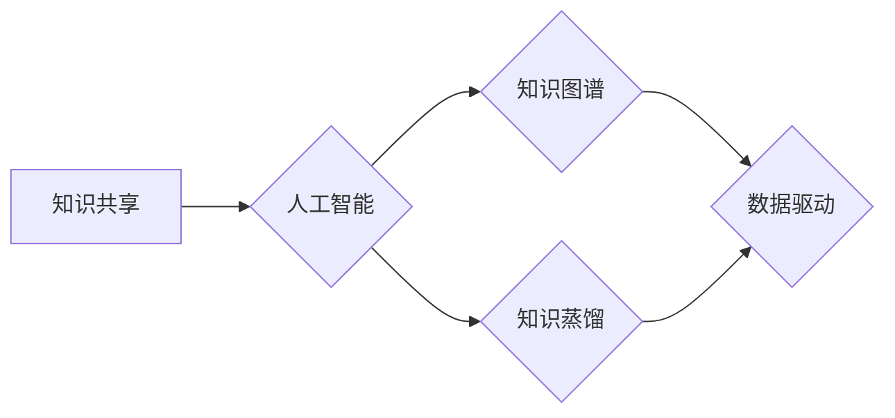

                 

## 人类知识的共享时代：知识的力量

> 关键词：知识共享、人工智能、机器学习、深度学习、数据驱动、知识图谱、知识蒸馏、未来趋势

## 1. 背景介绍

人类文明的进步离不开知识的积累和传播。从古至今，人类一直在寻找更有效的方式来共享和利用知识。随着互联网的兴起，知识共享进入了全新的时代。海量的数字信息涌现，让人们可以轻易地获取和传播知识。然而，面对海量信息，如何有效地组织、理解和利用知识仍然是一个巨大的挑战。

人工智能技术的快速发展为知识共享带来了新的机遇。人工智能算法能够自动学习和理解知识，并将其应用于各种领域。例如，机器学习算法可以从海量数据中发现知识规律，深度学习算法可以模拟人类的认知过程，知识图谱可以将知识表示为结构化的形式，方便人们进行查询和推理。

## 2. 核心概念与联系

**2.1 知识共享**

知识共享是指知识的自由获取、使用、修改和传播。它强调知识的开放性和可访问性，旨在打破知识壁垒，促进知识的广泛传播和应用。

**2.2 人工智能**

人工智能是指模拟人类智能行为的计算机系统。它涵盖了多种技术，例如机器学习、深度学习、自然语言处理、计算机视觉等。

**2.3 知识图谱**

知识图谱是一种结构化的知识表示形式，它将知识表示为实体和关系的网络。实体代表现实世界中的事物，关系代表事物之间的联系。知识图谱可以帮助人们更好地理解和组织知识，并进行知识推理和查询。

**2.4 知识蒸馏**

知识蒸馏是一种机器学习技术，它将知识从一个大型模型（教师模型）转移到一个小型模型（学生模型）中。知识蒸馏可以帮助提高小型模型的性能，并减少模型的计算成本。

**2.5 数据驱动**

数据驱动是指利用数据来指导决策和模型训练。在人工智能领域，数据是模型训练和知识发现的关键要素。

**2.6 流程图**



## 3. 核心算法原理 & 具体操作步骤

### 3.1 算法原理概述

知识蒸馏算法的核心思想是利用教师模型的知识来指导学生模型的训练。教师模型通常是一个大型、训练良好的模型，它拥有丰富的知识和经验。学生模型通常是一个小型、轻量级的模型，它需要更少的计算资源。

知识蒸馏算法通过将教师模型的输出作为学生模型的软标签来进行训练。软标签是指教师模型对输入数据的概率分布，而不是简单的类别标签。

### 3.2 算法步骤详解

1. **训练教师模型:** 首先，需要训练一个大型的教师模型。教师模型可以是任何类型的深度学习模型，例如卷积神经网络（CNN）或循环神经网络（RNN）。

2. **生成软标签:** 将教师模型应用于训练数据，并获取其对每个输入数据的概率分布。这些概率分布就是软标签。

3. **训练学生模型:** 使用软标签来训练学生模型。学生模型的目标是尽可能地模仿教师模型的输出概率分布。

4. **评估模型性能:** 使用测试数据评估学生模型的性能。

### 3.3 算法优缺点

**优点:**

* 可以提高小型模型的性能。
* 可以减少模型的计算成本。
* 可以将知识从一个模型转移到另一个模型中。

**缺点:**

* 需要一个大型的教师模型作为基础。
* 训练过程可能比较复杂。

### 3.4 算法应用领域

知识蒸馏算法在许多领域都有应用，例如：

* **图像识别:** 将大型的图像识别模型的知识转移到小型模型中，以提高小型模型的识别精度。
* **自然语言处理:** 将大型的语言模型的知识转移到小型模型中，以提高小型模型的文本理解和生成能力。
* **语音识别:** 将大型的语音识别模型的知识转移到小型模型中，以提高小型模型的识别准确率。

## 4. 数学模型和公式 & 详细讲解 & 举例说明

### 4.1 数学模型构建

知识蒸馏算法的数学模型可以表示为以下公式：

$$
L_{KD} = \sum_{i=1}^{N} KL(p_i^{s}, p_i^{t})
$$

其中：

* $L_{KD}$ 是知识蒸馏损失函数。
* $N$ 是训练数据的数量。
* $p_i^{s}$ 是学生模型对第 $i$ 个样本的概率分布。
* $p_i^{t}$ 是教师模型对第 $i$ 个样本的概率分布。
* $KL$ 是KL散度，用于衡量两个概率分布之间的差异。

### 4.2 公式推导过程

知识蒸馏损失函数的目标是使学生模型的输出概率分布尽可能接近教师模型的输出概率分布。KL散度是一种常用的度量两个概率分布差异的指标。

### 4.3 案例分析与讲解

假设我们有一个图像分类任务，我们训练了一个大型的教师模型，它可以准确地识别各种图像类别。我们想要训练一个小型学生模型，以提高其识别精度。

我们可以使用知识蒸馏算法将教师模型的知识转移到学生模型中。首先，我们将教师模型应用于训练数据，并获取其对每个图像的概率分布。然后，我们将这些概率分布作为学生模型的软标签，并使用知识蒸馏损失函数来训练学生模型。

通过这种方式，学生模型可以学习到教师模型的知识，并提高其识别精度。

## 5. 项目实践：代码实例和详细解释说明

### 5.1 开发环境搭建

* Python 3.6+
* TensorFlow 2.0+
* PyTorch 1.0+

### 5.2 源代码详细实现

```python
# 导入必要的库
import tensorflow as tf

# 定义教师模型和学生模型
teacher_model = tf.keras.models.load_model('teacher_model.h5')
student_model = tf.keras.models.Sequential([
    # ... 学生模型的层结构 ...
])

# 定义知识蒸馏损失函数
def knowledge_distillation_loss(y_true, y_pred):
    # ... 计算知识蒸馏损失 ...

# 训练学生模型
student_model.compile(optimizer='adam', loss=knowledge_distillation_loss)
student_model.fit(x_train, y_train, epochs=10)

```

### 5.3 代码解读与分析

* 首先，我们导入必要的库，并定义教师模型和学生模型。
* 然后，我们定义知识蒸馏损失函数，该函数计算学生模型的输出概率分布与教师模型的输出概率分布之间的差异。
* 最后，我们使用知识蒸馏损失函数来训练学生模型。

### 5.4 运行结果展示

* 训练完成后，我们可以使用测试数据评估学生模型的性能。
* 我们可以比较学生模型和教师模型的准确率、召回率、F1-score等指标，以评估知识蒸馏算法的效果。

## 6. 实际应用场景

### 6.1 医疗诊断

知识蒸馏可以用于将专家医生的诊断知识转移到小型模型中，帮助医生更快、更准确地诊断疾病。

### 6.2 教育领域

知识蒸馏可以用于将教师的教学知识转移到智能教育系统中，帮助学生个性化学习。

### 6.3 自动驾驶

知识蒸馏可以用于将高级驾驶员的驾驶经验转移到自动驾驶系统中，提高自动驾驶系统的安全性。

### 6.4 未来应用展望

随着人工智能技术的不断发展，知识蒸馏算法将在更多领域得到应用，例如：

* **个性化推荐:** 将用户的偏好和行为模式转移到推荐系统中，提供更精准的推荐。
* **自然语言生成:** 将人类的写作风格和语言能力转移到文本生成模型中，生成更自然、更流畅的文本。
* **药物研发:** 将药物研发领域的知识和经验转移到机器学习模型中，加速药物研发过程。

## 7. 工具和资源推荐

### 7.1 学习资源推荐

* **书籍:**
    * Deep Learning by Ian Goodfellow, Yoshua Bengio, and Aaron Courville
    * Hands-On Machine Learning with Scikit-Learn, Keras & TensorFlow by Aurélien Géron
* **在线课程:**
    * TensorFlow Tutorials: https://www.tensorflow.org/tutorials
    * PyTorch Tutorials: https://pytorch.org/tutorials/

### 7.2 开发工具推荐

* **TensorFlow:** https://www.tensorflow.org/
* **PyTorch:** https://pytorch.org/
* **Keras:** https://keras.io/

### 7.3 相关论文推荐

* Hinton, G., Vinyals, O., & Dean, J. (2015). Distilling the knowledge in a neural network. arXiv preprint arXiv:1503.02531.
* Buciluă, C., Caruana, R., & Niculescu-Mizil, A. (2006). Model compression using knowledge distillation. In Proceedings of the 12th international conference on machine learning (pp. 55-62).

## 8. 总结：未来发展趋势与挑战

### 8.1 研究成果总结

知识蒸馏算法是一种有效的知识迁移技术，它可以将大型模型的知识转移到小型模型中，提高小型模型的性能。

### 8.2 未来发展趋势

* **更有效的知识蒸馏方法:** 研究更有效的知识蒸馏方法，例如利用注意力机制、对抗训练等技术。
* **跨模态知识蒸馏:** 研究跨模态知识蒸馏方法，例如将图像、文本、音频等不同模态的知识进行迁移。
* **联邦学习下的知识蒸馏:** 研究在联邦学习环境下进行知识蒸馏，保护用户隐私。

### 8.3 面临的挑战

* **教师模型的选择:** 选择合适的教师模型是知识蒸馏的关键。
* **知识蒸馏参数的调优:** 知识蒸馏算法的参数需要进行仔细的调优。
* **知识蒸馏的解释性:** 知识蒸馏算法的决策过程需要更加透明和可解释。

### 8.4 研究展望

知识蒸馏算法在人工智能领域具有广阔的应用前景。未来，随着研究的深入，知识蒸馏算法将更加高效、灵活、可解释，并应用于更多领域，推动人工智能技术的进步。

## 9. 附录：常见问题与解答

* **Q1: 知识蒸馏算法需要一个大型的教师模型吗？**

* **A1:** 是的，知识蒸馏算法通常需要一个大型的教师模型作为基础。

* **Q2: 知识蒸馏算法的训练过程复杂吗？**

* **A2:** 知识蒸馏算法的训练过程比传统的模型训练过程复杂一些，需要对教师模型和学生模型进行仔细的调优。

* **Q3: 知识蒸馏算法的应用场景有哪些？**

* **A3:** 知识蒸馏算法可以应用于许多领域，例如图像识别、自然语言处理、语音识别等。


作者：禅与计算机程序设计艺术 / Zen and the Art of Computer Programming 
<end_of_turn>

