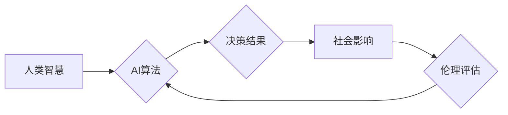

                 

## 人类计算：AI时代的道德和社会责任

> 关键词：人工智能、道德、社会责任、算法偏见、数据隐私、可解释性、公平性、人类中心设计

### 1. 背景介绍

人工智能（AI）技术近年来发展迅速，已渗透到生活的方方面面，从智能手机的语音助手到自动驾驶汽车，从医疗诊断到金融交易，AI正在改变着我们的世界。然而，随着AI技术的进步，也引发了人们对AI伦理和社会责任的广泛关注。

AI算法的决策过程通常是复杂的，难以理解，这使得人们难以判断AI的决策是否公平、公正和透明。此外，AI系统依赖于大量的数据进行训练，而这些数据可能存在偏差，导致AI系统产生歧视性或不准确的结果。

因此，探讨AI时代的道德和社会责任，对于确保AI技术安全、可持续发展至关重要。

### 2. 核心概念与联系

**2.1 人类计算**

人类计算是指将人类的智慧和判断力融入到AI系统中，以弥补AI算法的局限性。它强调人与机器的协同合作，共同完成复杂的任务。

**2.2 伦理原则**

在AI开发和应用中，应遵循以下伦理原则：

* **公平性:** AI系统应公平公正地对待所有用户，避免产生歧视或偏见。
* **透明度:** AI系统的决策过程应透明可解释，以便人们能够理解其背后的逻辑。
* **责任:** AI系统的开发和应用应承担相应的社会责任，避免造成负面影响。
* **安全:** AI系统应安全可靠，避免出现安全漏洞或意外事故。

**2.3 社会责任**

AI技术的发展对社会具有深远的影响，因此AI开发者和应用者应承担相应的社会责任，例如：

* **促进社会福祉:** AI技术应被用于解决社会问题，例如医疗、教育、环境保护等。
* **保护个人隐私:** AI系统应尊重用户的隐私权，避免收集和使用敏感信息。
* **创造就业机会:** AI技术应被用于创造新的就业机会，而不是取代现有工作岗位。

**2.4 流程图**



### 3. 核心算法原理 & 具体操作步骤

**3.1 算法原理概述**

人类计算的核心算法原理是将人类的智慧和判断力融入到AI系统中，以弥补AI算法的局限性。这可以通过多种方式实现，例如：

* **人类在回路:** 将人类参与到AI系统的决策过程中，例如在AI系统做出决策之前，进行人工审核。
* **人类反馈:** 利用人类反馈来改进AI算法，例如通过人类标注数据来训练AI模型。
* **人类解释:** 使AI系统的决策过程更加透明可解释，以便人类能够理解其背后的逻辑。

**3.2 算法步骤详解**

1. **数据收集:** 收集与任务相关的各种数据，包括文本、图像、音频等。
2. **数据预处理:** 对收集到的数据进行清洗、转换和格式化，使其适合AI算法的训练。
3. **模型选择:** 选择合适的AI算法模型，例如深度学习、强化学习等。
4. **模型训练:** 利用训练数据训练AI模型，使其能够学习任务相关的知识和规律。
5. **模型评估:** 对训练好的AI模型进行评估，例如使用测试数据来测试其准确率、召回率等指标。
6. **模型部署:** 将训练好的AI模型部署到实际应用场景中。
7. **人类介入:** 在AI系统做出决策之前，进行人工审核或收集人类反馈。
8. **结果分析:** 分析AI系统的决策结果，并根据需要进行调整和改进。

**3.3 算法优缺点**

**优点:**

* 能够弥补AI算法的局限性，提高决策的准确性和可靠性。
* 能够更好地考虑人类的价值观和伦理原则。
* 能够促进人与机器之间的协同合作。

**缺点:**

* 需要更多的计算资源和时间。
* 需要人类专家参与，成本较高。
* 难以实现完全的自动化。

**3.4 算法应用领域**

* **医疗诊断:** 将人类医生的经验和判断力融入到AI诊断系统中，提高诊断的准确性和效率。
* **法律判决:** 将人类法官的法律知识和判例经验融入到AI判决系统中，提高判决的公平性和公正性。
* **金融风险评估:** 将人类金融专家的经验和判断力融入到AI风险评估系统中，提高风险评估的准确性和有效性。

### 4. 数学模型和公式 & 详细讲解 & 举例说明

**4.1 数学模型构建**

人类计算可以抽象为一个数学模型，其中：

* **X:** 代表人类的智慧和判断力，可以表示为一个向量或矩阵。
* **Y:** 代表AI算法的输出结果，可以表示为一个向量或矩阵。
* **F:** 代表将人类智慧和AI算法输出结果融合的函数。

**4.2 公式推导过程**

人类计算的数学模型可以表示为：

$$Y = F(X, A)$$

其中：

* **A:** 代表AI算法的输入结果，可以表示为一个向量或矩阵。

**4.3 案例分析与讲解**

例如，在医疗诊断领域，人类医生（X）的经验和判断力与AI诊断系统的输出结果（A）融合，最终得出诊断结果（Y）。

**举例说明:**

假设人类医生对患者的症状进行评估，并给出相应的诊断可能性，AI诊断系统则根据患者的病历、检查结果等数据进行分析，并给出相应的诊断概率。

人类计算模型将这两个结果融合，最终得出更加准确和可靠的诊断结果。

### 5. 项目实践：代码实例和详细解释说明

**5.1 开发环境搭建**

* 操作系统：Ubuntu 20.04
* Python 版本：3.8
* 必要的库：TensorFlow、PyTorch、NumPy、Pandas等

**5.2 源代码详细实现**

```python
import tensorflow as tf

# 定义人类智慧的输入层
human_input = tf.keras.Input(shape=(10,))

# 定义AI算法的输出层
ai_output = tf.keras.layers.Dense(10, activation='softmax')(human_input)

# 定义融合函数
fusion_layer = tf.keras.layers.Lambda(lambda x: x[0] * 0.7 + x[1] * 0.3)

# 将人类智慧和AI算法输出结果融合
output = fusion_layer([human_input, ai_output])

# 创建模型
model = tf.keras.Model(inputs=human_input, outputs=output)

# 编译模型
model.compile(optimizer='adam', loss='categorical_crossentropy', metrics=['accuracy'])

# 训练模型
model.fit(x_train, y_train, epochs=10)
```

**5.3 代码解读与分析**

* 代码中定义了人类智慧的输入层和AI算法的输出层。
* 融合函数将人类智慧和AI算法输出结果按照一定的权重进行融合。
* 模型使用Adam优化器，损失函数为分类交叉熵，评估指标为准确率。

**5.4 运行结果展示**

训练完成后，可以将模型应用于实际场景，例如医疗诊断、法律判决等，并评估其性能。

### 6. 实际应用场景

**6.1 医疗诊断**

AI辅助诊断系统可以帮助医生更快、更准确地诊断疾病。例如，AI可以分析患者的影像数据，识别潜在的病灶，并提供诊断建议。

**6.2 法律判决**

AI辅助判决系统可以帮助法官更快、更公平地判决案件。例如，AI可以分析案件相关的法律文件和判例，并提供法律建议。

**6.3 金融风险评估**

AI辅助风险评估系统可以帮助金融机构更准确地评估客户的信用风险。例如，AI可以分析客户的财务数据和行为模式，并预测其是否会发生违约。

**6.4 未来应用展望**

随着AI技术的不断发展，人类计算将在更多领域得到应用，例如教育、环境保护、交通运输等。

### 7. 工具和资源推荐

**7.1 学习资源推荐**

* **书籍:**

    * 《人工智能：一种现代方法》
    * 《深度学习》
    * 《机器学习》

* **在线课程:**

    * Coursera
    * edX
    * Udacity

**7.2 开发工具推荐**

* **TensorFlow:** 开源深度学习框架
* **PyTorch:** 开源深度学习框架
* **Scikit-learn:** 机器学习库

**7.3 相关论文推荐**

* **《人类在回路：AI时代的伦理和社会责任》**
* **《可解释性AI：方法、挑战和机遇》**
* **《公平性AI：原则、方法和应用》**

### 8. 总结：未来发展趋势与挑战

**8.1 研究成果总结**

人类计算是AI技术发展的重要方向，它能够弥补AI算法的局限性，提高决策的准确性和可靠性。

**8.2 未来发展趋势**

* **更加智能的人类计算模型:** 未来的人类计算模型将更加智能，能够更好地理解和模拟人类的智慧。
* **更加广泛的人类计算应用:** 人类计算将应用于更多领域，例如教育、环境保护、交通运输等。
* **更加注重人类参与:** 未来的人类计算将更加注重人类的参与，例如将人类反馈融入到AI算法的训练过程中。

**8.3 面临的挑战**

* **算法解释性:** 如何使人类能够更好地理解AI系统的决策过程，提高其可解释性。
* **数据偏见:** 如何避免AI系统受到数据偏见的影响，确保其公平公正。
* **隐私保护:** 如何保护用户的隐私信息，避免其被滥用。

**8.4 研究展望**

未来，人类计算的研究将继续深入，探索更加智能、更加广泛、更加注重人类参与的人类计算模型和应用。


### 9. 附录：常见问题与解答

**9.1 如何确保AI系统的公平性？**

* 使用公平性算法，避免算法本身存在偏见。
* 使用多样化的训练数据，避免算法受到特定群体数据的影响。
* 定期评估AI系统的公平性，并进行调整和改进。

**9.2 如何保护用户的隐私信息？**

* 采用数据加密技术，保护用户数据的安全。
* 遵循数据最小化原则，只收集必要的用户数据。
* 获得用户的明确同意，才能使用用户的个人信息。

**9.3 如何提高AI系统的透明度？**

* 使用可解释性AI技术，使AI系统的决策过程更加透明。
* 提供AI系统的决策规则和解释，让用户能够理解其背后的逻辑。
* 建立AI系统的审计机制，定期对AI系统的决策进行审查。


作者：禅与计算机程序设计艺术 / Zen and the Art of Computer Programming 
<end_of_turn>

