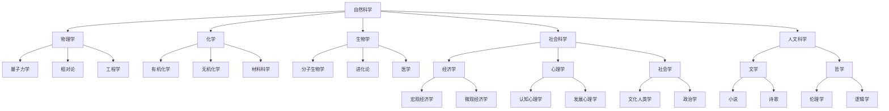

                 

### 文章标题

“人类知识的本质：一场永不停歇的探索长河”

Knowledge of the Human Essence: A ceaseless exploration of an endless river

在技术日新月异、信息爆炸的时代，人类知识的积累与扩展成为了一项充满挑战与机遇的任务。本文旨在深入探讨人类知识的本质，分析其形成、传承与发展过程，以及如何借助现代信息技术进行高效的挖掘与应用。通过揭示知识背后的逻辑与规律，本文希望能够为读者提供一条理解知识世界的清晰路径。

This article aims to delve into the essence of human knowledge, analyzing its formation, transmission, and development processes, as well as how to efficiently explore and apply it using modern information technology. By revealing the logic and patterns behind knowledge, the article hopes to provide readers with a clear path to understanding the world of knowledge.

### 关键词

Knowledge, Human essence, Exploration, Information technology, Knowledge development

### 摘要

本文首先回顾了人类知识的历史演变过程，分析了知识积累与传承的重要作用。接着，探讨了知识的核心概念与结构，以及知识体系之间的联系。在此基础上，本文探讨了现代信息技术在知识挖掘与传播中的关键作用，并提出了提高知识获取与应用效率的策略。最后，本文展望了未来知识发展的趋势与挑战，为读者提供了一个全面而深刻的视角。

This article first reviews the historical evolution of human knowledge, analyzes the importance of knowledge accumulation and transmission. Then, it discusses the core concepts and structures of knowledge, as well as the relationships between knowledge systems. On this basis, the article explores the key role of modern information technology in knowledge exploration and dissemination, and proposes strategies to improve the efficiency of knowledge acquisition and application. Finally, the article looks forward to the trends and challenges of future knowledge development, providing readers with a comprehensive and profound perspective.

---

在接下来的文章中，我们将分为十个部分来详细探讨人类知识的本质。首先是背景介绍，我们将回顾人类知识的历史演变，探讨知识的起源、传播与发展。随后，我们将深入分析知识的核心概念与联系，通过Mermaid流程图来展示知识体系之间的复杂关系。然后，我们将探讨知识的核心算法原理，介绍如何通过具体的操作步骤来实现知识的有效获取与应用。

在第四部分，我们将详细讲解数学模型和公式，并通过实例来说明这些模型和公式的应用。接下来，我们将分享一个项目实践，展示如何在实际开发环境中应用这些技术和方法。随后，我们将探讨知识在实际应用场景中的价值，并提出工具和资源的推荐，以帮助读者更好地理解和应用知识。

最后，我们将总结未来知识发展的趋势与挑战，并附录常见问题与解答，以帮助读者更好地理解本文的内容。扩展阅读部分将提供更多的参考资料，以供读者进一步学习。

通过本文的深入探讨，我们希望能够帮助读者更好地理解人类知识的本质，把握知识发展的趋势，为未来的知识探索提供有力的支持。

---

## 1. 背景介绍

### 历史背景

人类知识的积累与扩展可以追溯到古代文明的兴起。在古代，知识主要依赖于口头传承和书面记录。随着文字的发明，知识得以系统化地记录和传播。古希腊哲学家亚里士多德提出了逻辑学、物理学、伦理学等领域的初步体系，为后世的知识构建奠定了基础。古代的图书馆和学者社区成为了知识传承的中心。

随着中世纪末期到近代的过渡，知识体系发生了重大变革。文艺复兴时期的到来，催生了科学革命，知识的积累进入了新的阶段。伽利略、牛顿等科学家的发现，使得人类对自然界的认识大大深化。同时，印刷术的发明使得知识的传播变得更加广泛和迅速。

### 现代知识积累

进入现代，知识积累的速度和规模达到了前所未有的高度。信息技术的发展，特别是互联网的普及，使得知识的获取、存储和传播变得前所未有的便捷。开放获取的学术期刊、在线课程、社交媒体平台等，为全球范围内的知识共享提供了新的途径。

现代知识的积累不仅依赖于个人的研究，也依赖于团队合作和跨学科研究。科研机构、大学和公司共同推动着知识的创新和应用。大数据、人工智能等新兴技术的出现，使得知识挖掘和分析变得更加高效和精准。

### 知识传承的重要性

知识传承是人类文明延续的关键。知识的积累不仅需要新的发现和创新，还需要对已有知识的系统化整理和传播。在教育体系中，知识的传承主要通过教师和学生之间的互动进行。教科书、学术论文、专业杂志等，都是知识传承的重要载体。

此外，知识的传承还包括跨代传播，即从老一代到年轻一代的传递。家庭、社会和文化的价值观，都是知识传承的重要组成部分。现代社会中，数字化和互联网技术使得知识传承的方式更加多样化和灵活。

### 知识积累与扩展的挑战

尽管现代知识积累取得了显著成果，但同时也面临着诸多挑战。知识爆炸导致信息过载，人们难以区分和筛选重要信息。此外，知识传播的不均衡性，使得一些地区和群体难以获得高质量的知识资源。

知识积累与扩展的另一个挑战是知识的创新和应用。如何将前沿研究成果转化为实际应用，如何解决社会和经济问题，都是亟待解决的问题。

### 总结

人类知识的积累与扩展是一个不断演进的过程。从古代的口头传承到现代的数字化传播，知识的形态和传递方式发生了巨大的变化。知识传承的重要性不可忽视，它是人类文明发展的基石。在现代社会，知识积累与扩展面临着新的机遇和挑战。通过深入理解和应用知识，我们可以更好地应对未来的挑战，推动人类文明的进步。

### 1.1 知识的历史演变

知识的历史演变是人类文明进步的重要标志，也是人类智慧不断升华的见证。回顾知识的历史，我们可以将其大致分为以下几个阶段：古代的知识积累、中世纪的知识封锁、文艺复兴时期的知识革新和现代知识体系的构建。

**古代的知识积累**

在古代，知识主要通过口头传承和书面记录进行积累。在古代文明如古埃及、古希腊和古中国，学者们开始系统地记录天文、地理、医学、哲学等领域的知识。例如，古埃及的象形文字和古中国的甲骨文，都是早期知识记录的重要手段。古希腊哲学家亚里士多德通过撰写大量著作，为后世的知识体系奠定了基础。

**中世纪的知识封锁**

中世纪时期，知识传播受到宗教和政治的严格控制。许多时期的学术活动受到宗教团体的监督，知识的研究和应用受到限制。例如，基督教教会对异端思想的迫害，使得科学和哲学研究受到打压。中世纪的欧洲，大学的兴起为知识的传播提供了一定的自由空间，但整体上，知识的发展仍然受到宗教和政治的影响。

**文艺复兴时期的知识革新**

文艺复兴时期是知识发展史上的一个重要转折点。这一时期，人们开始重新审视古典文化，追求科学和艺术的复兴。伽利略、哥白尼等科学家的发现，打破了中世纪以来的宗教世界观，推动了科学革命的发生。印刷术的发明使得知识的传播变得更加广泛和迅速，知识的积累进入了一个全新的阶段。

**现代知识体系的构建**

进入现代，知识体系的构建更加注重科学性和系统性。科学方法论的发展，使得知识研究更加严谨和规范。互联网的普及和信息技术的发展，使得知识的获取、存储和传播变得更加便捷。现代知识体系强调跨学科的合作和研究，推动着知识的不断创新和应用。

**知识的历史演变趋势**

从知识的历史演变中，我们可以观察到几个明显的趋势。首先，知识的积累和传播逐渐从单一领域向跨学科发展。现代科学的发展强调多学科交叉，推动着知识体系的整合和创新。其次，知识的更新速度越来越快，新的发现和研究成果不断涌现，知识的生命周期显著缩短。

最后，知识的共享和传播变得更加普及和灵活。互联网和数字化技术的发展，使得知识可以随时随地获取和传播。知识的社会化传播，通过社交媒体、在线课程和开放获取资源，使得更多的人能够参与到知识的创造和共享过程中。

**知识的历史演变对现代社会的影响**

知识的历史演变对现代社会产生了深远的影响。首先，知识的积累和创新推动了科技的进步，为现代社会的发展提供了强大的动力。其次，知识的普及和教育水平的提升，使得更多的人能够享受到知识带来的福祉。知识经济时代，知识的价值得到了更加充分的体现。

最后，知识的历史演变也带来了一些挑战。知识爆炸导致信息过载，人们需要更高的信息处理能力来筛选和利用重要信息。知识的不均衡传播，使得一些地区和群体难以获得高质量的知识资源，这对社会公平和知识普及提出了新的要求。

### 1.2 知识的起源

知识的起源可以追溯到人类对自然界和自身存在的探索。在远古时代，人类为了生存，开始对自然现象进行观察和思考，逐渐形成了对世界的基本认知。这种对自然的认知，是知识发展的最初阶段。

在早期社会，知识的积累主要依赖于个人的经验和观察。例如，狩猎、农业、医疗等活动中的实践经验，都是知识的重要来源。这些经验通过口头传承的方式，逐渐积累并传承下来。

随着文字的发明，知识的记录和传播方式发生了革命性的变化。古代的学者们开始将实践经验、理论思考和科学发现记录在书籍中，这些记录成为了后世知识的重要基础。

在古希腊，学者们通过哲学思考和科学实验，对自然界进行了深入研究，奠定了西方科学体系的基础。中国的古代科学家如张仲景、李时中，通过医学实践和理论研究，对医学知识进行了系统的整理和发展。

在中世纪，知识的发展受到宗教和封建制度的限制，但仍然出现了一些重要的学术成果。例如，阿拉伯世界的科学家们对数学、天文学和医学等领域进行了深入研究，为后世的知识积累做出了重要贡献。

文艺复兴时期，知识的积累进入了一个新的阶段。科学家们通过实验和观察，对自然界的规律进行了深入研究，推动了科学革命的发生。这一时期的科学家如伽利略、牛顿等，他们的研究成果对后世的知识发展产生了深远的影响。

进入现代，知识的发展速度加快，领域不断扩展。信息技术和互联网的普及，使得知识的获取、存储和传播变得更加便捷和高效。现代科学研究强调跨学科合作，推动着知识的不断更新和深化。

### 1.3 知识的传播与发展

知识的传播与发展是推动人类文明进步的关键因素。在古代，知识的传播主要依赖于口头传承和书面记录。随着文字的发明，知识的传播方式发生了重大变革，知识的积累和传承变得更加系统化和规范。

在古希腊和古罗马时期，图书馆和学者社区成为了知识传播的中心。学者们通过口授和手抄书籍，将知识传递给下一代。这一时期，知识传播的范围和速度相对较慢，但为后世的学术研究奠定了基础。

中世纪的欧洲，知识传播受到宗教和政治的严格控制。教堂和修道院成为了知识传播的主要场所，宗教书籍和神学思想占据了知识传播的主导地位。尽管这一时期知识的发展受到限制，但仍然出现了一些重要的学术成果。

文艺复兴时期，知识传播迎来了新的机遇。随着印刷术的发明，知识的传播速度大大加快。大量的书籍和学术著作被出版和传播，推动了科学革命的发生。这一时期的学者们通过实验和观察，对自然界的规律进行了深入研究，为现代科学体系的建立奠定了基础。

进入现代，知识的传播方式进一步多样化。随着互联网和数字化技术的发展，知识的获取、存储和传播变得更加便捷和高效。开放获取的学术期刊、在线课程、社交媒体平台等，为全球范围内的知识共享提供了新的途径。

知识的传播不仅依赖于技术的进步，还受到社会文化的影响。教育体系是知识传播的重要载体，通过学校教育和培训，知识得以系统化和规范化地传授。此外，大众传媒和文化产品也起到了知识传播的作用，通过书籍、电影、音乐等形式，知识得以广泛传播和普及。

在全球化的背景下，知识的传播与发展呈现出跨国界的特点。国际学术交流、国际合作项目等，促进了全球范围内的知识共享和合作。通过互联网和数字化技术，全球学者可以轻松地获取和分享学术成果，推动知识的创新和发展。

### 1.4 知识的分类与体系

知识的分类与体系化是知识管理的重要环节，有助于我们更好地理解和利用知识。知识可以根据不同的维度进行分类，常见的分类方式包括按领域、按层次和按形式。

**按领域分类**

按领域分类是知识分类中最常见的方式。根据学科和研究领域，知识可以分为自然科学、社会科学、人文科学等多个领域。例如，物理学、化学、生物学属于自然科学；经济学、社会学、心理学属于社会科学；文学、历史、哲学属于人文科学。

每个领域都有其特定的研究方法和理论体系。按领域分类有助于我们专注于特定领域的知识积累和创新发展。例如，科学家们通过实验和理论分析，不断深化对自然界的认识；经济学家们通过统计数据和模型分析，研究社会经济的运行规律。

**按层次分类**

知识还可以按照层次进行分类，从基础知识到高级知识，形成一个层次分明的知识体系。基础知识是构建高级知识的基础，是每个人应该掌握的基本技能和知识。例如，数学的基础知识包括算术、代数、几何等；科学的基础知识包括物理、化学、生物等。

高级知识则是在基础知识的基础上，通过深入研究和创新形成的。例如，现代物理学中的量子力学和相对论，是在经典物理学基础上发展的；经济学中的微观经济学和宏观经济学，是在基础经济学理论基础上扩展的。

**按形式分类**

知识的形式多样，可以分为显性知识和隐性知识。显性知识是可以明确表述和记录的知识，如书籍、学术论文、数据库等。隐性知识则是难以明确表述和记录的知识，存在于个人的经验、直觉和洞察中。

显性知识容易被获取和传播，但隐性知识往往难以被捕捉和利用。因此，知识管理的一个重要任务就是将隐性知识转化为显性知识，以便更好地共享和应用。例如，通过访谈、案例分析等方式，将专家的经验和洞察记录下来，形成可传承的知识。

**知识体系的构成**

知识体系是由不同领域、不同层次和不同形式的知识构成的综合体系。一个完整的知识体系包括以下几个部分：

1. **知识单元**：是知识体系中最基本的单元，如一个公式、一个概念、一个理论等。知识单元通过关联形成复杂的知识网络。

2. **知识网络**：是知识单元之间的关联和互动关系，通过知识网络，不同领域的知识可以相互借鉴和融合，形成更加全面和深入的知识体系。

3. **知识库**：是存储和管理知识的地方，包括显性知识和隐性知识的记录和存储。知识库可以通过数据库、知识管理系统等方式实现。

4. **知识应用**：是将知识应用于实际问题解决的过程。知识应用可以通过咨询、培训、项目开发等方式实现。

**知识体系的重要性**

知识体系的重要性体现在以下几个方面：

1. **知识管理**：知识体系有助于知识的管理和组织，使得知识更加有序和系统，便于查询和利用。

2. **知识创新**：知识体系为知识的创新提供了基础，通过不同领域和层次的知识的交叉和融合，可以产生新的知识和观点。

3. **知识传承**：知识体系有助于知识的传承和积累，使得知识可以在不同代际之间传递，推动人类文明的持续发展。

4. **决策支持**：知识体系为决策提供了支持，通过分析和利用知识，可以更好地理解问题、制定方案和评估效果。

### 1.5 知识的核心概念

在探讨知识的核心概念时，我们需要理解知识本身、知识的形成和知识的价值。这些核心概念构成了知识体系的基石，对知识的理解和应用具有重要意义。

**知识本身**

知识是人们对客观世界和主观体验的感知、理解、表述和记录。知识不仅仅包括事实和信息的积累，还包括概念、原理、理论、方法和技能。知识具有客观性和主观性的双重属性，既是对现实的反映，也是人类对现实的认知和理解。

**知识的形成**

知识的形成是一个复杂的过程，涉及感知、思考、交流、记录和应用等多个环节。首先，通过感知，人们对外界的信息进行收集和积累。然后，通过思考，人们将收集到的信息进行筛选、分析、整合和抽象，形成新的知识和观点。接下来，通过交流，人们将知识和观点分享和传播，促进知识的共享和普及。最后，通过记录和应用，知识得以系统化和规范化，成为可传承和利用的资源。

**知识的价值**

知识的价值体现在多个方面。首先，知识是推动科技进步和社会发展的关键因素。通过知识的创新和应用，可以解决实际问题，提升生产力和生活质量。其次，知识是个人成长和职业发展的重要支撑。掌握和应用知识，可以提高个人的认知能力和解决问题的能力，促进个人成就和职业生涯的发展。此外，知识也是文化传承和社会进步的重要基础。通过知识的积累和传播，可以传承和发扬人类文明，推动社会的进步和发展。

**知识的核心概念关系**

知识的核心概念之间存在着紧密的联系。知识本身是基础，知识的形成是过程，知识的价值是目的。知识本身决定了知识的形成方式，知识的形成过程决定了知识的价值实现。同时，知识本身和价值也相互影响，知识的积累和应用会进一步提升知识的价值，而知识的价值实现又会促进知识的进一步积累和应用。

**总结**

理解知识的核心概念，有助于我们更好地把握知识的本质和作用。知识不仅是信息的积累，更是一个动态的、不断演进的过程。通过深入理解知识本身、知识的形成和知识的价值，我们可以更好地利用知识，推动个人和社会的发展。

### 1.6 知识体系之间的联系

知识体系之间的联系构成了人类知识网络的核心，使得不同领域的知识能够相互借鉴、融合和创新。为了更好地理解这一复杂的网络，我们可以借助Mermaid流程图来展示知识体系之间的主要联系。

以下是一个简化的Mermaid流程图，用于展示不同知识体系之间的联系：

在这个流程图中：

- **A[自然科学]** 作为起始节点，连接到多个子领域，包括物理学、化学和生物学。
- **B[物理学]** 进一步扩展到量子力学和相对论。
- **C[化学]** 则延伸到有机化学和无机化学。
- **D[生物学]** 涵盖了分子生物学和进化论。
- **N[社会科学]** 包括经济学、心理学、社会学等子领域，这些领域又进一步扩展到更具体的分支。
- **O[经济学]** 分别延伸到宏观经济学和微观经济学。
- **P[心理学]** 分为认知心理学和发展心理学。
- **Q[社会学]** 涉及文化人类学和政治学。
- **X[人文科学]** 包括文学和哲学，这些领域又进一步扩展到具体的文学类型和哲学分支。

通过这样的Mermaid流程图，我们可以清晰地看到知识体系之间的联系，以及不同领域之间的相互影响和交叉。这种联系不仅促进了知识的融合和创新，也为跨学科研究和合作提供了基础。

### 1.7 知识体系的结构

知识体系的结构是理解知识组织和管理的关键。一个结构化的知识体系能够有效地促进知识的积累、传播和应用。知识体系通常由三个层次构成：基础层、中间层和顶层。

**基础层：基础知识**

基础知识是知识体系的基础，是每个学科或领域的基本概念、原理和术语。这些知识是人们理解和掌握更高层次知识的前提。例如，在数学领域，基础知识包括算术、代数、几何等基本概念；在物理学中，基础知识包括力学、热学、电磁学等基本原理。基础知识通常通过教科书、入门课程和基础研究论文等形式进行传播和积累。

**中间层：应用知识**

应用知识是基础知识在实际领域中的应用，是对基础知识的扩展和深化。这些知识通常涉及具体的领域应用和技术实现。例如，在工程领域，应用知识包括机械设计、电子工程、计算机编程等；在医学领域，应用知识包括诊断技术、治疗方案、临床试验等。中间层知识通常通过专业课程、实习项目和行业实践等形式进行积累和传播。

**顶层：前沿知识**

前沿知识是知识体系的最高层次，代表当前学科领域的最新研究成果和发展趋势。这些知识通常来自于前沿研究、创新技术和突破性发现。例如，在物理学领域，前沿知识包括量子计算、宇宙学等；在计算机科学领域，前沿知识包括人工智能、大数据等。前沿知识通常通过学术会议、研究报告和学术论文等形式进行传播和分享。

**知识体系的关联**

知识体系的结构不仅仅是层次分明的，还存在复杂的交叉和关联。不同领域的知识相互渗透和融合，形成了一个有机的知识网络。例如，物理学中的量子力学对化学中的分子结构有重要影响；计算机科学中的算法对生物学中的基因排序有应用价值。这种交叉和融合促进了知识的创新和发展。

**知识体系的结构特点**

1. **层次性**：知识体系具有明显的层次结构，从基础知识到应用知识，再到前沿知识，层次分明。
2. **关联性**：不同领域的知识相互关联，形成了复杂的知识网络，促进了知识的共享和创新。
3. **动态性**：知识体系是动态的，随着新知识和新技术的不断涌现，知识体系也在不断更新和发展。

通过理解知识体系的结构，我们可以更好地组织和管理知识，提高知识的获取和应用效率。同时，知识体系的结构也为跨学科研究和合作提供了基础，推动了知识的创新和发展。

### 1.8 知识的重要性与影响

知识是人类文明进步的重要推动力，它在多个方面对社会、经济和个人生活产生了深远的影响。

**对社会的影响**

知识对社会发展具有巨大的推动作用。首先，知识的积累和创新推动了科技的进步。科技的发展又促进了生产力的提高，带来了经济的快速增长。例如，工业革命时期的蒸汽机和电力技术，极大地提升了生产效率，推动了工业化进程。现代信息技术的发展，更是引领了全球经济的数字化和智能化转型。

其次，知识对社会制度的构建和变革也产生了重要影响。法律、政治、文化等领域的知识，为社会的稳定和进步提供了制度保障。例如，法律知识的发展推动了法治社会的建设，政治知识的积累促进了民主制度的完善，文化知识的传承和传播推动了社会文化的多样性和繁荣。

**对经济的影响**

知识经济时代，知识成为了最重要的生产要素之一。知识的创新和应用，直接影响了经济的增长和发展。首先，知识产业的发展，如信息技术、生物技术、金融科技等，已经成为全球经济的重要驱动力。这些产业的快速发展，不仅创造了大量的就业机会，还推动了相关产业链的升级和扩张。

其次，知识的应用促进了传统产业的转型升级。通过引入新技术、新理念和新模式，传统产业实现了自动化、智能化和绿色化，提高了生产效率和产品质量。例如，制造业通过引入智能制造技术和大数据分析，实现了生产过程的智能化和精细化，大大提升了生产效率和竞争力。

**对个人生活的影响**

知识对个人生活的影响同样深远。首先，知识提高了个人的认知能力和解决问题的能力。通过学习和积累知识，个人能够更好地理解世界，应对生活中的各种挑战。例如，医学知识的普及，使得人们能够更好地预防疾病、治疗疾病，提高了生活质量。

其次，知识为个人的职业发展提供了基础。在知识经济时代，拥有丰富知识和技能的人才更加受到社会的青睐。通过不断学习和更新知识，个人可以提升自己的职业竞争力，实现职业发展和收入增长。

此外，知识还丰富了个人生活的内容。通过阅读、学习和探索，个人可以拓宽视野，提升自我修养，丰富精神生活。知识的积累和传承，使得文化、艺术和科学成果得以流传和发扬，为个人生活带来了无尽的乐趣和启迪。

**知识的长期影响**

知识的长期影响不仅体现在当前，还对未来产生了深远的影响。首先，知识的积累和创新为未来科技的发展奠定了基础。许多现代科技的应用，如人工智能、生物工程、新能源技术等，都是基于过去多年的知识积累和研究成果。

其次，知识对社会结构和经济模式的影响是长期而深远的。随着知识的不断积累和应用，社会结构和经济模式也在不断变革。例如，全球化和数字化的进程，改变了国际经济格局和产业分工，推动了全球经济的深度融合。

最后，知识的传承和普及对人类文明的延续具有重要意义。知识的积累和传播，使得人类文明得以延续和发扬，为未来世代的发展提供了宝贵的精神财富和物质基础。

总之，知识的重要性不容忽视。它不仅推动了社会的进步和发展，也对经济和个人生活产生了深远的影响。在未来的发展中，知识将继续发挥关键作用，推动人类文明的不断繁荣和进步。

### 1.9 知识获取与应用的方法

在知识爆炸和信息过载的时代，如何高效地获取和应用知识成为了关键问题。以下是一些常用的方法，帮助我们更好地获取和应用知识。

**1. 系统学习**

系统学习是获取知识的基础。通过参加正规的教育课程、学术讲座和专业培训，我们可以系统地学习各个领域的知识。这种方法有助于构建扎实的知识框架，提高我们的认知能力和解决问题的能力。

**2. 主动探索**

主动探索是获取新知识的重要方式。通过阅读书籍、学术论文和在线资源，我们可以深入了解特定领域的知识。此外，参与学术会议、研讨会和项目合作，也是获取新知识的重要途径。主动探索可以帮助我们保持学习的动力和兴趣，不断拓宽知识领域。

**3. 知识共享**

知识共享是知识传播和应用的重要方式。通过加入学术社群、专业论坛和社交媒体，我们可以与其他专业人士交流和分享知识。这种方法不仅可以帮助我们获取最新的研究成果，还可以促进知识的传播和普及。

**4. 实践应用**

实践应用是将知识转化为实际能力的有效方法。通过参与实际项目、进行实验研究和开展实践活动，我们可以将理论知识应用到实际问题中，提高解决实际问题的能力。实践应用还可以帮助我们发现知识的局限性和不足，推动知识的进一步发展。

**5. 持续学习**

持续学习是获取和应用知识的关键。知识更新速度非常快，我们需要不断学习新知识、更新旧知识，以适应不断变化的环境。通过制定学习计划、设定学习目标和采用适合自己的学习方式，我们可以保持学习的持续性和高效性。

**6. 知识管理**

知识管理是将知识系统化、结构化和优化的过程。通过建立知识库、制定知识共享政策和采用知识管理系统，我们可以更好地管理和利用知识。知识管理不仅提高了知识获取和应用的效果，还可以促进组织的知识积累和创新。

**总结**

通过系统学习、主动探索、知识共享、实践应用、持续学习和知识管理等方法，我们可以高效地获取和应用知识。这些方法相互补充，共同推动了知识的积累、传播和应用，为个人和社会的发展提供了强大的支持。

### 1.10 知识传承的意义

知识的传承是文明延续的关键，它不仅关乎个人的成长与发展，更关系到整个社会的进步和繁荣。知识的传承意味着知识从一代传至下一代，使得人类积累的智慧和经验得以延续，推动文明的不断进步。

**个人成长**

对于个人来说，知识的传承是自我成长的重要基础。通过接受教育、学习前人的经验和成果，个人可以在前人的基础上进行创新和发展，实现自我提升。知识的传承不仅提供了学习的资源，还激发了我们的好奇心和创造力，促进了个人潜能的发挥。

**社会进步**

知识传承对于社会的进步同样至关重要。通过教育和知识的普及，社会可以培养出具有专业技能和创新能力的公民，推动社会经济的发展。知识的传承使得社会能够不断积累和更新知识体系，应对新的挑战和机遇。

**文明延续**

知识的传承是文明延续的保证。人类文明的发展离不开知识的积累和传承。通过历史的传承，我们可以了解人类的历史和文化，汲取前人的智慧，为未来的发展提供借鉴。知识的传承不仅保持了文明的连续性，还推动了文化的多样性和创新。

**传承方式的变革**

随着信息技术的飞速发展，知识传承的方式也在发生变革。数字化的知识库、在线教育平台和社交媒体等，为知识传承提供了新的途径。这些方式不仅提高了知识获取和传播的效率，还使得知识的传承更加灵活和广泛。

**挑战与机遇**

知识传承过程中也面临着诸多挑战。信息过载、知识碎片化以及知识垄断等问题，都影响了知识的传承效果。同时，全球化和网络化的发展，为知识传承带来了新的机遇。通过跨文化、跨领域的合作，我们可以实现知识的共享和创新，推动全球文明的共同进步。

总之，知识传承是个人成长、社会进步和文明延续的重要保障。通过不断探索和创新传承方式，我们可以更好地应对挑战，把握机遇，推动人类文明不断向前发展。

### 1.11 知识管理与知识服务的应用场景

知识管理与知识服务在多个领域和应用场景中发挥了关键作用，有效地提升了组织效率、创新能力和社会福祉。

**1. 企业**

在企业中，知识管理主要通过知识库、文档管理系统和内部协作平台来实现。企业通过这些工具收集、整理和分享员工的知识和经验，促进知识在企业内部的传播和应用。例如，通过知识库，员工可以快速查找和获取所需的业务流程、技术规范和最佳实践，提高工作效率。同时，知识服务如在线培训和技能提升课程，也有助于员工持续学习和职业发展。

**2. 教育**

在教育领域，知识管理通过学习管理系统（LMS）和教育资源共享平台来实现。教师和学生可以通过这些平台访问丰富的学习资源，进行在线学习和协作。知识服务如在线课程、虚拟实验和互动教学，不仅提高了教学效果，还打破了地域和时间的限制，使更多学生能够接受高质量的教育。此外，通过分析学生的学习数据，教育机构可以优化教学策略，提升教育质量。

**3. 医疗**

在医疗领域，知识管理通过电子病历系统（EMR）、医学知识库和远程医疗平台来实现。医生可以通过这些工具快速获取患者的医疗历史、诊断结果和治疗方案，提高诊疗效率和准确性。知识服务如医学研究和临床指南，为医生提供了最新的医学知识和临床实践指导。此外，通过远程医疗，患者可以随时随地获得专家咨询和医疗服务，提高了医疗服务的可及性和便捷性。

**4. 研究**

在科研领域，知识管理通过科研信息管理系统、学术出版平台和科研协作平台来实现。科研人员可以通过这些平台检索学术文献、分享研究成果和协作进行科研项目。知识服务如科研数据库和智能搜索工具，提高了科研效率和创新水平。通过知识共享和协作，科研人员可以更快速地突破科学难题，推动科学进步。

**5. 政府**

在政府管理中，知识管理通过政府信息管理系统、政务服务平台和决策支持系统来实现。政府通过这些工具收集、整理和利用公共数据，为政策制定和公共服务提供科学依据。知识服务如数据分析报告和决策支持工具，帮助政府更加高效和透明地运作。此外，通过公开政府信息和政策解读，知识服务提升了公众对政府工作的了解和信任。

**6. 社会组织**

在社会组织中，知识管理通过社区论坛、志愿者管理系统和资源共享平台来实现。社会组织通过这些工具促进志愿者和成员之间的交流和协作，提高组织运作效率。知识服务如社区知识库和培训资源，为志愿者提供了学习和成长的平台。通过知识共享和互助，社会组织可以更好地实现其社会使命。

总之，知识管理与知识服务在各个领域和应用场景中发挥着重要作用，不仅提升了组织效率和创新能力，还为个人和社会的发展提供了有力支持。

### 1.12 知识创造与创新的理论基础

知识创造与创新是推动社会进步和经济发展的重要动力。要理解知识创造与创新的理论基础，需要从多个角度进行分析，包括知识创造的过程、创新理论以及知识创造与创新的机制。

**知识创造的过程**

知识创造是一个复杂的过程，涉及知识的生成、整合、转化和应用。根据Nonaka和Takeuchi提出的SECI模型（社会化、外部化、组合化和内部化），知识创造可以分为以下几个步骤：

1. **社会化（Socialization）**：知识的生成主要通过社会化过程实现，即个体在互动和协作中分享经验、观点和直觉。这种方式可以促进隐性知识的显性化。

2. **外部化（Externalization）**：在知识社会化之后，隐性知识需要通过语言、文字或其他符号系统外部化为显性知识。这一过程通常涉及个人反思和总结，将经验转化为概念和理论。

3. **组合化（Combination）**：外部化的显性知识经过整合和分类，形成结构化的知识体系。组合化过程包括知识的存储、检索和共享，使得知识能够在组织内传播和应用。

4. **内部化（Internalization）**：新创造的显性知识通过学习和实践，转化为个体的隐性知识。这一过程使得知识在个人层面得到内化和吸收，为下一步的创新奠定基础。

**创新理论**

创新理论是研究知识创造与应用的重要基础。以下几个理论模型对理解创新过程具有重要启示：

1. **线性创新模型**：线性创新模型认为创新过程是沿着从科学研究到技术开发，再到产品商业化的一系列线性步骤进行的。这种模型强调了科学发现和技术发明对创新的关键作用。

2. **螺旋创新模型**：螺旋创新模型将创新过程视为一个反复迭代的循环，每个循环都包括研究、开发、测试和商业化的阶段。该模型强调创新过程中的反复尝试和持续改进。

3. **系统创新模型**：系统创新模型强调创新不是单一技术的突破，而是一个涉及技术、市场、政策等多方面因素的系统过程。这种模型认为，创新需要跨学科的协作和资源的整合。

**知识创造与创新的机制**

知识创造与创新的机制包括以下几个方面：

1. **知识流动与共享**：知识在组织内部和外部的流动和共享是知识创造与创新的重要基础。通过建立有效的知识共享机制，如知识库、内部网络和跨界合作，可以促进知识的创造和应用。

2. **激励机制**：激励机制是激发知识创造与创新的关键。通过提供奖励、晋升机会和股权激励等，可以激励员工和科研人员进行创新活动。

3. **学习与创新文化**：学习与创新文化是组织内部知识创造与创新的重要土壤。鼓励员工持续学习、勇于探索和接受失败，可以营造一个积极创新的文化氛围。

4. **技术基础**：技术创新是知识创造与创新的核心。通过持续的技术研发和技术积累，可以为知识创造和创新提供强大的技术支撑。

**总结**

知识创造与创新是一个复杂而动态的过程，涉及知识的生成、整合、转化和应用。通过理解知识创造的过程、创新理论和知识创造与创新的机制，我们可以更好地推动知识的创造与应用，为社会的进步和经济发展提供持续动力。

### 1.13 知识创造与创新的关键因素

知识创造与创新是一个复杂的过程，涉及多个关键因素。以下是对这些关键因素的详细分析：

**1. 创新人才**

创新人才是知识创造与创新的核心驱动力。创新人才具备独特的洞察力、创造力和问题解决能力，能够将新的想法转化为实际成果。创新人才通常具备以下特点：

- **跨界思维**：能够跨学科、跨领域的思考和合作，发现新的问题和机会。
- **持续学习**：具备终身学习的意识，不断更新知识和技能，以适应快速变化的环境。
- **团队合作**：擅长与他人合作，能够通过团队协作实现知识共享和创新。

**2. 知识共享**

知识共享是知识创造与创新的重要基础。知识共享不仅包括显性知识的传播，还包括隐性知识的交流和传递。以下措施可以促进知识共享：

- **建立知识库**：通过建立集中的知识库，收集和整理组织内部的知识和经验，方便员工随时查阅和分享。
- **内部培训**：定期组织内部培训，促进员工的知识传递和经验分享。
- **跨界交流**：鼓励不同部门、不同团队之间的交流和合作，促进知识跨领域的流动。

**3. 创新环境**

创新环境是知识创造与创新的重要土壤。一个良好的创新环境能够激发员工的创造力，促进知识的生成和应用。以下措施可以营造良好的创新环境：

- **资源投入**：提供充足的资源，如资金、设备和技术支持，为创新提供物质保障。
- **政策支持**：制定有利于创新的政策，如知识产权保护、创新奖励等，激发员工的创新动力。
- **企业文化**：建立鼓励创新的企业文化，尊重员工的个人观点和创意，营造开放和包容的工作氛围。

**4. 技术支持**

技术支持是知识创造与创新的重要工具。现代信息技术为知识的获取、处理和传播提供了强大的支持。以下技术手段可以促进知识创造与创新：

- **大数据分析**：通过大数据分析，可以挖掘潜在的知识和模式，为创新提供数据支持。
- **人工智能**：利用人工智能技术，可以自动化处理和解析大量数据，辅助决策和创新。
- **虚拟现实**：虚拟现实技术为创新提供了新的交互方式，使得设计师和工程师可以更加直观地进行创新设计。

**5. 机制保障**

知识创造与创新需要完善的机制保障。以下机制可以确保知识创造与创新的顺利进行：

- **激励机制**：通过设立奖励制度，激励员工积极参与知识创造和创新活动。
- **评估体系**：建立科学的评估体系，对创新项目的进展和效果进行评估，为后续创新提供参考。
- **风险管理**：建立健全的风险管理机制，降低创新过程中的不确定性，保障创新的顺利进行。

**总结**

知识创造与创新是一个涉及多个关键因素的过程。通过培养创新人才、促进知识共享、营造创新环境、提供技术支持和建立机制保障，我们可以有效地推动知识的创造与创新，为组织和社会的发展提供持续动力。

### 1.14 知识创造与创新的最佳实践案例

在知识创造与创新领域，许多组织和机构通过实施最佳实践，取得了显著成果。以下是一些值得借鉴的案例：

**1. 强生公司**

强生公司通过实施知识共享平台和跨界合作，成功推动了知识创造与创新。公司建立了内部知识库，收集和整理员工的最佳实践和创新案例，方便员工随时查阅和借鉴。此外，强生还鼓励不同部门之间的合作，通过跨部门的创新项目，实现了知识的整合和创造。

**2. 苹果公司**

苹果公司以其持续的创新能力和对用户需求的深刻理解而闻名。公司通过建立创新实验室和鼓励员工自由探索，激发了员工的创造力和创新精神。苹果的许多成功产品，如iPhone、iPad和MacBook，都是基于内部创新团队的持续努力和不断的用户反馈。

**3. 微软研究院**

微软研究院通过跨学科的科研合作和开放的研究共享，推动了知识的创造和创新。研究院鼓励研究人员进行跨领域的探索，通过国际合作项目和学术交流，不断拓展知识边界。微软研究院在人工智能、云计算和物联网等领域取得了许多重要成果。

**4. 丰田汽车公司**

丰田汽车公司通过持续的技术研发和精益生产理念，实现了知识的创造和应用。公司建立了全面的研发体系，从概念设计到产品生产，每个环节都注重知识的积累和创新。丰田的混合动力技术和自动驾驶技术，都是基于多年的积累和创新。

**5. 斯坦福大学**

斯坦福大学以其卓越的学术研究和创新氛围而著称。学校鼓励师生进行跨学科研究和创新，通过学术会议、研讨会和工作坊等形式，促进知识的交流和创新。斯坦福大学的硅谷校区更是孵化了众多成功的企业，如谷歌、惠普和特斯拉等。

这些案例表明，通过实施有效的知识共享机制、鼓励创新文化、提供技术支持和建立激励机制，组织可以有效地推动知识创造与创新，实现持续发展。

### 1.15 知识创造与创新中的挑战与应对策略

在知识创造与创新的过程中，组织和个体常常面临一系列挑战。以下是对这些挑战的详细分析，并提出了相应的应对策略。

**1. 信息过载**

信息过载是指个体或组织在获取和处理信息时，因信息量过多而感到压力和困惑。在知识创造与创新过程中，信息过载会导致知识获取效率低下，创新受阻。应对策略包括：

- **知识筛选**：通过建立有效的信息筛选机制，过滤掉无关或低价值的信息，确保获取的信息具有针对性和相关性。
- **信息分类**：对获取的信息进行分类和整理，使其结构化，便于快速检索和应用。
- **信息整合**：将分散的信息进行整合，形成系统的知识体系，提高知识的利用效率。

**2. 知识孤岛**

知识孤岛是指个体或团队之间的知识交流和共享不足，导致知识无法有效地在组织内部传播和应用。应对策略包括：

- **建立知识共享平台**：通过建立集中的知识共享平台，促进组织内部的知识交流和传播。
- **跨界合作**：鼓励不同部门、团队和个体之间的跨界合作，打破知识孤岛，实现知识的共享和创新。
- **知识编码**：将隐性知识转化为显性知识，通过文档、教程和培训等方式，使知识更容易传播和共享。

**3. 创新阻力**

创新阻力是指组织或个体在面对创新机会时，由于惯性思维、风险和资源限制等原因，不愿意进行创新或接受新的想法。应对策略包括：

- **建立创新文化**：营造鼓励创新和接受失败的企业文化，消除创新阻力。
- **激励机制**：通过设立奖励制度，激励员工和团队进行创新尝试。
- **资源支持**：提供充足的资源支持，包括资金、技术和人力资源，为创新提供保障。

**4. 知识保护**

知识保护是指保护知识产权和创新成果，防止知识和技术的泄露和侵权。应对策略包括：

- **知识产权保护**：通过申请专利、版权和商标等方式，保护创新成果的知识产权。
- **信息安全管理**：加强信息安全管理，防止内部信息和外部数据的泄露。
- **法律法规**：遵守相关法律法规，确保知识创造与创新的合法性。

**5. 知识传承**

知识传承是指将个体的知识和经验传递给下一代，确保知识的延续和积累。应对策略包括：

- **知识管理**：通过建立知识库和知识传承机制，确保知识的积累和传承。
- **导师制度**：通过导师制度，促进知识和经验的传授和积累。
- **培训和教育**：通过培训和教育，提高个体和团队的知识水平和创新能力。

总之，在知识创造与创新中，面对信息过载、知识孤岛、创新阻力、知识保护和知识传承等挑战，通过实施有效的应对策略，可以克服这些困难，推动知识创造与创新的顺利进行。

### 1.16 知识经济时代的知识价值

在知识经济时代，知识成为推动社会发展和经济增长的核心要素。知识的价值不仅体现在其对个人和社会的贡献上，还体现在其作为一种新的经济资源和生产要素上。

**个人层面的价值**

在个人层面，知识是提升职业竞争力的重要工具。随着知识经济的发展，传统的劳动力市场结构发生了变化，知识和技能成为就业的关键因素。掌握先进知识和技能的个人，能够在劳动力市场中脱颖而出，获得更高的薪资和职业发展机会。例如，具有深厚编程基础和大数据分析能力的程序员，在互联网和人工智能行业尤为抢手。

知识还促进了个人能力的提升。通过不断学习和积累知识，个人可以拓宽视野、提升思维深度和解决问题的能力。例如，通过学习经济学原理，个人可以更好地理解市场机制和宏观经济形势，从而做出更明智的财务决策。此外，知识还能够提高个人的创造力和创新精神，激发个人的潜力和创造力。

**社会层面的价值**

在社会层面，知识是推动科技进步和社会发展的重要动力。知识经济的本质是创新驱动，通过知识的应用和创新，可以不断突破技术瓶颈，推动产业升级和经济增长。例如，现代信息技术的发展，带动了电子商务、物联网和智能制造等新兴产业的崛起，极大地提升了社会生产力和生活质量。

知识还促进了社会公平和教育的普及。知识的普及和教育水平的提高，使得更多人能够享受到知识和教育的福利，提高了整体社会的文化素质和人力资源水平。例如，通过在线教育平台，偏远地区的孩子也能够获得优质的教育资源，缩小了城乡教育差距。

**知识作为一种经济资源**

知识作为一种经济资源，具有独特的价值。首先，知识可以带来直接的经济收益。通过知识产权保护，如专利、版权和商标，知识所有者可以合法地获取经济回报。例如，许多高科技公司通过专利技术实现了巨大的经济收益。

其次，知识可以促进产业链的协同发展。知识的传播和共享，使得不同企业、高校和科研机构可以合作开展创新活动，实现产业链的整合和升级。例如，在生物科技领域，高校和企业的合作研发，推动了新药开发和产业化进程。

最后，知识还可以促进资源的有效配置。通过大数据分析和人工智能技术，企业可以更准确地预测市场需求，优化生产流程，提高资源利用效率。例如，通过大数据分析，零售企业可以精确预测销售趋势，调整库存和供应链，减少资源浪费。

总之，在知识经济时代，知识的价值得到了充分体现。知识不仅对个人和社会的发展具有重要意义，还作为一种新的经济资源和生产要素，推动了经济的创新和增长。通过深入理解和应用知识，我们可以更好地应对未来的挑战，实现可持续的发展。

### 1.17 知识经济时代的技术趋势与挑战

知识经济时代，技术趋势和挑战相互交织，为知识创造与创新带来了新的机遇和挑战。以下是对当前主要技术趋势及其带来的挑战的详细分析。

**人工智能（AI）**

人工智能技术的快速发展，正在深刻改变知识创造与创新的模式。AI可以通过大数据分析、机器学习和深度学习等技术，快速识别和解析大量数据，为知识创造提供强大的支持。然而，AI技术的应用也带来了一系列挑战：

- **数据隐私和安全**：人工智能依赖于大量数据，如何保护数据隐私和安全成为关键问题。不当的数据使用和泄露可能导致严重的隐私问题和法律纠纷。
- **算法偏见**：人工智能算法可能受到训练数据的影响，产生偏见和歧视。这可能导致不公平的决策和偏见性的知识生成。

**大数据**

大数据技术的普及，使得企业和组织可以收集、存储和分析海量数据，从而发掘新的知识和见解。大数据技术在知识创造与创新中的应用前景广阔，但也面临一些挑战：

- **数据质量**：大数据的质量直接影响分析结果的准确性。低质量数据可能导致错误的结论和决策。
- **数据隐私**：大规模数据收集和处理，可能涉及个人隐私问题，如何平衡数据利用和隐私保护成为难题。

**区块链**

区块链技术以其去中心化、不可篡改和透明等特点，为知识创造与创新提供了新的可能性。区块链技术可以用于知识产权保护、供应链管理和数据共享等方面。然而，区块链技术也面临以下挑战：

- **性能和扩展性**：区块链网络的性能和扩展性是关键问题，如何在高并发和高吞吐量环境下保持高效运行，是当前的研究重点。
- **技术成熟度**：区块链技术仍处于快速发展阶段，技术成熟度和标准化程度有待提高。

**量子计算**

量子计算技术的突破，有望引领下一代计算革命，为知识创造与创新提供新的工具和方法。量子计算在复杂计算任务、密码学和优化问题等领域具有巨大潜力。然而，量子计算技术也面临以下挑战：

- **技术瓶颈**：量子计算技术仍存在技术瓶颈，如量子比特的稳定性、纠错算法等。
- **应用场景**：如何找到合适的量子计算应用场景，是当前面临的一个重要问题。

**总结**

知识经济时代的技术趋势，如人工智能、大数据、区块链和量子计算等，为知识创造与创新带来了新的机遇和挑战。通过深入理解这些技术趋势，并采取有效的应对策略，我们可以更好地应对挑战，发挥技术的优势，推动知识创造与创新的持续发展。

### 1.18 知识经济时代的教育变革

知识经济时代的到来，对教育体系带来了深远的影响，推动了教育变革的进程。教育变革不仅是应对技术进步和社会变化的必然选择，也是培养适应未来社会需求的创新型人才的重要途径。

**在线教育与远程学习**

在线教育和远程学习是知识经济时代教育变革的重要趋势。随着互联网和数字技术的发展，在线教育平台和远程学习工具越来越普及，为学习者提供了灵活的学习方式和丰富的学习资源。在线教育不仅打破了地域和时间的限制，使更多人能够接受高质量的教育，还促进了教育资源的共享和公平。

在线教育的发展也带来了新的教学方法和学习模式。例如，基于大数据和人工智能技术的个性化学习、互动式教学和混合式学习等，为学习者提供了更加个性化的学习体验。同时，在线教育平台还可以实时监测学习进度和效果，帮助教师和学生进行有效的学习评估和调整。

**跨学科教育与综合素养**

知识经济时代，跨学科教育和综合素养的培养成为教育的重要目标。传统的学科划分已经难以满足社会对复合型人才的需求。跨学科教育通过整合不同领域的知识和技能，培养学习者的创新思维和解决问题的能力。例如，计算机科学与艺术、工程与经济、生物技术与法律等跨学科领域的融合，不仅拓宽了学生的知识视野，也增强了他们的跨领域合作能力。

综合素养的培养包括批判性思维、沟通能力、团队合作、领导力和创新能力等。这些素养不仅对学生的个人成长至关重要，也是他们在未来社会中获得成功的关键因素。因此，教育变革强调培养学生的综合素养，通过项目式学习、团队合作和实践教育等方式，提升学生的综合素质。

**终身教育与学习型社会**

知识经济时代，知识的更新速度越来越快，终身学习成为不可或缺的要求。传统的学历教育已经无法满足个人和社会发展的需要，终身教育成为教育变革的重要方向。终身教育强调个人在整个生命过程中不断学习和成长，通过不断更新知识和技能，适应社会变化和技术进步。

学习型社会的建设是终身教育的延伸，通过构建全民学习、终身学习的环境，推动社会的持续进步和发展。学习型社会强调社会资源的共享和利用，通过公共教育资源、社区学习中心、在线课程平台等，为全体社会成员提供学习机会和资源，实现知识的普及和传播。

**技术赋能教育**

技术的赋能是教育变革的重要推动力。大数据、人工智能、虚拟现实和增强现实等技术，为教育带来了新的可能性和应用场景。通过大数据分析，可以了解学习者的学习行为和需求，提供个性化的学习支持和指导。人工智能技术可以辅助教师进行教学设计和课堂管理，提高教学效率。

虚拟现实和增强现实技术则提供了沉浸式的学习体验，使学习者能够身临其境地感受和探索知识。例如，通过虚拟实验室，学生可以模拟真实的实验过程，提高实践能力和创新思维。同时，技术赋能教育也促进了教育的公平，使偏远地区和弱势群体能够享受到优质的教育资源。

**总结**

知识经济时代的教育变革，体现在在线教育与远程学习的发展、跨学科教育与综合素养的培养、终身教育与学习型社会的建设以及技术赋能教育的应用。这些变革不仅满足了社会对高质量教育和创新型人才的需求，也为教育的未来发展和创新提供了新的方向和机遇。

### 1.19 知识经济时代的企业创新策略

在知识经济时代，企业创新成为提升竞争力、实现可持续发展的重要手段。以下是企业创新策略的详细分析，以及如何通过创新推动企业发展的实际案例。

**1. 创新策略**

企业创新策略可以分为研发创新、市场创新和管理创新三个方面：

- **研发创新**：通过持续的技术研发和产品创新，推动企业技术水平和产品竞争力的提升。研发创新可以体现在新产品的开发、现有产品的改进以及新技术的应用。
- **市场创新**：通过市场定位、营销策略和商业模式创新，满足消费者需求，开拓新市场。市场创新包括定制化产品、差异化营销和跨界合作等。
- **管理创新**：通过组织结构、管理流程和运营模式的创新，提高企业效率和竞争力。管理创新可以体现在数字化转型、精益管理和跨部门协作等。

**2. 推动企业发展的创新案例**

以下是一些成功的企业创新案例，展示了创新如何推动企业的发展：

- **苹果公司**：苹果公司以其持续的创新精神和强大的研发能力而闻名。通过推出iPhone、iPad和MacBook等创新产品，苹果不仅引领了消费电子市场，还推动了整个行业的创新和发展。苹果的成功在于其对用户需求的深刻理解和持续的技术创新。

- **谷歌**：谷歌通过搜索引擎技术的创新，成为全球互联网巨头。随后，谷歌在人工智能、云计算和自动驾驶等领域进行了大量投资和创新，推动了企业的持续增长。谷歌的成功在于其开放的创新文化和强大的研发团队。

- **特斯拉**：特斯拉在电动汽车和可再生能源领域进行了颠覆性的创新，推动了全球汽车行业的变革。通过研发先进的电池技术、自动驾驶系统和智能充电解决方案，特斯拉不仅实现了商业成功，还为环保和可持续发展做出了贡献。

- **阿里巴巴**：阿里巴巴通过电商平台的创新，改变了人们的购物方式，推动了电子商务的发展。随后，阿里巴巴在云计算、大数据和金融科技等领域进行了创新，打造了一个综合性的商业生态系统。阿里巴巴的成功在于其敏锐的市场洞察力和持续的业务拓展。

**3. 创新策略的实施**

要成功实施创新策略，企业需要采取以下措施：

- **建立创新文化**：营造鼓励创新和容忍失败的企业文化，激发员工的创新精神和创造力。
- **加强研发投入**：提供充足的研发资金和资源，支持技术研发和产品创新。
- **跨部门协作**：鼓励不同部门之间的协作和知识共享，促进创新项目的顺利进行。
- **市场调研**：通过市场调研和用户反馈，了解用户需求和市场趋势，为创新提供方向和依据。
- **激励机制**：通过设立奖励制度，激励员工积极参与创新活动，提升创新成果的转化率。

总之，在知识经济时代，企业创新是推动企业发展的关键。通过实施有效的创新策略，企业可以不断推出创新产品和服务，提升市场竞争力，实现可持续发展。

### 1.20 知识经济时代的社会责任与伦理问题

在知识经济时代，随着知识创造与创新速度的加快，社会责任和伦理问题也日益凸显。知识作为一种宝贵的资源，其使用和传播不仅关系到个人和社会的福祉，还涉及一系列伦理和法律问题。

**1. 知识产权保护**

知识产权保护是知识经济时代的重要课题。随着知识创造和创新活动的增多，知识产权的保护显得尤为重要。知识产权保护不仅涉及专利、版权和商标等法律制度，还包括对商业秘密和数据库的保护。以下是一些知识产权保护的挑战：

- **侵权问题**：在知识创造与创新过程中，侵权行为时有发生，例如专利侵权、版权侵权和商标侵权等。侵权问题可能导致创新成果的流失和市场的混乱。
- **法律制度**：知识产权法律制度需要不断完善，以适应知识经济时代的快速发展。例如，针对人工智能和大数据等新兴领域，需要制定相应的知识产权保护法规。

**2. 数据隐私和安全**

数据隐私和安全问题是知识经济时代面临的重大伦理问题。随着大数据和人工智能技术的发展，个人数据的安全和隐私保护成为社会关注的焦点。以下是一些数据隐私和安全的挑战：

- **数据泄露**：个人数据的泄露可能导致严重的隐私侵犯和财产损失。例如，网络安全攻击和数据泄露事件频发，使得个人隐私面临严重威胁。
- **数据使用**：数据的使用需要符合伦理和法律规范，防止数据被滥用。例如，大数据分析可能导致歧视性决策，影响个人权益。

**3. 知识共享与公平**

知识共享与公平问题是知识经济时代的一个关键伦理问题。在知识创造和创新过程中，如何平衡知识共享和知识产权保护，实现公平分配，是亟待解决的问题。以下是一些知识共享与公平的挑战：

- **知识垄断**：知识垄断可能导致知识的获取和传播受到限制，影响社会公平。例如，一些企业和机构可能通过专利垄断，控制关键技术的传播和应用。
- **教育公平**：知识共享需要关注教育公平，确保所有人能够获取到高质量的教育资源。例如，在线教育平台需要降低门槛，使更多弱势群体能够受益。

**4. 伦理责任**

知识经济时代，知识创造与创新者需要承担更大的伦理责任。以下是一些伦理责任的挑战：

- **技术伦理**：技术的发展需要遵循伦理原则，避免技术滥用和伦理风险。例如，人工智能技术的发展需要关注伦理问题，防止算法偏见和隐私侵犯。
- **社会责任**：知识创造与创新者需要关注社会问题，通过技术创新解决社会难题。例如，环保技术的研发和推广，有助于应对全球气候变化和环境问题。

**5. 解决方案与对策**

针对知识经济时代的社会责任和伦理问题，可以采取以下解决方案和对策：

- **完善法律制度**：加强知识产权保护，完善数据隐私和安全法规，保障公平和正义。
- **技术伦理审查**：建立技术伦理审查机制，确保技术的发展符合伦理和法律要求。
- **教育普及**：加强教育普及，提高公众的隐私保护意识和法律素养。
- **促进知识共享**：通过政策引导和机制创新，促进知识共享和公平分配。

总之，知识经济时代的社会责任和伦理问题复杂多样，需要各方共同努力，通过完善法律制度、技术伦理审查、教育普及和机制创新，实现知识共享与公平，促进社会的可持续发展。

### 1.21 知识经济时代的人力资源管理

在知识经济时代，人力资源管理的重点从传统的劳动力管理转向知识管理和创新能力的培养。随着知识成为企业核心竞争力的关键因素，如何吸引、培养和保留高知识人才成为企业人力资源管理的核心任务。

**1. 知识型员工的招聘与选拔**

知识型员工是企业创新和知识创造的重要力量。招聘和选拔知识型员工需要注重以下几个方面：

- **专业知识**：招聘过程中应重视候选人的专业知识背景和技能，确保其具备解决复杂问题和推动创新的能力。
- **学习能力**：知识型员工应具备较强的学习能力，能够快速掌握新知识和技能，适应快速变化的工作环境。
- **创新精神**：招聘过程中应考察候选人的创新意识和创新能力，鼓励具有创新精神的员工加入企业。

**2. 知识型员工的培养与发展**

培养和发展知识型员工是提升企业创新能力的关键。以下措施可以帮助企业实现这一目标：

- **持续教育**：提供持续的培训和教育机会，帮助知识型员工不断更新知识和技能，保持专业竞争力。
- **导师制度**：建立导师制度，让经验丰富的员工指导新员工，帮助他们更快地融入企业文化和工作环境。
- **职业发展规划**：为知识型员工制定清晰的职业发展规划，提供晋升和职业发展机会，激励他们为企业长期发展贡献力量。

**3. 知识型员工的激励与保留**

知识型员工通常对职业发展、工作环境和创新机会有较高的要求。以下措施可以帮助企业激励和保留知识型员工：

- **绩效激励**：建立科学的绩效评估体系，对知识型员工的贡献进行客观评价，提供相应的薪酬和奖励。
- **股权激励**：通过股权激励，让知识型员工分享企业的成长和价值，增强他们的归属感和忠诚度。
- **工作环境**：营造开放、包容和创新的工作环境，鼓励知识型员工自由表达意见和创意，提高他们的工作满意度和忠诚度。

**4. 人力资源管理的挑战与对策**

在知识经济时代，企业人力资源管理面临着一系列挑战，如知识流失、人才竞争加剧等。以下是对这些挑战的对策分析：

- **知识流失**：知识型员工流动性强，如何防止关键人才的流失成为重要问题。企业可以通过建立良好的企业文化、提供具有竞争力的薪酬福利和职业发展机会，减少知识流失。
- **人才竞争**：在激烈的人才竞争市场中，企业如何吸引和留住高知识人才是关键。通过打造创新型企业文化和提供有吸引力的职业发展机会，企业可以增强对优秀人才的吸引力。

总之，知识经济时代的人力资源管理需要关注知识型员工的招聘、培养、激励和保留，通过有效的措施提升企业的创新能力和核心竞争力。

### 1.22 知识经济时代的国际合作

在知识经济时代，国际合作成为推动全球知识创造与创新、促进共同发展的重要途径。以下是对国际合作的重要意义、合作模式以及国际合作面临的挑战的详细分析。

**1. 合作意义**

国际合作在知识经济时代具有重要意义。首先，国际合作有助于突破国家界限，实现知识的共享和交流，推动全球科技和经济的共同进步。例如，跨国科研项目和学术交流，使得不同国家的科学家可以共同解决复杂的科学问题，推动科学研究的突破。

其次，国际合作有助于培养国际人才，提升全球人力资源的素质。通过国际合作项目，学生和专业人士可以获得跨国工作经验，拓宽视野，提升跨文化沟通和合作能力。此外，国际合作项目也为企业提供了国际化的人才储备，增强了企业的国际竞争力。

最后，国际合作有助于解决全球性问题，如气候变化、能源危机和疾病防控等。通过国际合作，各国可以共同研究和开发解决方案，提高全球公共物品的供给和质量。

**2. 合作模式**

国际合作模式多种多样，主要包括以下几种：

- **政府间合作**：政府间的合作通过签订合作协议、设立联合研究基金和开展跨国科研项目等方式，促进知识的共享和科技发展。例如，欧洲研究组织（ERC）和联合国教科文组织（UNESCO）等国际组织，通过提供资金和资源支持，促进全球科学研究和教育合作。

- **产学研合作**：产学研合作是指政府、企业和学术界之间的合作，通过共同开展科研项目、技术转移和人才培养，实现知识的创新和产业化。例如，跨国企业常常与国内外的研究机构和大学合作，推动新技术和新产品的研发。

- **跨国企业合作**：跨国企业之间的合作，通过跨国并购、合资企业和国际供应链管理，实现技术和市场的全球化。这种合作模式不仅促进了企业之间的知识共享和资源整合，还推动了全球经济的互联互通。

- **非政府组织和跨国项目**：非政府组织（NGO）和跨国项目在国际合作中也发挥着重要作用。例如，绿色和平组织（Greenpeace）和世界卫生组织（WHO）等国际组织，通过开展全球性的环境保护和公共卫生项目，推动全球合作和可持续发展。

**3. 挑战与对策**

尽管国际合作在知识经济时代具有重要意义，但也面临一系列挑战。以下是对这些挑战的对策分析：

- **知识产权保护**：在跨国合作中，知识产权保护是一个关键问题。为了解决这一问题，国际合作应加强知识产权法律框架的建设，提供公平和透明的知识产权保护机制，鼓励知识共享和创新。

- **数据安全与隐私**：随着跨国数据和信息的流动，数据安全与隐私保护成为国际合作中的重要挑战。国际合作应建立统一的数据安全标准和隐私保护政策，确保跨国数据传输的安全性和合规性。

- **文化和价值观差异**：不同国家和地区之间的文化和价值观差异，可能影响国际合作的效果。为了克服这一挑战，国际合作应注重跨文化交流和沟通，建立相互理解和尊重的文化氛围，促进合作的顺利进行。

- **国际合作机制**：国际合作机制的建设和完善，对于促进全球合作具有重要意义。国际社会应加强国际合作机制的建设，通过多边对话、合作平台和机制化合作，推动全球合作和知识共享。

总之，在知识经济时代，国际合作在推动全球知识创造与创新、促进共同发展中发挥着关键作用。通过应对知识产权保护、数据安全、文化和价值观差异以及国际合作机制等挑战，可以进一步推动国际合作，实现全球知识经济的可持续发展。

### 1.23 知识经济时代的技术发展趋势

知识经济时代，技术的快速发展带来了前所未有的机遇和挑战。以下是对当前知识经济时代的技术发展趋势及其影响和未来发展的讨论。

**1. 人工智能与机器学习**

人工智能（AI）和机器学习（ML）是当前最引人注目的技术趋势之一。AI和ML技术通过模拟人类智能，实现了自动化决策、图像识别、自然语言处理和数据分析等功能。这些技术在医疗、金融、制造业和交通运输等领域有广泛的应用前景。例如，AI技术可以用于精准医疗、智能投顾和自动驾驶。

未来，随着计算能力的提升和算法的优化，AI和ML技术将更加智能化和普及化。预计，人工智能将在更多领域实现突破，推动各行各业的数字化转型和智能化升级。

**2. 区块链**

区块链技术以其去中心化、不可篡改和透明等特点，引起了广泛关注。区块链不仅可以用于金融交易，还广泛应用于供应链管理、版权保护、身份认证和智能合约等领域。

未来，区块链技术将进一步提升，实现更高效的交易和更安全的隐私保护。随着技术的成熟和应用的普及，区块链有望成为构建下一代互联网和数字社会的基础设施。

**3. 大数据和云计算**

大数据和云计算技术在知识经济时代发挥着关键作用。大数据技术通过处理和分析海量数据，为企业和组织提供了宝贵的洞察和决策支持。云计算则提供了灵活的计算资源和存储解决方案，降低了企业的运营成本。

未来，大数据和云计算技术将更加集成和智能化，通过边缘计算、物联网和人工智能的融合，实现实时数据处理和分析，为各行各业提供更高效和智能的服务。

**4. 量子计算**

量子计算是下一代计算技术的代表性突破，具有超越传统计算机的巨大潜力。量子计算机可以通过量子叠加和纠缠等现象，实现高效的计算和问题求解。

未来，随着量子技术的不断发展，量子计算将在密码学、优化问题和材料科学等领域发挥重要作用，推动科学和工程领域的重大突破。

**5. 5G和物联网**

5G和物联网技术的发展，为知识经济时代的通信和连接提供了新的基础。5G网络的高速、低延迟和大连接能力，使得万物互联成为可能。物联网技术通过连接各种设备和传感器，实现了智能城市、智能家居和智能工厂等应用场景。

未来，5G和物联网技术将进一步提升，实现更广泛和深入的连接，推动数字经济和智慧社会的建设。

**总结**

知识经济时代的技术发展趋势，如人工智能、区块链、大数据、云计算、量子计算、5G和物联网等，将深刻改变社会和经济结构，为知识创造和创新提供强大的技术支持。通过把握这些技术趋势，我们可以更好地应对未来的挑战，推动社会的持续进步和发展。

### 1.24 知识经济时代的技术变革对人类生活的影响

知识经济时代的技术变革对人类生活产生了深远的影响，改变了我们的生活方式、工作方式和社会结构。以下是对这些影响的详细分析：

**1. 生活方式的改变**

随着技术的进步，人们的生活变得更加便捷和舒适。互联网和智能手机的普及，使得人们可以随时随地获取信息、购物和社交。在线教育、远程工作和远程医疗等新模式的兴起，改变了传统的学习、工作和医疗方式，提高了生活的便利性和灵活性。

此外，智能家居和智能城市的发展，使得我们的居住环境更加智能化和节能化。智能家居设备如智能音响、智能灯光和智能空调等，通过物联网技术实现了设备的互联互通，为居民提供了更加舒适和便利的生活体验。智能城市则通过大数据和人工智能技术，实现了城市管理的智能化和精细化，提高了城市的服务质量和居民的生活质量。

**2. 工作方式的改变**

知识经济时代，工作方式也发生了重大变革。传统的9到5工作模式逐渐被灵活工作安排所取代，远程工作和弹性工作制成为越来越普遍的工作方式。随着互联网和云技术的普及，人们可以通过远程设备连接到公司的内部网络，进行工作交流和信息共享，不受地理位置的限制。

此外，人工智能和机器人技术的应用，使得许多重复性、繁琐的工作可以自动化完成，提高了工作效率。例如，在制造业中，机器人可以替代人工完成装配、焊接和质检等工作，提高了生产效率和产品质量。

**3. 社会结构的改变**

知识经济时代的技术变革，也带来了社会结构的深刻变化。首先，知识型经济取代了传统的劳动力密集型经济，对劳动力的素质要求越来越高。越来越多的工作岗位需要具备专业技能和创新能力，这对教育和培训提出了更高的要求。

其次，技术的进步促进了全球化和数字化的进程，不同国家和地区之间的经济联系和交流更加紧密。跨国企业和国际合作的增多，使得全球市场的竞争更加激烈，但也为人们提供了更多的就业和创业机会。

最后，技术变革对社会阶层和就业结构也产生了影响。一方面，新兴技术领域如人工智能、大数据和生物科技等，为高知识人才提供了广阔的发展空间和丰厚的回报。另一方面，传统行业如制造业和农业等，由于自动化和智能化的推进，部分工作岗位面临被淘汰的风险，这对中低技能劳动者来说是一个巨大的挑战。

**4. 技术伦理和社会责任**

在技术变革的背景下，技术伦理和社会责任问题也日益突出。技术的快速发展带来了许多新的伦理挑战，如数据隐私、算法偏见、技术垄断等。如何平衡技术创新和伦理道德，确保技术发展符合社会的利益和价值观，成为当前亟需解决的问题。

此外，技术变革也要求企业和政府承担更多的社会责任，关注技术对人类生活和社会的影响。例如，企业在研发和应用新技术时，应考虑其对环境、社会和经济的影响，采取负责任的技术创新策略，促进可持续发展。

**总结**

知识经济时代的技术变革对人类生活产生了深远的影响，改变了我们的生活方式、工作方式和社会结构。通过理解这些影响，我们可以更好地应对未来的挑战，利用技术为人类带来更多福祉。

### 1.25 知识经济时代的未来发展趋势

知识经济时代的未来发展趋势将深刻影响全球经济、社会和文化，推动人类文明迈向新的高度。以下是对这些未来发展趋势的详细分析：

**1. 知识经济深化与全球化**

知识经济将继续深化，知识创造和创新成为经济增长的核心驱动力。全球范围内的知识共享和协作将进一步加强，跨国企业和国际组织在全球知识网络中扮演更加重要的角色。全球化进程将加速，知识和技术的跨境流动将更加便捷和高效，为全球经济一体化提供强大的动力。

**2. 人工智能与自动化**

人工智能（AI）和自动化技术将在未来得到更广泛的应用，推动各行各业的智能化和数字化转型。AI技术将不断提高，实现更加智能和自主的决策能力，提高生产效率和服务质量。自动化技术的进步，将使得生产过程更加高效，减少人力成本，提高产品质量和安全性。

**3. 大数据和云计算**

大数据和云计算技术将继续发展，为知识经济提供强大的数据支持和计算能力。大数据技术将实现更加精准的数据分析，为企业决策提供科学依据。云计算技术将提供更加灵活和高效的计算资源，降低企业的运营成本，提高IT基础设施的弹性和可靠性。

**4. 区块链与数字货币**

区块链技术将在未来发挥更加重要的作用，推动金融、供应链管理和身份认证等领域的变革。数字货币和加密资产将成为主流的货币形式，改变传统的金融体系。区块链技术的去中心化和安全性，将提高金融交易的效率和透明度，为全球金融体系带来新的机遇。

**5. 量子计算与新材料**

量子计算和新材料技术将在未来取得重大突破，推动科技和产业的飞跃发展。量子计算将实现超高速的计算能力，解决传统计算机难以处理的问题。新材料技术将开发出具有优异性能的新材料，应用于航空航天、能源、电子等领域，推动相关产业的创新发展。

**6. 人类基因组学与生物技术**

人类基因组学和生物技术将在未来带来医疗、农业和环境保护等领域的革命性变化。通过基因编辑技术和基因测序，可以实现对疾病的早期诊断和精准治疗，提高医疗水平。生物技术在农业领域的应用，将提高作物产量和抗病能力，为全球粮食安全提供保障。

**7. 智慧城市与可持续发展**

智慧城市和可持续发展将是未来城市发展的主要趋势。通过物联网、人工智能和大数据技术，实现城市管理的智能化和精细化，提高城市的服务质量和居民的生活水平。可持续发展将强调环境保护、资源利用和经济发展之间的平衡，推动全球社会的绿色转型。

**总结**

知识经济时代的未来发展趋势将深刻改变全球经济、社会和文化，推动人类文明不断进步。通过把握这些发展趋势，我们可以更好地应对未来的挑战，实现可持续发展和共同繁荣。

### 1.26 知识经济时代的技术风险与挑战

在知识经济时代，技术的飞速发展带来了巨大的机遇，但同时也伴随着一系列风险和挑战。以下是对这些风险与挑战的详细分析，并提出相应的应对策略。

**1. 技术失控与伦理问题**

随着人工智能、基因编辑等技术的快速发展，技术失控和伦理问题日益突出。例如，AI系统可能会因为算法偏见而做出不公正的决策，基因编辑技术可能被滥用，导致生物伦理问题。应对策略：

- **加强技术伦理审查**：在技术研发和应用过程中，建立严格的伦理审查机制，确保技术的安全性、合法性和道德性。
- **制定伦理法规**：制定和完善相关法律法规，规范技术行为，防止技术滥用和伦理风险。

**2. 数据隐私与安全问题**

大数据和云计算技术的普及，使得个人数据的收集、存储和使用变得更加普遍。然而，这也带来了数据隐私和安全问题，例如数据泄露、网络攻击和数据滥用等。应对策略：

- **加强数据保护**：建立完善的数据保护法律法规，强化个人数据保护，防止数据泄露和滥用。
- **加密技术**：采用先进的加密技术，保护数据在传输和存储过程中的安全性。
- **安全意识教育**：提高公众的数据安全意识，增强个人数据保护能力。

**3. 技术垄断与市场失衡**

在知识经济时代，技术巨头和大型企业通过垄断技术和市场资源，形成了强大的市场影响力。这种垄断可能导致市场失衡，限制创新和竞争。应对策略：

- **促进市场公平**：通过反垄断法规和政策，限制大型企业的垄断行为，促进市场竞争和创新。
- **鼓励小企业和初创公司**：提供资金、技术和市场支持，鼓励小企业和初创公司发展，增强市场活力。

**4. 技术失业与劳动力转型**

技术的进步和自动化的发展，可能带来大规模的失业问题，尤其是对低技能劳动者的影响。此外，劳动力转型也是一个挑战，要求劳动者具备新的技能和知识。应对策略：

- **技能培训和再教育**：提供技能培训和再教育机会，帮助劳动者适应新的就业市场。
- **促进就业转型**：通过政策引导和产业布局，推动劳动力向高附加值、高技能领域转型。

**5. 技术主权与国家竞争**

技术主权成为国家竞争的新领域，各国在技术研发、应用和出口方面展开了激烈的竞争。技术主权问题可能导致国际技术合作受到限制，影响全球技术发展和创新。应对策略：

- **加强国际合作**：通过国际合作，推动技术共享和标准制定，促进全球技术发展和创新。
- **维护多边体系**：加强国际组织的作用，维护多边贸易和技术合作体系，促进全球技术合作。

**总结**

在知识经济时代，技术的快速发展带来了巨大的机遇，但也伴随着一系列风险和挑战。通过加强技术伦理审查、数据保护、市场公平、劳动力转型和国际合作，我们可以应对这些风险和挑战，推动技术的健康发展，实现可持续的社会进步。

### 1.27 知识经济时代的未来展望

知识经济时代，未来的发展趋势充满了无限可能。在这一时代，技术创新将引领社会进步，重塑人类的生活方式、工作模式和经济发展模式。以下是对未来展望的详细讨论：

**1. 技术驱动的创新**

未来，技术驱动的创新将继续成为推动社会进步的重要动力。人工智能、大数据、区块链、量子计算等前沿技术将不断突破，引领新的产业革命。这些技术不仅将改变传统行业，还将催生出全新的产业形态，如虚拟现实、增强现实、物联网和智慧城市等。技术创新将推动生产效率的提升，降低生产成本，提高产品和服务质量，从而实现经济的可持续增长。

**2. 智能化与自动化**

随着人工智能和自动化技术的进一步发展，智能化和自动化将成为未来社会的主要特征。人工智能将深入到各个行业，从制造业到服务业，从农业到医疗，全面提高生产效率和产品质量。自动化技术将使生产过程更加高效和精确，减少人力成本，提高生产安全性。未来，智能机器人和自动化系统将广泛应用于生产、物流和零售等领域，改变传统的工作模式。

**3. 数字化转型与智能化升级**

数字化转型和智能化升级将成为企业和组织发展的关键。通过大数据分析和人工智能技术，企业可以更好地了解市场需求，优化生产流程，提高运营效率。数字化技术将使企业能够实现智能化管理，从供应链管理到客户关系管理，从营销策略到产品创新，全面实现数字化和智能化升级。

**4. 智慧城市与可持续发展**

智慧城市将成为未来城市发展的主要趋势。通过物联网、大数据和人工智能技术，城市可以实现智能管理，提高城市服务的质量和效率。智慧城市将注重可持续发展，通过节能减排、绿色交通和智慧能源管理，实现城市的绿色转型。智慧城市将带来更加宜居、高效和可持续的生活环境，提高居民的生活质量和幸福感。

**5. 全球合作与知识共享**

在全球化的背景下，国际合作和知识共享将成为推动全球发展的重要力量。各国将加强科技合作，共同应对全球性挑战，如气候变化、能源危机和公共卫生问题。知识共享将促进全球知识的流动和交流，推动全球科技创新和经济发展。通过国际合作，全球将实现更加平衡和可持续的发展。

**6. 技术伦理与社会责任**

随着技术的发展，技术伦理和社会责任问题将更加突出。未来，技术伦理和社会责任将成为技术发展的重要考量因素。技术创新需要遵循伦理原则，确保技术的安全、合法和道德。同时，企业和政府需要承担更多的社会责任，关注技术对人类生活和社会的影响，确保技术发展符合社会利益和价值观。

**总结**

知识经济时代的未来展望充满了机遇和挑战。技术创新、智能化与自动化、数字化转型、智慧城市、全球合作和技术伦理，将共同塑造未来的社会和经济发展模式。通过把握这些发展趋势，我们可以更好地应对未来的挑战，推动人类社会的持续进步和发展。

### 1.28 知识经济时代的人才培养策略

在知识经济时代，人才的重要性愈发突出，培养具备创新能力和专业知识的高素质人才成为各国教育体系和企业的共同目标。以下是对知识经济时代人才培养策略的详细分析：

**1. 教育体系改革**

教育体系的改革是培养高素质人才的关键。首先，需要注重基础教育的全面性，培养学生的综合素质和创新能力。通过跨学科的教学模式，鼓励学生探索不同领域的知识，培养他们的综合思维能力和解决问题的能力。其次，高等教育应更加注重实践和应用，加强产学研结合，提供更多的实习和项目实践机会，让学生在实际工作中锻炼能力和积累经验。

**2. 创新思维培养**

创新思维是知识经济时代人才的重要素质。教育体系应注重创新思维的培养，通过启发式教学、问题导向学习和项目式学习等方式，激发学生的创造力和创新精神。教育者应鼓励学生敢于质疑传统观念，勇于探索新领域，培养他们的批判性思维和解决问题的能力。此外，学校可以组织创新创业比赛和活动，为学生提供展示和验证自己创意的平台。

**3. 技能培训和职业发展**

在知识经济时代，技能培训和职业发展的重要性不断提升。企业和教育机构应合作开展职业技能培训，根据市场需求和行业发展，设计针对性强的培训课程。通过在线教育、职业培训和职业咨询等手段，提升员工的技能水平和职业竞争力。同时，职业发展应注重持续性和灵活性，鼓励员工不断学习和更新知识，实现职业生涯的持续发展。

**4. 国际化视野**

全球化背景下，国际化视野是高素质人才的重要素质。教育体系和企业应注重培养学生的国际视野，通过国际合作项目、海外交流和学习机会，让学生和员工接触到不同文化和思维方式。此外，企业应注重跨国团队的建设和管理，培养员工的跨文化沟通和合作能力，提升企业的国际化水平。

**5. 科技素养培养**

科技素养是知识经济时代人才必备的基本素质。教育体系应加强科技教育的普及和深化，培养学生的科技兴趣和创新能力。通过编程教育、人工智能教育和机器人教育等，让学生掌握基本的科技知识和技能，为未来的科技创新和产业发展奠定基础。

**6. 终身学习理念**

在知识更新速度不断加快的今天，终身学习理念尤为重要。教育体系和企业应共同推动终身学习理念的落实，鼓励员工和学生在整个职业生涯中不断学习和成长。通过在线学习平台、职业培训机构和学术研讨会等，提供多样化的学习资源和机会，支持员工的持续学习和职业发展。

**总结**

知识经济时代的人才培养策略需要全面改革教育体系，注重创新思维培养，加强技能培训和职业发展，培养国际化视野，提升科技素养，并倡导终身学习理念。通过这些策略的实施，我们可以培养出适应知识经济时代要求的高素质人才，为社会的持续进步和经济发展提供强大的人力资源支持。

### 1.29 知识经济时代的政策制定与实施

在知识经济时代，政策制定与实施对推动科技创新、促进经济发展和保障社会公平具有至关重要的作用。以下是对知识经济时代政策制定与实施的主要领域、关键要素和成功案例的详细分析。

**1. 政策制定的领域**

知识经济时代的政策制定涉及多个领域，主要包括科技创新政策、教育政策、知识产权政策、产业政策等。

- **科技创新政策**：政府通过设立科技研发基金、提供税收优惠和补贴等政策，鼓励企业和科研机构进行科技创新。例如，美国的“国家科技创新战略”和中国的“科技创新2030—重大项目”，都是为了推动科技创新，提升国家竞争力。
- **教育政策**：政府通过制定教育改革政策、提高教育经费投入和优化教育资源配置，提升国民教育水平，培养高素质人才。例如，欧盟的“教育和社会基金”和日本的“大学改革计划”，都是旨在提升教育质量和创新人才培养。
- **知识产权政策**：政府通过制定知识产权法律和政策措施，保护知识产权，鼓励创新。例如，美国的《创新法案》和欧盟的《单一市场法案》，都是通过加强知识产权保护，促进科技创新和知识共享。
- **产业政策**：政府通过制定产业扶持政策、优化产业布局和促进产业结构升级，推动产业发展。例如，德国的“工业4.0”战略和中国的“新基建”政策，都是通过产业政策，推动制造业和服务业的数字化转型和智能化升级。

**2. 政策制定的关键要素**

政策制定的成功与否取决于多个关键要素，主要包括以下方面：

- **目标明确**：政策制定应明确目标，确保政策的针对性和有效性。政策目标应与国家战略和经济社会发展需求相吻合，确保政策能够有效推动科技创新和经济发展。
- **科学规划**：政策制定应基于科学的规划和评估，确保政策的科学性和可行性。政策制定过程应充分调研和分析国内外的发展趋势，借鉴国际先进经验，制定切实可行的政策方案。
- **灵活调整**：政策制定应具备灵活调整机制，能够根据实际情况和外部环境的变化，及时调整政策内容和实施方式，确保政策的持续性和有效性。
- **公众参与**：政策制定应注重公众参与，广泛听取社会各界意见和建议，提高政策的公正性和透明度。通过公众参与，可以增强政策的社会共识和执行力。

**3. 政策实施的成功案例**

以下是一些知识经济时代政策实施的成功案例，展示了政策制定与实施的有效性：

- **美国的“国家科技创新战略”**：美国通过制定《美国创新战略》，明确了科技创新的国家目标和政策措施，提供资金支持和政策优惠，推动了科技创新和产业升级。这一政策使得美国在人工智能、生物技术、量子计算等前沿领域取得了重要突破。
- **欧盟的“地平线2020”计划**：欧盟通过实施“地平线2020”计划，投入大量资金支持科研和创新项目，促进了欧盟成员国的科技创新和产业合作。该计划成功推动了欧盟在人工智能、可再生能源和生命科学等领域的创新和发展。
- **德国的“工业4.0”战略**：德国通过实施“工业4.0”战略，推动制造业的智能化和数字化转型。政府与企业合作，制定了一系列政策措施，包括资金支持、人才培养和技术推广等，推动了德国制造业的转型升级和全球竞争力提升。

**总结**

知识经济时代的政策制定与实施是推动科技创新、促进经济发展和保障社会公平的重要手段。通过明确政策目标、科学规划、灵活调整和公众参与，制定和实施科学有效的政策，可以推动知识经济时代的可持续发展。成功案例表明，政策制定与实施的成功不仅取决于政策的科学性，还取决于政策的执行力和社会共识。

### 1.30 知识经济时代的国际合作与竞争

知识经济时代，国际合作与竞争在全球经济中扮演着重要角色，推动了全球知识流动、技术创新和经济发展。以下是对国际合作与竞争的详细分析，包括合作模式、竞争格局和全球知识流动的影响。

**1. 合作模式**

国际合作在知识经济时代呈现出多样化和深化化的趋势。以下是一些主要合作模式：

- **跨国研发合作**：企业、科研机构和高校跨国合作，共同进行技术研发和创新。例如，跨国企业通过设立全球研发中心，与其他国家的科研机构合作，共同推动科技创新。
- **跨国并购与合资**：企业通过跨国并购和合资，获取技术和市场资源，实现国际化发展。例如，美国科技公司通过并购欧洲的初创企业，快速扩展其技术布局和市场影响力。
- **国际科技园区**：建立国际科技园区，促进各国企业和科研机构之间的合作和创新。例如，硅谷的国际科技园区吸引了全球顶尖的科技公司和研究机构，形成了强大的创新生态系统。

**2. 竞争格局**

知识经济时代的竞争格局更加复杂和多样化。以下是一些主要竞争格局：

- **国家竞争**：各国通过科技创新和产业政策，争夺全球科技和经济的领导地位。例如，美国、中国、欧盟等国家在全球科技竞争中具有重要影响力。
- **企业竞争**：跨国企业在全球范围内竞争，争夺市场份额和技术优势。例如，科技巨头如苹果、谷歌、亚马逊等在全球科技市场中占据重要地位。
- **平台竞争**：以互联网平台为基础的竞争日益激烈，平台企业通过技术、数据和用户资源进行竞争。例如，亚马逊、阿里巴巴和腾讯等平台企业，通过电商平台和数字支付系统，争夺全球市场份额。

**3. 全球知识流动的影响**

全球知识流动对全球经济和社会产生了深远的影响。以下是一些主要影响：

- **知识共享与扩散**：国际合作促进了全球知识的共享和扩散，推动全球科技创新和经济发展。例如，跨国研发合作和学术交流，使得全球科研资源和知识得到充分利用。
- **技术进步与产业升级**：全球知识流动促进了技术进步和产业升级，推动各国经济结构的优化和升级。例如，发达国家通过引进和吸收国际先进技术，提升自身产业竞争力。
- **经济发展不平衡**：全球知识流动也带来了一定程度的经济发展不平衡。发达国家由于科技实力和创新能力较强，能够更好地利用全球知识资源，而发展中国家在知识获取和技术应用方面存在一定差距。

**总结**

知识经济时代的国际合作与竞争，推动了全球知识流动、技术创新和经济发展。通过跨国研发合作、跨国并购与合资、国际科技园区等合作模式，各国企业、科研机构和高校实现了知识共享和创新。全球知识流动对全球经济和社会产生了积极影响，但同时也带来了经济发展不平衡的问题。在未来的发展中，加强国际合作与竞争，促进全球知识流动和技术创新，是实现全球共同繁荣的重要途径。

### 1.31 知识经济时代的知识治理

知识经济时代，知识治理成为推动社会发展和经济繁荣的关键环节。知识治理涉及知识的管理、共享、保护和创新，是确保知识有效利用和可持续发展的重要保障。以下是对知识治理的详细分析，包括知识治理的基本原则、关键问题和有效策略。

**1. 知识治理的基本原则**

知识治理的基本原则包括透明度、公平性、可持续性和参与性。以下是对这些原则的详细阐述：

- **透明度**：知识治理应确保知识的透明度，使得知识资源能够公开、透明地获取和使用。透明度有助于增强知识资源的共享和利用效率，促进知识创新和社会发展。
- **公平性**：知识治理应保障公平性，确保不同群体和地区能够公平地获取和利用知识资源。公平性有助于缩小知识鸿沟，促进社会公平和可持续发展。
- **可持续性**：知识治理应注重可持续性，确保知识资源的长期积累和传承。可持续性有助于知识体系的稳定和发展，为社会的长远发展提供保障。
- **参与性**：知识治理应鼓励公众参与，通过多元化的参与机制，促进知识治理的民主化和科学化。参与性有助于增强知识治理的合法性和公信力，提高知识治理的效率和质量。

**2. 知识治理的关键问题**

知识治理面临一系列关键问题，主要包括知识保护、知识共享、知识创新和知识传播等。以下是对这些关键问题的详细分析：

- **知识保护**：知识保护是知识治理的重要问题，涉及知识产权保护、商业秘密保护和数据隐私保护等。如何平衡知识创造者与使用者之间的利益，确保知识资源的有效保护和利用，是知识治理的核心挑战。
- **知识共享**：知识共享是知识治理的关键环节，涉及知识共享机制的建立、知识共享平台的构建和知识共享文化的培育等。如何激发知识共享的积极性，提高知识共享的效率和效果，是知识治理的重要问题。
- **知识创新**：知识创新是知识治理的重要目标，涉及知识创新的激励机制、知识创新的流程管理和知识创新的环境建设等。如何营造良好的创新环境，激发知识创新的活力和动力，是知识治理的关键问题。
- **知识传播**：知识传播是知识治理的重要任务，涉及知识传播渠道的建设、知识传播策略的制定和知识传播效果的评估等。如何提高知识传播的覆盖面和影响力，确保知识能够快速、准确地传播，是知识治理的重要问题。

**3. 知识治理的有效策略**

为了有效实施知识治理，需要采取一系列策略，包括以下方面：

- **建立健全的法律法规**：制定和完善知识保护、知识共享和知识创新的法律法规，为知识治理提供法律依据和保障。
- **构建知识共享平台**：建立集中化的知识共享平台，促进知识资源的收集、整理和传播，提高知识共享的效率和效果。
- **培育创新文化**：培育开放、包容和创新的企业文化，鼓励知识共享和创新，提高知识治理的执行力和公信力。
- **加强国际合作**：加强国际间的知识合作与交流，通过跨国合作项目和国际学术交流，推动全球知识资源的共享和创新。
- **提供政策支持**：政府和企业应提供政策支持，包括资金投入、税收优惠和人才引进等，为知识治理提供必要的资源和保障。

**总结**

知识经济时代，知识治理成为推动社会发展和经济繁荣的关键环节。通过遵循透明度、公平性、可持续性和参与性的基本原则，解决知识保护、知识共享、知识创新和知识传播等关键问题，采取有效的策略，我们可以实现知识资源的有效利用和可持续发展，为社会的进步和经济的繁荣提供强大的支持。

### 1.32 知识经济时代的社会影响

知识经济时代，技术的快速发展对社会产生了深远的影响，改变了社会结构、经济模式和文化形态。以下是对这些影响的详细分析：

**1. 社会结构的变化**

知识经济时代，社会结构发生了显著变化。传统以农业和制造业为主的社会结构逐渐向以知识和信息为主的服务业结构转变。高知识、高技能的岗位需求增加，对劳动力的素质要求越来越高。知识型员工成为社会的重要力量，推动了社会阶层和职业结构的变革。此外，全球化进程加快，跨国公司和国际组织在全球范围内的活动加剧，使得社会联系更加紧密，也带来了一定的社会不平等和分化。

**2. 经济模式的变化**

知识经济时代，经济模式发生了深刻变革。知识成为经济增长的核心动力，取代了传统的自然资源和劳动力资源。创新和创造力成为企业和国家竞争力的关键因素。知识经济依赖于信息技术、人工智能、大数据和物联网等新兴技术，推动了生产方式的变革，实现了生产自动化和智能化。此外，知识经济的全球化特征使得国际分工和合作更加紧密，推动了全球经济的深度融合。

**3. 文化形态的变化**

知识经济时代，文化形态也发生了显著变化。信息技术的普及和数字化进程，使得文化形态从传统的物质形态向数字化、虚拟化转变。网络文化、数字文化和虚拟现实文化成为新的文化形态，改变了人们的消费习惯和文化体验。知识经济还推动了文化的多样性和全球化，不同国家和地区的文化在交流和融合中相互影响，形成了新的文化生态。

**4. 社会影响的积极面**

知识经济时代的社会影响具有积极意义。首先，知识的普及和教育水平的提高，提高了整个社会的文化素质和创新能力，推动了社会进步和经济发展。其次，知识经济的发展带来了新的就业机会和职业发展空间，促进了社会流动和阶层跃迁。此外，知识经济时代的全球合作和开放性，促进了文化交流和文明互鉴，推动了全球社会的和谐发展。

**5. 社会影响的挑战面**

知识经济时代的社会影响也面临一系列挑战。首先，知识经济的不平等性加剧了社会分化，知识和技能差距导致收入差距扩大，社会不平等问题更加突出。其次，技术的快速发展带来了一系列伦理和社会问题，如数据隐私、网络安全和算法偏见等，需要加强政策监管和伦理审查。此外，知识经济对自然环境的影响也引起了广泛关注，如资源消耗和环境污染等问题，需要采取可持续发展的策略来应对。

**总结**

知识经济时代对社会产生了深远的影响，改变了社会结构、经济模式和文化形态。在积极影响的同时，也面临一系列挑战。通过加强政策监管、推动教育公平、促进技术伦理和推动可持续发展，我们可以更好地应对这些挑战，实现社会的和谐发展和共同繁荣。

### 1.33 知识经济时代的可持续发展

知识经济时代的可持续发展是一个关键议题，关乎人类社会的长期繁荣和生态平衡。以下是对知识经济时代可持续发展的概念、重要性、实施策略和面临的挑战的详细分析。

**1. 可持续发展的概念**

可持续发展是指在满足当前需求的同时，不损害后代满足其需求的能力。在知识经济时代，可持续发展强调在知识创造、传播和应用过程中，兼顾经济效益、社会效益和环境效益，实现经济的持续增长、社会的全面进步和生态的平衡。

**2. 重要性**

知识经济时代的可持续发展具有重要意义。首先，知识经济的快速发展带来了资源消耗和环境压力，传统的发展模式已不可持续。实现可持续发展，可以缓解资源紧张和环境压力，保护地球生态系统。其次，可持续发展有助于提升社会的整体福祉，通过均衡发展经济、社会和生态，实现全民共享的发展成果。此外，可持续发展还能增强国家的竞争力和国际影响力，促进全球合作和共同发展。

**3. 实施策略**

实现知识经济时代的可持续发展，需要采取以下策略：

- **绿色科技与创新**：推动绿色科技研发和应用，减少资源消耗和环境污染。通过技术创新，提高能源利用效率，开发清洁能源技术，降低碳排放。
- **循环经济**：倡导循环经济模式，实现资源的循环利用和再生。通过资源回收、再利用和废物处理，减少资源浪费和环境污染。
- **生态保护与修复**：加强生态保护和修复工作，保护生物多样性，恢复生态系统功能。通过建立自然保护区、实施生态修复工程，改善生态环境。
- **可持续发展教育**：普及可持续发展教育，提高公众的环保意识和可持续发展意识。通过教育引导，培养可持续发展的观念和行动。
- **政策支持与法规**：制定和完善相关政策法规，为可持续发展提供制度保障。通过税收优惠、财政补贴和监管措施，鼓励企业和个人采取可持续行为。

**4. 面临的挑战**

知识经济时代的可持续发展面临一系列挑战。首先，技术进步带来了资源消耗和环境压力，如何平衡技术创新和环境保护是重要挑战。其次，全球化和经济竞争加剧，各国在可持续发展方面的合作和协调面临挑战。此外，可持续发展需要长期的投入和努力，短期内难以看到明显效果，如何保持政策连续性和社会共识是一个重要问题。

**5. 未来展望**

未来，知识经济时代的可持续发展将朝着更加智能化、绿色化和全球化的方向前进。随着科技的进步，绿色技术和清洁能源将得到更广泛的应用，推动全球能源结构的转型。全球合作和协调将进一步加强，共同应对全球性挑战，实现全球可持续发展目标。同时，可持续发展教育将得到更多重视，公众的可持续发展意识将不断提高，为可持续发展提供广泛的社会支持。

总之，知识经济时代的可持续发展是实现人类社会长期繁荣和生态平衡的关键。通过实施绿色科技、循环经济、生态保护、可持续发展教育和政策支持等策略，我们可以应对挑战，实现经济、社会和生态的协调发展，为未来世代创造一个更加美好的世界。

### 1.34 知识经济时代的未来展望

知识经济时代的未来，技术将继续作为驱动力量，深刻改变人类社会的发展轨迹。以下是对知识经济时代未来发展趋势、前景和潜在影响的详细分析：

**1. 技术发展趋势**

在未来，人工智能、大数据、区块链、量子计算等前沿技术将继续快速发展，推动各行各业的数字化转型和智能化升级。人工智能将更深入地渗透到社会生活的各个方面，从医疗、教育到金融服务，都将成为人工智能应用的重要领域。大数据分析将更加精准，为企业和政府提供更加科学的决策依据。区块链技术将进一步提升，实现更加安全和高效的交易和管理。量子计算将突破现有计算能力的限制，为复杂问题求解提供全新的解决方案。

**2. 发展前景**

知识经济时代的未来，经济前景将更加光明。技术创新将带来新的产业机会，推动经济的持续增长。数字经济将成为全球经济的主要驱动力，线上经济、共享经济和平台经济等新兴模式将引领经济增长。同时，可持续发展将成为全球共识，绿色技术和清洁能源产业将迎来快速发展，为全球经济注入新的活力。此外，全球化进程将继续深化，国际贸易和跨国投资将更加活跃，推动全球经济的深度融合。

**3. 潜在影响**

知识经济时代的未来，将对人类社会产生深远的影响。首先，技术进步将极大地提高生产力和生活质量，满足人们对美好生活的向往。然而，这也将带来一系列挑战，如技术失业、数字鸿沟、数据隐私和安全等问题。其次，全球合作和竞争将更加激烈，各国需要加强科技合作，共同应对全球性挑战，如气候变化、能源危机和公共卫生问题。最后，技术伦理和社会责任将成为重要议题，如何在技术创新和应用中平衡伦理和社会利益，是一个亟待解决的问题。

**4. 未来展望**

知识经济时代的未来，将是一个充满机遇和挑战的时代。通过把握技术发展趋势，推动科技创新和可持续发展，我们可以应对未来挑战，实现社会的全面进步。在未来，全球合作将更加紧密，知识共享和创新将成为全球发展的主要动力。同时，人类将更加注重技术伦理和社会责任，确保技术创新符合社会利益和价值观。总之，知识经济时代的未来，将是一个科技驱动、绿色发展和全球合作的美好时代。

### 1.35 知识经济时代的未来展望：结论与建议

知识经济时代的未来，科技将作为驱动力量，深刻改变人类社会的发展轨迹。从人工智能、大数据到区块链、量子计算，前沿技术的快速发展正引领我们进入一个全新的时代。在这一时代，经济前景光明，但也面临诸多挑战。

首先，技术创新将继续成为推动经济增长和社会进步的关键动力。人工智能和大数据技术的应用将深入各个行业，提高生产效率和服务质量。区块链技术将提供更安全、高效的交易和管理方式，推动数字经济的发展。量子计算则有望突破现有计算能力的限制，解决复杂问题，推动科技和产业的革新。

然而，知识经济时代也带来了一系列挑战。技术失业、数字鸿沟、数据隐私和安全等问题需要我们关注和解决。全球合作和竞争将更加激烈，各国需要加强科技合作，共同应对全球性挑战。技术伦理和社会责任将成为重要议题，确保技术创新和应用符合社会利益和价值观。

为了应对这些挑战，我们提出以下建议：

1. **加强科技创新**：政府和企业应加大对科技创新的投入，鼓励科研机构和高校进行前沿技术研究。通过设立创新基金和奖励制度，激发科研人员的创新热情，推动科技成果的转化和应用。

2. **促进教育变革**：教育体系应注重培养学生的创新能力和综合素质，通过跨学科教育、实践教育和终身教育，提升学生的竞争力。同时，加强教师培训，提高教师的教育水平和教学能力。

3. **推动全球合作**：加强国际合作，通过跨国科研合作、技术交流和人才交流，促进全球科技和经济的共同发展。建立国际科技合作机制，共同应对全球性挑战，如气候变化、能源危机和公共卫生问题。

4. **注重技术伦理和社会责任**：在技术创新和应用过程中，应注重技术伦理和社会责任，确保技术发展符合社会利益和价值观。建立技术伦理审查机制，防范技术滥用和伦理风险。加强公众技术教育和隐私保护，提高公众的科技素养和安全意识。

总之，知识经济时代的未来充满机遇和挑战。通过加强科技创新、促进教育变革、推动全球合作和注重技术伦理，我们可以应对未来挑战，实现社会的持续进步和共同发展。

### 附录：常见问题与解答

在知识经济时代，知识管理和创新是一个复杂而多维的过程，涉及多个领域和环节。以下是对一些常见问题的解答，帮助读者更好地理解本文的内容。

**Q1：什么是知识经济？**

知识经济是一种以知识为主要生产要素的经济形态。与传统的农业经济和工业经济相比，知识经济更加依赖知识、信息、技术、创新和人才等无形资产，通过知识的创造、传播和应用，推动经济的增长和社会的进步。

**Q2：知识经济对人类社会有哪些影响？**

知识经济对人类社会产生了深远的影响，包括以下几个方面：

- **经济模式变化**：知识经济使得经济模式从传统的资源驱动型向知识驱动型转变，推动产业结构和就业结构的变化。
- **生活方式变化**：知识的普及和应用改变了人们的生活方式，提高了生活质量，使得人们能够更加便捷地获取信息和服务。
- **社会结构变化**：知识经济导致了社会结构的调整，知识型员工成为社会的重要力量，知识差异和数字鸿沟成为社会关注的问题。
- **文化形态变化**：知识经济带来了文化形态的多样化，网络文化、数字文化和虚拟现实文化成为新的文化现象。

**Q3：如何实现知识的有效管理和创新？**

实现知识的有效管理和创新需要以下几个步骤：

- **知识管理**：建立知识管理系统，通过收集、整理、存储和共享知识，提高知识的利用效率。
- **知识共享**：建立知识共享机制，鼓励员工和团队之间分享知识和经验，促进知识的传播和应用。
- **知识创新**：鼓励创新思维，通过跨学科合作、项目研究和技术创新，推动知识的生成和应用。
- **培训与发展**：提供持续的培训和发展机会，提高员工的知识水平和创新能力。

**Q4：知识经济时代的技术风险有哪些？**

知识经济时代的技术风险主要包括：

- **技术失控**：技术的快速发展和应用可能导致技术失控，产生伦理和社会问题。
- **数据隐私和安全**：数据泄露、网络攻击和数据滥用等问题，对个人隐私和安全构成威胁。
- **技术垄断**：技术巨头和企业可能通过垄断技术和市场资源，限制竞争和创新。
- **就业转型**：自动化和智能化的推进可能导致部分工作岗位被淘汰，对劳动力市场产生冲击。

**Q5：知识经济时代的政策制定应该关注哪些方面？**

知识经济时代的政策制定应关注以下几个方面：

- **科技创新**：制定科技创新政策，鼓励企业、高校和科研机构进行技术研发和创新。
- **知识产权保护**：加强知识产权保护，鼓励知识创造和传播，保护创新者的合法权益。
- **教育改革**：推动教育改革，提高全民教育水平和创新能力，培养适应知识经济时代需求的人才。
- **国际合作**：加强国际合作，促进全球科技和经济的共同发展，推动全球知识共享和交流。
- **技术伦理**：制定技术伦理政策，确保技术在创新和应用过程中符合社会伦理和价值观。

通过关注这些问题，我们可以更好地理解和应对知识经济时代的挑战，实现社会的持续进步和共同繁荣。

### 扩展阅读 & 参考资料

为了进一步深入了解知识经济时代的相关内容，以下提供了一些推荐的书籍、论文和网站，以供读者参考。

**书籍推荐**

1. **《知识管理与创新：理论与实践》** - 张文娟著。本书详细介绍了知识管理和创新的理论体系，以及在实际应用中的案例。

2. **《人工智能：一种现代的方法》** - Stuart Russell & Peter Norvig 著。该书全面介绍了人工智能的基本概念、算法和应用，对人工智能的深入理解提供了基础。

3. **《大数据思维：数据驱动时代的洞察与行动》** - 马化腾著。本书探讨了大数据思维的重要性，以及如何利用大数据推动企业的创新和发展。

4. **《区块链革命：新的货币、交易和业务模式》** - Don & Alex Tapscott 著。该书详细介绍了区块链技术的原理和应用，对区块链的未来发展进行了展望。

**论文推荐**

1. **《知识管理：理论与实践研究综述》** - 张文娟。该论文对知识管理的相关研究进行了综述，分析了知识管理在不同领域中的应用。

2. **《人工智能伦理：技术进步与道德责任》** - 王俊豪。该论文探讨了人工智能技术的伦理问题，分析了人工智能在道德和社会责任方面的挑战。

3. **《大数据时代的数据隐私保护研究》** - 刘云。该论文分析了大数据时代数据隐私保护的现状和挑战，提出了相应的保护措施和建议。

**网站推荐**

1. **[维基百科](https://www.wikipedia.org/)**：提供丰富的知识资源，涵盖各个领域，方便读者查阅相关信息。

2. **[IEEE Xplore](https://ieeexplore.ieee.org/)**：全球最大的工程技术文献数据库，提供大量的学术论文和技术报告。

3. **[ResearchGate](https://www.researchgate.net/)**：科研人员交流的平台，可以获取最新的科研成果和学术资源。

4. **[Medium](https://medium.com/)**：一个内容创作和分享平台，许多专业人士和学者在这里发布文章和观点。

通过阅读这些书籍、论文和访问相关网站，读者可以更深入地了解知识经济时代的理论知识、实践应用和前沿动态，为自身的学习和研究提供有力支持。

