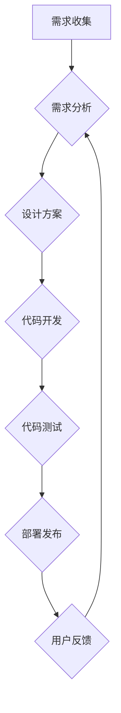

                 

## 体系化管理:卓越领导力的源泉

> 关键词：体系化管理、领导力、软件开发、团队协作、流程优化、技术架构、敏捷开发

## 1. 背景介绍

在当今瞬息万变的科技时代，卓越的领导力已成为企业持续成功的关键因素。传统的管理模式往往难以适应快速迭代、创新驱动的软件开发环境。体系化管理作为一种科学、高效的管理方法，逐渐成为软件开发团队提升效率、增强竞争力的重要保障。

体系化管理的核心在于建立一套完善的流程、规范和制度，将工作分解成可管理的模块，并通过明确的角色分工、责任归属和沟通机制，确保工作顺利进行。它强调流程的标准化、数据化的监控和持续改进，从而提升团队协作效率、降低风险，最终实现卓越的业务成果。

## 2. 核心概念与联系

体系化管理的核心概念包括：

* **流程化:** 将工作分解成一系列可重复的步骤，并建立标准化的流程规范，确保工作的一致性和可控性。
* **标准化:** 制定统一的标准和规范，包括代码风格、文档格式、测试流程等，提高工作效率和一致性。
* **自动化:** 利用工具和技术自动化重复性工作，例如代码构建、测试执行、部署发布等，释放人力资源，提高效率。
* **数据驱动:** 通过数据监控和分析，了解工作进展、问题根源和改进方向，推动持续优化。
* **持续改进:** 持续评估和改进流程和制度，不断提升工作效率和质量。

**Mermaid 流程图:**

## 3. 核心算法原理 & 具体操作步骤

体系化管理的核心算法并非传统意义上的算法，而是基于流程和规范的管理方法。其核心原理在于将复杂的工作分解成可管理的模块，并通过标准化的流程和规范，确保每个模块的顺利完成。

### 3.1  算法原理概述

体系化管理的算法原理可以概括为以下几个方面：

* **模块化:** 将工作分解成独立、可重复的模块，每个模块都有明确的职责和边界。
* **标准化:** 为每个模块制定标准化的流程、规范和工具，确保工作的一致性和可控性。
* **自动化:** 利用工具和技术自动化重复性工作，提高效率和降低错误率。
* **数据驱动:** 通过数据监控和分析，了解工作进展、问题根源和改进方向。
* **持续改进:** 持续评估和改进流程和制度，不断提升工作效率和质量。

### 3.2  算法步骤详解

体系化管理的具体操作步骤可以概括为以下几个阶段：

1. **需求分析:** 详细分析用户需求，明确项目目标和范围。
2. **流程设计:** 根据需求，设计一套完整的流程，包括工作分解、角色分工、责任归属、沟通机制等。
3. **标准化规范:** 制定统一的标准和规范，包括代码风格、文档格式、测试流程等，确保工作的一致性和可控性。
4. **工具选型:** 选择合适的工具和技术，例如版本控制系统、构建工具、测试框架等，提高工作效率和自动化程度。
5. **流程实施:** 将流程和规范落地执行，并进行持续监控和优化。
6. **数据分析:** 收集工作数据，进行分析和评估，了解工作进展、问题根源和改进方向。
7. **持续改进:** 根据数据分析结果，不断改进流程和制度，提升工作效率和质量。

### 3.3  算法优缺点

**优点:**

* **提高效率:** 流程标准化和自动化可以显著提高工作效率。
* **降低风险:** 明确的角色分工和责任归属可以降低工作风险。
* **增强一致性:** 统一的标准和规范可以确保工作的一致性和质量。
* **促进协作:** 明确的流程和沟通机制可以促进团队协作。

**缺点:**

* **实施成本:** 建立体系化管理体系需要投入一定的成本和时间。
* **流程僵化:** 过于强调流程标准化可能会导致流程僵化，难以适应变化。
* **缺乏灵活性:** 体系化管理的流程可能会限制个人的创造力和灵活性。

### 3.4  算法应用领域

体系化管理广泛应用于软件开发、项目管理、制造业、金融业等各个领域。

## 4. 数学模型和公式 & 详细讲解 & 举例说明

体系化管理的数学模型和公式主要用于分析和优化流程效率、资源分配和风险控制。

### 4.1  数学模型构建

常见的数学模型包括：

* **流程时间模型:** 用于分析流程执行时间，例如：

$$T = \sum_{i=1}^{n} t_i$$

其中：

* $T$ 为流程总执行时间
* $t_i$ 为每个步骤的执行时间
* $n$ 为流程步骤总数

* **资源分配模型:** 用于优化资源分配，例如：

$$R = \frac{W}{E}$$

其中：

* $R$ 为资源需求量
* $W$ 为工作量
* $E$ 为资源效率

### 4.2  公式推导过程

例如，流程时间模型的推导过程如下：

1. 假设流程包含 $n$ 个步骤。
2. 每个步骤的执行时间为 $t_i$。
3. 流程总执行时间为所有步骤执行时间的总和。
4. 因此，流程总执行时间 $T$ 可以表示为：

$$T = t_1 + t_2 + ... + t_n = \sum_{i=1}^{n} t_i$$

### 4.3  案例分析与讲解

例如，一个软件开发流程包含需求分析、设计、编码、测试、部署五个步骤。假设每个步骤的平均执行时间分别为 2 天、1 天、3 天、2 天、1 天。

根据流程时间模型，流程总执行时间为：

$$T = 2 + 1 + 3 + 2 + 1 = 9 天$$

## 5. 项目实践：代码实例和详细解释说明

## 5.1  开发环境搭建

体系化管理的实践需要搭建相应的开发环境，包括版本控制系统、构建工具、测试框架等。

## 5.2  源代码详细实现

体系化管理的代码实现主要体现在流程自动化和数据监控方面。

## 5.3  代码解读与分析

代码解读需要根据具体项目情况进行分析，例如：

* 版本控制系统代码：用于管理代码版本和历史记录。
* 构建工具代码：用于自动化代码构建、测试和部署。
* 测试框架代码：用于自动化测试用例执行和结果分析。

## 5.4  运行结果展示

运行结果展示需要根据具体项目情况进行分析，例如：

* 代码构建成功率
* 测试用例执行结果
* 部署成功率
* 流程执行时间

## 6. 实际应用场景

体系化管理在软件开发领域有着广泛的应用场景，例如：

* **敏捷开发:** 体系化管理可以帮助敏捷开发团队更好地管理迭代周期、任务分配和工作流程。
* **DevOps:** 体系化管理可以帮助DevOps团队实现自动化构建、测试和部署，提高开发效率和部署速度。
* **大型项目管理:** 体系化管理可以帮助大型项目团队更好地管理复杂的工作流程、资源分配和风险控制。

### 6.4  未来应用展望

未来，体系化管理将更加注重人工智能和机器学习的应用，例如：

* **智能流程优化:** 利用人工智能算法自动分析流程数据，识别瓶颈和改进方向，并自动优化流程。
* **智能资源分配:** 利用机器学习算法预测资源需求，并智能分配资源，提高资源利用率。
* **智能风险控制:** 利用机器学习算法识别潜在风险，并自动采取措施进行风险控制。

## 7. 工具和资源推荐

### 7.1  学习资源推荐

* **书籍:** 《体系化管理》、《卓越领导力》、《敏捷软件开发》
* **在线课程:** Coursera、edX、Udemy等平台提供体系化管理和敏捷开发相关的在线课程。

### 7.2  开发工具推荐

* **版本控制系统:** Git、SVN
* **构建工具:** Maven、Gradle
* **测试框架:** JUnit、TestNG
* **持续集成平台:** Jenkins、Travis CI

### 7.3  相关论文推荐

* **Agile Software Development: Principles, Patterns, and Practices**
* **The Phoenix Project: A Novel About IT, DevOps, and Helping Your Business Win**
* **The DevOps Handbook: How to Create World-Class Agility, Reliability, and Security in Technology Organizations**

## 8. 总结：未来发展趋势与挑战

### 8.1  研究成果总结

体系化管理作为一种科学、高效的管理方法，在软件开发领域取得了显著的成果，提高了团队效率、降低了风险，并推动了软件开发的持续创新。

### 8.2  未来发展趋势

未来，体系化管理将更加注重人工智能和机器学习的应用，实现智能流程优化、智能资源分配和智能风险控制，进一步提升管理效率和水平。

### 8.3  面临的挑战

体系化管理的实施需要克服一些挑战，例如：

* **组织文化转变:** 需要企业文化和管理理念的转变，才能更好地适应体系化管理模式。
* **人员技能提升:** 需要员工具备相应的管理技能和知识，才能有效执行体系化管理流程。
* **技术平台建设:** 需要搭建完善的技术平台，才能支撑体系化管理的实施和运行。

### 8.4  研究展望

未来，体系化管理的研究将更加深入，包括：

* **人工智能与体系化管理的融合:** 研究如何利用人工智能技术进一步优化体系化管理流程，提高管理效率和智能化水平。
* **体系化管理的跨领域应用:** 研究如何将体系化管理方法应用于其他领域，例如制造业、金融业等。
* **体系化管理的个性化定制:** 研究如何根据不同企业和项目的特点，定制个性化的体系化管理方案。

## 9. 附录：常见问题与解答

### 9.1  常见问题

* 体系化管理的实施成本高吗？
* 体系化管理是否会降低员工的创造力和灵活性？
* 如何评估体系化管理的成效？

### 9.2  解答

* 体系化管理的实施成本取决于具体项目的规模和复杂度，但可以通过自动化工具和流程优化来降低成本。
* 体系化管理的流程标准化可以提高工作效率和一致性，但需要灵活调整，避免过度僵化，并鼓励员工提出改进建议。
* 体系化管理的成效可以通过流程执行时间、资源利用率、错误率、客户满意度等指标进行评估。

作者：禅与计算机程序设计艺术 / Zen and the Art of Computer Programming 
<end_of_turn>

