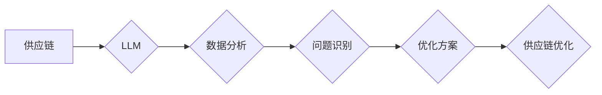

                 

## 供应链优化器：LLM 管理全球物流

> 关键词：供应链优化、LLM、大语言模型、物流管理、预测分析、机器学习、算法优化

## 1. 背景介绍

全球化经济的蓬勃发展使得供应链网络日益复杂，其效率和稳定性对企业竞争力至关重要。传统的供应链管理模式往往依赖于经验和规则，难以应对不断变化的市场需求和突发事件。近年来，人工智能（AI）技术，特别是大语言模型（LLM）的快速发展，为供应链优化带来了新的机遇。

LLM 拥有强大的自然语言处理能力，能够理解和分析海量文本数据，从中提取有价值的信息。结合其强大的学习和推理能力，LLM 可以用于预测需求、优化库存、规划运输路线、管理风险等多个环节，有效提升供应链效率和弹性。

## 2. 核心概念与联系

### 2.1 供应链优化

供应链优化是指通过分析和调整供应链各环节的流程、资源和信息流，以实现成本最低、效率最高、服务质量最佳的目标。

### 2.2 大语言模型（LLM）

LLM 是指能够理解和生成人类语言的大型神经网络模型。通过训练海量文本数据，LLM 能够掌握语言的语法、语义和上下文关系，并应用于各种自然语言处理任务，例如文本分类、机器翻译、问答系统等。

### 2.3 供应链优化器

供应链优化器是指利用 LLM 技术构建的智能系统，能够自动分析供应链数据，识别问题和潜在机会，并提出优化方案。

**核心概念与联系流程图**



## 3. 核心算法原理 & 具体操作步骤

### 3.1 算法原理概述

供应链优化器通常基于以下核心算法原理：

* **预测分析:** 利用历史数据和机器学习算法预测未来需求、库存水平、运输成本等关键指标。
* **路径规划:** 使用图论算法和启发式搜索策略规划最优的运输路线，考虑时间、成本、距离等因素。
* **库存管理:** 基于预测分析和安全库存策略，优化库存水平，降低库存成本和缺货风险。
* **风险管理:** 利用机器学习算法识别潜在风险，并提出相应的应对措施。

### 3.2 算法步骤详解

1. **数据收集:** 从各种数据源收集供应链相关数据，例如销售记录、库存信息、运输数据、市场趋势等。
2. **数据预处理:** 对收集到的数据进行清洗、转换和格式化，使其适合模型训练和分析。
3. **模型训练:** 利用机器学习算法训练预测模型、路径规划模型、库存管理模型等。
4. **优化方案生成:** 根据预测结果和优化目标，生成最优的供应链方案，例如运输路线、库存水平、采购计划等。
5. **方案评估:** 对优化方案进行评估，并根据实际情况进行调整和优化。

### 3.3 算法优缺点

**优点:**

* **提高效率:** 自动化供应链管理流程，提高效率和准确性。
* **降低成本:** 优化库存、运输和资源配置，降低成本。
* **增强弹性:** 预测和应对市场变化和突发事件，增强供应链弹性。

**缺点:**

* **数据依赖:** 算法性能依赖于数据质量和数量。
* **模型复杂:** 训练和部署复杂的机器学习模型需要专业技术和资源。
* **解释性:** 一些机器学习模型的决策过程难以解释，难以获得用户信任。

### 3.4 算法应用领域

* **物流运输:** 优化运输路线、调度车辆、预测运输时间。
* **库存管理:** 预测需求、优化库存水平、减少库存积压。
* **采购计划:** 预测需求、优化采购时间和数量。
* **风险管理:** 识别潜在风险、制定应对措施。

## 4. 数学模型和公式 & 详细讲解 & 举例说明

### 4.1 数学模型构建

供应链优化问题通常可以用数学模型来描述，例如线性规划、整数规划、动态规划等。

**举例:** 考虑一个简单的库存管理问题，目标是确定最佳的订货量和订货时间，以最小化库存成本和缺货成本。

* **库存成本:**  $C_h = h \cdot Q \cdot T$，其中 $h$ 是单位库存成本，$Q$ 是订货量，$T$ 是库存周期。
* **缺货成本:** $C_s = s \cdot D \cdot P$，其中 $s$ 是单位缺货成本，$D$ 是缺货量，$P$ 是缺货概率。

**目标函数:** 最小化总成本 $C = C_h + C_s$

### 4.2 公式推导过程

根据目标函数和约束条件，可以推导出具体的数学模型和求解公式。

**举例:** 假设需求量 $D$ 是已知的，订货周期 $T$ 是固定的，缺货概率 $P$ 是与订货量 $Q$ 有关的函数。

则目标函数可以表示为:

$C(Q) = h \cdot Q \cdot T + s \cdot D \cdot P(Q)$

通过求解 $C(Q)$ 的最小值，可以得到最佳的订货量 $Q^*$。

### 4.3 案例分析与讲解

通过实际案例分析，可以验证数学模型的有效性和算法的性能。

**举例:** 可以使用历史数据模拟一个实际的库存管理问题，并使用不同的算法和模型进行比较，分析其效果和优缺点。

## 5. 项目实践：代码实例和详细解释说明

### 5.1 开发环境搭建

* **操作系统:** Linux 或 macOS
* **编程语言:** Python
* **库和框架:** TensorFlow、PyTorch、Scikit-learn、Pandas、NumPy

### 5.2 源代码详细实现

```python
# 预测需求的示例代码
import pandas as pd
from sklearn.linear_model import LinearRegression

# 加载历史数据
data = pd.read_csv('sales_data.csv')

# 训练预测模型
model = LinearRegression()
model.fit(data[['month']], data['sales'])

# 预测未来需求
future_month = pd.DataFrame({'month': [1, 2, 3]})
future_sales = model.predict(future_month)

print(future_sales)
```

### 5.3 代码解读与分析

* **数据加载:** 使用 Pandas 库加载历史销售数据。
* **模型训练:** 使用 Scikit-learn 库的线性回归模型训练预测模型。
* **预测未来需求:** 使用训练好的模型预测未来三个月的销售量。

### 5.4 运行结果展示

运行代码后，将输出未来三个月的预测销售量。

## 6. 实际应用场景

### 6.1 物流运输优化

* **路线规划:** 利用 LLM 优化运输路线，考虑时间、成本、距离等因素，减少运输成本和时间。
* **车辆调度:** 利用 LLM 预预测货物需求，优化车辆调度方案，提高运输效率。

### 6.2 库存管理优化

* **需求预测:** 利用 LLM 预测未来需求，优化库存水平，减少库存积压和缺货风险。
* **库存控制:** 利用 LLM 建立库存控制模型，自动调整库存水平，确保满足需求。

### 6.3 采购计划优化

* **需求预测:** 利用 LLM 预测未来需求，优化采购计划，确保及时采购所需物资。
* **供应商选择:** 利用 LLM 分析供应商信息，选择最优供应商，降低采购成本。

### 6.4 未来应用展望

* **个性化供应链:** 利用 LLM 分析客户需求，构建个性化供应链，提供更精准的服务。
* **可持续供应链:** 利用 LLM 优化资源配置，减少环境污染，构建更可持续的供应链。
* **自动化的供应链管理:** 利用 LLM 自动化供应链管理流程，提高效率和降低成本。

## 7. 工具和资源推荐

### 7.1 学习资源推荐

* **书籍:**
    * 《深度学习》
    * 《自然语言处理》
    * 《供应链管理》
* **在线课程:**
    * Coursera
    * edX
    * Udacity

### 7.2 开发工具推荐

* **编程语言:** Python
* **机器学习库:** TensorFlow、PyTorch、Scikit-learn
* **数据分析库:** Pandas、NumPy

### 7.3 相关论文推荐

* **LLM 在供应链优化中的应用:**
    * [论文标题1](论文链接)
    * [论文标题2](论文链接)
* **供应链优化算法:**
    * [论文标题3](论文链接)
    * [论文标题4](论文链接)

## 8. 总结：未来发展趋势与挑战

### 8.1 研究成果总结

LLM 技术为供应链优化带来了新的机遇，能够有效提高效率、降低成本和增强弹性。

### 8.2 未来发展趋势

* **更强大的 LLMs:** 随着模型规模和训练数据的增加，LLMs 将变得更加强大，能够处理更复杂的任务。
* **更广泛的应用场景:** LLM 将应用于更多供应链环节，例如风险管理、合同谈判、客户服务等。
* **更智能的供应链:** LLM 将与其他人工智能技术融合，构建更智能、更自适应的供应链。

### 8.3 面临的挑战

* **数据隐私和安全:** LLM 需要处理大量敏感数据，需要确保数据隐私和安全。
* **模型解释性和可信度:** 一些 LLMs 的决策过程难以解释，难以获得用户信任。
* **技术可访问性:** LLM 技术的应用需要专业知识和资源，需要降低技术门槛。

### 8.4 研究展望

未来研究将重点关注以下方面:

* **开发更安全、更可靠的 LLM 模型。**
* **提高 LLM 模型的解释性和可信度。**
* **降低 LLM 技术的应用门槛。**


## 9. 附录：常见问题与解答

* **Q1: LLM 是否能够完全替代人类供应链管理人员？**

* **A1:** 目前 LLMs 无法完全替代人类供应链管理人员，但可以帮助他们自动化重复性任务，提高效率和准确性。

* **Q2: 如何确保 LLM 模型的准确性和可靠性？**

* **A2:** 需要使用高质量的数据训练模型，并进行充分的测试和评估。

* **Q3: LLM 技术的应用成本如何？**

* **A3:** LLM 技术的应用成本取决于模型规模、训练数据量和部署环境等因素。

作者：禅与计算机程序设计艺术 / Zen and the Art of Computer Programming 


<end_of_turn>

