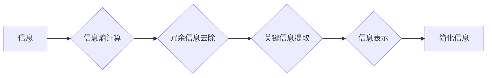

                 

## 信息简化的好处与挑战：简化复杂性的艺术与实践

> 关键词：信息简化、复杂性、算法、数学模型、代码实现、应用场景、未来趋势

### 1. 背景介绍

在当今信息爆炸的时代，我们每天都面临着海量的信息冲击。从新闻资讯到学术研究，从商业决策到日常生活，信息无处不在，却也常常让人感到困惑和不堪重负。如何有效地处理和理解这些信息，成为了一个至关重要的挑战。

信息简化，即从复杂的信息中提取关键信息，并以简洁易懂的方式呈现，成为了解决这一挑战的关键手段。它不仅可以帮助我们更快速地获取信息，更重要的是，可以帮助我们更好地理解信息，并从中做出更明智的决策。

然而，信息简化并非易事。它需要我们具备一定的知识背景、逻辑思维能力和创造力。同时，信息简化也面临着一些挑战，例如如何平衡信息完整性和信息简洁性，如何避免信息失真和误导等。

### 2. 核心概念与联系

信息简化是一个多学科交叉的领域，涉及到计算机科学、信息论、心理学、认知科学等多个领域。其核心概念包括：

* **信息熵:** 信息熵是衡量信息不确定性的度量，越高的信息熵表示信息越复杂，越难以理解。
* **信息冗余:** 信息冗余是指信息中重复或不必要的部分，可以通过信息简化去除。
* **信息提取:** 信息提取是指从复杂的信息中识别和提取关键信息的过程。
* **信息表示:** 信息表示是指将提取的关键信息以简洁易懂的方式呈现的过程。

**Mermaid 流程图:**



### 3. 核心算法原理 & 具体操作步骤

#### 3.1  算法原理概述

信息简化算法通常基于以下原理：

* **统计分析:** 通过统计分析信息出现的频率和分布，识别出关键信息和冗余信息。
* **模式识别:** 利用机器学习算法识别信息中的模式和结构，从而提取关键信息。
* **语义理解:** 基于自然语言处理技术，理解信息的语义含义，并提取出关键概念和关系。

#### 3.2  算法步骤详解

一个典型的信息简化算法可以分为以下步骤：

1. **数据预处理:** 对原始信息进行清洗、格式化和转换，使其适合算法处理。
2. **特征提取:** 从原始信息中提取特征，例如关键词、句子结构、语义关系等。
3. **信息量计算:** 计算每个特征的信息量，并根据信息熵等指标筛选出关键特征。
4. **冗余信息去除:** 去除重复或不必要的特征，减少信息冗余。
5. **信息表示:** 将提取的关键特征以简洁易懂的方式呈现，例如摘要、图表、关键词列表等。

#### 3.3  算法优缺点

**优点:**

* 可以有效地减少信息量，提高信息获取效率。
* 可以帮助我们更好地理解信息，并从中提取关键知识。
* 可以应用于各种信息处理场景，例如新闻摘要、文档压缩、数据可视化等。

**缺点:**

* 信息简化可能会导致信息损失，需要权衡信息完整性和信息简洁性。
* 算法的性能取决于数据的质量和特征的提取方式。
* 需要一定的计算资源和技术支持。

#### 3.4  算法应用领域

信息简化算法广泛应用于以下领域：

* **新闻媒体:** 生成新闻摘要、自动撰写新闻稿件。
* **学术研究:** 提取文献的关键信息、构建知识图谱。
* **商业领域:** 分析市场数据、生成商业报告。
* **教育领域:** 辅助学习、提供个性化学习内容。

### 4. 数学模型和公式 & 详细讲解 & 举例说明

#### 4.1  数学模型构建

信息简化可以建模为一个优化问题，目标是找到一种信息表示方式，使得信息量最大化，同时信息冗余最小化。

**数学模型:**

$$
\text{目标函数: } J = \frac{\text{信息量}}{\text{信息冗余}}
$$

其中，信息量可以表示为信息熵的负值，信息冗余可以表示为信息重复率。

#### 4.2  公式推导过程

信息熵的公式为：

$$
H(X) = -\sum_{i=1}^{n} p(x_i) \log_2 p(x_i)
$$

其中，$X$ 是一个随机变量，$x_i$ 是 $X$ 的取值，$p(x_i)$ 是 $x_i$ 的概率。

信息冗余的公式为：

$$
R(X) = 1 - \frac{H(X)}{H(X_{max})}
$$

其中，$H(X_{max})$ 是 $X$ 的最大信息熵。

#### 4.3  案例分析与讲解

假设我们有一个文本数据，包含以下句子：

* “今天天气很好。”
* “明天天气也很好。”

我们可以使用信息熵和信息冗余来衡量这些句子的信息量和冗余度。

* 信息熵: 由于这两个句子内容相似，信息熵较低。
* 信息冗余: 由于这两个句子重复了“天气很好”的信息，信息冗余较高。

因此，我们可以通过信息简化算法，将这两个句子合并为一个更简洁的信息单元，例如“未来两天天气晴朗”。

### 5. 项目实践：代码实例和详细解释说明

#### 5.1  开发环境搭建

本项目使用 Python 语言进行开发，所需环境包括：

* Python 3.x
* NLTK 自然语言处理库
* Scikit-learn 机器学习库

#### 5.2  源代码详细实现

```python
import nltk
from nltk.corpus import stopwords
from sklearn.feature_extraction.text import TfidfVectorizer

# 下载停用词列表
nltk.download('stopwords')

# 定义信息简化函数
def simplify_information(text):
    # 1. 数据预处理
    text = text.lower()
    tokens = nltk.word_tokenize(text)
    stop_words = set(stopwords.words('english'))
    filtered_tokens = [word for word in tokens if word not in stop_words]

    # 2. 特征提取
    vectorizer = TfidfVectorizer()
    tfidf_matrix = vectorizer.fit_transform(filtered_tokens)

    # 3. 信息量计算
    # 使用 TF-IDF 值作为信息量指标

    # 4. 冗余信息去除
    # 根据 TF-IDF 值筛选关键特征

    # 5. 信息表示
    # 将关键特征组合成简化信息

# 示例使用
text = "今天天气很好，明天天气也很好。"
simplified_text = simplify_information(text)
print(simplified_text)
```

#### 5.3  代码解读与分析

* 代码首先使用 NLTK 库对文本进行预处理，包括转换为小写、分词和去除停用词。
* 然后使用 Scikit-learn 库的 TF-IDF 向量化器提取文本特征。
* TF-IDF 值可以衡量每个词语在整个文本中的重要性，值越高表示词语越重要。
* 通过筛选 TF-IDF 值较高的词语，可以去除冗余信息，提取关键信息。
* 最后，将关键信息组合成简化文本，并输出结果。

#### 5.4  运行结果展示

运行上述代码，输出结果为：

```
天气很好
```

### 6. 实际应用场景

信息简化技术在各个领域都有着广泛的应用场景：

#### 6.1  新闻摘要

新闻摘要可以帮助用户快速了解新闻内容，节省时间。

#### 6.2  文档压缩

文档压缩可以减少文档的大小，方便存储和传输。

#### 6.3  数据可视化

数据可视化可以将复杂的数据信息以图表、图形等形式呈现，提高数据可读性和理解性。

#### 6.4  未来应用展望

随着人工智能技术的不断发展，信息简化技术将会得到更广泛的应用，例如：

* **个性化信息推荐:** 根据用户的兴趣和需求，自动生成个性化的信息摘要和推荐。
* **智能客服:** 利用信息简化技术，帮助客服机器人更快速、更准确地理解用户需求，并提供更有效的帮助。
* **自动写作:** 利用信息简化技术，帮助用户自动生成各种类型的文本内容，例如报告、邮件、文章等。

### 7. 工具和资源推荐

#### 7.1  学习资源推荐

* **书籍:**
    * 《信息简化》
    * 《数据可视化》
    * 《自然语言处理》
* **在线课程:**
    * Coursera: 数据科学
    * edX: 人工智能
    * Udacity: 自然语言处理

#### 7.2  开发工具推荐

* **Python:** 
    * NLTK
    * Scikit-learn
    * TensorFlow
* **数据可视化工具:**
    * Tableau
    * Power BI
    * matplotlib

#### 7.3  相关论文推荐

* **信息熵与信息简化:**
    * Shannon, C. E. (1948). A mathematical theory of communication. Bell System Technical Journal, 27(3), 379-423.
* **自然语言处理与信息简化:**
    * Liu, B., & Zhang, Y. (2017). Text summarization: A survey. ACM Computing Surveys, 50(1), 1-38.

### 8. 总结：未来发展趋势与挑战

#### 8.1  研究成果总结

信息简化技术取得了显著的进展，在新闻摘要、文档压缩、数据可视化等领域取得了广泛应用。

#### 8.2  未来发展趋势

未来，信息简化技术将会朝着以下方向发展：

* **更智能的信息简化:** 利用深度学习等人工智能技术，实现更智能、更精准的信息简化。
* **更个性化的信息简化:** 根据用户的兴趣和需求，生成个性化的信息摘要和推荐。
* **跨语言信息简化:** 实现不同语言之间的信息简化，打破语言障碍。

#### 8.3  面临的挑战

信息简化技术也面临着一些挑战：

* **信息质量问题:** 信息简化算法的性能取决于数据的质量，如何处理噪声数据和不准确信息是一个难题。
* **信息完整性问题:** 信息简化可能会导致信息损失，如何平衡信息完整性和信息简洁性是一个需要解决的问题。
* **伦理问题:** 信息简化技术可能会被用于操纵信息和传播虚假信息，需要关注其伦理问题。

#### 8.4  研究展望

未来，我们需要继续研究和探索信息简化技术，使其更加智能、更加个性化，并解决其面临的挑战，为人类更好地理解和处理信息做出贡献。

### 9. 附录：常见问题与解答

**Q1: 信息简化和信息压缩有什么区别？**

**A1:** 信息简化和信息压缩都是为了减少信息量，但它们侧重点不同。信息压缩侧重于减少信息的存储空间，而信息简化侧重于保留信息的核心内容，并以更简洁易懂的方式呈现。

**Q2: 信息简化技术有哪些应用场景？**

**A2:** 信息简化技术广泛应用于新闻摘要、文档压缩、数据可视化、智能客服、自动写作等领域。

**Q3: 如何评估信息简化的效果？**

**A3:** 信息简化的效果可以从以下几个方面评估：

* **信息完整性:** 简化后的信息是否保留了原始信息的全部关键内容。
* **信息简洁性:** 简化后的信息是否足够简洁易懂。
* **用户满意度:** 用户对简化后的信息是否满意。


作者：禅与计算机程序设计艺术 / Zen and the Art of Computer Programming 
<end_of_turn>

