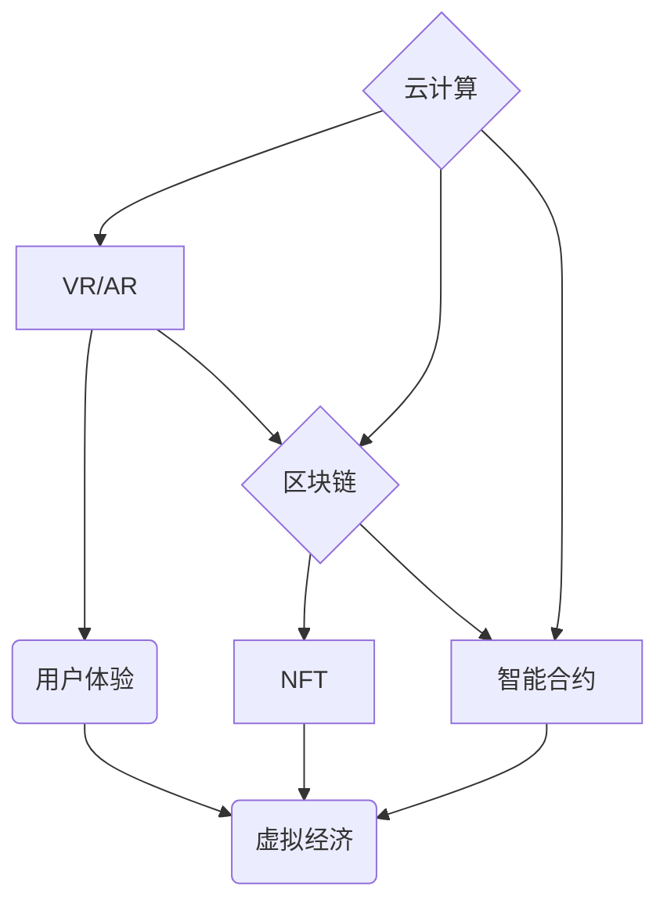

                 

## 元宇宙技术栈：从VR/AR到区块链

> 关键词：元宇宙、VR/AR、区块链、NFT、Web3、人工智能、云计算

## 1. 背景介绍

元宇宙的概念近年来备受关注，它被描述为一个融合虚拟现实 (VR)、增强现实 (AR)、区块链、人工智能等技术的沉浸式数字世界。在这个世界里，用户可以创建、分享和体验数字内容，并与其他用户进行互动。元宇宙的出现，标志着互联网发展进入一个新的阶段，它将深刻地改变我们的生活方式、工作模式和社会结构。

然而，元宇宙的构建并非易事，它需要整合多种先进技术，并解决诸多技术难题。本文将深入探讨元宇宙技术栈的核心概念、算法原理、项目实践以及未来发展趋势，帮助读者更好地理解元宇宙的构建和发展。

## 2. 核心概念与联系

元宇宙技术栈的核心概念包括：

* **虚拟现实 (VR):** 通过头戴式显示器和手柄等设备，创造沉浸式的虚拟环境，用户可以身临其境地体验虚拟世界。
* **增强现实 (AR):** 在现实世界中叠加虚拟元素，增强用户对现实世界的感知和交互体验。
* **区块链:**  一种分布式账本技术，可以确保数据安全、透明和不可篡改，为元宇宙提供底层信任机制。
* **非同质化代币 (NFT):**  一种独特的数字资产，可以代表虚拟物品、数字艺术品等，为元宇宙的虚拟经济提供基础。
* **人工智能 (AI):**  可以赋予虚拟角色智能行为，增强用户体验，并推动元宇宙的个性化发展。
* **云计算:**  提供强大的计算和存储资源，支持元宇宙的规模化发展。

这些核心概念相互关联，共同构成了元宇宙的技术基础。

**元宇宙技术栈架构图:**



## 3. 核心算法原理 & 具体操作步骤

### 3.1  算法原理概述

元宇宙技术栈中涉及多种核心算法，例如：

* **3D建模和渲染算法:** 用于创建虚拟世界的三维场景和物体，并将其渲染到用户设备上。
* **路径规划算法:** 用于虚拟角色在虚拟世界中导航，避开障碍物，到达目标位置。
* **人工智能算法:** 用于赋予虚拟角色智能行为，例如对话、决策、学习等。
* **加密算法:** 用于保障元宇宙数据安全和隐私。

这些算法的原理和实现方式都非常复杂，需要深入学习和研究。

### 3.2  算法步骤详解

以路径规划算法为例，其具体步骤如下：

1. **构建地图:** 将虚拟世界中的环境信息转化为地图数据，包括障碍物、路径、目标点等。
2. **选择路径规划算法:** 根据虚拟世界的特点和需求，选择合适的路径规划算法，例如A*算法、Dijkstra算法等。
3. **计算路径:** 使用选定的算法，计算虚拟角色从起点到目标点的最佳路径。
4. **导航控制:** 根据计算出的路径，控制虚拟角色的运动，使其沿着规划好的路径前进。

### 3.3  算法优缺点

不同的算法具有不同的优缺点，需要根据具体应用场景进行选择。例如，A*算法具有较高的效率，但对地图数据要求较高；Dijkstra算法则更适合处理复杂环境。

### 3.4  算法应用领域

路径规划算法广泛应用于机器人导航、无人驾驶、游戏开发等领域。在元宇宙中，它可以用于虚拟角色的移动、虚拟物品的运输等场景。

## 4. 数学模型和公式 & 详细讲解 & 举例说明

### 4.1  数学模型构建

元宇宙技术栈中涉及多种数学模型，例如：

* **3D空间坐标系:** 用于描述虚拟世界的空间位置。
* **线性代数:** 用于处理虚拟角色的运动、旋转、缩放等操作。
* **概率论和统计学:** 用于构建虚拟角色的行为模型和预测用户行为。

### 4.2  公式推导过程

以3D空间坐标系为例，其数学模型如下：

* **笛卡尔坐标系:**  用三个坐标 (x, y, z) 来表示空间中的一个点。
* **欧拉角:** 用三个角度 (roll, pitch, yaw) 来表示空间中物体的旋转。

### 4.3  案例分析与讲解

假设一个虚拟角色在3D空间中移动，其位置坐标为 (x, y, z)。如果用户输入一个方向向量 (dx, dy, dz)，则虚拟角色的新的位置坐标可以计算如下：

$$
(x', y', z') = (x + dx, y + dy, z + dz)
$$

## 5. 项目实践：代码实例和详细解释说明

### 5.1  开发环境搭建

元宇宙项目开发通常需要使用多种开发工具和框架，例如：

* **Unity:**  一款流行的3D游戏引擎，可以用于构建虚拟世界和虚拟角色。
* **Unreal Engine:**  另一款强大的3D游戏引擎，提供更逼真的图形渲染效果。
* **Web3.js:**  一个用于开发基于区块链的应用程序的JavaScript库。
* **TensorFlow:**  一个开源的机器学习框架，可以用于构建虚拟角色的智能行为模型。

### 5.2  源代码详细实现

以下是一个简单的Unity代码示例，用于控制虚拟角色的移动：

```csharp
using UnityEngine;

public class CharacterController : MonoBehaviour
{
    public float speed = 5.0f;

    void Update()
    {
        float horizontalInput = Input.GetAxis("Horizontal");
        float verticalInput = Input.GetAxis("Vertical");

        Vector3 movement = new Vector3(horizontalInput, 0.0f, verticalInput);
        transform.Translate(movement * speed * Time.deltaTime);
    }
}
```

### 5.3  代码解读与分析

这段代码定义了一个名为CharacterController的脚本，用于控制虚拟角色的移动。

* `speed`变量控制角色的移动速度。
* `Update()`函数在每帧更新角色的位置。
* `Input.GetAxis("Horizontal")`和`Input.GetAxis("Vertical")`获取用户的左右和前后移动输入。
* `Vector3 movement`计算角色的移动方向。
* `transform.Translate()`函数将角色移动到新的位置。

### 5.4  运行结果展示

运行这段代码后，虚拟角色将根据用户的输入方向移动。

## 6. 实际应用场景

元宇宙技术栈在多个领域都有着广泛的应用场景，例如：

* **游戏:**  构建沉浸式的虚拟游戏世界，提供更丰富的游戏体验。
* **教育:**  创造虚拟课堂和实验室，提供更直观和互动式的学习体验。
* **医疗:**  模拟手术场景，进行虚拟手术训练，并辅助医生进行远程诊断。
* **社交:**  构建虚拟社交平台，让用户在虚拟世界中进行交流和互动。
* **商业:**  搭建虚拟商店和展厅，提供更便捷的购物和展示体验。

### 6.4  未来应用展望

随着元宇宙技术的不断发展，其应用场景将更加广泛，例如：

* **虚拟办公:**  构建虚拟办公环境，提高工作效率和协作能力。
* **虚拟旅游:**  体验虚拟的旅游景点，感受不同的文化和风景。
* **虚拟艺术:**  创作和欣赏虚拟艺术作品，丰富人们的精神生活。

## 7. 工具和资源推荐

### 7.1  学习资源推荐

* **书籍:**  《元宇宙：下一代互联网》
* **在线课程:**  Coursera、Udemy等平台上的元宇宙相关课程。
* **技术博客:**  Hacker News、Medium等平台上的元宇宙技术博客。

### 7.2  开发工具推荐

* **Unity:**  https://unity.com/
* **Unreal Engine:**  https://www.unrealengine.com/
* **Web3.js:**  https://web3js.readthedocs.io/en/v1.0.0/
* **TensorFlow:**  https://www.tensorflow.org/

### 7.3  相关论文推荐

* **《The Metaverse: A Conceptual Framework》**
* **《Blockchain Technology for the Metaverse》**
* **《Artificial Intelligence in the Metaverse》**

## 8. 总结：未来发展趋势与挑战

### 8.1  研究成果总结

元宇宙技术栈的发展取得了显著成果，例如：

* **VR/AR技术:**  硬件设备不断升级，体验更加沉浸式。
* **区块链技术:**  安全性、透明度和去中心化特性得到提升。
* **人工智能技术:**  虚拟角色的智能行为更加逼真。

### 8.2  未来发展趋势

元宇宙技术栈将朝着以下方向发展：

* **更沉浸式的体验:**  VR/AR技术将更加逼真，用户体验更加沉浸式。
* **更丰富的交互:**  人工智能技术将赋予虚拟角色更智能的行为，用户与虚拟世界的交互更加丰富。
* **更完善的生态:**  元宇宙将形成更加完善的生态系统，包括虚拟经济、虚拟社会、虚拟文化等。

### 8.3  面临的挑战

元宇宙技术栈也面临着诸多挑战，例如：

* **技术难题:**  例如，如何实现更逼真的虚拟现实体验、如何构建更加安全的区块链系统等。
* **伦理问题:**  例如，如何保护用户隐私、如何防止虚拟世界中的犯罪活动等。
* **社会影响:**  例如，元宇宙可能会改变人们的生活方式和社会结构，需要进行深入的社会研究和伦理探讨。

### 8.4  研究展望

未来，元宇宙技术栈的研究将更加深入，将探索元宇宙的更多应用场景，并解决元宇宙发展过程中面临的挑战。

## 9. 附录：常见问题与解答

**Q1: 元宇宙和虚拟现实有什么区别？**

**A1:** 元宇宙是一个更广义的概念，它包含了虚拟现实、增强现实、区块链、人工智能等多种技术，并构建了一个沉浸式数字世界。虚拟现实只是元宇宙的一部分，它指的是使用头戴式显示器等设备创造沉浸式虚拟环境的技术。

**Q2: 元宇宙的未来发展趋势是什么？**

**A2:** 元宇宙的未来发展趋势包括更沉浸式的体验、更丰富的交互、更完善的生态系统等。

**Q3: 元宇宙会带来哪些挑战？**

**A3:** 元宇宙会带来技术难题、伦理问题和社会影响等挑战。

**作者：禅与计算机程序设计艺术 / Zen and the Art of Computer Programming** 


<end_of_turn>

