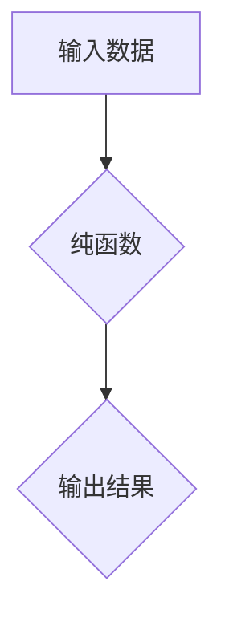

                 

## 函数式编程的思想与技术框架

> 关键词：函数式编程、纯函数、递归、lambda表达式、高阶函数、副作用、并发编程、可测试性、可维护性

### 1. 背景介绍

随着软件系统规模和复杂度的不断增长，传统的面向对象编程（OOP）模式在某些方面逐渐显露出局限性。例如，OOP 中的类和对象之间的交互往往会带来难以理解和维护的代码，难以实现真正的并发编程，并且测试和调试难度较大。

函数式编程（FP）作为一种相对较新的编程范式，以其简洁、可读性强、可测试性高、并发安全等特点，逐渐受到越来越多的关注。FP 强调将程序看作一系列无副作用的函数组合，通过函数的递归调用和高阶函数来实现复杂逻辑。

### 2. 核心概念与联系

#### 2.1 函数的本质

在 FP 中，函数被视为一等公民，这意味着函数可以像其他数据类型一样被赋值、传递、返回和操作。

#### 2.2 纯函数

纯函数是 FP 的核心概念之一。一个纯函数具有以下两个特性：

* **确定性：** 给定相同的输入，纯函数总是返回相同的输出。
* **无副作用：** 纯函数不会改变外部状态，例如修改全局变量或打印输出。

纯函数的确定性和无副作用特性使得它们易于测试、理解和维护。

#### 2.3 递归

递归是一种用于解决重复问题的编程技术，它通过将问题分解成更小的子问题，然后递归地解决这些子问题，最终得到问题的解。

#### 2.4 高阶函数

高阶函数是指可以接受其他函数作为参数或返回函数作为结果的函数。高阶函数是 FP 中强大的工具，可以用来实现函数组合、映射、过滤等操作。

#### 2.5 副作用

副作用是指函数执行过程中会改变外部状态的操作。FP 尽量避免副作用，因为副作用会使程序难以理解和测试。

**Mermaid 流程图**



### 3. 核心算法原理 & 具体操作步骤

#### 3.1 算法原理概述

函数式编程的核心算法原理是通过函数的组合和递归来实现复杂逻辑。

#### 3.2 算法步骤详解

1. 将问题分解成一系列更小的子问题。
2. 对于每个子问题，定义一个纯函数来解决它。
3. 使用高阶函数将这些纯函数组合起来，形成一个解决原问题的函数。
4. 递归地调用这些函数，直到得到最终结果。

#### 3.3 算法优缺点

**优点：**

* **可读性强：** 函数式代码通常比面向对象代码更简洁易懂。
* **可测试性高：** 纯函数易于测试，因为它们是确定性的，并且没有副作用。
* **并发安全：** 由于 FP 避免了副作用，因此 FP 程序更容易实现并发编程。
* **可维护性高：** 函数式代码更容易理解和修改，因为函数是独立的模块。

**缺点：**

* **学习曲线陡峭：** FP 的概念和思想与传统编程模式不同，需要一定的学习时间。
* **性能问题：** 在某些情况下，函数式代码的性能可能不如面向对象代码。

#### 3.4 算法应用领域

函数式编程广泛应用于以下领域：

* **数据科学和机器学习：** FP 的简洁性和可测试性使其成为数据科学和机器学习领域的首选编程语言。
* **Web 开发：** FP 的并发安全性和可维护性使其成为 Web 开发的理想选择。
* **游戏开发：** FP 的性能和可读性使其成为游戏开发的良好选择。

### 4. 数学模型和公式 & 详细讲解 & 举例说明

#### 4.1 数学模型构建

函数式编程可以看作是一种基于数学函数的编程模型。

* **输入：** 函数的输入可以看作是函数的定义域。
* **输出：** 函数的输出可以看作是函数的值域。
* **函数关系：** 函数之间的关系可以看作是数学函数的复合关系。

#### 4.2 公式推导过程

在 FP 中，可以使用数学公式来描述函数的组合和递归。例如，可以使用函数的复合关系来描述两个函数的组合：

$$f \circ g(x) = f(g(x))$$

其中，$f$ 和 $g$ 是两个函数，$x$ 是输入。

#### 4.3 案例分析与讲解

例如，我们可以使用函数式编程来实现一个求阶乘的函数：

```python
def factorial(n):
  if n == 0:
    return 1
  else:
    return n * factorial(n - 1)
```

这个函数使用递归来实现阶乘的计算。

### 5. 项目实践：代码实例和详细解释说明

#### 5.1 开发环境搭建

可以使用任何支持函数式编程的语言和开发环境来实现 FP 项目。例如，可以使用 Python、JavaScript、Scala 等语言，以及相应的 IDE 或文本编辑器。

#### 5.2 源代码详细实现

```python
def add(x, y):
  return x + y

def subtract(x, y):
  return x - y

def multiply(x, y):
  return x * y

def divide(x, y):
  if y == 0:
    raise ZeroDivisionError("Division by zero")
  return x / y

# 使用高阶函数实现一个计算器
def calculator(operation, x, y):
  if operation == "add":
    return add(x, y)
  elif operation == "subtract":
    return subtract(x, y)
  elif operation == "multiply":
    return multiply(x, y)
  elif operation == "divide":
    return divide(x, y)
  else:
    raise ValueError("Invalid operation")

# 使用计算器
result = calculator("add", 5, 3)
print(result)  # 输出：8
```

#### 5.3 代码解读与分析

这段代码演示了如何使用函数式编程的思想来实现一个简单的计算器。

* 定义了四个基本算术函数：`add`、`subtract`、`multiply` 和 `divide`。
* 使用高阶函数 `calculator` 来封装不同的算术操作。
* `calculator` 函数接受一个操作符和两个操作数作为参数，并根据操作符调用相应的算术函数。

#### 5.4 运行结果展示

运行这段代码会输出 `8`，表示 5 + 3 的结果。

### 6. 实际应用场景

#### 6.1 数据处理

FP 非常适合处理数据，例如数据清洗、转换和分析。

#### 6.2 并发编程

FP 的并发安全性和可测试性使其成为并发编程的理想选择。

#### 6.3 Web 开发

FP 可以用于构建高性能、可维护的 Web 应用。

#### 6.4 未来应用展望

随着 FP 的发展和普及，它将在更多领域得到应用，例如人工智能、机器学习、区块链等。

### 7. 工具和资源推荐

#### 7.1 学习资源推荐

* **书籍：**
    * 《函数式编程》
    * 《结构化编程》
    * 《模式识别》
* **在线课程：**
    * Coursera 上的函数式编程课程
    * Udemy 上的函数式编程课程

#### 7.2 开发工具推荐

* **Python:** PyCharm, VS Code
* **JavaScript:** WebStorm, VS Code
* **Scala:** IntelliJ IDEA, VS Code

#### 7.3 相关论文推荐

* **论文：**
    * 《函数式编程的思想与技术框架》
    * 《函数式编程的应用与实践》

### 8. 总结：未来发展趋势与挑战

#### 8.1 研究成果总结

函数式编程已经取得了显著的成果，并在许多领域得到了广泛应用。

#### 8.2 未来发展趋势

* **更广泛的应用：** FP 将在更多领域得到应用，例如人工智能、机器学习、区块链等。
* **更强大的工具：** 将会有更多更强大的 FP 工具和框架出现。
* **更深入的研究：** FP 的理论和实践将继续深入研究。

#### 8.3 面临的挑战

* **学习曲线陡峭：** FP 的概念和思想与传统编程模式不同，需要一定的学习时间。
* **性能问题：** 在某些情况下，函数式代码的性能可能不如面向对象代码。
* **生态系统发展：** FP 的生态系统仍然相对较小，需要更多的开源项目和社区支持。

#### 8.4 研究展望

未来，FP 将继续发展和完善，成为一种更强大、更广泛应用的编程范式。


### 9. 附录：常见问题与解答

#### 9.1 什么是纯函数？

纯函数是指给定相同的输入，总是返回相同的输出，并且不会改变外部状态的函数。

#### 9.2 为什么函数式编程避免副作用？

副作用会使程序难以理解和测试，并且会降低程序的并发安全。

#### 9.3 如何学习函数式编程？

可以阅读相关书籍和在线课程，并尝试使用 FP 语言和工具进行实践。


作者：禅与计算机程序设计艺术 / Zen and the Art of Computer Programming 
<end_of_turn>

