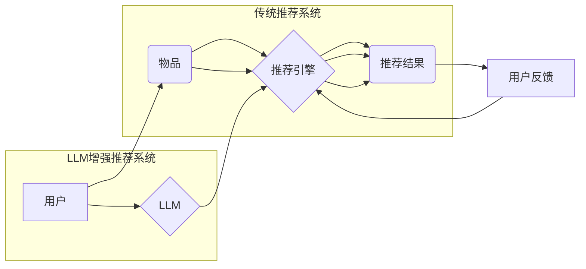

                 

## 利用LLM提升推荐系统的多样性与新颖性

> 关键词：LLM,推荐系统,多样性,新颖性,文本生成,个性化推荐,冷启动问题

## 1. 背景介绍

推荐系统作为信息过滤和个性化内容呈现的重要工具，在电商、社交媒体、视频平台等领域发挥着至关重要的作用。传统的推荐系统主要依赖于协同过滤、内容过滤和基于知识图谱的方法，但这些方法往往存在以下问题：

* **缺乏多样性:** 推荐结果可能过于集中在用户已知的偏好领域，导致用户体验单调乏味。
* **新颖性不足:** 推荐系统倾向于推荐热门或流行的内容，难以挖掘用户潜在兴趣或提供新鲜感。
* **冷启动问题:** 对新用户或新物品的推荐效果较差，难以快速建立用户画像和物品特征。

近年来，大语言模型（LLM）的快速发展为推荐系统带来了新的机遇。LLM具备强大的文本理解和生成能力，可以有效解决上述问题，提升推荐系统的多样性和新颖性。

## 2. 核心概念与联系

### 2.1  LLM概述

LLM是一种基于Transformer架构的深度学习模型，通过训练海量文本数据，学习语言的语法、语义和上下文关系。其强大的文本生成能力使其能够理解用户需求，生成个性化的推荐内容。

### 2.2  推荐系统与LLM的结合

LLM可以与传统的推荐系统相结合，形成一个更智能、更个性化的推荐体系。

**推荐系统架构图**



**核心概念:**

* **用户理解:** LLM可以分析用户的历史行为、偏好和文本描述，构建更精准的用户画像。
* **物品描述增强:** LLM可以生成物品的丰富描述，包括文本、图像和视频等多模态内容，提升物品的吸引力。
* **个性化推荐:** LLM可以根据用户的个性化需求，生成个性化的推荐内容，例如推荐用户感兴趣的主题、风格或作者。
* **新颖性挖掘:** LLM可以探索用户潜在的兴趣，推荐用户从未接触过的物品，提升推荐的新颖性。

## 3. 核心算法原理 & 具体操作步骤

### 3.1  算法原理概述

LLM可以用于推荐系统的多个环节，例如用户画像构建、物品描述生成、推荐策略优化等。

* **用户画像构建:** 利用LLM对用户的历史行为、评论和社交信息进行分析，构建用户的兴趣偏好、价值观和行为模式等多维度的用户画像。
* **物品描述生成:** 利用LLM生成物品的丰富描述，包括文本、图像和视频等多模态内容，提升物品的吸引力。
* **推荐策略优化:** 利用LLM对用户的行为数据进行分析，优化推荐策略，例如个性化推荐、多样性推荐和新颖性推荐等。

### 3.2  算法步骤详解

以用户画像构建为例，LLM可以根据以下步骤构建用户画像：

1. **数据预处理:** 收集用户的历史行为数据、评论数据和社交信息数据，进行清洗、格式化和编码处理。
2. **LLM模型训练:** 利用预处理后的数据训练LLM模型，使其能够理解用户的语言表达和行为模式。
3. **用户画像生成:** 将用户的历史行为数据、评论数据和社交信息数据输入到训练好的LLM模型中，模型会根据用户的特征生成用户的兴趣偏好、价值观和行为模式等多维度的用户画像。

### 3.3  算法优缺点

**优点:**

* **精准度高:** LLM可以理解用户的复杂语言表达，构建更精准的用户画像。
* **个性化强:** LLM可以根据用户的个性化需求，生成个性化的推荐内容。
* **新颖性强:** LLM可以探索用户的潜在兴趣，推荐用户从未接触过的物品。

**缺点:**

* **计算资源消耗大:** LLM模型训练和推理需要大量的计算资源。
* **数据依赖性强:** LLM模型的性能取决于训练数据的质量和数量。
* **可解释性差:** LLM模型的决策过程较为复杂，难以解释其推荐结果背后的逻辑。

### 3.4  算法应用领域

LLM可以应用于各种推荐场景，例如：

* **电商推荐:** 推荐用户可能感兴趣的商品，提升用户购物体验。
* **内容推荐:** 推荐用户可能感兴趣的文章、视频、音乐等内容，提升用户内容消费体验。
* **社交推荐:** 推荐用户可能认识的朋友或感兴趣的社群，提升用户社交体验。

## 4. 数学模型和公式 & 详细讲解 & 举例说明

### 4.1  数学模型构建

LLM推荐系统的数学模型可以基于用户-物品交互矩阵和LLM生成的物品描述进行构建。

* **用户-物品交互矩阵:** 用一个矩阵表示用户对物品的评分或交互行为，其中每个元素代表用户对物品的偏好程度。
* **物品描述向量:** 利用LLM将物品描述转换为向量，每个维度代表物品的某个特征，例如物品类别、主题、风格等。

### 4.2  公式推导过程

推荐系统的目标是预测用户对物品的评分或交互行为。可以使用以下公式进行预测:

$$
\hat{r}_{u,i} = \mathbf{u}^T \mathbf{v}_i + \mathbf{b}_u + \mathbf{b}_i + \epsilon
$$

其中:

* $\hat{r}_{u,i}$ 是模型预测的用户 $u$ 对物品 $i$ 的评分。
* $\mathbf{u}$ 是用户 $u$ 的特征向量。
* $\mathbf{v}_i$ 是物品 $i$ 的特征向量。
* $\mathbf{b}_u$ 是用户 $u$ 的偏差项。
* $\mathbf{b}_i$ 是物品 $i$ 的偏差项。
* $\epsilon$ 是随机误差项。

### 4.3  案例分析与讲解

假设用户 $u$ 对物品 $i$ 的评分为 4，模型预测的用户 $u$ 对物品 $i$ 的评分为 3.8。

* 预测结果与实际评分相近，表明模型能够有效预测用户对物品的评分。
* 偏差项 $\mathbf{b}_u$ 和 $\mathbf{b}_i$ 可以调整模型的预测结果，例如，如果用户 $u$ 对某个类型的物品评分较高，则可以增加用户的偏差项 $\mathbf{b}_u$，提高模型对该类型物品的推荐准确率。

## 5. 项目实践：代码实例和详细解释说明

### 5.1  开发环境搭建

* Python 3.7+
* PyTorch 1.7+
* Transformers 4.10+
* 其他依赖库：numpy, pandas, scikit-learn等

### 5.2  源代码详细实现

```python
from transformers import AutoModelForSequenceClassification, AutoTokenizer

# 加载预训练模型和词典
model_name = "bert-base-uncased"
tokenizer = AutoTokenizer.from_pretrained(model_name)
model = AutoModelForSequenceClassification.from_pretrained(model_name)

# 用户输入文本
user_input = "我最近喜欢看科幻电影"

# 文本预处理
encoded_input = tokenizer(user_input, return_tensors="pt")

# 模型推理
outputs = model(**encoded_input)
predicted_class = outputs.logits.argmax().item()

# 输出结果
print(f"用户可能感兴趣的电影类型: {predicted_class}")
```

### 5.3  代码解读与分析

* 代码首先加载预训练的BERT模型和词典。
* 然后，将用户的文本输入进行预处理，转换为模型可识别的格式。
* 模型推理阶段，将预处理后的文本输入到BERT模型中，模型会输出每个电影类型的预测概率。
* 最后，根据预测概率选择概率最高的电影类型作为推荐结果。

### 5.4  运行结果展示

运行代码后，模型会输出用户可能感兴趣的电影类型，例如：科幻、动作、冒险等。

## 6. 实际应用场景

### 6.1  电商推荐

LLM可以帮助电商平台推荐更个性化、更新颖的商品，例如：

* 根据用户的浏览历史和购买记录，推荐用户可能感兴趣的商品。
* 根据用户的评论和反馈，推荐用户可能喜欢的商品属性和风格。
* 挖掘用户的潜在兴趣，推荐用户从未接触过的商品。

### 6.2  内容推荐

LLM可以帮助内容平台推荐更个性化、更相关的文章、视频、音乐等内容，例如：

* 根据用户的阅读历史和观看记录，推荐用户可能感兴趣的文章和视频。
* 根据用户的评论和反馈，推荐用户可能喜欢的主题和风格。
* 挖掘用户的潜在兴趣，推荐用户从未接触过的内容。

### 6.3  社交推荐

LLM可以帮助社交平台推荐更精准、更相关的用户和社群，例如：

* 根据用户的社交关系和兴趣爱好，推荐用户可能认识的朋友或感兴趣的社群。
* 根据用户的评论和反馈，推荐用户可能喜欢的兴趣小组和话题讨论。
* 挖掘用户的潜在兴趣，推荐用户从未接触过的用户和社群。

### 6.4  未来应用展望

LLM在推荐系统领域的应用前景广阔，未来可能在以下方面取得突破：

* **多模态推荐:** 将文本、图像、视频等多模态信息融合到推荐系统中，提升推荐的准确性和个性化程度。
* **动态推荐:** 基于用户的实时行为和上下文信息，进行动态的推荐调整，提供更及时和精准的推荐结果。
* **解释性推荐:** 提升LLM推荐系统的可解释性，让用户能够理解推荐结果背后的逻辑，增强用户信任度。

## 7. 工具和资源推荐

### 7.1  学习资源推荐

* **书籍:**
    * Deep Learning by Ian Goodfellow, Yoshua Bengio, and Aaron Courville
    * Natural Language Processing with Python by Steven Bird, Ewan Klein, and Edward Loper
* **在线课程:**
    * Stanford CS224N: Natural Language Processing with Deep Learning
    * Coursera: Deep Learning Specialization
* **博客和网站:**
    * The Gradient
    * Towards Data Science
    * OpenAI Blog

### 7.2  开发工具推荐

* **框架:** PyTorch, TensorFlow
* **库:** Transformers, HuggingFace
* **平台:** Google Colab, Kaggle

### 7.3  相关论文推荐

* **BERT: Pre-training of Deep Bidirectional Transformers for Language Understanding**
* **GPT-3: Language Models are Few-Shot Learners**
* **T5: Text-to-Text Transfer Transformer**

## 8. 总结：未来发展趋势与挑战

### 8.1  研究成果总结

LLM在推荐系统领域取得了显著的成果，能够提升推荐系统的多样性和新颖性，并提供更精准的个性化推荐。

### 8.2  未来发展趋势

LLM在推荐系统领域的未来发展趋势包括：

* **多模态推荐:** 将文本、图像、视频等多模态信息融合到推荐系统中，提升推荐的准确性和个性化程度。
* **动态推荐:** 基于用户的实时行为和上下文信息，进行动态的推荐调整，提供更及时和精准的推荐结果。
* **解释性推荐:** 提升LLM推荐系统的可解释性，让用户能够理解推荐结果背后的逻辑，增强用户信任度。

### 8.3  面临的挑战

LLM在推荐系统领域也面临一些挑战：

* **计算资源消耗大:** LLM模型训练和推理需要大量的计算资源，这对于一些小型企业或个人开发者来说是一个障碍。
* **数据依赖性强:** LLM模型的性能取决于训练数据的质量和数量，而高质量的训练数据往往难以获取。
* **可解释性差:** LLM模型的决策过程较为复杂，难以解释其推荐结果背后的逻辑，这可能会导致用户对推荐结果的信任度降低。

### 8.4  研究展望

未来，研究者将继续探索LLM在推荐系统领域的应用，并致力于解决上述挑战，例如：

* 开发更轻量级的LLM模型，降低计算资源消耗。
* 研究新的数据获取和预处理方法，提升训练数据的质量。
* 探索新的模型架构和算法，提升LLM推荐系统的可解释性。


## 9. 附录：常见问题与解答

**Q1: LLM推荐系统与传统推荐系统的区别是什么？**

**A1:** LLM推荐系统利用LLM的文本理解和生成能力，能够更精准地理解用户的需求和偏好，并生成更个性化、更新颖的推荐内容。而传统推荐系统主要依赖于协同过滤、内容过滤和基于知识图谱的方法，其推荐结果可能较为单调和缺乏个性化。

**Q2: 如何评估LLM推荐系统的性能？**

**A2:** LLM推荐系统的性能可以评估指标包括：

* **准确率:** 推荐结果与用户实际偏好程度的匹配度。
* **多样性:** 推荐结果的种类和范围。
* **新颖性:** 推荐结果的独特性和新鲜感。
* **用户满意度:** 用户对推荐结果的评价和反馈。

**Q3: LLM推荐系统有哪些应用场景？**

**A3:** LLM推荐系统可以应用于各种场景，例如：

* 电商推荐
* 内容推荐
* 社交推荐
* 个性化教育
* 个性化医疗

**Q4: 如何选择合适的LLM模型？**

**A4:** 选择合适的LLM模型需要考虑以下因素：

* 任务类型
* 数据规模
* 计算资源
* 模型性能

**Q5: 如何解决LLM推荐系统的可解释性问题？**

**A5:** 提升LLM推荐系统的可解释性可以通过以下方法：

* 使用可解释性模型，例如LIME和SHAP。
* 提供推荐结果的解释性信息，例如推荐理由和相关物品。
* 设计用户交互界面，让用户能够更好地理解推荐结果背后的逻辑。


作者：禅与计算机程序设计艺术 / Zen and the Art of Computer Programming<end_of_turn>

