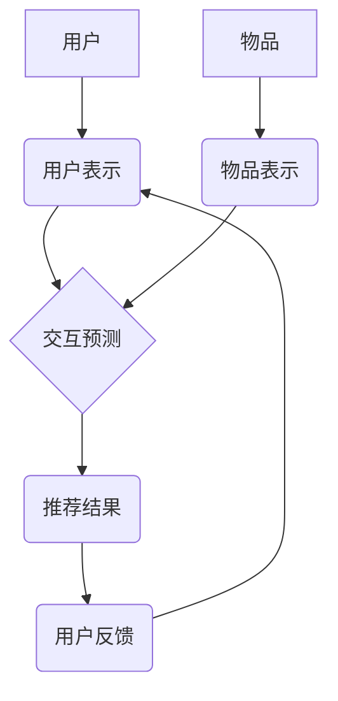

                 

## 利用大模型优化推荐系统的多样性与相关性平衡

> 关键词：大模型、推荐系统、多样性、相关性、平衡、个性化推荐、冷启动问题

## 1. 背景介绍

推荐系统作为信息过滤和个性化内容呈现的重要工具，在电商、社交媒体、视频平台等领域发挥着至关重要的作用。其核心目标是根据用户的历史行为、偏好和上下文信息，预测用户对特定物品的兴趣，并推荐最相关的、最吸引用户的物品。然而，传统的推荐系统往往面临着多样性与相关性的平衡问题。

**1.1. 相关性与多样性的冲突**

* **相关性** 指推荐结果与用户兴趣的匹配程度。高相关性的推荐能够满足用户的当前需求，提高用户满意度。
* **多样性** 指推荐结果的种类和范围。高多样性的推荐能够帮助用户发现新的内容，拓宽视野，避免推荐结果过于单一。

在实际应用中，追求高相关性的推荐往往会导致推荐结果过于单一，缺乏多样性。反之，追求高多样性的推荐可能会牺牲部分相关性，导致推荐结果与用户兴趣不符。

**1.2. 大模型的优势**

大模型，例如 GPT-3、BERT 等，凭借其强大的语义理解能力和泛化能力，为解决推荐系统多样性与相关性平衡问题提供了新的思路。大模型能够学习到用户兴趣的复杂模式，并生成更精准、更个性化的推荐结果。

## 2. 核心概念与联系

推荐系统的大模型优化主要围绕以下核心概念展开：

* **用户表示:** 利用大模型学习用户兴趣的深度表示，捕捉用户细粒度的偏好和需求。
* **物品表示:** 利用大模型学习物品的语义特征，刻画物品的属性、内容和用户感知。
* **交互预测:** 利用大模型预测用户对物品的交互行为，例如点击、收藏、购买等。
* **多样性增强:** 利用大模型生成多样化的推荐结果，避免推荐结果过于单一。

**2.1. 推荐系统架构**



## 3. 核心算法原理 & 具体操作步骤

**3.1. 算法原理概述**

大模型优化推荐系统主要采用以下几种算法：

* **Transformer网络:** Transformer网络能够捕捉序列数据中的长距离依赖关系，适用于学习用户和物品的复杂表示。
* **自注意力机制:** 自注意力机制能够学习用户和物品之间的关系，并赋予不同特征不同的权重，提高推荐结果的精准度。
* **多任务学习:** 多任务学习可以同时训练多个任务，例如相关性预测和多样性增强，从而提高模型的整体性能。

**3.2. 算法步骤详解**

1. **数据预处理:** 收集用户行为数据、物品信息数据等，并进行清洗、转换、编码等预处理操作。
2. **用户和物品表示学习:** 利用 Transformer网络和自注意力机制，学习用户和物品的深度表示。
3. **交互预测:** 利用训练好的模型预测用户对物品的交互行为。
4. **多样性增强:** 利用多样性增强算法，例如基于聚类的多样性增强、基于对抗学习的多样性增强等，生成多样化的推荐结果。
5. **推荐结果排序:** 根据预测结果和多样性指标，对推荐结果进行排序，生成最终的推荐列表。

**3.3. 算法优缺点**

* **优点:** 大模型能够学习到用户兴趣的复杂模式，提高推荐结果的精准度和多样性。
* **缺点:** 大模型训练成本高，需要大量的计算资源和数据。

**3.4. 算法应用领域**

大模型优化推荐系统适用于各种场景，例如：

* **电商推荐:** 推荐商品、优惠券、促销活动等。
* **社交媒体推荐:** 推荐好友、话题、文章等。
* **视频平台推荐:** 推荐视频、直播、用户等。

## 4. 数学模型和公式 & 详细讲解 & 举例说明

**4.1. 数学模型构建**

推荐系统的核心是预测用户对物品的交互行为。我们可以使用以下数学模型来表示用户对物品的评分：

$$
r_{ui} = f(u, i, \theta)
$$

其中：

* $r_{ui}$ 表示用户 $u$ 对物品 $i$ 的评分。
* $u$ 表示用户特征向量。
* $i$ 表示物品特征向量。
* $\theta$ 表示模型参数。
* $f$ 表示评分函数。

**4.2. 公式推导过程**

评分函数 $f$ 可以采用多种形式，例如线性回归、神经网络等。

**4.3. 案例分析与讲解**

假设我们使用神经网络作为评分函数，则模型结构如下：

```
用户特征向量 --> 全连接层 --> 激活函数 --> 全连接层 --> 激活函数 --> 输出层
```

其中，全连接层用于学习用户和物品之间的关系，激活函数用于引入非线性，输出层输出用户对物品的评分。

## 5. 项目实践：代码实例和详细解释说明

**5.1. 开发环境搭建**

* Python 3.7+
* TensorFlow/PyTorch
* CUDA

**5.2. 源代码详细实现**

```python
import tensorflow as tf

# 定义用户和物品特征向量
user_features = tf.keras.Input(shape=(10,))
item_features = tf.keras.Input(shape=(10,))

# 全连接层
dense_layer1 = tf.keras.layers.Dense(64, activation='relu')(user_features)
dense_layer2 = tf.keras.layers.Dense(64, activation='relu')(item_features)

# 融合用户和物品特征
merged_features = tf.keras.layers.concatenate([dense_layer1, dense_layer2])

# 输出层
output_layer = tf.keras.layers.Dense(1, activation='linear')(merged_features)

# 定义模型
model = tf.keras.Model(inputs=[user_features, item_features], outputs=output_layer)

# 编译模型
model.compile(optimizer='adam', loss='mse')

# 训练模型
model.fit(
    x=[user_data, item_data],
    y=ratings_data,
    epochs=10,
    batch_size=32
)
```

**5.3. 代码解读与分析**

* 代码定义了用户和物品特征向量，并使用全连接层和激活函数学习用户和物品之间的关系。
* 融合用户和物品特征后，使用输出层预测用户对物品的评分。
* 模型使用 Adam 优化器和均方误差损失函数进行训练。

**5.4. 运行结果展示**

训练完成后，可以使用模型预测用户对物品的评分，并生成推荐列表。

## 6. 实际应用场景

**6.1. 个性化推荐**

大模型可以学习到用户的个性化偏好，并推荐更符合用户兴趣的物品。例如，电商平台可以利用大模型推荐用户可能感兴趣的商品，提高用户购买意愿。

**6.2. 冷启动问题解决**

大模型可以利用其强大的语义理解能力，对新用户和新物品进行建模，缓解冷启动问题。例如，视频平台可以利用大模型推荐新用户可能感兴趣的视频，帮助新用户快速熟悉平台内容。

**6.3. 内容推荐多样化**

大模型可以生成多样化的推荐结果，避免推荐结果过于单一。例如，音乐平台可以利用大模型推荐不同风格的音乐，帮助用户发现新的音乐类型。

**6.4. 未来应用展望**

随着大模型技术的不断发展，其在推荐系统中的应用场景将更加广泛。例如，大模型可以用于个性化广告推荐、推荐系统解释性增强、跨模态推荐等领域。

## 7. 工具和资源推荐

**7.1. 学习资源推荐**

* **书籍:**
    * Deep Learning by Ian Goodfellow, Yoshua Bengio, and Aaron Courville
    * Natural Language Processing with Python by Steven Bird, Ewan Klein, and Edward Loper
* **在线课程:**
    * TensorFlow Tutorials: https://www.tensorflow.org/tutorials
    * PyTorch Tutorials: https://pytorch.org/tutorials/

**7.2. 开发工具推荐**

* **TensorFlow:** https://www.tensorflow.org/
* **PyTorch:** https://pytorch.org/
* **Hugging Face Transformers:** https://huggingface.co/transformers/

**7.3. 相关论文推荐**

* **BERT: Pre-training of Deep Bidirectional Transformers for Language Understanding**
* **GPT-3: Language Models are Few-Shot Learners**
* **Deep Learning for Recommender Systems**

## 8. 总结：未来发展趋势与挑战

**8.1. 研究成果总结**

大模型在推荐系统领域取得了显著的成果，能够有效提升推荐结果的精准度和多样性。

**8.2. 未来发展趋势**

* **模型规模和能力提升:** 未来大模型规模将进一步扩大，能力将更加强大，能够学习到更复杂的模式。
* **多模态推荐:** 大模型将融合文本、图像、音频等多模态数据，实现更丰富的推荐体验。
* **个性化推荐增强:** 大模型将更加深入地学习用户个性化偏好，提供更精准的个性化推荐。

**8.3. 面临的挑战**

* **训练成本高:** 大模型训练需要大量的计算资源和数据，成本较高。
* **数据隐私问题:** 大模型训练需要大量用户数据，如何保护用户隐私是一个重要挑战。
* **模型解释性:** 大模型的决策过程较为复杂，如何提高模型解释性是一个需要解决的问题。

**8.4. 研究展望**

未来研究将集中在以下几个方面:

* **降低大模型训练成本:** 研究更有效的训练方法和硬件架构，降低大模型训练成本。
* **保护用户隐私:** 研究隐私保护技术，保障用户数据安全。
* **提高模型解释性:** 研究可解释性人工智能技术，提高大模型的透明度和可信度。


## 9. 附录：常见问题与解答

**9.1. Q: 大模型训练需要多少数据？**

**A:** 大模型训练需要大量的训练数据，通常需要百万甚至数十亿条数据。

**9.2. Q: 大模型训练需要多少计算资源？**

**A:** 大模型训练需要大量的计算资源，通常需要使用高性能GPU集群。

**9.3. Q: 如何评估大模型的推荐效果？**

**A:** 可以使用各种指标来评估大模型的推荐效果，例如点击率、转化率、用户满意度等。


作者：禅与计算机程序设计艺术 / Zen and the Art of Computer Programming 
<end_of_turn>

