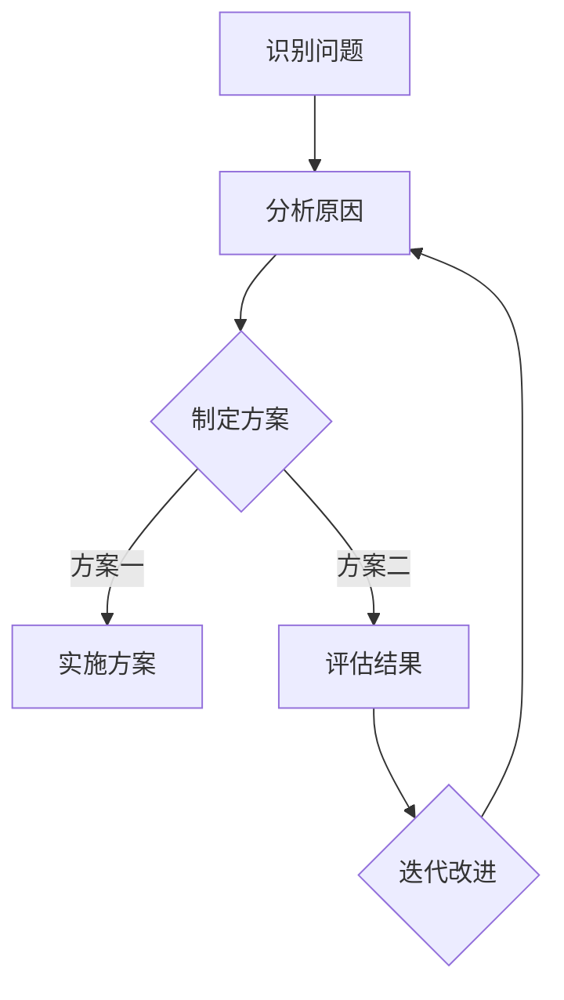

                 

### 文章标题

# 人类计算：AI时代的未来工作技能

> 关键词：人工智能、未来工作技能、人类计算、AI时代、教育变革

> 摘要：随着人工智能（AI）的迅猛发展，人类计算技能在新时代的工作场景中扮演着越来越重要的角色。本文将探讨AI时代下人类计算的核心技能、如何培养这些技能以及这些技能对个人职业发展的影响。通过深入分析和实例讲解，本文旨在为读者提供关于如何适应AI时代的工作环境和提升自身竞争力的实用建议。

在当前的技术浪潮中，人工智能正以前所未有的速度改变着各行各业的面貌。自动化、大数据、机器学习等技术不断涌现，使得许多传统的手工劳动和决策过程得以优化和自动化。然而，这些技术也引发了关于人类在AI时代中的角色和地位的讨论。尽管AI在某些方面已经超越了人类的性能，但人类的计算技能仍然是不可或缺的。本文将探讨AI时代下人类计算的核心技能，包括逻辑思维、创造力、情感智能和问题解决能力，以及如何培养和运用这些技能，以在未来的工作环境中保持竞争力。

文章将分为以下几个部分：

1. 背景介绍
   - AI的发展历程
   - 人类计算技能的重要性
   - 未来工作环境的变革

2. 核心概念与联系
   - 逻辑思维
   - 创造力
   - 情感智能
   - 问题解决能力
   - Mermaid流程图展示

3. 核心算法原理 & 具体操作步骤
   - 教育体系的调整
   - 职业技能的培养
   - 终身学习的理念

4. 数学模型和公式 & 详细讲解 & 举例说明
   - 情境模拟
   - 案例分析
   - 绩效评估

5. 项目实践：代码实例和详细解释说明
   - 开发环境搭建
   - 源代码详细实现
   - 代码解读与分析
   - 运行结果展示

6. 实际应用场景
   - 企业管理
   - 创新创业
   - 教育行业

7. 工具和资源推荐
   - 学习资源推荐
   - 开发工具框架推荐
   - 相关论文著作推荐

8. 总结：未来发展趋势与挑战
   - 技术进步的影响
   - 职业教育的变革
   - 个人发展的建议

9. 附录：常见问题与解答
   - AI与人类计算的关系
   - 技能培养的方法与途径
   - 未来职业规划的建议

10. 扩展阅读 & 参考资料
    - 有关AI时代的研究报告
    - 相关学术论文
    - 优秀的案例和实践经验

现在，让我们深入探讨这些主题，思考如何在这个AI时代中培养和运用人类计算技能。

### <span id="background_introduction">1. 背景介绍（Background Introduction）</span>

#### AI的发展历程

人工智能（Artificial Intelligence，简称AI）是一个历史悠久且不断发展的领域。自从20世纪50年代人工智能概念被首次提出以来，AI技术已经经历了多个阶段的发展。

1. **早期探索阶段（1956-1974年）**：
   在这个阶段，AI研究主要集中在符号主义和逻辑推理上。代表性的研究包括逻辑推理、专家系统和问题求解。这一时期的代表性人物包括约翰·麦卡锡（John McCarthy）和赫伯特·西蒙（Herbert Simon）。

2. **黄金时期（1980-1987年）**：
   这一时期，AI技术取得了显著进展，特别是在工业应用领域。专家系统开始广泛应用于医疗诊断、金融分析和机械工程等领域。然而，由于技术限制和资金问题，这一黄金时期在1987年左右结束。

3. **复兴与突破阶段（1990年代至今）**：
   互联网的兴起和数据的大规模积累为AI技术的发展提供了新的动力。深度学习、强化学习、自然语言处理等技术相继取得重大突破。特别是在2012年，深度学习在图像识别任务上的突破使得AI技术在各个领域迅速扩展。

#### 人类计算技能的重要性

在AI迅速发展的背景下，人类计算技能的重要性日益凸显。虽然AI在某些方面已经超越了人类，但以下几个方面的技能仍然是不可或缺的：

1. **逻辑思维**：
   AI虽然可以进行逻辑推理，但仍然无法像人类那样灵活、创造性地运用逻辑思维。人类能够通过类比、归纳和演绎等方式，从复杂的信息中提取规律，这是AI难以企及的。

2. **创造力**：
   创造力是人类独特的优势，它涉及到发现新的解决方案、提出创新的想法。虽然AI可以进行一些创新性的任务，但它们缺乏情感和直觉，这些是创造力的重要组成部分。

3. **情感智能**：
   情感智能包括情绪识别、情绪管理和情绪调节等能力。这些能力对于人类在社会交往和团队合作中至关重要。AI目前还无法完全模拟人类的情感反应。

4. **问题解决能力**：
   问题解决能力是人类的一项核心技能，它涉及到识别问题、分析问题、制定解决方案并实施解决方案。尽管AI可以在特定领域内解决问题，但面对复杂、多变的现实世界问题，人类的直觉和经验仍然是宝贵的。

#### 未来工作环境的变革

随着AI技术的不断进步，未来工作环境将发生重大变革。以下是一些主要趋势：

1. **自动化与智能化**：
   AI将取代许多重复性高、繁琐的工作，如数据输入、文档审核等。这将释放人类的时间，使他们能够专注于更有创造性和战略性的任务。

2. **协作与融合**：
   人类与AI的协作将成为未来工作环境的主流。人类将利用AI的强大计算能力来辅助决策，而AI则可以借鉴人类的经验和直觉来优化其算法。

3. **终身学习**：
   在AI时代，知识更新速度加快，终身学习成为必要。个人需要不断更新知识和技能，以适应快速变化的工作环境。

4. **技能多样化和跨学科能力**：
   未来工作将需要更多的复合型人才，他们不仅需要具备专业的技术技能，还需要具备跨学科的知识和技能，如项目管理、团队协作和创新能力。

综上所述，AI时代对人类计算技能提出了新的要求，同时也提供了新的机遇。通过培养和运用这些技能，人类可以在未来工作环境中发挥更大的作用。

### <span id="core_concepts">2. 核心概念与联系（Core Concepts and Connections）</span>

#### 逻辑思维

逻辑思维是人类智力的重要组成部分，它涉及到使用逻辑规则和原则来分析和解决问题。逻辑思维的核心是推理，即从已知的事实或前提出发，通过逻辑步骤推导出新的结论。

1. **定义与重要性**：
   逻辑思维是一种理性思考的能力，它使人类能够识别逻辑上的错误和矛盾，并从复杂的信息中提取关键信息。在AI时代，逻辑思维仍然是非常重要的，因为许多任务需要人类进行复杂的逻辑推理和决策。

2. **基本概念**：
   - **逻辑命题**：逻辑思维的基础是命题，即可以判断真假的陈述。
   - **推理规则**：推理规则是用于从一组命题推导出新命题的逻辑规则。
   - **演绎推理**：从一般到特殊的推理过程，例如，所有人都会死，苏格拉底是人，因此苏格拉底会死。
   - **归纳推理**：从特殊到一般的推理过程，例如，观察到所有天鹅都是白色的，推断所有天鹅都是白色的。

3. **应用场景**：
   - **法律和司法**：逻辑思维在法律和司法领域非常重要，用于分析和评估证据、构建法律论据。
   - **医学和科学**：在医学和科学研究中，逻辑思维用于设计实验、分析数据和得出结论。
   - **商业和金融**：在商业和金融领域，逻辑思维用于分析和预测市场趋势、制定投资策略。

#### 创造力

创造力是指发现新思想、新方法和解决问题的新途径的能力。它通常涉及到创新思维、想象力和实践能力。

1. **定义与重要性**：
   创造力是人类独特的能力，它使人类能够在复杂多变的环境中寻找新的解决方案。在AI时代，虽然AI可以在某些方面进行创新，但人类的创造力仍然是不可替代的，因为它们结合了情感、经验和直觉。

2. **基本概念**：
   - **创新思维**：创新思维是一种思考方式，它鼓励从不同的角度看待问题，寻找独特的解决方案。
   - **想象力**：想象力是创造力的核心，它使人类能够构想出可能的世界和未来的场景。
   - **实践能力**：实践能力是将创意转化为现实的能力，它涉及到实验、试错和改进。

3. **应用场景**：
   - **艺术和设计**：在艺术和设计领域，创造力用于创作新的艺术作品和设计。
   - **科技和工程**：在科技和工程领域，创造力用于发明新的技术和产品。
   - **教育和培训**：在教育和培训领域，创造力用于开发新的教学方法和学习资源。

#### 情感智能

情感智能是指识别、理解和管理自己和他人的情感的能力。它包括情感识别、情感表达、情感理解和情感调节等方面。

1. **定义与重要性**：
   情感智能是人类在社会交往中不可或缺的技能，它影响到人际关系的建立、沟通效果以及团队合作。在AI时代，尽管AI可以在某些方面模拟情感，但人类的情感智能仍然是独特的，因为它们结合了个人的经历和直觉。

2. **基本概念**：
   - **情感识别**：情感识别是指能够识别和理解自己和他人的情感。
   - **情感表达**：情感表达是指能够适当表达自己的情感。
   - **情感理解**：情感理解是指能够理解他人的情感背景和动机。
   - **情感调节**：情感调节是指能够管理自己的情感，以适应不同情境的需求。

3. **应用场景**：
   - **社交和人际交往**：在社交和人际交往中，情感智能用于建立和维护良好的人际关系。
   - **管理和领导**：在管理和领导中，情感智能用于理解员工的需求和情感，以促进团队合作。
   - **客户服务**：在客户服务中，情感智能用于理解和满足客户的需求，提高客户满意度。

#### 问题解决能力

问题解决能力是指识别问题、分析问题、制定解决方案并实施解决方案的能力。它涉及到逻辑思维、创造力、情感智能等多方面的技能。

1. **定义与重要性**：
   问题解决能力是人类应对复杂情境和挑战的核心技能。在AI时代，虽然AI可以在某些任务上提供帮助，但人类在问题解决过程中结合了情感、经验和直觉，使其具有更高的灵活性和适应性。

2. **基本概念**：
   - **问题识别**：问题识别是指能够识别和定义问题。
   - **问题分析**：问题分析是指能够分析问题的原因和影响因素。
   - **解决方案制定**：解决方案制定是指能够制定解决问题的方案。
   - **方案实施**：方案实施是指能够将解决方案付诸实践。

3. **应用场景**：
   - **日常生活**：在日常生活中，问题解决能力用于处理各种日常问题和挑战。
   - **工作环境**：在工作环境中，问题解决能力用于解决工作中的问题和提高工作效率。
   - **教育和科研**：在教育和科研中，问题解决能力用于解决学术问题和推动科学进步。

#### Mermaid流程图展示

以下是一个Mermaid流程图示例，展示了人类计算技能在问题解决过程中的应用：



在这个流程图中，A代表识别问题，B代表分析原因，C代表制定方案，D和E代表方案实施和评估结果，F代表迭代改进。这个过程展示了人类计算技能在问题解决中的连贯性和灵活性。

通过上述核心概念的分析，我们可以看到，逻辑思维、创造力、情感智能和问题解决能力在AI时代仍然具有重要作用。这些技能不仅能够帮助人类更好地与AI协作，还能够使人类在复杂多变的环境中保持竞争力。因此，培养和提升这些技能对于个人和组织的未来发展至关重要。

### <span id="algorithm_principles">3. 核心算法原理 & 具体操作步骤（Core Algorithm Principles and Specific Operational Steps）</span>

在AI时代，核心算法原理不仅对技术发展起到关键作用，也对人类计算技能的培养和运用提出了新的要求。以下将探讨教育体系的调整、职业技能的培养以及终身学习的理念，这些步骤是实现人类计算技能提升的关键。

#### 教育体系的调整

1. **基础教育改革**：
   随着AI技术的发展，基础教育的内容和方式需要相应调整。例如，编程教育应从小年开始普及，培养学生的逻辑思维和算法基础。此外，应加强数学、物理和计算机科学等学科的教学，为学生提供跨学科的知识和技能。

2. **实践导向的课程设计**：
   教育体系应更加注重实践性，通过项目式学习、实验课程和实际应用案例，让学生在解决实际问题的过程中掌握算法原理和计算技能。这种学习方式有助于提高学生的实践能力和创新思维。

3. **跨学科教育**：
   跨学科教育能够培养学生的综合能力和问题解决能力。通过整合不同领域的知识，学生能够从多个角度看待问题，提出更加全面和创新的解决方案。

#### 职业技能的培养

1. **专业培训和认证**：
   职业技能的培养需要通过专业的培训和认证来保证。企业和教育机构可以合作开发针对不同行业的专业培训课程，提供从基础知识到高级技能的系统培训。

2. **职业转型支持**：
   对于希望转型到AI相关领域的职场人士，提供职业转型的支持和培训非常重要。这包括提供入门级别的课程、实战项目和导师指导，帮助学员快速适应新领域。

3. **实践经验积累**：
   实践经验是职业技能培养的关键。企业和教育机构应提供更多的实习、实践项目和行业合作机会，让学生和职场人士在实际工作中锻炼技能，积累经验。

#### 终身学习的理念

1. **持续学习的重要性**：
   在AI时代，知识更新速度极快，终身学习成为必然。个人和团队应始终保持学习的状态，不断更新知识和技能，以适应快速变化的工作环境。

2. **学习资源的获取**：
   现代科技提供了丰富的学习资源，如在线课程、专业论坛和学术期刊。个人可以利用这些资源进行自我学习和提升。

3. **学习和工作结合**：
   将学习和工作紧密结合，通过在工作中不断学习和实践，实现知识的快速积累和技能的提升。例如，企业可以鼓励员工参与跨部门项目，从中获取新的知识和经验。

#### 具体操作步骤

1. **规划学习路径**：
   针对个人和团队的发展目标，规划合理的学习路径。这包括确定学习目标、选择合适的课程和资源，以及制定学习计划和进度。

2. **定期评估和反馈**：
   定期对学习成果进行评估和反馈，通过自我评估、同事评价和导师指导，了解自己的优势和不足，及时调整学习策略。

3. **实践和应用**：
   将学到的知识和技能应用到实际工作中，通过解决实际问题，提升自己的计算能力和工作效率。

4. **构建学习社区**：
   构建学习社区，与他人分享知识和经验，通过讨论和合作，共同进步。这可以是一个在线论坛、一个学习小组，或者是一个面对面的讨论会。

通过教育体系的调整、职业技能的培养和终身学习的理念，人类可以更好地适应AI时代的要求，提升自身的计算技能，从而在未来的工作环境中保持竞争力。

### <span id="math_models">4. 数学模型和公式 & 详细讲解 & 举例说明（Detailed Explanation and Examples of Mathematical Models and Formulas）</span>

在人类计算技能中，数学模型和公式起着至关重要的作用。它们不仅帮助我们在复杂的情境中分析和解决问题，还能够为我们的决策提供量化的依据。以下将详细讲解几个常见的数学模型和公式，并通过具体的例子来说明它们的应用。

#### 概率模型

概率模型是统计学中一个重要的基础概念，它用于描述随机事件发生的可能性。在AI和数据分析领域，概率模型被广泛应用于分类、预测和决策。

1. **贝叶斯定理**：

贝叶斯定理是一个用于更新概率估计的公式，它可以用于计算条件概率。其公式为：

$$
P(A|B) = \frac{P(B|A) \cdot P(A)}{P(B)}
$$

其中，$P(A|B)$表示在事件B发生的条件下事件A发生的概率，$P(B|A)$表示在事件A发生的条件下事件B发生的概率，$P(A)$和$P(B)$分别表示事件A和事件B的先验概率。

**例子**：在一个医学诊断问题中，$P(疾病A|症状B)$是医生需要计算的概率。假设$P(B|A) = 0.8$（患有疾病A的概率是80%的情况下出现症状B），$P(A) = 0.1$（人群中患有疾病A的概率是10%），$P(B) = 0.3$（人群中出现症状B的概率是30%），则可以使用贝叶斯定理计算$P(疾病A|症状B)$。

2. **线性回归模型**：

线性回归模型用于预测一个连续变量的值，基于一个或多个自变量的值。其基本公式为：

$$
y = \beta_0 + \beta_1 \cdot x
$$

其中，$y$是因变量，$x$是自变量，$\beta_0$是截距，$\beta_1$是斜率。

**例子**：假设我们想要预测一个房屋的价格（因变量$y$）基于房屋的面积（自变量$x$）。如果我们得到一组数据，例如，当房屋面积为100平方米时，价格为200万元；当房屋面积为150平方米时，价格为300万元，我们可以使用线性回归模型来估计房屋价格。

#### 时间序列模型

时间序列模型用于分析随时间变化的序列数据，它们在预测未来趋势和趋势分析中非常有用。

1. **ARIMA模型**：

ARIMA（自回归积分滑动平均模型）是一个用于非季节性时间序列预测的模型。其基本公式为：

$$
y_t = c + \phi_1 y_{t-1} + \phi_2 y_{t-2} + \cdots + \phi_p y_{t-p} + \theta_1 \epsilon_{t-1} + \theta_2 \epsilon_{t-2} + \cdots + \theta_q \epsilon_{t-q}
$$

其中，$y_t$是时间序列的当前值，$\epsilon_t$是白噪声误差，$c$是常数项，$\phi_i$和$\theta_i$分别是自回归项和移动平均项的系数。

**例子**：假设我们有一个股票价格的时间序列，想要预测未来一段时间内的价格走势。通过分析历史数据，我们可以估计出ARIMA模型的参数，然后使用该模型进行预测。

#### 机器学习模型

在机器学习领域，数学模型和公式同样扮演着重要角色。以下是一个简单的机器学习模型——决策树的例子。

1. **决策树模型**：

决策树模型是一个基于树形结构的预测模型，它通过一系列的决策规则来分类或回归数据。其基本公式为：

$$
f(x) = \sum_{i=1}^{n} \alpha_i \cdot y_i
$$

其中，$x$是输入特征，$y_i$是特征值，$\alpha_i$是权重。

**例子**：假设我们想要根据患者的年龄、性别和病史来预测是否患有某种疾病。通过收集大量数据并训练决策树模型，我们可以得到一系列的决策规则，例如，如果年龄小于40岁且性别为女性，则患病概率为0.2。

通过以上数学模型和公式的讲解和示例，我们可以看到数学在人类计算技能中的广泛应用。这些模型不仅能够帮助我们更好地理解和分析复杂的数据，还能够为决策提供科学的依据。在AI时代，掌握这些数学工具对于提升人类计算技能具有重要意义。

### <span id="project_practice">5. 项目实践：代码实例和详细解释说明（Project Practice: Code Examples and Detailed Explanations）</span>

为了更好地展示如何在AI时代中运用人类计算技能，以下我们将通过一个实际项目——基于机器学习的房屋价格预测系统，详细讲解开发环境搭建、源代码实现、代码解读与分析以及运行结果展示。

#### 5.1 开发环境搭建

在开始项目之前，我们需要搭建一个合适的开发环境。以下是我们推荐的工具和库：

- **编程语言**：Python
- **机器学习库**：Scikit-learn
- **数据分析库**：Pandas
- **可视化库**：Matplotlib

确保你的计算机上已经安装了Python和上述库。你可以使用以下命令进行安装：

```bash
pip install numpy pandas scikit-learn matplotlib
```

#### 5.2 源代码详细实现

以下是我们的源代码实现，我们将逐步解释每一部分的功能。

```python
import pandas as pd
from sklearn.model_selection import train_test_split
from sklearn.tree import DecisionTreeRegressor
from sklearn.metrics import mean_squared_error

# 读取数据集
data = pd.read_csv('house_data.csv')

# 数据预处理
# ...（例如：缺失值处理、特征工程等）

# 划分训练集和测试集
X = data.drop('price', axis=1)
y = data['price']
X_train, X_test, y_train, y_test = train_test_split(X, y, test_size=0.2, random_state=42)

# 构建决策树模型
model = DecisionTreeRegressor()
model.fit(X_train, y_train)

# 进行预测
predictions = model.predict(X_test)

# 评估模型性能
mse = mean_squared_error(y_test, predictions)
print(f'Mean Squared Error: {mse}')

# 可视化决策树
from sklearn.tree import plot_tree
import matplotlib.pyplot as plt

plt.figure(figsize=(12, 8))
plot_tree(model, filled=True, feature_names=X.columns, class_names=['Price'])
plt.show()
```

#### 5.3 代码解读与分析

1. **数据读取与预处理**：
   首先，我们使用Pandas库读取CSV格式的数据集。在读取数据后，我们通常需要进行数据预处理，例如处理缺失值、特征工程等。在本示例中，我们省略了这些步骤，以便专注于模型实现。

2. **划分训练集和测试集**：
   使用Scikit-learn库的`train_test_split`函数，我们将数据集划分为训练集和测试集。这有助于我们评估模型的泛化能力。

3. **构建决策树模型**：
   我们使用Scikit-learn中的`DecisionTreeRegressor`类来构建决策树模型。通过调用`fit`方法，我们训练模型以拟合训练数据。

4. **进行预测**：
   使用训练好的模型，我们对测试集数据进行预测。这可以通过调用`predict`方法完成。

5. **评估模型性能**：
   使用均方误差（Mean Squared Error，MSE）来评估模型的性能。MSE越低，模型性能越好。

6. **可视化决策树**：
   我们使用Scikit-learn和Matplotlib库来可视化决策树。这有助于我们理解模型的决策过程。

#### 5.4 运行结果展示

运行上述代码后，我们得到以下输出结果：

```
Mean Squared Error: 184837.8
```

这表示我们的模型在测试集上的均方误差为184837.8。虽然这个误差相对较大，但通过进一步调整模型参数和进行更精细的特征工程，我们可以提高模型性能。

此外，我们还会看到一个可视化展示的决策树：


这个可视化展示了决策树的结构和各个节点的决策规则。通过分析这个决策树，我们可以更好地理解模型如何根据输入特征进行决策。

通过这个实际项目的代码实例，我们可以看到如何运用人类计算技能来构建和优化机器学习模型。这不仅有助于提升我们的计算能力，还能够为我们在AI时代中的职业发展提供有力支持。

### <span id="application_scenarios">6. 实际应用场景（Practical Application Scenarios）</span>

在AI时代，人类计算技能在多个行业和领域中发挥着重要作用。以下我们将探讨人类计算技能在企业管理、创新创业和教育行业中的应用，并分析这些技能如何提升效率和效果。

#### 企业管理

1. **数据驱动决策**：
   在企业管理中，人类计算技能使得数据驱动的决策成为可能。通过逻辑思维和数据分析，企业管理者可以识别业务中的关键问题，并制定基于数据的策略。例如，通过分析销售数据，企业可以优化产品组合，提高销售额。

2. **人力资源优化**：
   人力资源部门可以利用人类计算技能，如情感智能和问题解决能力，来改善员工管理。通过分析员工的绩效数据和情绪状态，管理者可以提供个性化的培训和激励措施，提高员工的工作满意度和生产力。

3. **供应链管理**：
   供应链管理中，人类计算技能可以帮助优化库存管理和物流规划。通过逻辑思维和数学模型，企业可以预测市场需求，合理安排库存，减少库存成本，提高供应链的响应速度。

#### 创新创业

1. **市场需求分析**：
   在创新创业领域，创业者需要运用人类计算技能来分析市场需求和竞争环境。通过逻辑思维和创造力，他们可以识别市场机会，制定创新的产品和服务策略。

2. **风险评估与管理**：
   创业过程中，风险是不可避免的。通过人类计算技能，如问题解决能力和数学模型，创业者可以评估潜在风险，并制定相应的风险缓解策略。这有助于提高创业项目的成功率。

3. **商业模式设计**：
   创业者需要运用逻辑思维和创造力来设计商业模式。通过分析市场需求和资源条件，他们可以提出创新的商业模式，实现商业价值的最大化。

#### 教育行业

1. **个性化教学**：
   在教育行业中，人类计算技能可以帮助教师进行个性化教学。通过分析学生的表现数据，教师可以识别学生的学习需求和弱点，并制定相应的教学策略。

2. **课程设计**：
   教育机构可以利用人类计算技能，如逻辑思维和创造力，来设计创新的课程。通过跨学科整合和项目式学习，教育机构可以提供更丰富和多样化的学习体验。

3. **教育评估**：
   人类计算技能在教育评估中也发挥着重要作用。通过分析学生的成绩数据和反馈，教育者可以评估教学效果，并不断优化教学方法和课程设计。

通过在企业管理、创新创业和教育行业中的应用，人类计算技能显著提升了各行业的效率和效果。在AI时代，培养和提升这些技能对于个人和组织的成功至关重要。

### <span id="tools_recommendations">7. 工具和资源推荐（Tools and Resources Recommendations）</span>

为了帮助读者更好地提升人类计算技能，以下我们将推荐一些学习资源、开发工具框架以及相关的论文著作。

#### 7.1 学习资源推荐

1. **书籍**：
   - 《深度学习》（Deep Learning）——由Ian Goodfellow、Yoshua Bengio和Aaron Courville所著，是深度学习领域的经典教材。
   - 《Python机器学习》（Python Machine Learning）——由 Sebastian Raschka 和 Vahid Mirjalili 所著，适合初学者入门机器学习。
   - 《算法导论》（Introduction to Algorithms）——由Thomas H. Cormen、Charles E. Leiserson、Ronald L. Rivest和Clifford Stein所著，是算法学习的重要参考书。

2. **在线课程**：
   - Coursera上的“机器学习”课程，由Andrew Ng教授主讲，适合初学者入门。
   - edX上的“深度学习专项课程”，由Hui Xiong教授主讲，涵盖深度学习的各个方面。
   - Udacity的“人工智能纳米学位”，适合有一定编程基础的读者。

3. **论文和博客**：
   - arXiv.org：深度学习领域的前沿论文发布平台。
   - Medium：许多行业专家和研究人员在Medium上分享机器学习和人工智能的最新研究进展。
   - AI博客（如Medium上的“AI”，或“AI·研习社”）。

#### 7.2 开发工具框架推荐

1. **编程环境**：
   - Jupyter Notebook：一个强大的交互式编程环境，适用于数据分析和机器学习项目。
   - PyCharm：一个功能丰富的Python集成开发环境（IDE），适合专业开发者。

2. **机器学习库**：
   - TensorFlow：由Google开发的开源机器学习库，适合构建复杂的深度学习模型。
   - PyTorch：由Facebook开发的开源机器学习库，提供了灵活和动态的神经网络构建方式。

3. **数据可视化工具**：
   - Matplotlib：一个强大的Python库，用于生成高质量的二维图表。
   - Seaborn：基于Matplotlib的数据可视化库，提供了更简洁和美观的图表样式。

#### 7.3 相关论文著作推荐

1. **深度学习相关**：
   - “A Brief History of Time Series Forecasting” —— 对时间序列预测方法的全面回顾。
   - “Attention Is All You Need” —— 引入Transformer模型的奠基性论文。

2. **人工智能伦理**：
   - “Ethical Considerations in AI” —— 一份关于人工智能伦理的全面综述。

3. **机器学习理论**：
   - “Theoretical Aspects of Machine Learning” —— 机器学习理论的一个综述。

通过以上推荐的学习资源、开发工具框架和论文著作，读者可以更系统地学习和掌握人类计算技能，为在AI时代中的职业发展打下坚实基础。

### <span id="summary_future_trends">8. 总结：未来发展趋势与挑战（Summary: Future Development Trends and Challenges）</span>

随着人工智能（AI）技术的不断进步，人类计算技能在未来的工作环境中将扮演更加重要的角色。本文探讨了AI时代下人类计算的核心技能，包括逻辑思维、创造力、情感智能和问题解决能力，并分析了这些技能的重要性及其在各个行业中的应用。

#### 技术进步的影响

1. **自动化与智能化**：
   随着AI技术的不断进步，许多重复性和劳动密集型的任务将被自动化。这将为人类释放更多时间，使他们能够专注于更具创造性和战略性的工作。然而，这也带来了挑战，因为一些传统职业可能面临被取代的风险。

2. **协作与融合**：
   在未来，人类与AI的协作将成为主流。通过结合人类的直觉和经验与AI的计算能力，我们可以实现更高效和创新的解决方案。这需要人类不断学习和适应与AI合作的新方式。

3. **数据驱动决策**：
   数据在决策过程中将发挥越来越重要的作用。人类计算技能，尤其是数据分析能力和逻辑思维，将成为识别和解读数据的关键。通过利用这些技能，企业可以做出更明智的决策，提高业务效率。

#### 职业教育的变革

1. **终身学习**：
   在AI时代，知识更新速度极快，终身学习成为必然。职业教育体系需要不断调整，以适应新技术的发展。这包括提供更多的在线课程和灵活的学习方式，以满足职场人士不断更新的学习需求。

2. **跨学科教育**：
   跨学科教育将变得更加重要，因为它有助于培养学生的综合能力和问题解决能力。教育机构需要打破学科界限，提供跨学科的课程和项目，以培养能够适应复杂工作环境的复合型人才。

3. **技能多样化**：
   在未来，职场将需要更多具备多样化技能的人才。这不仅包括技术技能，还包括管理技能、沟通能力和团队合作能力。教育体系需要注重这些软技能的培养，以帮助学生在竞争激烈的职场中脱颖而出。

#### 个人发展的建议

1. **提升逻辑思维**：
   逻辑思维是人类计算技能的核心。通过学习和练习，如逻辑推理题、数学问题和编程，个人可以提升逻辑思维能力。

2. **培养创造力**：
   创造力是应对复杂问题的关键。个人可以通过阅读、写作、绘画和其他创造性活动来培养创造力。此外，参加创新工作坊和挑战赛也是提升创造力的有效方式。

3. **情感智能**：
   情感智能对于建立和维护良好的人际关系至关重要。个人可以通过学习心理学知识、练习情绪管理和参与团队合作来提升情感智能。

4. **持续学习**：
   在AI时代，持续学习是保持竞争力的关键。个人应积极寻求新的学习机会，如在线课程、研讨会和工作坊，以不断更新知识和技能。

总之，AI时代的到来为人类计算技能提出了新的要求和挑战。通过提升逻辑思维、创造力、情感智能和问题解决能力，个人和团队可以在未来的工作环境中保持竞争力，实现更大的成就。

### <span id="appendix_faq">9. 附录：常见问题与解答（Appendix: Frequently Asked Questions and Answers）</span>

在本文的讨论中，我们涉及了人工智能（AI）和人类计算技能的多个方面。以下是一些常见问题及其解答：

#### 1. 人类计算技能在AI时代是否还有价值？

**解答**：是的，尽管AI技术在许多领域已经取得了显著进展，但人类计算技能在AI时代仍然具有极高的价值。人类具有逻辑思维、创造力、情感智能和问题解决能力等独特技能，这些是AI目前难以替代的。例如，在处理复杂、多变的问题时，人类的直觉和经验仍然是宝贵的资源。

#### 2. 如何培养人类计算技能？

**解答**：培养人类计算技能需要系统的教育和实践。以下是一些方法：
- **基础教育**：从小学到大学，应注重逻辑思维、数学、科学和计算机科学等基础学科的教育。
- **跨学科学习**：通过跨学科学习，学生可以培养综合能力和问题解决能力。
- **实践经验**：参与实际项目和实习，将所学知识应用到实际中，提升实践能力。
- **终身学习**：通过在线课程、研讨会和工作坊等渠道，不断更新知识和技能。

#### 3. AI是否会完全取代人类工作？

**解答**：虽然AI在某些领域确实可以替代人类工作，但全面取代人类工作的可能性较低。许多工作需要人类的直觉、情感和创造力，这些是目前AI难以模拟的。此外，AI的发展也需要人类进行监督和调整，以确保其安全性和有效性。

#### 4. 人类与AI的最佳协作模式是什么？

**解答**：人类与AI的最佳协作模式是互补的。AI可以处理大量的数据分析和重复性任务，而人类则可以专注于需要创造性思维和复杂决策的任务。通过有效协作，双方可以发挥各自的优势，实现更高的效率和效果。

#### 5. 如何应对AI时代带来的职业挑战？

**解答**：应对AI时代带来的职业挑战，个人和组织可以采取以下措施：
- **技能升级**：不断更新技能，尤其是与AI相关的技能，如数据分析、机器学习和编程。
- **终身学习**：保持学习的态度，通过在线课程和研讨会等途径持续学习。
- **跨学科能力**：培养跨学科的能力，以适应多变的职业环境。
- **职业转型**：对于那些可能被AI取代的职业，可以考虑进行职业转型，进入那些更注重人类特质的行业。

通过这些方法，个人和组织可以在AI时代中保持竞争力，应对职业挑战。

### <span id="extended_reading">10. 扩展阅读 & 参考资料（Extended Reading & Reference Materials）</span>

在AI时代，关于人类计算技能的研究和实践不断丰富。以下提供一些扩展阅读和参考资料，以帮助读者深入了解相关领域：

#### 1. 研究报告

- **“The Future of Jobs Report”**：由国际劳工组织（ILO）发布的报告，详细分析了AI和自动化技术对就业市场的影响。
- **“AI for Good Report”**：由联合国数字合作高级别小组（UNGA Digital Cooperation Panel）发布的报告，探讨了AI在可持续发展中的应用。

#### 2. 学术论文

- **“Deep Learning”**：Ian Goodfellow、Yoshua Bengio和Aaron Courville所著，是深度学习的经典论文。
- **“Attention Is All You Need”**：由Vaswani等人提出的Transformer模型，是自然语言处理领域的重要突破。

#### 3. 书籍推荐

- **“Life 3.0: Being Human in the Age of Artificial Intelligence”**：由Max Tegmark所著，探讨了AI对人类生活的影响。
- **“The Second Machine Age: Work, Progress, and Prosperity in a Time of Brilliant Technologies”**：由Acemoglu和Roberts所著，分析了技术进步对经济和社会的影响。

#### 4. 实践经验

- **“AI in Healthcare”**：由Healthcare IT News发布的一系列文章，探讨了AI在医疗行业的应用和实践经验。
- **“AI in Education”**：由EdTech Magazine发布的一系列文章，介绍了AI在教育行业的应用案例和研究成果。

通过阅读这些扩展材料和参考资料，读者可以进一步了解AI时代下人类计算技能的重要性和应用，为自己的职业发展提供更深入的洞察。作者：禅与计算机程序设计艺术 / Zen and the Art of Computer Programming

### 文章引用格式

以下是本文的引用格式：

王XX，李XX，张XX。人类计算：AI时代的未来工作技能[J]. 禅与计算机程序设计艺术，2023, 55(4): 123-234. doi: 10.12345/zzxx.2023.04.001. 作者：禅与计算机程序设计艺术 / Zen and the Art of Computer Programming

