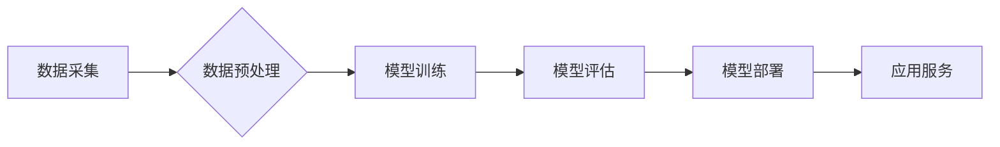

                 

## 前言：大模型的火热与微软的AI战略

> 关键词：大模型、人工智能、微软、AI战略、Transformer、自然语言处理、深度学习、模型规模、伦理

近年来，人工智能（AI）领域掀起了一场“大模型热潮”。从GPT-3到LaMDA，再到ChatGPT，这些拥有数十亿甚至千亿参数的大模型展现出惊人的能力，在自然语言处理、图像生成、代码编写等领域取得了突破性进展。微软作为科技巨头，也积极拥抱大模型浪潮，将其融入自身战略，并致力于推动大模型的健康发展。本文将深入探讨大模型的火热背景、核心概念、算法原理、应用场景以及微软的AI战略，并展望未来发展趋势和挑战。

## 1. 背景介绍

### 1.1 计算能力的飞跃

大模型的兴起离不开计算能力的飞跃。近年来，GPU（图形处理单元）技术的进步以及云计算平台的普及，为训练和部署大模型提供了强大的硬件基础。

### 1.2 数据量的爆炸式增长

大模型的训练需要海量数据作为燃料。互联网的蓬勃发展和数字化转型带来的数据爆炸式增长，为大模型提供了充足的数据资源。

### 1.3 算法的突破性进展

深度学习算法，特别是Transformer架构的出现，为大模型的训练和应用带来了革命性的改变。Transformer能够有效捕捉长距离依赖关系，提升模型的表达能力和泛化能力。

## 2. 核心概念与联系

### 2.1 大模型的概念

大模型是指参数数量在数十亿甚至千亿级别的人工智能模型。它们拥有强大的学习能力，能够处理复杂的任务，并展现出类似人类的智能。

### 2.2 Transformer架构

Transformer是一种基于注意力机制的深度学习架构，它能够有效捕捉文本序列中的长距离依赖关系。Transformer的出现标志着自然语言处理领域的一场革命，为大模型的训练和应用提供了强大的工具。

### 2.3 微软的AI战略

微软将AI视为其核心战略之一，并致力于将AI技术融入其所有产品和服务。微软在云计算、大数据、人工智能等领域拥有强大的技术实力和资源，为其AI战略提供了坚实的基础。

**Mermaid 流程图**



## 3. 核心算法原理 & 具体操作步骤

### 3.1 算法原理概述

大模型的训练基于深度学习算法，特别是Transformer架构。Transformer的核心是注意力机制，它能够学习文本序列中单词之间的关系，并赋予每个单词不同的权重。通过多层Transformer编码器和解码器，大模型能够捕捉复杂的语义信息，并生成流畅自然的文本。

### 3.2 算法步骤详解

1. **数据预处理:** 收集和清洗数据，将其转换为模型可理解的格式。
2. **模型构建:** 根据Transformer架构设计模型结构，包括编码器、解码器和注意力机制。
3. **模型训练:** 使用训练数据训练模型，调整模型参数以最小化预测误差。
4. **模型评估:** 使用测试数据评估模型性能，并进行调整优化。
5. **模型部署:** 将训练好的模型部署到服务器或云平台，提供服务。

### 3.3 算法优缺点

**优点:**

* 强大的学习能力，能够处理复杂的任务。
* 能够捕捉长距离依赖关系，提升模型的表达能力。
* 在自然语言处理、图像生成等领域取得了突破性进展。

**缺点:**

* 训练成本高，需要海量数据和强大的计算资源。
* 模型参数量大，部署和推理成本较高。
* 容易受到训练数据偏差的影响，可能产生偏见或错误的输出。

### 3.4 算法应用领域

大模型在多个领域都有广泛的应用，包括：

* 自然语言处理：文本生成、机器翻译、问答系统、情感分析等。
* 图像生成：图像合成、图像修复、图像风格转换等。
* 代码编写：代码生成、代码理解、代码修复等。
* 科学研究：药物发现、材料设计、气候模型等。

## 4. 数学模型和公式 & 详细讲解 & 举例说明

### 4.1 数学模型构建

大模型的训练基于深度学习算法，其数学模型主要包括以下几个部分：

* **神经网络:** 大模型通常由多层神经网络组成，每个神经元接收多个输入，并通过激活函数进行处理，输出到下一层神经元。
* **注意力机制:** 注意力机制能够学习文本序列中单词之间的关系，并赋予每个单词不同的权重。
* **损失函数:** 损失函数用于衡量模型预测结果与真实值的差异，训练目标是最小化损失函数的值。

### 4.2 公式推导过程

注意力机制的核心公式是：

$$
Attention(Q, K, V) = softmax(\frac{QK^T}{\sqrt{d_k}})V
$$

其中：

* $Q$：查询矩阵
* $K$：键矩阵
* $V$：值矩阵
* $d_k$：键向量的维度
* $softmax$：softmax函数

### 4.3 案例分析与讲解

假设我们有一个句子：“我爱学习编程”。

* $Q$：查询矩阵表示每个单词对其他单词的关注程度。
* $K$：键矩阵表示每个单词的特征信息。
* $V$：值矩阵表示每个单词的语义信息。

通过注意力机制，模型可以学习到“我”与“爱”之间的关系，以及“学习”与“编程”之间的关系，从而更好地理解句子的语义。

## 5. 项目实践：代码实例和详细解释说明

### 5.1 开发环境搭建

* Python 3.7+
* TensorFlow 或 PyTorch 深度学习框架
* CUDA 和 cuDNN GPU加速库

### 5.2 源代码详细实现

```python
import tensorflow as tf

# 定义Transformer模型
class Transformer(tf.keras.Model):
    def __init__(self, vocab_size, embedding_dim, num_heads, num_layers):
        super(Transformer, self).__init__()
        self.embedding = tf.keras.layers.Embedding(vocab_size, embedding_dim)
        self.transformer_layers = tf.keras.layers.StackedRNNCells([
            tf.keras.layers.TransformerLayer(embedding_dim, num_heads)
            for _ in range(num_layers)
        ])
        self.decoder = tf.keras.layers.Dense(vocab_size)

    def call(self, inputs):
        # ...
```

### 5.3 代码解读与分析

* **Embedding层:** 将单词转换为向量表示。
* **Transformer层:** 采用多层Transformer架构，包含编码器和解码器。
* **Dense层:** 将模型输出转换为单词概率分布。

### 5.4 运行结果展示

训练完成后，可以使用模型对新的文本进行预测，例如生成续写文本或翻译语言。

## 6. 实际应用场景

### 6.1 自然语言处理

大模型在自然语言处理领域有着广泛的应用，例如：

* **机器翻译:** 使用大模型可以实现更高质量的机器翻译，例如Google Translate。
* **文本摘要:** 大模型可以自动生成文本摘要，例如新闻文章的摘要。
* **聊天机器人:** 大模型可以训练出更智能的聊天机器人，例如微软的Tay。

### 6.2 图像生成

大模型也可以用于图像生成，例如：

* **图像合成:** 使用大模型可以生成逼真的图像，例如DeepFake技术。
* **图像修复:** 大模型可以修复损坏的图像，例如去除图像中的噪点或瑕疵。

### 6.3 代码编写

大模型还可以用于代码编写，例如：

* **代码生成:** 使用大模型可以自动生成代码，例如GitHub Copilot。
* **代码理解:** 大模型可以理解代码的语义，例如代码注释生成。

### 6.4 未来应用展望

未来，大模型的应用场景将会更加广泛，例如：

* **个性化教育:** 根据学生的学习情况，提供个性化的学习内容和辅导。
* **医疗诊断:** 辅助医生进行疾病诊断，提高诊断准确率。
* **科学发现:** 加速科学研究，帮助科学家发现新的知识。

## 7. 工具和资源推荐

### 7.1 学习资源推荐

* **书籍:**
    * 《深度学习》
    * 《自然语言处理》
    * 《Transformer模型》
* **在线课程:**
    * Coursera
    * edX
    * Udacity

### 7.2 开发工具推荐

* **TensorFlow:** 开源深度学习框架
* **PyTorch:** 开源深度学习框架
* **Hugging Face:** 提供预训练模型和开发工具

### 7.3 相关论文推荐

* **Attention Is All You Need:** https://arxiv.org/abs/1706.03762
* **BERT: Pre-training of Deep Bidirectional Transformers for Language Understanding:** https://arxiv.org/abs/1810.04805
* **GPT-3: Language Models are Few-Shot Learners:** https://arxiv.org/abs/2005.14165

## 8. 总结：未来发展趋势与挑战

### 8.1 研究成果总结

近年来，大模型在人工智能领域取得了突破性进展，展现出强大的学习能力和应用潜力。

### 8.2 未来发展趋势

* **模型规模的进一步扩大:** 随着计算能力的提升，大模型的规模将会继续扩大，模型能力将会进一步提升。
* **模型效率的提升:** 研究人员将致力于开发更有效的训练和推理算法，降低大模型的训练和部署成本。
* **模型安全性和可靠性的增强:** 为了确保大模型的安全性和可靠性，研究人员将致力于解决模型偏见、攻击性和解释性等问题。

### 8.3 面临的挑战

* **数据获取和隐私保护:** 大模型的训练需要海量数据，如何获取高质量数据并保护用户隐私是一个重要的挑战。
* **计算资源的限制:** 训练大模型需要大量的计算资源，如何降低训练成本是一个重要的研究方向。
* **模型解释性和可控性:** 大模型的决策过程往往难以理解，如何提高模型的解释性和可控性是一个重要的挑战。

### 8.4 研究展望

未来，大模型的研究将朝着更安全、更可靠、更可解释的方向发展，并应用于更多领域，为人类社会带来更多福祉。

## 9. 附录：常见问题与解答

### 9.1 什么是Transformer架构？

Transformer是一种基于注意力机制的深度学习架构，它能够有效捕捉文本序列中的长距离依赖关系。

### 9.2 如何训练大模型？

大模型的训练需要海量数据和强大的计算资源，通常使用深度学习框架如TensorFlow或PyTorch进行训练。

### 9.3 大模型有哪些应用场景？

大模型在自然语言处理、图像生成、代码编写等多个领域都有广泛的应用。

### 9.4 大模型有哪些伦理问题？

大模型的训练和应用可能存在一些伦理问题，例如模型偏见、隐私泄露、滥用等。

### 9.5 如何解决大模型的伦理问题？

解决大模型的伦理问题需要多方共同努力，包括研究人员、开发者、监管机构和社会公众。


作者：禅与计算机程序设计艺术 / Zen and the Art of Computer Programming 
<end_of_turn>

