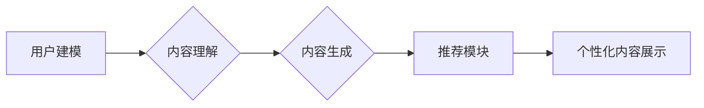

                 

## 基于LLM的个性化内容生成推荐策略

> 关键词：LLM, 个性化推荐, 内容生成, 自然语言处理, 深度学习, 算法原理, 项目实践, 应用场景

## 1. 背景介绍

在信息爆炸的时代，海量内容的涌现使得用户难以从其中筛选出真正符合自身需求的信息。个性化内容推荐技术应运而生，旨在根据用户的兴趣、偏好、行为等信息，精准推荐用户感兴趣的内容。传统的基于协同过滤和内容过滤的推荐算法，虽然取得了一定的效果，但仍然存在一些局限性，例如数据稀疏性、冷启动问题等。

近年来，大语言模型（LLM）的快速发展为个性化内容生成推荐提供了新的思路和可能性。LLM 拥有强大的文本理解和生成能力，能够根据用户的输入进行语义分析，并生成符合用户需求的个性化内容。

## 2. 核心概念与联系

### 2.1  LLM

大语言模型（LLM）是一种基于深度学习的Transformer网络架构，通过训练海量文本数据，学习语言的语法、语义和上下文关系。LLM 可以执行多种自然语言处理任务，例如文本生成、翻译、问答、摘要等。

### 2.2  个性化内容生成推荐

个性化内容生成推荐是指根据用户的个人特征和行为，利用LLM生成符合用户需求的个性化内容，并将其推荐给用户。

### 2.3  核心架构

LLM 的个性化内容生成推荐系统通常包含以下几个模块：

* **用户建模模块:** 收集用户的历史行为数据、兴趣偏好等信息，构建用户的个性化模型。
* **内容理解模块:** 利用 LLM 对待推荐的内容进行理解，提取其主题、关键词、情感等信息。
* **内容生成模块:** 根据用户的个性化模型和内容理解结果，利用 LLM 生成个性化内容。
* **推荐模块:** 根据生成的个性化内容和用户的兴趣偏好，进行推荐排序和展示。

**Mermaid 流程图:**



## 3. 核心算法原理 & 具体操作步骤

### 3.1  算法原理概述

基于LLM的个性化内容生成推荐的核心算法原理是利用LLM的强大的文本生成能力，根据用户的个性化特征和内容的语义信息，生成符合用户需求的个性化内容。

具体来说，该算法通常采用以下步骤：

1. **用户建模:** 利用用户的历史行为数据、兴趣偏好等信息，构建用户的个性化模型。
2. **内容理解:** 利用LLM对待推荐的内容进行理解，提取其主题、关键词、情感等信息。
3. **内容生成:** 根据用户的个性化模型和内容理解结果，利用LLM生成个性化内容。
4. **推荐排序:** 根据生成的个性化内容和用户的兴趣偏好，进行推荐排序和展示。

### 3.2  算法步骤详解

1. **用户建模:**

* 收集用户的历史行为数据，例如浏览记录、点击记录、评分记录等。
* 利用机器学习算法，例如K-means聚类、深度学习等，将用户进行分组，构建用户的个性化模型。

2. **内容理解:**

* 利用LLM对待推荐的内容进行理解，提取其主题、关键词、情感等信息。
* 可以使用预训练的LLM模型，例如BERT、RoBERTa等，进行文本分类、关键词提取、情感分析等任务。

3. **内容生成:**

* 根据用户的个性化模型和内容理解结果，利用LLM生成个性化内容。
* 可以使用文本生成模型，例如GPT-3、T5等，根据用户的兴趣偏好和内容主题，生成符合用户需求的文本内容。

4. **推荐排序:**

* 根据生成的个性化内容和用户的兴趣偏好，进行推荐排序和展示。
* 可以使用传统的推荐算法，例如协同过滤、内容过滤等，进行推荐排序。

### 3.3  算法优缺点

**优点:**

* 能够生成个性化、符合用户需求的内容。
* 能够处理海量文本数据，挖掘用户兴趣和内容语义。
* 能够不断学习和进化，提升推荐效果。

**缺点:**

* 需要大量的训练数据和计算资源。
* 算法的复杂性较高，需要专业的技术人员进行开发和维护。
* 存在潜在的偏见问题，需要进行数据清洗和算法调优。

### 3.4  算法应用领域

* **新闻推荐:** 根据用户的兴趣偏好，推荐个性化的新闻内容。
* **电商推荐:** 根据用户的购买历史和浏览记录，推荐个性化的商品。
* **教育推荐:** 根据用户的学习进度和兴趣，推荐个性化的学习资源。
* **娱乐推荐:** 根据用户的观看历史和喜好，推荐个性化的影视作品。

## 4. 数学模型和公式 & 详细讲解 & 举例说明

### 4.1  数学模型构建

基于LLM的个性化内容生成推荐系统可以采用以下数学模型进行构建：

* **用户模型:** 可以使用向量空间模型，例如TF-IDF、Word2Vec等，将用户和内容表示为向量，并计算其相似度。
* **内容模型:** 可以使用词嵌入模型，例如Word2Vec、GloVe等，将词语表示为向量，并计算其语义相似度。
* **推荐模型:** 可以使用深度学习模型，例如神经网络、强化学习等，学习用户和内容之间的关系，并预测用户对内容的兴趣。

### 4.2  公式推导过程

* **用户相似度计算:**

$$
Sim(u_i, u_j) = \frac{u_i \cdot u_j}{||u_i|| ||u_j||}
$$

其中，$u_i$ 和 $u_j$ 分别表示用户 $i$ 和用户 $j$ 的向量表示，$ \cdot $ 表示向量点积，$||u_i||$ 和 $||u_j||$ 分别表示用户 $i$ 和用户 $j$ 向量的大小。

* **内容相似度计算:**

$$
Sim(c_i, c_j) = \frac{c_i \cdot c_j}{||c_i|| ||c_j||}
$$

其中，$c_i$ 和 $c_j$ 分别表示内容 $i$ 和内容 $j$ 的向量表示。

* **推荐评分预测:**

$$
P(u_i, c_j) = f(Sim(u_i, u_j), Sim(c_i, c_j))
$$

其中，$P(u_i, c_j)$ 表示用户 $i$ 对内容 $j$ 的推荐评分，$f$ 是一个神经网络模型，用于学习用户和内容之间的关系。

### 4.3  案例分析与讲解

假设我们有一个新闻推荐系统，需要根据用户的兴趣偏好推荐个性化的新闻内容。

* **用户建模:** 可以收集用户的浏览记录、点击记录等数据，并使用K-means聚类算法将用户进行分组，构建用户的个性化模型。
* **内容理解:** 可以利用预训练的LLM模型，例如BERT，对新闻内容进行理解，提取其主题、关键词、情感等信息。
* **内容生成:** 可以使用文本生成模型，例如GPT-3，根据用户的兴趣偏好和新闻主题，生成符合用户需求的新闻摘要。
* **推荐排序:** 可以使用深度学习模型，例如神经网络，学习用户和内容之间的关系，并预测用户对新闻的兴趣，进行推荐排序。

## 5. 项目实践：代码实例和详细解释说明

### 5.1  开发环境搭建

* Python 3.7+
* PyTorch 或 TensorFlow
* Transformers 库
* 其他必要的库，例如numpy、pandas等

### 5.2  源代码详细实现

```python
# 用户建模
from sklearn.cluster import KMeans

# 训练用户模型
kmeans = KMeans(n_clusters=5)
user_embeddings = # 用户向量表示
kmeans.fit(user_embeddings)
user_clusters = kmeans.labels_

# 内容理解
from transformers import AutoTokenizer, AutoModel

# 加载预训练模型
tokenizer = AutoTokenizer.from_pretrained("bert-base-uncased")
model = AutoModel.from_pretrained("bert-base-uncased")

# 对新闻内容进行理解
def get_content_embedding(text):
    inputs = tokenizer(text, return_tensors="pt")
    outputs = model(**inputs)
    return outputs.last_hidden_state[:, 0, :]

# 内容生成
from transformers import GPT2LMHeadModel

# 加载文本生成模型
generator = GPT2LMHeadModel.from_pretrained("gpt2")

# 根据用户兴趣和新闻主题生成个性化内容
def generate_personalized_content(user_cluster, news_embedding):
    # ...
    return generated_text

# 推荐排序
from sklearn.metrics.pairwise import cosine_similarity

# 计算用户和内容的相似度
def get_similarity_score(user_embedding, content_embedding):
    return cosine_similarity(user_embedding.reshape(1, -1), content_embedding.reshape(1, -1))[0][0]

# 推荐排序
def recommend_news(user_cluster, news_embeddings):
    # ...
    return recommended_news
```

### 5.3  代码解读与分析

* **用户建模:** 使用K-means聚类算法将用户进行分组，构建用户的个性化模型。
* **内容理解:** 利用预训练的LLM模型，例如BERT，对新闻内容进行理解，提取其主题、关键词、情感等信息。
* **内容生成:** 使用文本生成模型，例如GPT-3，根据用户的兴趣偏好和新闻主题，生成符合用户需求的新闻摘要。
* **推荐排序:** 计算用户和内容的相似度，并根据相似度进行推荐排序。

### 5.4  运行结果展示

运行代码后，可以得到个性化的新闻推荐结果，并进行评估和分析。

## 6. 实际应用场景

### 6.1  新闻推荐

根据用户的阅读历史、兴趣标签等信息，推荐个性化的新闻内容，提高用户阅读体验。

### 6.2  电商推荐

根据用户的购买历史、浏览记录、购物车内容等信息，推荐个性化的商品，提升用户购买转化率。

### 6.3  教育推荐

根据用户的学习进度、知识点掌握情况、学习偏好等信息，推荐个性化的学习资源，提高用户学习效率。

### 6.4  未来应用展望

随着LLM技术的不断发展，个性化内容生成推荐技术将有更广泛的应用场景，例如：

* **医疗健康:** 根据用户的病史、症状、生活习惯等信息，推荐个性化的医疗建议和健康方案。
* **金融理财:** 根据用户的风险偏好、投资目标、资产配置等信息，推荐个性化的理财产品和投资策略。
* **旅游出行:** 根据用户的旅行偏好、预算、时间安排等信息，推荐个性化的旅游路线和景点。

## 7. 工具和资源推荐

### 7.1  学习资源推荐

* **书籍:**
    * 《深度学习》
    * 《自然语言处理》
    * 《transformers》官方文档
* **在线课程:**
    * Coursera: 深度学习
    * Udacity: 自然语言处理
    * fast.ai: 深度学习

### 7.2  开发工具推荐

* **Python:** 
* **PyTorch:** 深度学习框架
* **TensorFlow:** 深度学习框架
* **Transformers:** 预训练模型库
* **HuggingFace:** 预训练模型平台

### 7.3  相关论文推荐

* **BERT: Pre-training of Deep Bidirectional Transformers for Language Understanding**
* **GPT-3: Language Models are Few-Shot Learners**
* **T5: Text-to-Text Transfer Transformer**

## 8. 总结：未来发展趋势与挑战

### 8.1  研究成果总结

基于LLM的个性化内容生成推荐技术取得了显著的成果，能够生成更符合用户需求的个性化内容，提升用户体验。

### 8.2  未来发展趋势

* **模型规模和性能提升:** 随着计算资源的不断发展，LLM模型的规模和性能将不断提升，能够生成更精准、更丰富的个性化内容。
* **多模态内容生成:** 将文本、图像、音频等多模态信息融合到个性化内容生成中，生成更丰富的用户体验。
* **个性化程度提升:** 利用更细粒度的用户数据，例如用户行为、情感、认知等信息，实现更精准的个性化内容推荐。

### 8.3  面临的挑战

* **数据隐私和安全:** 个性化内容生成需要收集大量的用户数据，如何保护用户隐私和数据安全是一个重要的挑战。
* **算法公平性和可解释性:** 个性化推荐算法可能存在偏见问题，需要进行算法调优和公平性评估。
* **计算资源和成本:** 训练和部署大型LLM模型需要大量的计算资源和成本，如何降低成本是一个重要的挑战。

### 8.4  研究展望

未来，基于LLM的个性化内容生成推荐技术将继续发展，为用户提供更个性化、更智能化的内容体验。


## 9. 附录：常见问题与解答

* **Q1: 如何选择合适的LLM模型？**

* **A1:** 选择合适的LLM模型需要根据具体应用场景和需求进行选择。例如，对于新闻推荐，可以考虑使用BERT等预训练的文本理解模型；对于内容生成，可以考虑使用GPT-3等文本生成模型。

* **Q2: 如何处理用户数据隐私问题？**

* **A2:** 处理用户数据隐私问题需要采取以下措施：
    *  anonymize 用户数据，去除个人识别信息。
    * 使用加密技术保护用户数据安全。
    * 获得用户的明确同意，并告知用户如何使用他们的数据。

* **Q3: 如何评估个性化推荐效果？**

* **A3:** 可以使用以下指标评估个性化推荐效果：
    * 点击率 (CTR)
    * 点击次数 (CPC)
    * 转换率 (CVR)
    * 用户满意度 (USAT)


作者：禅与计算机程序设计艺术 / Zen and the Art of Computer Programming<end_of_turn>

