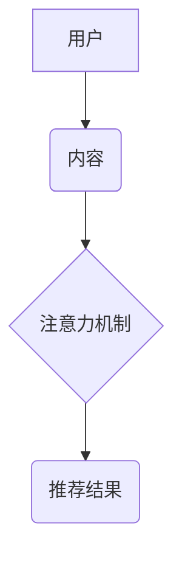

                 

## 基于图注意力网络的社交推荐精确性提升

> 关键词：社交推荐、图注意力网络、用户画像、关系挖掘、精准推荐

## 1. 背景介绍

社交媒体平台的蓬勃发展为用户提供了丰富的社交互动和信息获取渠道。然而，海量信息和用户之间的复杂关系也带来了信息过载和推荐精准度下降的问题。精准的社交推荐能够帮助用户发现感兴趣的内容和潜在的朋友，提升用户体验和平台活跃度。传统的基于协同过滤和内容过滤的推荐算法存在着数据稀疏性、冷启动问题和推荐结果单一性等局限性。

近年来，图神经网络（Graph Neural Networks，GNN）因其能够有效学习用户和内容之间的复杂关系而受到广泛关注。图注意力网络（Graph Attention Network，GAT）作为一种新型的GNN，通过学习用户之间的注意力权重，能够更精准地捕捉用户之间的关系和影响，从而提升推荐的准确性。

## 2. 核心概念与联系

### 2.1  社交推荐系统

社交推荐系统旨在根据用户的社交关系和行为模式，推荐他们可能感兴趣的用户、内容或活动。

### 2.2  图神经网络

图神经网络（GNN）是一种专门用于处理图结构数据的机器学习模型。它通过在图结构中传播信息，学习节点之间的关系和特征，从而实现对图数据的分析和预测。

### 2.3  图注意力网络

图注意力网络（GAT）是一种基于图神经网络的模型，它通过学习节点之间的注意力权重，对图结构中的信息进行加权聚合，从而更精准地捕捉节点之间的关系和影响。

**图注意力网络架构**



## 3. 核心算法原理 & 具体操作步骤

### 3.1  算法原理概述

图注意力网络的核心思想是通过学习用户之间的注意力权重，对用户之间的关系进行加权聚合，从而构建用户之间的关系图，并利用该关系图进行推荐。

### 3.2  算法步骤详解

1. **构建用户-内容图:** 将用户和内容作为图的节点，用户之间的社交关系和用户对内容的交互行为作为图的边。

2. **嵌入用户和内容:** 将用户和内容映射到低维向量空间，以便于模型学习。

3. **计算注意力权重:** 利用注意力机制计算用户之间的注意力权重，权重表示用户之间关系的重要性。

4. **聚合邻居信息:** 根据注意力权重，对每个用户的邻居信息进行加权聚合，得到每个用户的表示向量。

5. **预测推荐结果:** 利用聚合后的用户表示向量，预测用户可能感兴趣的内容。

### 3.3  算法优缺点

**优点:**

* 能够有效学习用户之间的复杂关系。
* 能够捕捉用户之间的影响和推荐偏好。
* 提升推荐的准确性和个性化程度。

**缺点:**

* 计算复杂度较高，训练时间较长。
* 需要大量的用户数据和交互行为数据进行训练。
* 对图结构的构建和特征提取有一定的依赖性。

### 3.4  算法应用领域

* 社交媒体推荐
* 电子商务推荐
* 内容推荐
* 人才招聘

## 4. 数学模型和公式 & 详细讲解 & 举例说明

### 4.1  数学模型构建

图注意力网络的数学模型可以表示为：

$$
\mathbf{h}_i^{(l+1)} = \sigma \left( \sum_{j \in \mathcal{N}(i)} \alpha_{ij}^{(l)} \mathbf{W}^{(l)} \mathbf{h}_j^{(l)} + \mathbf{b}^{(l)} \right)
$$

其中：

* $\mathbf{h}_i^{(l)}$ 表示第 $l$ 层第 $i$ 个节点的隐藏状态向量。
* $\mathcal{N}(i)$ 表示第 $i$ 个节点的邻居节点集合。
* $\alpha_{ij}^{(l)}$ 表示第 $l$ 层第 $i$ 个节点对第 $j$ 个节点的注意力权重。
* $\mathbf{W}^{(l)}$ 表示第 $l$ 层的权重矩阵。
* $\mathbf{b}^{(l)}$ 表示第 $l$ 层的偏置向量。
* $\sigma$ 表示激活函数。

### 4.2  公式推导过程

注意力权重 $\alpha_{ij}^{(l)}$ 通常使用以下公式计算：

$$
\alpha_{ij}^{(l)} = \frac{\exp \left( \mathbf{a}^{T} \left[ \mathbf{W}^{(l)} \mathbf{h}_i^{(l)} \Vert \mathbf{W}^{(l)} \mathbf{h}_j^{(l)} \right] \right)}{\sum_{k \in \mathcal{N}(i)} \exp \left( \mathbf{a}^{T} \left[ \mathbf{W}^{(l)} \mathbf{h}_i^{(l)} \Vert \mathbf{W}^{(l)} \mathbf{h}_k^{(l)} \right] \right)}
$$

其中：

* $\mathbf{a}$ 表示注意力参数向量。
* $\Vert$ 表示向量拼接操作。

### 4.3  案例分析与讲解

假设我们有一个社交网络图，其中用户 A 和用户 B 是邻居节点。

* 用户 A 的隐藏状态向量为 $\mathbf{h}_A^{(l)}$.
* 用户 B 的隐藏状态向量为 $\mathbf{h}_B^{(l)}$.

根据注意力权重公式，我们可以计算出用户 A 对用户 B 的注意力权重 $\alpha_{AB}^{(l)}$.

如果 $\alpha_{AB}^{(l)}$ 大于其他邻居节点的注意力权重，则表示用户 A 对用户 B 的关系更加重要，用户 B 的信息将对用户 A 的隐藏状态向量 $\mathbf{h}_A^{(l+1)}$ 产生更大的影响。

## 5. 项目实践：代码实例和详细解释说明

### 5.1  开发环境搭建

* Python 3.6+
* PyTorch 1.0+
* TensorFlow 2.0+
* 其他必要的库，例如 numpy, pandas, matplotlib 等。

### 5.2  源代码详细实现

```python
import torch
import torch.nn as nn

class GraphAttentionLayer(nn.Module):
    def __init__(self, in_features, out_features, dropout, alpha, concat=True):
        super(GraphAttentionLayer, self).__init__()
        self.in_features = in_features
        self.out_features = out_features
        self.dropout = dropout
        self.alpha = alpha
        self.concat = concat

        self.W = nn.Linear(in_features, out_features, bias=False)
        self.a = nn.Parameter(torch.zeros(1, out_features))
        self.leaky_relu = nn.LeakyReLU(self.alpha)

    def forward(self, h, adj):
        h = self.W(h)
        a_h = torch.matmul(h, self.a)
        a_h = a_h.unsqueeze(1)
        a_h = a_h + adj
        a_h = self.leaky_relu(a_h)
        a_h = torch.softmax(a_h, dim=1)
        a_h = a_h * self.dropout
        h_prime = torch.matmul(a_h, h)
        if self.concat:
            return torch.cat([h, h_prime], dim=1)
        else:
            return h_prime

# ... 其他代码实现 ...
```

### 5.3  代码解读与分析

* `GraphAttentionLayer` 类定义了图注意力网络的单个层。
* `__init__` 方法初始化模型参数，包括输入特征维度、输出特征维度、dropout 率、注意力系数 alpha 和是否拼接输入和输出特征。
* `forward` 方法实现图注意力网络的正向传播过程，包括计算注意力权重、加权聚合邻居信息和更新隐藏状态向量。

### 5.4  运行结果展示

* 通过训练模型并测试其推荐效果，可以评估图注意力网络的性能。
* 可以使用指标，例如准确率、召回率、平均精度等，来衡量推荐效果。

## 6. 实际应用场景

### 6.1  社交媒体推荐

* 推荐朋友、群组和活动
* 推荐个性化内容和广告

### 6.2  电子商务推荐

* 推荐商品、店铺和优惠券
* 个性化商品组合推荐

### 6.3  内容推荐

* 推荐新闻、视频、音乐和书籍
* 个性化内容订阅和发现

### 6.4  未来应用展望

* 结合其他机器学习模型，例如深度学习和强化学习，提升推荐效果。
* 利用多模态数据，例如文本、图像和视频，构建更丰富的用户画像。
* 研究更有效的图结构构建方法和注意力机制，提升模型的鲁棒性和泛化能力。

## 7. 工具和资源推荐

### 7.1  学习资源推荐

* **书籍:**
    * 《图神经网络》
    * 《深度学习》
* **在线课程:**
    * Coursera: 深度学习
    * Udacity: 构建推荐系统
* **博客和网站:**
    * Graph Neural Networks: https://www.graphneuralnetworks.com/
    * Towards Data Science: https://towardsdatascience.com/

### 7.2  开发工具推荐

* **Python:** https://www.python.org/
* **PyTorch:** https://pytorch.org/
* **TensorFlow:** https://www.tensorflow.org/

### 7.3  相关论文推荐

* 《Graph Attention Networks》
* 《Deep Graph Infomax》
* 《Node Embeddings by Learning Graph Representations》

## 8. 总结：未来发展趋势与挑战

### 8.1  研究成果总结

基于图注意力网络的社交推荐算法取得了显著的成果，能够有效提升推荐的准确性和个性化程度。

### 8.2  未来发展趋势

* 结合其他机器学习模型，例如深度学习和强化学习，构建更强大的推荐系统。
* 利用多模态数据，构建更丰富的用户画像，提升推荐的精准度和多样性。
* 研究更有效的图结构构建方法和注意力机制，提升模型的鲁棒性和泛化能力。

### 8.3  面临的挑战

* 数据稀疏性和冷启动问题仍然是挑战。
* 模型训练复杂度较高，需要大量的计算资源。
* 如何平衡推荐精准度和用户多样性是一个需要进一步研究的问题。

### 8.4  研究展望

未来，基于图注意力网络的社交推荐算法将朝着更智能、更个性化、更精准的方向发展。


## 9. 附录：常见问题与解答

* **Q1: 图注意力网络与传统的协同过滤和内容过滤算法相比有哪些优势？**

* **A1:** 图注意力网络能够有效学习用户之间的复杂关系，捕捉用户之间的影响和推荐偏好，从而提升推荐的准确性和个性化程度。传统的协同过滤和内容过滤算法存在着数据稀疏性、冷启动问题和推荐结果单一性等局限性。

* **Q2: 如何构建社交网络图？**

* **A2:** 社交网络图可以根据用户之间的社交关系和交互行为构建。例如，用户之间的好友关系、点赞、评论和分享行为都可以作为图的边。

* **Q3: 图注意力网络的训练过程复杂吗？**

* **A3:** 图注意力网络的训练过程相对复杂，需要大量的计算资源和训练数据。

* **Q4: 图注意力网络的应用场景有哪些？**

* **A4:** 图注意力网络的应用场景广泛，包括社交媒体推荐、电子商务推荐、内容推荐、人才招聘等。


作者：禅与计算机程序设计艺术 / Zen and the Art of Computer Programming 
<end_of_turn>

