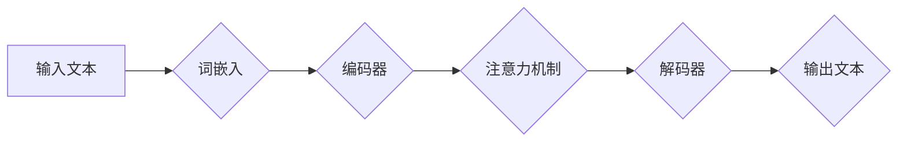

                 

## 多语言翻译：AI的语言桥梁

> 关键词：自然语言处理，机器翻译，深度学习，Transformer，BERT，语言模型，跨语言理解

### 1. 背景介绍

语言是人类交流和表达思想的工具，也是文化传承和社会发展的基石。然而，不同语言之间的差异阻碍了人们之间的沟通和理解。随着全球化进程的加速，跨语言交流的需求日益迫切。传统的人工翻译方法效率低下，成本高昂，难以满足快速发展的时代需求。

近年来，人工智能技术取得了飞速发展，特别是深度学习技术的突破，为多语言翻译带来了新的机遇。机器翻译（Machine Translation，MT）作为自然语言处理（Natural Language Processing，NLP）的重要分支，利用计算机算法将一种语言的文本翻译成另一种语言的文本。

### 2. 核心概念与联系

**2.1 核心概念**

* **自然语言处理（NLP）：** 致力于使计算机能够理解、处理和生成人类语言的学科。
* **机器翻译（MT）：** 利用计算机算法将一种语言的文本翻译成另一种语言的文本。
* **深度学习（Deep Learning）：** 一种机器学习的子领域，利用多层神经网络模拟人类大脑的学习过程。
* **Transformer：** 一种新型的深度学习架构，能够有效处理序列数据，在机器翻译领域取得了突破性进展。
* **BERT：** 基于Transformer的预训练语言模型，在理解和生成文本方面表现出色，为机器翻译提供了强大的基础。

**2.2 架构流程图**



**2.3 核心联系**

机器翻译的核心是将一种语言的文本转换为另一种语言的文本，这需要理解语言的语法、语义和上下文。深度学习技术，特别是Transformer架构，为机器翻译提供了强大的工具。BERT等预训练语言模型能够学习到丰富的语言知识，为机器翻译提供了更准确和流畅的翻译结果。

### 3. 核心算法原理 & 具体操作步骤

**3.1 算法原理概述**

机器翻译算法通常分为以下几个步骤：

1. **词嵌入：** 将单词映射到低维向量空间，捕捉单词之间的语义关系。
2. **编码器：** 将输入文本序列编码成一个固定长度的向量表示，捕捉文本的语义和上下文信息。
3. **注意力机制：** 允许模型关注输入文本中与当前翻译词语相关的部分，提高翻译的准确性和流畅度。
4. **解码器：** 根据编码后的文本向量生成目标语言的文本序列。

**3.2 算法步骤详解**

1. **词嵌入：** 使用词嵌入模型（如Word2Vec或GloVe）将每个单词映射到一个低维向量空间。
2. **编码器：** 使用Transformer架构的编码器层将输入文本序列编码成一个固定长度的向量表示。编码器层包含多个自注意力层和前馈神经网络层，能够捕捉文本的语义和上下文信息。
3. **注意力机制：** 在解码器中使用注意力机制，允许模型关注输入文本中与当前翻译词语相关的部分。注意力机制可以学习到哪些部分对当前翻译词语的影响最大，从而提高翻译的准确性和流畅度。
4. **解码器：** 使用Transformer架构的解码器层根据编码后的文本向量生成目标语言的文本序列。解码器层也包含多个自注意力层和前馈神经网络层，能够生成流畅自然的文本。

**3.3 算法优缺点**

* **优点：**
    * 准确率高：Transformer架构和注意力机制能够有效捕捉语言的语义和上下文信息，提高翻译的准确率。
    * 流畅度高：解码器中的注意力机制能够生成更流畅自然的文本。
    * 可扩展性强：Transformer架构可以轻松扩展到处理更长的文本序列。
* **缺点：**
    * 计算量大：Transformer架构的训练和推理过程需要大量的计算资源。
    * 数据依赖性强：Transformer模型需要大量的训练数据才能达到较高的准确率。

**3.4 算法应用领域**

* **机器翻译：** 将一种语言的文本翻译成另一种语言的文本。
* **跨语言搜索：** 在不同语言的搜索引擎中进行搜索。
* **跨语言对话：** 在不同语言之间进行对话。
* **文本摘要：** 将长文本摘要成短文本。
* **文本分类：** 将文本分类到不同的类别。

### 4. 数学模型和公式 & 详细讲解 & 举例说明

**4.1 数学模型构建**

机器翻译模型通常是一个神经网络模型，其输入是源语言的文本序列，输出是目标语言的文本序列。模型的训练目标是最小化源语言文本和目标语言文本之间的差异。

**4.2 公式推导过程**

常用的损失函数是交叉熵损失函数，其公式如下：

$$
L = -\sum_{i=1}^{N} y_i \log \hat{y}_i
$$

其中：

* $N$ 是目标语言文本的长度。
* $y_i$ 是目标语言文本的第 $i$ 个词的真实标签。
* $\hat{y}_i$ 是模型预测的目标语言文本的第 $i$ 个词的概率。

**4.3 案例分析与讲解**

假设我们有一个简单的机器翻译模型，输入是“你好”，输出是“hello”。

* $y_1 = 1$，表示目标语言文本的第一个词是“hello”。
* $\hat{y}_1 = 0.9$，表示模型预测的目标语言文本的第一个词是“hello”的概率为0.9。

则交叉熵损失函数的值为：

$$
L = -1 \log 0.9 = -0.105
$$

**4.4 举例说明**

Transformer架构中的自注意力机制使用以下公式计算每个词语与其他词语之间的注意力权重：

$$
Attention(Q, K, V) = softmax(\frac{QK^T}{\sqrt{d_k}})V
$$

其中：

* $Q$ 是查询矩阵。
* $K$ 是键矩阵。
* $V$ 是值矩阵。
* $d_k$ 是键向量的维度。

注意力权重表示每个词语对其他词语的影响程度。

### 5. 项目实践：代码实例和详细解释说明

**5.1 开发环境搭建**

* Python 3.6+
* TensorFlow 或 PyTorch
* CUDA 和 cuDNN（可选，用于GPU加速）

**5.2 源代码详细实现**

```python
import tensorflow as tf

# 定义编码器层
class Encoder(tf.keras.layers.Layer):
    def __init__(self, embedding_dim, num_heads, ff_dim):
        super(Encoder, self).__init__()
        self.embedding = tf.keras.layers.Embedding(vocab_size, embedding_dim)
        self.multi_head_attention = tf.keras.layers.MultiHeadAttention(num_heads=num_heads, key_dim=embedding_dim)
        self.ffn = tf.keras.layers.Dense(ff_dim, activation='relu')

    def call(self, inputs):
        # 词嵌入
        x = self.embedding(inputs)
        # 多头注意力
        x = self.multi_head_attention(x, x, x)
        # 前馈神经网络
        x = self.ffn(x)
        return x

# 定义解码器层
class Decoder(tf.keras.layers.Layer):
    def __init__(self, embedding_dim, num_heads, ff_dim):
        super(Decoder, self).__init__()
        self.embedding = tf.keras.layers.Embedding(vocab_size, embedding_dim)
        self.multi_head_attention = tf.keras.layers.MultiHeadAttention(num_heads=num_heads, key_dim=embedding_dim)
        self.ffn = tf.keras.layers.Dense(ff_dim, activation='relu')

    def call(self, inputs):
        # 词嵌入
        x = self.embedding(inputs)
        # 多头注意力
        x = self.multi_head_attention(x, encoder_outputs, x)
        # 前馈神经网络
        x = self.ffn(x)
        return x

# 定义机器翻译模型
class Translator(tf.keras.Model):
    def __init__(self, embedding_dim, num_heads, ff_dim):
        super(Translator, self).__init__()
        self.encoder = Encoder(embedding_dim, num_heads, ff_dim)
        self.decoder = Decoder(embedding_dim, num_heads, ff_dim)
        self.linear = tf.keras.layers.Dense(vocab_size)

    def call(self, inputs, targets):
        encoder_outputs = self.encoder(inputs)
        decoder_outputs = self.decoder(targets, encoder_outputs)
        outputs = self.linear(decoder_outputs)
        return outputs

# 实例化模型
model = Translator(embedding_dim=512, num_heads=8, ff_dim=2048)

# 训练模型
model.compile(optimizer='adam', loss='sparse_categorical_crossentropy')
model.fit(train_data, train_labels, epochs=10)

# 预测
predictions = model.predict(test_data)
```

**5.3 代码解读与分析**

* 编码器层：负责将源语言文本编码成一个固定长度的向量表示。
* 解码器层：负责根据编码后的文本向量生成目标语言的文本序列。
* 多头注意力机制：允许模型关注输入文本中与当前翻译词语相关的部分。
* 前馈神经网络：用于非线性变换。
* 线性层：用于将解码器输出映射到目标语言的词汇表。

**5.4 运行结果展示**

训练完成后，可以使用模型对新的文本进行翻译。

### 6. 实际应用场景

**6.1 跨语言沟通**

* **即时翻译：** 将语音或文本实时翻译成目标语言，方便跨语言沟通。
* **翻译软件：** 提供文本翻译、文档翻译等功能，帮助用户理解不同语言的文本。

**6.2 信息获取**

* **跨语言搜索：** 在不同语言的搜索引擎中进行搜索，获取更全面的信息。
* **跨语言阅读：** 将外文书籍、文章等翻译成母语，方便阅读和理解。

**6.3 商业应用**

* **电子商务：** 将商品信息、网站内容等翻译成不同语言，拓展海外市场。
* **旅游业：** 提供旅游翻译服务，帮助游客了解目的地信息。

**6.4 未来应用展望**

* **更准确的翻译：** 利用更强大的深度学习模型和更大的训练数据，提高翻译的准确率和流畅度。
* **更个性化的翻译：** 根据用户的偏好和语境，提供个性化的翻译服务。
* **多模态翻译：** 将图像、视频等多模态信息与文本结合，实现更全面的跨语言理解。

### 7. 工具和资源推荐

**7.1 学习资源推荐**

* **书籍：**
    * 《深度学习》 by Ian Goodfellow, Yoshua Bengio, Aaron Courville
    * 《自然语言处理》 by Dan Jurafsky, James H. Martin
* **在线课程：**
    * Coursera: Natural Language Processing Specialization
    * Udacity: Deep Learning Nanodegree

**7.2 开发工具推荐**

* **TensorFlow：** 开源深度学习框架，支持GPU加速。
* **PyTorch：** 开源深度学习框架，灵活易用。
* **Hugging Face Transformers：** 提供预训练的Transformer模型和工具。

**7.3 相关论文推荐**

* **Attention Is All You Need：** https://arxiv.org/abs/1706.03762
* **BERT: Pre-training of Deep Bidirectional Transformers for Language Understanding：** https://arxiv.org/abs/1810.04805

### 8. 总结：未来发展趋势与挑战

**8.1 研究成果总结**

近年来，机器翻译领域取得了显著进展，特别是Transformer架构和注意力机制的应用，显著提高了翻译的准确率和流畅度。预训练语言模型，如BERT，为机器翻译提供了更强大的基础。

**8.2 未来发展趋势**

* **更准确的翻译：** 利用更强大的深度学习模型和更大的训练数据，进一步提高翻译的准确率和流畅度。
* **更个性化的翻译：** 根据用户的偏好和语境，提供个性化的翻译服务。
* **多模态翻译：** 将图像、视频等多模态信息与文本结合，实现更全面的跨语言理解。
* **低资源语言翻译：** 研究解决低资源语言翻译问题的方法，让更多语言受益于机器翻译技术。

**8.3 面临的挑战**

* **数据稀缺：** 许多语言的数据量有限，难以训练高质量的机器翻译模型。
* **语义理解：** 语言的语义理解非常复杂，机器翻译模型仍然难以完全理解复杂的句子和上下文。
* **文化差异：** 不同文化背景的语言存在差异，机器翻译模型需要考虑文化因素，才能提供更准确和自然的翻译。

**8.4 研究展望**

未来，机器翻译领域将继续朝着更准确、更个性化、更全面的方向发展。研究者将继续探索新的深度学习模型、新的训练方法和新的数据资源，以解决机器翻译面临的挑战，让机器翻译技术真正成为跨语言沟通的桥梁。

### 9. 附录：常见问题与解答

**9.1 如何选择合适的机器翻译模型？**

选择合适的机器翻译模型取决于具体的应用场景和需求。对于需要高准确率的应用，可以选择预训练的Transformer模型，如BERT或T5。对于资源有限的应用，可以选择更轻量级的模型。

**9.2 如何评估机器翻译模型的性能？**

常用的评估指标包括BLEU、ROUGE和METEOR。BLEU指标衡量翻译结果与参考翻译的相似度，ROUGE指标衡量机器翻译摘要的质量，METEOR指标综合考虑了翻译结果的准确性和流畅度。

**9.3 如何训练自己的机器翻译模型？**

训练自己的机器翻译模型需要准备大量的平行文本数据，并使用深度学习框架，如TensorFlow或PyTorch，构建模型并进行训练。


作者：禅与计算机程序设计艺术 / Zen and the Art of Computer Programming<end_of_turn>

