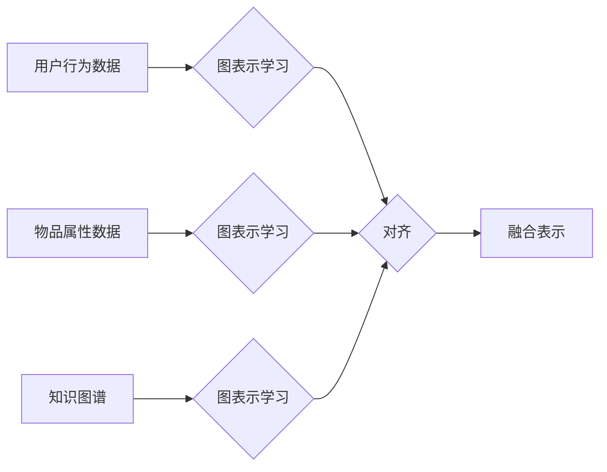

                 

## 大模型在推荐系统中的图表示对齐应用

> 关键词：大模型、推荐系统、图表示学习、对齐、知识图谱、用户行为

## 1. 背景介绍

推荐系统作为信息过滤和个性化服务的重要组成部分，在电商、社交媒体、视频平台等领域发挥着越来越重要的作用。传统的基于协同过滤和内容过滤的推荐算法，往往难以捕捉用户行为的复杂性和物品之间的潜在关系。近年来，随着深度学习技术的快速发展，基于图表示学习的推荐算法逐渐成为研究热点。

图表示学习旨在将用户、物品和他们的交互关系表示为图结构，并通过学习图嵌入来挖掘潜在的模式和关系。然而，现有的图表示学习方法通常假设图结构是静态的，而实际场景中用户行为和物品信息是动态变化的。此外，大规模推荐系统往往需要处理海量用户和物品数据，传统的图表示学习方法在处理大规模图数据时存在效率问题。

大模型的出现为解决这些问题提供了新的思路。大模型拥有强大的学习能力和泛化能力，能够从海量数据中学习到更丰富的知识和模式。将大模型与图表示学习相结合，可以构建更强大的推荐系统，更好地应对动态变化的用户行为和物品信息。

## 2. 核心概念与联系

图表示对齐是将不同来源的图数据进行对齐，使其能够在同一个语义空间中进行表示。在推荐系统中，我们可以将用户行为数据、物品属性数据和知识图谱等不同来源的数据表示为图结构，并通过图表示对齐技术将它们进行融合，从而构建更全面的用户和物品表示。

**图表示对齐流程图:**



**核心概念:**

* **用户行为数据:** 包括用户对物品的点击、浏览、购买等行为记录。
* **物品属性数据:** 包括物品的类别、价格、描述等属性信息。
* **知识图谱:** 包含用户、物品和他们的关系的知识库。
* **图表示学习:** 将图数据转换为低维向量表示，以便于后续的分析和应用。
* **图表示对齐:** 将不同来源的图数据进行对齐，使其能够在同一个语义空间中进行表示。
* **融合表示:** 将对齐后的图表示进行融合，构建更全面的用户和物品表示。

## 3. 核心算法原理 & 具体操作步骤

### 3.1  算法原理概述

图表示对齐算法的核心思想是通过学习一个共享的嵌入空间，使得来自不同图的数据在该空间中具有相似的表示。常用的图表示对齐算法包括：

* **基于对齐损失函数的算法:** 这种方法通过定义一个对齐损失函数，将不同图的数据映射到同一个嵌入空间，并通过优化损失函数来学习嵌入空间。
* **基于迁移学习的算法:** 这种方法利用预训练的图嵌入模型，将知识从源图迁移到目标图，从而实现对齐。
* **基于对抗学习的算法:** 这种方法利用生成对抗网络 (GAN) 的思想，训练一个生成器来生成目标图的嵌入，并训练一个鉴别器来区分目标图的嵌入和源图的嵌入，从而实现对齐。

### 3.2  算法步骤详解

以基于对齐损失函数的算法为例，其具体操作步骤如下：

1. **数据预处理:** 将用户行为数据、物品属性数据和知识图谱等数据预处理，例如去除噪声、标准化数据等。
2. **图构建:** 将预处理后的数据构建成图结构，例如将用户和物品作为节点，用户行为作为边。
3. **嵌入学习:** 使用图表示学习算法学习每个节点的嵌入向量，例如使用 Graph Convolutional Network (GCN) 或 Graph Attention Network (GAT)。
4. **对齐损失函数定义:** 定义一个对齐损失函数，例如基于欧氏距离或KL散度的损失函数，用于衡量不同图数据在嵌入空间中的相似度。
5. **模型训练:** 使用优化算法，例如梯度下降，优化对齐损失函数，从而学习到一个共享的嵌入空间。
6. **融合表示:** 将对齐后的图表示进行融合，例如使用平均值或加权平均值，构建更全面的用户和物品表示。

### 3.3  算法优缺点

**优点:**

* 可以融合来自不同来源的数据，构建更全面的用户和物品表示。
* 可以捕捉用户行为和物品之间的潜在关系。
* 可以提高推荐系统的准确性和个性化程度。

**缺点:**

* 算法复杂度较高，需要大量的计算资源。
* 对齐损失函数的设计需要经验和技巧。
* 需要大量的标注数据进行训练。

### 3.4  算法应用领域

图表示对齐算法在推荐系统、知识图谱推理、社交网络分析等领域都有广泛的应用。

## 4. 数学模型和公式 & 详细讲解 & 举例说明

### 4.1  数学模型构建

假设我们有三个图数据源：用户行为图 $G_u$，物品属性图 $G_i$ 和知识图谱 $G_k$。每个图数据源都有自己的节点集 $U$，$I$ 和 $K$，以及边集 $E_u$，$E_i$ 和 $E_k$。

我们的目标是学习一个共享的嵌入空间 $V$，使得来自不同图数据源的节点在该空间中具有相似的表示。

### 4.2  公式推导过程

我们使用基于对齐损失函数的算法，定义一个对齐损失函数 $L_{align}$，用于衡量不同图数据在嵌入空间中的相似度。

$$L_{align} = \sum_{u \in U} \sum_{i \in I} \sum_{k \in K} ||\mathbf{v}_u - \mathbf{v}_i - \mathbf{v}_k||^2$$

其中，$\mathbf{v}_u$，$\mathbf{v}_i$ 和 $\mathbf{v}_k$ 分别表示节点 $u$，$i$ 和 $k$ 在嵌入空间 $V$ 中的嵌入向量。

我们使用优化算法，例如梯度下降，优化对齐损失函数 $L_{align}$，从而学习到一个共享的嵌入空间 $V$。

### 4.3  案例分析与讲解

假设我们有一个电商平台，用户行为图 $G_u$ 包含用户点击、浏览和购买的历史记录，物品属性图 $G_i$ 包含物品的类别、价格、描述等属性信息，知识图谱 $G_k$ 包含用户和物品之间的关系，例如“用户喜欢购买某个类型的物品”。

通过图表示对齐算法，我们可以学习到一个共享的嵌入空间 $V$，使得用户、物品和他们的关系在该空间中具有相似的表示。例如，我们可以发现用户 A 和用户 B 具有相似的兴趣，因为他们在嵌入空间中的向量距离较近。

## 5. 项目实践：代码实例和详细解释说明

### 5.1  开发环境搭建

* Python 3.7+
* PyTorch 1.7+
* NetworkX 2.6+
* DGL 0.5+

### 5.2  源代码详细实现

```python
import torch
import torch.nn as nn
from dgl import DGLGraph

# 定义图表示学习模型
class GCN(nn.Module):
    def __init__(self, in_features, hidden_features, out_features):
        super(GCN, self).__init__()
        self.linear1 = nn.Linear(in_features, hidden_features)
        self.linear2 = nn.Linear(hidden_features, out_features)

    def forward(self, g, features):
        h = g.ndata['feat']
        h = self.linear1(h)
        h = torch.relu(h)
        h = self.linear2(h)
        return h

# 定义对齐损失函数
def align_loss(v_u, v_i, v_k):
    return torch.mean((v_u - v_i - v_k) ** 2)

# 构建图数据
g_u = DGLGraph()
g_i = DGLGraph()
g_k = DGLGraph()

# 训练模型
optimizer = torch.optim.Adam(model.parameters(), lr=0.01)
for epoch in range(100):
    # 前向传播
    v_u = model(g_u, g_u.ndata['feat'])
    v_i = model(g_i, g_i.ndata['feat'])
    v_k = model(g_k, g_k.ndata['feat'])

    # 计算损失
    loss = align_loss(v_u, v_i, v_k)

    # 反向传播
    optimizer.zero_grad()
    loss.backward()

    # 更新参数
    optimizer.step()

```

### 5.3  代码解读与分析

* 代码首先定义了图表示学习模型 GCN 和对齐损失函数 align_loss。
* 然后构建了三个图数据源：用户行为图 $G_u$，物品属性图 $G_i$ 和知识图谱 $G_k$。
* 最后使用优化算法训练模型，并计算损失函数值。

### 5.4  运行结果展示

训练完成后，我们可以使用学习到的嵌入向量来进行推荐。例如，我们可以计算用户 A 和物品 B 在嵌入空间中的余弦相似度，来判断用户 A 是否可能喜欢物品 B。

## 6. 实际应用场景

### 6.1  电商推荐

大模型在图表示对齐技术的基础上，可以构建更精准的电商推荐系统。例如，可以融合用户购买历史、浏览记录、商品属性和用户兴趣等多方面信息，推荐更符合用户需求的商品。

### 6.2  社交推荐

社交平台可以利用图表示对齐技术，将用户关系、兴趣爱好、好友推荐等信息融合在一起，推荐更相关的用户和内容。

### 6.3  新闻推荐

新闻推荐系统可以利用图表示对齐技术，将用户阅读历史、新闻主题、作者信息等信息融合在一起，推荐更符合用户兴趣的新闻。

### 6.4  未来应用展望

随着大模型和图表示学习技术的不断发展，大模型在推荐系统中的图表示对齐应用将更加广泛和深入。例如，可以利用大模型学习更复杂的图结构和关系，构建更智能的推荐系统。

## 7. 工具和资源推荐

### 7.1  学习资源推荐

* **书籍:**
    * 《图神经网络》
    * 《深度学习》
* **在线课程:**
    * Coursera: 深度学习
    * Udacity: 构建推荐系统
* **博客:**
    * Graph Neural Networks: A Comprehensive Guide
    * Towards Data Science

### 7.2  开发工具推荐

* **DGL:** 图神经网络库
* **PyTorch:** 深度学习框架
* **NetworkX:** 图论库

### 7.3  相关论文推荐

* **Graph Representation Learning for Recommender Systems**
* **Deep Graph Matching for Recommender Systems**
* **Knowledge Graph Embedding for Recommender Systems**

## 8. 总结：未来发展趋势与挑战

### 8.1  研究成果总结

大模型在推荐系统中的图表示对齐应用取得了显著的成果，能够有效地融合多源数据，提升推荐系统的准确性和个性化程度。

### 8.2  未来发展趋势

* **更复杂的图结构和关系:** 大模型可以学习更复杂的图结构和关系，构建更智能的推荐系统。
* **跨模态图表示学习:** 将文本、图像、视频等多模态数据融合到图表示学习中，构建更全面的用户和物品表示。
* **联邦学习:** 利用联邦学习技术，在保护用户隐私的前提下进行大模型训练。

### 8.3  面临的挑战

* **数据稀疏性:** 现实世界中的图数据往往是稀疏的，这会影响大模型的训练效果。
* **计算资源:** 大模型的训练需要大量的计算资源，这对于资源有限的机构来说是一个挑战。
* **可解释性:** 大模型的决策过程往往难以解释，这对于推荐系统的可信度和透明度是一个挑战。

### 8.4  研究展望

未来，我们将继续探索大模型在推荐系统中的图表示对齐应用，并致力于解决上述挑战，构建更智能、更可靠、更可解释的推荐系统。

## 9. 附录：常见问题与解答

**Q1: 图表示对齐算法有哪些优缺点？**

**A1:** 图表示对齐算法的优点是能够融合来自不同来源的数据，构建更全面的用户和物品表示，提高推荐系统的准确性和个性化程度。缺点是算法复杂度较高，需要大量的计算资源，对齐损失函数的设计需要经验和技巧，需要大量的标注数据进行训练。

**Q2: 大模型在图表示对齐中的优势是什么？**

**A2:** 大模型拥有强大的学习能力和泛化能力，能够从海量数据中学习到更丰富的知识和模式，从而构建更精准的图表示对齐模型。

**Q3: 如何评估图表示对齐算法的性能？**

**A3:** 可以使用推荐准确率、召回率、NDCG 等指标来评估图表示对齐算法的性能。

**Q4: 大模型在图表示对齐中的应用场景有哪些？**

**A4:** 大模型在图表示对齐技术的基础上，可以应用于电商推荐、社交推荐、新闻推荐等多个领域。


作者：禅与计算机程序设计艺术 / Zen and the Art of Computer Programming<end_of_turn>

