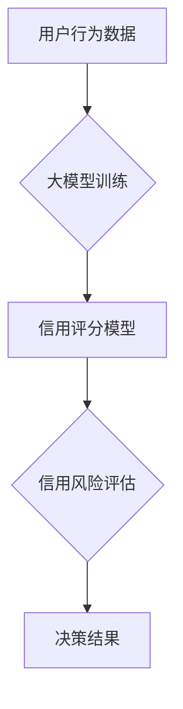

                 

## 大模型在电商平台信用评分中的应用

> 关键词：大模型、信用评分、电商平台、机器学习、自然语言处理、推荐系统、风险控制

## 1. 背景介绍

在当今数字经济时代，电商平台作为重要的商业模式，其发展离不开对用户信用的有效评估和管理。信用评分作为衡量用户信用风险的重要指标，在电商平台的运营中扮演着至关重要的角色。传统的信用评分模型主要依赖于用户静态特征，如年龄、收入、地址等，但这些特征往往无法全面反映用户的信用状况。随着大数据和人工智能技术的快速发展，大模型在电商平台信用评分中的应用成为一个新的研究热点。

大模型，是指参数规模庞大、训练数据海量的人工智能模型。其强大的学习能力和泛化能力，能够从海量数据中挖掘出更丰富的用户行为特征，从而构建更精准、更全面的信用评分模型。

## 2. 核心概念与联系

### 2.1 信用评分

信用评分是指通过对用户的历史行为、财务状况等信息进行分析，并赋予其一个数值表示，以评估其信用风险的程度。信用评分越高，表示用户的信用风险越低，反之亦然。

### 2.2 大模型

大模型是指参数规模庞大、训练数据海量的人工智能模型。其强大的学习能力和泛化能力，能够从海量数据中挖掘出更丰富的用户行为特征，从而构建更精准、更全面的信用评分模型。

### 2.3 电商平台

电商平台是指通过互联网为商家和消费者提供商品交易服务的平台。电商平台需要对用户进行信用评估，以降低平台风险，保障交易安全。

**大模型在电商平台信用评分中的应用流程图**



## 3. 核心算法原理 & 具体操作步骤

### 3.1 算法原理概述

大模型在电商平台信用评分中的应用主要基于机器学习算法，例如深度学习算法、梯度提升树算法等。这些算法能够从海量用户数据中学习出用户信用风险的特征，并构建出能够预测用户信用风险的模型。

### 3.2 算法步骤详解

1. **数据收集与预处理:** 收集用户行为数据，包括购买记录、浏览记录、评价记录、评论内容等。对数据进行清洗、转换、编码等预处理操作，使其能够被模型所接受。
2. **特征工程:** 从用户数据中提取特征，例如购买频率、平均消费金额、评价等级、评论情感等。这些特征能够反映用户的信用风险。
3. **模型训练:** 选择合适的机器学习算法，并使用训练数据对模型进行训练。训练过程的目标是让模型能够准确预测用户的信用风险。
4. **模型评估:** 使用测试数据对模型进行评估，并根据评估结果进行模型调优。
5. **模型部署:** 将训练好的模型部署到电商平台，用于对新用户的信用风险进行评估。

### 3.3 算法优缺点

**优点:**

* **精准度高:** 大模型能够从海量数据中学习出更丰富的用户行为特征，从而构建出更精准的信用评分模型。
* **可扩展性强:** 大模型能够处理海量数据，并且可以根据需要进行扩展。
* **自动化程度高:** 大模型的训练和部署可以自动化，降低人工成本。

**缺点:**

* **训练成本高:** 大模型的训练需要大量的计算资源和时间。
* **数据依赖性强:** 大模型的性能取决于训练数据的质量和数量。
* **解释性差:** 大模型的决策过程较为复杂，难以解释其评分结果。

### 3.4 算法应用领域

大模型在电商平台信用评分中的应用，不仅可以用于用户信用评估，还可以应用于其他领域，例如：

* **欺诈检测:** 识别和预防欺诈交易。
* **风险控制:** 评估和控制平台的风险。
* **推荐系统:** 根据用户的信用风险，推荐更合适的商品和服务。

## 4. 数学模型和公式 & 详细讲解 & 举例说明

### 4.1 数学模型构建

信用评分模型通常采用回归模型或分类模型。回归模型用于预测用户的信用风险得分，而分类模型用于将用户分为不同的信用等级。

**回归模型:**

一个简单的线性回归模型可以表示为：

$$
\hat{y} = \beta_0 + \beta_1 x_1 + \beta_2 x_2 + ... + \beta_n x_n + \epsilon
$$

其中：

* $\hat{y}$ 是预测的信用风险得分。
* $\beta_0, \beta_1, ..., \beta_n$ 是模型参数。
* $x_1, x_2, ..., x_n$ 是用户的特征向量。
* $\epsilon$ 是误差项。

**分类模型:**

常见的分类模型包括逻辑回归、支持向量机、决策树等。这些模型通过学习用户的特征和信用等级之间的关系，来预测用户的信用等级。

### 4.2 公式推导过程

具体的公式推导过程取决于选择的机器学习算法。例如，逻辑回归的公式推导过程涉及到似然函数和最大似然估计。

### 4.3 案例分析与讲解

假设我们使用线性回归模型来预测用户的信用风险得分。我们收集了用户的年龄、收入、购买频率等特征数据，并将其作为模型的输入。通过训练模型，我们得到了模型参数 $\beta_0, \beta_1, ..., \beta_n$。

当我们对一个新用户进行信用评估时，我们可以将用户的特征数据代入模型公式，得到其预测的信用风险得分。

## 5. 项目实践：代码实例和详细解释说明

### 5.1 开发环境搭建

* Python 3.x
* TensorFlow 或 PyTorch 等深度学习框架
* Scikit-learn 等机器学习库
* Jupyter Notebook 或其他代码编辑器

### 5.2 源代码详细实现

```python
# 导入必要的库
import pandas as pd
from sklearn.model_selection import train_test_split
from sklearn.linear_model import LogisticRegression

# 加载用户数据
data = pd.read_csv('user_data.csv')

# 选择特征和目标变量
features = ['age', 'income', 'purchase_frequency']
target = 'credit_score'

# 将数据分为训练集和测试集
X_train, X_test, y_train, y_test = train_test_split(data[features], data[target], test_size=0.2)

# 创建逻辑回归模型
model = LogisticRegression()

# 训练模型
model.fit(X_train, y_train)

# 对测试集进行预测
y_pred = model.predict(X_test)

# 评估模型性能
from sklearn.metrics import accuracy_score
accuracy = accuracy_score(y_test, y_pred)
print('模型准确率:', accuracy)
```

### 5.3 代码解读与分析

* 首先，我们导入必要的库，并加载用户数据。
* 然后，我们选择特征和目标变量，并将数据分为训练集和测试集。
* 接下来，我们创建逻辑回归模型，并使用训练集进行模型训练。
* 训练完成后，我们使用测试集进行模型预测，并评估模型性能。

### 5.4 运行结果展示

运行结果会显示出模型的准确率，例如：

```
模型准确率: 0.85
```

这表示模型在测试集上的预测准确率为 85%。

## 6. 实际应用场景

大模型在电商平台信用评分中的应用场景非常广泛，例如：

* **用户注册审核:** 对新用户进行信用评估，判断其是否符合平台的注册条件。
* **贷款申请审批:** 对贷款申请者的信用风险进行评估，决定是否批准贷款申请。
* **交易风险控制:** 对交易进行风险评估，识别和预防欺诈交易。
* **个性化推荐:** 根据用户的信用风险，推荐更合适的商品和服务。

### 6.4 未来应用展望

随着大模型技术的不断发展，其在电商平台信用评分中的应用将会更加广泛和深入。例如：

* **更精准的信用评分:** 大模型能够从更丰富的用户数据中学习出更精准的信用风险特征。
* **更个性化的信用评估:** 大模型能够根据用户的具体情况，进行更个性化的信用评估。
* **更智能的风险控制:** 大模型能够帮助电商平台构建更智能的风险控制系统，自动识别和预防风险。

## 7. 工具和资源推荐

### 7.1 学习资源推荐

* **书籍:**
    * 《深度学习》
    * 《机器学习实战》
    * 《自然语言处理入门》
* **在线课程:**
    * Coursera
    * edX
    * Udacity

### 7.2 开发工具推荐

* **Python:** 
    * TensorFlow
    * PyTorch
    * Scikit-learn
* **云平台:**
    * AWS
    * Azure
    * Google Cloud

### 7.3 相关论文推荐

* **BERT:** Devlin, J., Chang, M. W., Lee, K., & Toutanova, K. (2018). BERT: Pre-training of deep bidirectional transformers for language understanding. arXiv preprint arXiv:1810.04805.
* **GPT-3:** Brown, T. B., Mann, B., Ryder, N., Subbiah, M., Kaplan, J., Dhariwal, P., ... & Amodei, D. (2020). Language models are few-shot learners. arXiv preprint arXiv:2005.14165.

## 8. 总结：未来发展趋势与挑战

### 8.1 研究成果总结

大模型在电商平台信用评分中的应用取得了显著的成果，能够提高信用评分的精准度和自动化程度，降低平台风险，提升用户体验。

### 8.2 未来发展趋势

* **模型规模和能力的提升:** 大模型的规模和能力将会不断提升，能够学习出更复杂的信用风险特征。
* **多模态数据的融合:** 大模型将能够融合文本、图像、音频等多模态数据，构建更全面的信用评分模型。
* **解释性模型的开发:** 研究者将致力于开发更具解释性的信用评分模型，提高模型的可理解性和可信度。

### 8.3 面临的挑战

* **数据隐私和安全:** 大模型的训练需要海量用户数据，如何保护用户数据隐私和安全是一个重要的挑战。
* **模型公平性和可解释性:** 大模型的决策过程较为复杂，如何确保模型的公平性和可解释性是一个需要解决的问题。
* **模型部署和维护:** 大模型的部署和维护需要大量的计算资源和专业技术人员。

### 8.4 研究展望

未来，大模型在电商平台信用评分中的应用将会更加广泛和深入，为电商平台和用户带来更多价值。研究者将继续致力于解决上述挑战，推动大模型技术在信用评分领域的创新发展。

## 9. 附录：常见问题与解答

* **Q1: 大模型的训练成本很高，如何降低训练成本？**

* **A1:** 可以使用云平台的计算资源，并采用模型压缩和量化等技术来降低训练成本。

* **Q2: 大模型的解释性差，如何提高模型的可解释性？**

* **A2:** 可以使用可解释机器学习模型，或者结合其他技术手段，例如局部解释方法，来提高模型的可解释性。


作者：禅与计算机程序设计艺术 / Zen and the Art of Computer Programming 
<end_of_turn>

