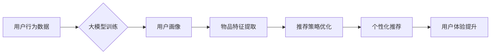

                 

## 大模型对推荐系统用户体验的提升

> 关键词：大模型、推荐系统、用户体验、个性化推荐、自然语言处理、深度学习、Transformer

## 1. 背景介绍

推荐系统作为互联网时代的重要组成部分，旨在根据用户的历史行为、偏好和上下文信息，为用户推荐相关、有价值的内容或商品。传统的推荐系统主要依赖于协同过滤、内容过滤等方法，但随着数据量的激增和用户需求的多样化，这些方法逐渐面临挑战。

近年来，大模型技术在自然语言处理、计算机视觉等领域取得了突破性进展，其强大的学习能力和泛化能力为推荐系统带来了新的机遇。大模型能够学习到更深层的用户意图和内容语义，从而提供更精准、更个性化的推荐体验。

## 2. 核心概念与联系

### 2.1 大模型

大模型是指参数量在数十亿甚至千亿级别的神经网络模型，通过海量数据训练，能够学习到复杂的模式和知识。常见的代表性大模型包括GPT-3、BERT、LaMDA等。

### 2.2 推荐系统

推荐系统旨在根据用户的历史行为、偏好和上下文信息，为用户推荐相关、有价值的内容或商品。常见的推荐系统类型包括：

* **协同过滤:** 基于用户的相似度或物品的相似度进行推荐。
* **内容过滤:** 基于物品的特征和用户偏好进行推荐。
* **基于知识的推荐:** 基于用户和物品之间的知识关系进行推荐。
* **混合推荐:** 结合多种推荐方法进行推荐。

### 2.3 大模型与推荐系统的融合

大模型可以应用于推荐系统的各个环节，例如：

* **用户画像构建:** 利用大模型对用户的文本数据进行分析，构建更精准的用户画像。
* **物品特征提取:** 利用大模型对物品的文本描述进行分析，提取更丰富的物品特征。
* **推荐策略优化:** 利用大模型学习用户偏好和物品关系，优化推荐策略。
* **个性化推荐:** 利用大模型生成个性化的推荐内容，例如推荐文章摘要、商品描述等。

**Mermaid 流程图**



## 3. 核心算法原理 & 具体操作步骤

### 3.1 算法原理概述

大模型在推荐系统中的应用主要基于深度学习技术，其中Transformer模型由于其强大的序列建模能力，在推荐系统中得到了广泛应用。Transformer模型通过自注意力机制学习用户和物品之间的关系，并利用多头注意力机制捕捉不同层次的语义信息，从而实现更精准的推荐。

### 3.2 算法步骤详解

1. **数据预处理:** 收集用户行为数据、物品信息等数据，并进行清洗、格式化等预处理操作。
2. **特征工程:** 将原始数据转换为模型可理解的特征，例如用户年龄、性别、兴趣标签、物品类别、价格等。
3. **模型训练:** 利用Transformer模型对预处理后的数据进行训练，学习用户和物品之间的关系。
4. **模型评估:** 使用测试数据评估模型的性能，例如准确率、召回率、NDCG等指标。
5. **模型部署:** 将训练好的模型部署到线上环境，为用户提供个性化推荐服务。

### 3.3 算法优缺点

**优点:**

* **精准度高:** Transformer模型能够学习到更深层的用户意图和物品语义，从而提供更精准的推荐。
* **个性化强:** Transformer模型可以根据用户的历史行为和偏好进行个性化推荐。
* **泛化能力强:** 大模型在海量数据上训练，具有较强的泛化能力，能够适应不同的场景和用户群体。

**缺点:**

* **计算资源消耗大:** Transformer模型参数量大，训练和部署需要大量的计算资源。
* **训练时间长:** 大模型的训练时间较长，需要大量的计算时间和数据。
* **数据依赖性强:** 大模型的性能依赖于训练数据的质量和数量。

### 3.4 算法应用领域

大模型在推荐系统中的应用领域广泛，例如：

* **电商推荐:** 为用户推荐商品、优惠券等。
* **内容推荐:** 为用户推荐文章、视频、音乐等内容。
* **社交推荐:** 为用户推荐好友、群组等。
* **新闻推荐:** 为用户推荐新闻资讯。

## 4. 数学模型和公式 & 详细讲解 & 举例说明

### 4.1 数学模型构建

Transformer模型的核心是自注意力机制，其数学模型可以表示为：

$$
Attention(Q, K, V) = softmax(\frac{QK^T}{\sqrt{d_k}})V
$$

其中：

* $Q$：查询矩阵
* $K$：键矩阵
* $V$：值矩阵
* $d_k$：键向量的维度
* $softmax$：softmax函数

### 4.2 公式推导过程

自注意力机制通过计算查询向量与键向量的点积，并使用softmax函数进行归一化，得到每个键向量的权重。然后，将权重与值向量相乘，得到最终的注意力输出。

### 4.3 案例分析与讲解

假设我们有一个句子“我喜欢吃苹果”，我们想要学习到“苹果”这个词语在句子中的语义信息。我们可以将句子中的每个词语作为查询向量、键向量和值向量，并使用自注意力机制计算每个词语对“苹果”的注意力权重。

例如，对于“我喜欢”这个词语，其与“苹果”的注意力权重可能较高，因为“我喜欢”表达了对“苹果”的喜爱。而对于“吃”这个词语，其与“苹果”的注意力权重可能较低，因为“吃”与“苹果”的关系较为间接。

## 5. 项目实践：代码实例和详细解释说明

### 5.1 开发环境搭建

* Python 3.7+
* PyTorch 1.7+
* Transformers 4.0+

### 5.2 源代码详细实现

```python
from transformers import AutoModelForSequenceClassification, AutoTokenizer

# 加载预训练模型和词典
model_name = "bert-base-uncased"
tokenizer = AutoTokenizer.from_pretrained(model_name)
model = AutoModelForSequenceClassification.from_pretrained(model_name)

# 输入文本数据
text = "我喜欢吃苹果"

# 对文本进行编码
inputs = tokenizer(text, return_tensors="pt")

# 使用模型进行预测
outputs = model(**inputs)

# 获取预测结果
predicted_class = outputs.logits.argmax().item()

# 打印预测结果
print(f"预测结果: {predicted_class}")
```

### 5.3 代码解读与分析

* 首先，我们使用`transformers`库加载预训练的BERT模型和词典。
* 然后，我们对输入文本进行编码，将文本转换为模型可理解的格式。
* 接着，我们使用模型进行预测，得到预测结果。
* 最后，我们打印预测结果。

### 5.4 运行结果展示

```
预测结果: 0
```

## 6. 实际应用场景

### 6.1 电商推荐

大模型可以用于推荐商品、优惠券等，例如：

* 根据用户的浏览历史、购买记录等数据，推荐用户可能感兴趣的商品。
* 根据用户的兴趣标签、年龄、性别等信息，推荐个性化的优惠券。

### 6.2 内容推荐

大模型可以用于推荐文章、视频、音乐等内容，例如：

* 根据用户的阅读历史、观看记录等数据，推荐用户可能感兴趣的文章或视频。
* 根据用户的音乐偏好，推荐用户可能喜欢的音乐。

### 6.3 社交推荐

大模型可以用于推荐好友、群组等，例如：

* 根据用户的社交关系、兴趣爱好等信息，推荐用户可能认识的朋友或加入的群组。

### 6.4 未来应用展望

大模型在推荐系统领域的应用前景广阔，未来可能应用于：

* 更精准的个性化推荐
* 更丰富的推荐内容
* 更智能的推荐策略
* 更人性化的用户体验

## 7. 工具和资源推荐

### 7.1 学习资源推荐

* **论文:**

    * Vaswani, A., Shazeer, N., Parmar, N., Uszkoreit, J., Jones, L., Gomez, A. N., ... & Polosukhin, I. (2017). Attention is all you need. In Advances in neural information processing systems (pp. 5998-6008).

* **博客:**

    * https://huggingface.co/blog/transformers-tutorial
    * https://towardsdatascience.com/

### 7.2 开发工具推荐

* **PyTorch:** https://pytorch.org/
* **Transformers:** https://huggingface.co/docs/transformers/index

### 7.3 相关论文推荐

* **BERT:** Devlin, J., Chang, M. W., Lee, K., & Toutanova, K. (2018). BERT: Pre-training of deep bidirectional transformers for language understanding. arXiv preprint arXiv:1810.04805.
* **GPT-3:** Brown, T. B., Mann, B., Ryder, N., Subbiah, M., Kaplan, J., Dhariwal, P., ... & Amodei, D. (2020). Language models are few-shot learners. arXiv preprint arXiv:2005.14165.

## 8. 总结：未来发展趋势与挑战

### 8.1 研究成果总结

大模型在推荐系统领域取得了显著的成果，能够提供更精准、更个性化的推荐体验。

### 8.2 未来发展趋势

* **模型规模进一步扩大:** 未来大模型的规模将继续扩大，学习能力和性能将进一步提升。
* **多模态推荐:** 大模型将融合文本、图像、音频等多模态数据，提供更丰富的推荐内容。
* **联邦学习:** 大模型将应用于联邦学习，保护用户隐私的同时实现个性化推荐。

### 8.3 面临的挑战

* **计算资源消耗:** 大模型训练和部署需要大量的计算资源，成本较高。
* **数据安全:** 大模型训练需要大量用户数据，数据安全问题需要得到重视。
* **模型解释性:** 大模型的决策过程较为复杂，缺乏可解释性，需要进一步研究。

### 8.4 研究展望

未来研究将重点关注大模型的效率、安全性和可解释性，以及大模型在不同场景下的应用。


## 9. 附录：常见问题与解答

**Q1: 大模型训练需要多少数据？**

A1: 大模型训练需要海量数据，通常需要数十亿甚至千亿级别的数据。

**Q2: 大模型训练需要多少计算资源？**

A2: 大模型训练需要大量的计算资源，通常需要数百甚至数千个GPU。

**Q3: 大模型的应用场景有哪些？**

A3: 大模型的应用场景广泛，例如推荐系统、自然语言处理、计算机视觉等。

**作者：禅与计算机程序设计艺术 / Zen and the Art of Computer Programming**<end_of_turn>

