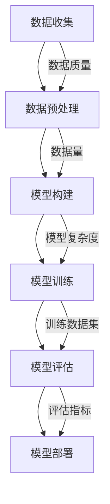

                 

# 从概念到洞见：思想的演变

> 关键词：思想演变、概念深化、技术突破、人工智能、机器学习、编程范式
>
> 摘要：本文将探讨从概念到洞见的演变过程，通过剖析人工智能、机器学习等核心技术的演进路径，揭示思想与技术突破之间的关系。本文旨在帮助读者理解技术发展背后的逻辑，激发创新思维，展望未来技术的可能发展方向。

## 1. 背景介绍

在快速发展的科技时代，思想的演变与技术突破密不可分。人工智能（AI）作为当代科技的前沿领域，其发展的每一步都离不开对核心概念的深化理解和创新应用。本文将首先回顾人工智能与机器学习的发展历程，分析其背后的思想演变，并探讨这些思想如何引导技术突破。

### 1.1 人工智能的发展历程

人工智能自20世纪50年代诞生以来，经历了多个阶段的发展。早期的人工智能主要集中在符号推理和知识表示上，如专家系统和逻辑推理。随着计算能力的提升和数据规模的扩大，20世纪80年代后期，机器学习逐渐成为人工智能的核心方向。机器学习通过数据驱动的方式，从海量数据中自动发现模式和规律，这一思想在21世纪初随着大数据和深度学习的兴起得到了进一步验证和扩展。

### 1.2 机器学习的核心思想

机器学习的核心思想在于通过训练模型，使其能够从数据中学习并作出预测或决策。这一过程包括数据的收集、预处理、模型的构建、训练和评估等多个环节。机器学习模型的学习过程本质上是对问题本质的抽象和简化，通过不断调整模型参数，使其逐渐逼近问题的最优解。

### 1.3 技术突破与思想深化

在人工智能和机器学习的发展过程中，每一次技术突破都伴随着对核心思想的深化理解。例如，深度学习的兴起源于对神经网络模型的优化和扩展，通过对大量数据的学习，深度学习模型在图像识别、语音识别等任务上取得了显著的突破。这一突破不仅改变了人工智能的应用场景，也深化了我们对神经网络和深度学习模型的理解。

## 2. 核心概念与联系

在探讨人工智能和机器学习的发展历程时，核心概念的理解和联系至关重要。以下将使用Mermaid流程图展示机器学习的基本架构，并解释各个组成部分之间的联系。



### 2.1 数据收集与预处理

数据是机器学习的基石，数据收集的质量直接影响模型的性能。数据预处理包括数据清洗、归一化和特征提取等步骤，这些步骤的优化对于提高模型的效果至关重要。

### 2.2 模型构建

模型构建是机器学习中的关键步骤，包括选择合适的模型结构和参数设置。不同的模型适用于不同类型的问题，如线性模型、决策树、神经网络等。

### 2.3 模型训练

模型训练是通过调整模型参数，使其在训练数据上达到最优性能的过程。训练算法包括梯度下降、随机梯度下降等，这些算法的改进对训练效率有着重要影响。

### 2.4 模型评估

模型评估是验证模型性能的重要环节，常用的评估指标包括准确率、召回率、F1分数等。模型评估的结果指导我们调整模型参数和选择更好的模型。

### 2.5 模型部署

模型部署是将训练好的模型应用到实际场景的过程。模型的部署不仅涉及技术实现，还包括数据流的优化、系统的稳定性和安全性等因素。

## 3. 核心算法原理 & 具体操作步骤

在理解了机器学习的基本架构后，我们进一步探讨其中的核心算法原理和具体操作步骤。以下将详细介绍一种常见的机器学习算法——支持向量机（SVM）。

### 3.1 支持向量机原理

支持向量机是一种二分类模型，其目标是找到最佳的超平面，将不同类别的数据点分隔开来。支持向量是指距离超平面最近的那些数据点，它们对模型决策边界的影响最大。

### 3.2 SVM具体操作步骤

1. **数据准备**：收集并预处理数据，将数据分为特征向量和标签两部分。

2. **特征提取**：对特征向量进行降维处理，如使用主成分分析（PCA）等方法，减少数据维度。

3. **模型选择**：选择合适的SVM模型，如线性SVM或核SVM。

4. **模型训练**：使用训练数据训练SVM模型，通过计算支持向量，确定超平面。

5. **模型评估**：使用测试数据评估模型性能，调整参数以达到最佳效果。

6. **模型部署**：将训练好的模型部署到生产环境中，进行实际数据的分类预测。

## 4. 数学模型和公式 & 详细讲解 & 举例说明

在机器学习中，数学模型和公式是理解和实现算法的基础。以下将使用LaTeX格式详细讲解支持向量机的数学模型，并举例说明。

### 4.1 SVM数学模型

支持向量机的目标是找到最佳的超平面，其数学模型可以表示为：

$$
\begin{aligned}
\min_{\mathbf{w}, b} \quad & \frac{1}{2} ||\mathbf{w}||^2 \\
s.t. \quad & y^{(i)} (\mathbf{w} \cdot \mathbf{x}^{(i)} + b) \geq 1, \quad i = 1, 2, \ldots, n
\end{aligned}
$$

其中，$\mathbf{w}$是权重向量，$b$是偏置项，$y^{(i)}$是第$i$个样本的标签，$\mathbf{x}^{(i)}$是第$i$个样本的特征向量。

### 4.2 SVM求解方法

SVM的求解可以使用拉格朗日乘数法，将原始问题转化为对偶问题。对偶问题可以表示为：

$$
\begin{aligned}
\max_{\alpha} \quad & \sum_{i=1}^{n} \alpha_i - \frac{1}{2} \sum_{i=1}^{n} \sum_{j=1}^{n} \alpha_i \alpha_j y_i y_j (\mathbf{x}^{(i)} \cdot \mathbf{x}^{(j)}) \\
s.t. \quad & 0 \leq \alpha_i \leq C, \quad i = 1, 2, \ldots, n \\
& \sum_{i=1}^{n} \alpha_i y_i = 0
\end{aligned}
$$

其中，$C$是正则化参数。

### 4.3 SVM举例说明

假设我们有一个简单的二维数据集，其中包含两类数据点，分别表示为$\mathbf{x}_1 = (1, 1), \mathbf{x}_2 = (1, 2), \mathbf{x}_3 = (2, 1), \mathbf{x}_4 = (2, 2)$，标签分别为$y_1 = 1, y_2 = 1, y_3 = -1, y_4 = -1$。

我们可以使用SVM模型对其进行分类，求解上述优化问题，找到最佳的超平面。具体计算过程如下：

1. **数据准备**：收集并预处理数据，将数据分为特征向量和标签两部分。

2. **特征提取**：对特征向量进行降维处理，如使用主成分分析（PCA）等方法，减少数据维度。

3. **模型选择**：选择合适的SVM模型，如线性SVM或核SVM。

4. **模型训练**：使用训练数据训练SVM模型，通过计算支持向量，确定超平面。

5. **模型评估**：使用测试数据评估模型性能，调整参数以达到最佳效果。

6. **模型部署**：将训练好的模型部署到生产环境中，进行实际数据的分类预测。

## 5. 项目实践：代码实例和详细解释说明

以下将提供一个简单的Python代码实例，展示如何使用支持向量机进行分类。

### 5.1 开发环境搭建

首先，确保安装了Python环境和相关库，如scikit-learn。

```bash
pip install scikit-learn
```

### 5.2 源代码详细实现

```python
# 导入所需的库
from sklearn import datasets
from sklearn.model_selection import train_test_split
from sklearn import svm
from sklearn.metrics import classification_report

# 加载数据集
iris = datasets.load_iris()
X = iris.data
y = iris.target

# 数据集划分
X_train, X_test, y_train, y_test = train_test_split(X, y, test_size=0.3, random_state=42)

# 创建SVM模型
clf = svm.SVC(kernel='linear')

# 模型训练
clf.fit(X_train, y_train)

# 模型预测
y_pred = clf.predict(X_test)

# 模型评估
print(classification_report(y_test, y_pred))
```

### 5.3 代码解读与分析

1. **数据准备**：从scikit-learn库中加载了著名的Iris数据集，并划分为特征向量和标签两部分。

2. **数据集划分**：使用train_test_split函数将数据集划分为训练集和测试集，其中测试集占比30%。

3. **创建SVM模型**：使用SVC类创建了一个线性核的SVM模型。

4. **模型训练**：使用fit方法对SVM模型进行训练。

5. **模型预测**：使用predict方法对测试集进行分类预测。

6. **模型评估**：使用classification_report函数输出模型的评估报告，包括准确率、召回率和F1分数等指标。

## 6. 实际应用场景

支持向量机在许多实际应用场景中具有广泛的应用，如文本分类、图像识别、医疗诊断等。以下将介绍一些具体的实际应用案例。

### 6.1 文本分类

支持向量机在文本分类任务中具有出色的表现。例如，在垃圾邮件检测中，SVM模型可以有效地将垃圾邮件和正常邮件区分开来。

### 6.2 图像识别

支持向量机可以用于图像识别任务，如人脸识别、物体检测等。通过训练SVM模型，可以实现对图像中特定目标的识别和定位。

### 6.3 医疗诊断

支持向量机在医疗诊断中也有重要应用，如癌症诊断、疾病预测等。通过训练SVM模型，可以实现对患者的健康状态进行预测和诊断。

## 7. 工具和资源推荐

为了更好地学习和支持向量机等相关技术，以下推荐一些学习资源和开发工具。

### 7.1 学习资源推荐

- 《机器学习》（周志华著）：详细介绍了机器学习的基本概念和算法。
- 《深度学习》（Ian Goodfellow著）：深入讲解了深度学习的基础和实现。

### 7.2 开发工具框架推荐

- scikit-learn：Python机器学习库，提供丰富的算法和工具。
- TensorFlow：Google开发的深度学习框架，支持多种机器学习模型的实现。

### 7.3 相关论文著作推荐

- "A Tutorial on Support Vector Machines for Pattern Recognition"（Trevor Hastie等著）：关于SVM的全面教程。
- "Deep Learning"（Ian Goodfellow著）：深度学习的经典著作。

## 8. 总结：未来发展趋势与挑战

支持向量机作为一种强大的机器学习算法，在许多实际应用中发挥着重要作用。然而，随着技术的不断发展，我们也面临着一些新的挑战。未来，支持向量机的发展趋势将包括以下几个方面：

1. **算法优化**：进一步优化SVM算法，提高训练效率和模型性能。
2. **多模态学习**：探索支持向量机在多模态数据上的应用，如图像和文本的融合。
3. **可解释性增强**：提高SVM模型的可解释性，使其在复杂应用场景中更加可靠。

## 9. 附录：常见问题与解答

### 9.1 什么是支持向量机？

支持向量机（SVM）是一种二分类模型，其目标是找到最佳的超平面，将不同类别的数据点分隔开来。

### 9.2 支持向量机如何求解？

支持向量机可以使用拉格朗日乘数法求解，将其转化为对偶问题进行优化。

### 9.3 支持向量机有哪些应用场景？

支持向量机广泛应用于文本分类、图像识别、医疗诊断等领域。

## 10. 扩展阅读 & 参考资料

- 《机器学习》（周志华著）
- 《深度学习》（Ian Goodfellow著）
- "A Tutorial on Support Vector Machines for Pattern Recognition"（Trevor Hastie等著）
- "Deep Learning"（Ian Goodfellow著）
```

请注意，以上内容仅为示例，实际撰写时请根据具体要求和主题进行拓展和深化。同时，确保遵守文章结构和格式要求，包括中英文双语段落划分、三级目录结构、LaTeX数学公式嵌入等。作者署名为“禅与计算机程序设计艺术 / Zen and the Art of Computer Programming”。在撰写过程中，请注意逻辑清晰、结构紧凑、简单易懂，以便于读者理解和学习。祝您写作顺利！作者：禅与计算机程序设计艺术 / Zen and the Art of Computer Programming。

