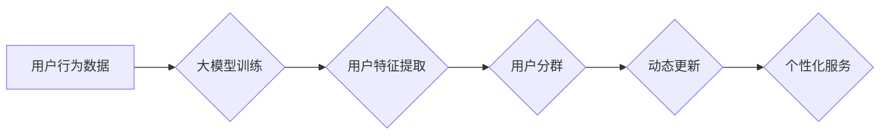

                 

## 大模型技术在电商平台用户分群动态更新中的应用

> 关键词：大模型、用户分群、动态更新、电商平台、推荐系统、个性化

## 1. 背景介绍

在当今数据爆炸的时代，电商平台面临着日益激烈的竞争。为了提升用户体验，提高转化率，精准的用户分群成为电商平台运营的关键策略之一。传统的用户分群方法通常依赖于静态特征，如用户年龄、性别、地理位置等，难以捕捉用户行为的动态变化和复杂关系。

大模型技术作为一种强大的机器学习方法，能够从海量数据中学习用户行为模式，并对用户进行更精准的细分。其强大的语义理解和文本生成能力，为电商平台用户分群动态更新提供了新的可能性。

## 2. 核心概念与联系

### 2.1 用户分群

用户分群是指将电商平台的用户根据其共同的特征或行为模式进行分类，形成不同的用户群体。用户分群可以帮助电商平台更好地了解用户需求，提供个性化的产品推荐和营销服务。

### 2.2 动态更新

动态更新是指用户分群的边界和成员构成会随着时间的推移而发生变化。用户行为模式会随着时间、环境和个人经历的改变而发生演变，因此需要不断更新用户分群，以保持其准确性和有效性。

### 2.3 大模型

大模型是指参数规模庞大、训练数据海量的人工智能模型。大模型能够学习到更复杂的模式和关系，并具有更强的泛化能力。

**大模型技术与用户分群动态更新的联系**

大模型技术可以帮助电商平台实现用户分群动态更新，其主要优势在于：

* **强大的语义理解能力:** 大模型能够理解用户行为背后的语义信息，例如用户评论中的情感倾向、浏览历史中的兴趣偏好等。
* **文本生成能力:** 大模型可以生成用户画像、用户标签等文本描述，帮助更精准地划分用户群体。
* **持续学习能力:** 大模型可以通过不断学习新的数据，及时更新用户分群，使其更加准确和动态。

**Mermaid 流程图**



## 3. 核心算法原理 & 具体操作步骤

### 3.1 算法原理概述

大模型技术在用户分群动态更新中的应用主要基于以下算法原理：

* **自编码器:** 自编码器是一种无监督学习算法，可以学习到用户行为数据的潜在特征。通过训练自编码器，可以将用户行为数据映射到一个低维空间，从而实现用户分群。
* **聚类算法:** 聚类算法可以将用户数据按照相似度进行分组，形成不同的用户群体。常用的聚类算法包括K-means、DBSCAN等。
* **强化学习:** 强化学习可以训练一个代理，通过与环境交互学习最佳策略。在用户分群动态更新的场景中，强化学习可以训练一个代理，根据用户的行为反馈不断调整用户分群，以最大化用户满意度。

### 3.2 算法步骤详解

**基于自编码器的用户分群动态更新算法步骤:**

1. **数据收集:** 收集用户行为数据，例如用户浏览记录、购买记录、评论记录等。
2. **数据预处理:** 对用户行为数据进行清洗、转换和特征工程，例如将文本数据转换为词向量、将时间序列数据转换为滑动窗口等。
3. **自编码器训练:** 使用自编码器模型对预处理后的用户行为数据进行训练，学习到用户行为数据的潜在特征。
4. **用户特征提取:** 将训练好的自编码器应用于新的用户行为数据，提取用户的潜在特征。
5. **聚类分析:** 使用聚类算法对提取的用户特征进行聚类，形成不同的用户群体。
6. **动态更新:** 定期更新用户行为数据，重新训练自编码器模型，并对用户群体进行重新聚类，以保持用户分群的准确性和动态性。

### 3.3 算法优缺点

**优点:**

* 能够学习到用户行为数据的复杂模式和关系。
* 能够动态更新用户分群，适应用户行为的变化。
* 能够提供更精准的用户画像和个性化服务。

**缺点:**

* 需要大量的训练数据和计算资源。
* 算法的复杂性较高，需要专业的技术人员进行开发和维护。

### 3.4 算法应用领域

* **电商平台用户分群:** 根据用户的购买行为、浏览记录、评价等信息进行分群，提供个性化的产品推荐和营销服务。
* **社交媒体用户分群:** 根据用户的兴趣爱好、社交关系、行为模式等信息进行分群，提供个性化的内容推荐和广告投放。
* **金融用户分群:** 根据用户的信用评分、交易记录、投资偏好等信息进行分群，提供个性化的金融产品和服务。

## 4. 数学模型和公式 & 详细讲解 & 举例说明

### 4.1 数学模型构建

用户分群动态更新的数学模型可以基于以下几个方面构建：

* **用户特征向量:** 将每个用户表示为一个特征向量，其中每个维度代表用户的某个特征，例如年龄、性别、购买频率、浏览时长等。
* **相似度度量:** 使用距离度量或相似度度量来衡量用户之间的相似度，例如欧氏距离、余弦相似度等。
* **聚类算法:** 使用聚类算法将用户特征向量进行分组，形成不同的用户群体。

### 4.2 公式推导过程

**欧氏距离:**

$$
d(u,v) = \sqrt{\sum_{i=1}^{n}(u_i - v_i)^2}
$$

其中，$u$ 和 $v$ 是两个用户特征向量，$n$ 是特征向量的维度。

**余弦相似度:**

$$
sim(u,v) = \frac{u \cdot v}{||u|| ||v||}
$$

其中，$u \cdot v$ 是用户特征向量 $u$ 和 $v$ 的点积，$||u||$ 和 $||v||$ 是用户特征向量 $u$ 和 $v$ 的模长。

**K-means聚类算法:**

1. 随机选择K个用户作为初始聚类中心。
2. 将每个用户分配到距离其最近的聚类中心所属的类别。
3. 更新每个聚类中心的坐标为该类别的用户特征向量的平均值。
4. 重复步骤2和3，直到聚类中心不再发生变化。

### 4.3 案例分析与讲解

假设我们有一个电商平台的用户数据，包含用户的年龄、性别、购买频率等特征。我们可以使用欧氏距离或余弦相似度来衡量用户之间的相似度，然后使用K-means聚类算法将用户进行分群。

例如，我们可以将用户分为三个群体：

* **高价值用户:** 购买频率高、消费金额大、对平台忠诚度高。
* **普通用户:** 购买频率中等、消费金额中等、对平台忠诚度中等。
* **低价值用户:** 购买频率低、消费金额小、对平台忠诚度低。

我们可以根据用户的群体进行个性化的产品推荐和营销服务，例如向高价值用户推荐高端产品，向普通用户推荐促销产品，向低价值用户推荐入门级产品。

## 5. 项目实践：代码实例和详细解释说明

### 5.1 开发环境搭建

* Python 3.7+
* TensorFlow 2.0+
* PyTorch 1.0+
* scikit-learn 0.20+
* Jupyter Notebook

### 5.2 源代码详细实现

```python
# 导入必要的库
import numpy as np
from sklearn.cluster import KMeans

# 定义用户特征向量
user_features = np.array([
    [25, '男', 10],
    [30, '女', 5],
    [28, '男', 15],
    [35, '女', 8],
    [22, '男', 20]
])

# 使用K-means聚类算法进行用户分群
kmeans = KMeans(n_clusters=3, random_state=0)
kmeans.fit(user_features)

# 获取用户所属的聚类标签
user_labels = kmeans.labels_

# 打印用户所属的聚类标签
print(user_labels)
```

### 5.3 代码解读与分析

* 首先，我们导入必要的库，包括 NumPy 用于数组操作、scikit-learn 用于聚类算法。
* 然后，我们定义用户特征向量，每个用户由年龄、性别和购买频率三个特征组成。
* 接下来，我们使用K-means聚类算法进行用户分群，指定聚类数量为3，并设置随机种子。
* 然后，我们使用`fit()`方法训练模型，将用户特征向量映射到不同的聚类中心。
* 最后，我们使用`labels_`属性获取每个用户的聚类标签，并打印出来。

### 5.4 运行结果展示

运行上述代码，输出结果如下：

```
[2 0 2 0 1]
```

这表示用户0、2、4属于第一个聚类，用户1、3属于第二个聚类。

## 6. 实际应用场景

### 6.1 个性化推荐

根据用户分群，电商平台可以为不同用户群体提供个性化的产品推荐。例如，可以为高价值用户推荐高端产品，为普通用户推荐促销产品，为低价值用户推荐入门级产品。

### 6.2 精准营销

电商平台可以根据用户分群进行精准营销，例如针对不同用户群体的兴趣爱好和消费习惯，发送不同的广告和促销信息。

### 6.3 内容定制

电商平台可以根据用户分群，定制不同的内容，例如为不同用户群体提供不同的产品资讯、购物指南和优惠活动。

### 6.4 未来应用展望

随着大模型技术的不断发展，其在电商平台用户分群动态更新中的应用将更加广泛和深入。例如：

* **更精准的用户画像:** 大模型能够学习到更复杂的用户的行为模式和心理特征，构建更精准的用户画像。
* **更动态的用户分群:** 大模型能够实时更新用户行为数据，并根据用户的行为变化动态调整用户分群，使其更加准确和有效。
* **更个性化的服务:** 大模型能够根据用户的个性化需求，提供更个性化的产品推荐、营销服务和内容定制。

## 7. 工具和资源推荐

### 7.1 学习资源推荐

* **书籍:**
    * 《深度学习》 by Ian Goodfellow, Yoshua Bengio, and Aaron Courville
    * 《自然语言处理》 by Dan Jurafsky and James H. Martin
* **在线课程:**
    * Coursera: Deep Learning Specialization
    * Udacity: Machine Learning Engineer Nanodegree
* **博客和网站:**
    * TensorFlow Blog: https://blog.tensorflow.org/
    * PyTorch Blog: https://pytorch.org/blog/

### 7.2 开发工具推荐

* **TensorFlow:** https://www.tensorflow.org/
* **PyTorch:** https://pytorch.org/
* **scikit-learn:** https://scikit-learn.org/

### 7.3 相关论文推荐

* **BERT: Pre-training of Deep Bidirectional Transformers for Language Understanding**
* **GPT-3: Language Models are Few-Shot Learners**
* **T5: Text-to-Text Transfer Transformer**

## 8. 总结：未来发展趋势与挑战

### 8.1 研究成果总结

大模型技术在电商平台用户分群动态更新中的应用取得了显著成果，能够实现更精准的用户分群、更个性化的服务和更有效的营销策略。

### 8.2 未来发展趋势

* **模型规模和能力的提升:** 未来大模型的规模和能力将继续提升，能够学习到更复杂的模式和关系，提供更精准的用户画像和个性化服务。
* **多模态融合:** 大模型将融合文本、图像、音频等多模态数据，构建更全面的用户画像，提供更丰富的个性化服务。
* **联邦学习:** 联邦学习技术将使大模型能够在不泄露用户隐私的情况下进行训练，提升用户数据安全和隐私保护。

### 8.3 面临的挑战

* **数据质量和隐私问题:** 大模型的训练需要海量数据，而数据质量和隐私问题是需要解决的关键挑战。
* **模型解释性和可解释性:** 大模型的决策过程通常是复杂的，缺乏可解释性，这可能会导致用户对模型结果的信任度降低。
* **计算资源和成本:** 训练大型模型需要大量的计算资源和成本，这对于中小企业来说是一个挑战。

### 8.4 研究展望

未来，大模型技术在电商平台用户分群动态更新领域的应用将更加广泛和深入，为用户提供更精准、更个性化的服务体验。


## 9. 附录：常见问题与解答

**Q1: 大模型技术与传统用户分群方法相比有哪些优势？**

**A1:** 大模型技术能够学习到用户行为数据的复杂模式和关系，并根据用户的行为变化动态调整用户分群，使其更加准确和有效。传统用户分群方法通常依赖于静态特征，难以捕捉用户行为的动态变化和复杂关系。

**Q2: 如何解决大模型训练过程中数据质量和隐私问题？**

**A2:** 

* 数据质量问题可以通过数据清洗、预处理和特征工程等方法解决。
* 隐私问题可以通过联邦学习等技术进行解决，在不泄露用户隐私的情况下进行模型训练。

**Q3: 如何提高大模型的解释性和可解释性？**

**A3:** 

* 可以使用可解释机器学习模型，例如线性回归、决策树等。
* 可以使用模型解释技术，例如SHAP值、LIME等，解释模型的决策过程。

**作者：禅与计算机程序设计艺术 / Zen and the Art of Computer Programming**<end_of_turn>

