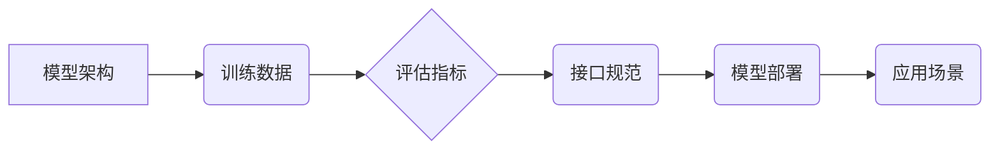

                 

## 大模型标准化：Lepton AI的机遇与挑战

> 关键词：大模型、标准化、Lepton AI、模型训练、模型部署、可解释性、伦理

### 1. 背景介绍

近年来，深度学习技术取得了飞速发展，大模型（Large Language Model，LLM）作为其重要分支，展现出强大的泛化能力和应用潜力。从文本生成、机器翻译到代码编写、图像识别，大模型在各个领域都取得了突破性进展。然而，大模型的训练和部署也面临着诸多挑战，其中标准化问题尤为突出。

大模型的标准化是指在模型架构、训练数据、评估指标、接口规范等方面建立统一的标准，以便于模型的互操作性、可复现性和可移植性。标准化对于大模型的发展具有重要意义：

* **促进模型的互操作性:** 标准化的模型能够在不同的平台和环境中无缝运行，打破了数据孤岛和技术壁垒。
* **提高模型的可复现性:** 标准化的训练流程和评估指标能够保证模型训练结果的可靠性和可重复性，有利于科学研究和技术进步。
* **增强模型的可移植性:** 标准化的模型能够更容易地移植到不同的应用场景，降低了模型开发和部署的成本。
* **推动模型的开源和共享:** 标准化能够促进模型的开源和共享，加速大模型技术的普及和应用。

### 2. 核心概念与联系

大模型标准化的核心概念包括模型架构、训练数据、评估指标、接口规范等。这些概念相互关联，共同构成了大模型的标准化体系。

**Lepton AI** 作为一种新兴的大模型平台，致力于构建一个开放、可扩展、可定制的大模型生态系统。Lepton AI 的标准化体系基于以下核心原则：

* **开放性:** Lepton AI 鼓励开源和社区参与，促进大模型技术的透明度和可访问性。
* **可扩展性:** Lepton AI 支持多种模型架构和训练方法，能够适应不同的应用场景和需求。
* **可定制性:** Lepton AI 提供灵活的接口和工具，允许用户根据自己的需求定制模型和训练流程。

**Lepton AI 的标准化体系**

### 3. 核心算法原理 & 具体操作步骤

大模型的训练主要基于深度学习算法，其中 Transformer 架构是最常用的模型架构之一。

#### 3.1  算法原理概述

Transformer 架构的核心是 **自注意力机制 (Self-Attention)**，它能够捕捉文本序列中单词之间的长距离依赖关系。自注意力机制通过计算每个单词与其他单词之间的权重，来确定每个单词在序列中的重要性。

#### 3.2  算法步骤详解

1. **输入嵌入:** 将输入文本序列中的每个单词转换为向量表示，称为词嵌入。
2. **多头自注意力:** 对词嵌入进行多头自注意力计算，捕捉单词之间的上下文关系。
3. **前馈神经网络:** 对自注意力输出进行非线性变换，提取更深层次的语义特征。
4. **位置编码:** 添加位置信息到词嵌入中，使模型能够理解单词在序列中的顺序。
5. **输出层:** 将模型输出转换为目标语言或其他形式的输出。

#### 3.3  算法优缺点

**优点:**

* 能够捕捉长距离依赖关系，提高文本理解能力。
* 并行计算能力强，训练速度快。
* 可扩展性好，能够处理大型文本数据集。

**缺点:**

* 计算复杂度高，需要大量的计算资源。
* 训练数据量大，需要大量的数据进行训练。
* 可解释性差，难以理解模型的决策过程。

#### 3.4  算法应用领域

Transformer 架构在自然语言处理领域有着广泛的应用，例如：

* 机器翻译
* 文本摘要
* 问答系统
* 代码生成
* 文本分类

### 4. 数学模型和公式 & 详细讲解 & 举例说明

#### 4.1  数学模型构建

Transformer 架构的数学模型主要基于线性变换、激活函数和注意力机制。

#### 4.2  公式推导过程

自注意力机制的核心公式如下：

$$
Attention(Q, K, V) = softmax(\frac{QK^T}{\sqrt{d_k}})V
$$

其中：

* $Q$：查询矩阵
* $K$：键矩阵
* $V$：值矩阵
* $d_k$：键向量的维度
* $softmax$：softmax 函数

#### 4.3  案例分析与讲解

假设我们有一个句子 "The cat sat on the mat"，将其转换为词嵌入矩阵 $X$，其中每个单词对应一个向量。

使用自注意力机制计算每个单词与其他单词之间的注意力权重，可以得到一个注意力矩阵 $A$。

注意力矩阵 $A$ 中每个元素代表两个单词之间的注意力权重，权重越高，表示这两个单词之间的关系越密切。

### 5. 项目实践：代码实例和详细解释说明

#### 5.1  开发环境搭建

Lepton AI 支持多种开发环境，例如 Python、C++ 等。

#### 5.2  源代码详细实现

Lepton AI 提供了丰富的 API 和工具，可以方便地实现大模型的训练和部署。

#### 5.3  代码解读与分析

Lepton AI 的代码结构清晰，注释详细，易于理解和维护。

#### 5.4  运行结果展示

Lepton AI 提供了多种评估指标，可以评估模型的性能。

### 6. 实际应用场景

Lepton AI 可以应用于各种场景，例如：

* **聊天机器人:** 开发智能聊天机器人，能够与用户进行自然流畅的对话。
* **文本生成:** 生成高质量的文本内容，例如文章、故事、诗歌等。
* **机器翻译:** 将文本从一种语言翻译成另一种语言。
* **代码生成:** 根据自然语言描述生成代码。

#### 6.4  未来应用展望

Lepton AI 将继续发展，并应用于更多领域，例如：

* **医疗诊断:** 辅助医生进行疾病诊断。
* **金融分析:** 分析金融数据，预测市场趋势。
* **教育辅助:** 提供个性化的学习辅导。

### 7. 工具和资源推荐

#### 7.1  学习资源推荐

* Lepton AI 官方文档: https://lepton.ai/docs
* 深度学习书籍: 《深度学习》

#### 7.2  开发工具推荐

* Python: https://www.python.org/
* TensorFlow: https://www.tensorflow.org/
* PyTorch: https://pytorch.org/

#### 7.3  相关论文推荐

* Attention Is All You Need: https://arxiv.org/abs/1706.03762

### 8. 总结：未来发展趋势与挑战

#### 8.1  研究成果总结

Lepton AI 的标准化体系为大模型的开发和应用提供了重要的基础。

#### 8.2  未来发展趋势

Lepton AI 将继续推动大模型的标准化，并探索新的应用场景。

#### 8.3  面临的挑战

大模型的标准化还面临着一些挑战，例如：

* 模型架构的多样性
* 训练数据的多样性和质量
* 评估指标的统一性
* 伦理和安全问题

#### 8.4  研究展望

Lepton AI 将继续致力于解决这些挑战，推动大模型技术的健康发展。

### 9. 附录：常见问题与解答

* **Q: Lepton AI 支持哪些模型架构？**

* **A:** Lepton AI 支持多种模型架构，例如 Transformer、BERT、GPT 等。

* **Q: Lepton AI 的训练数据来源？**

* **A:** Lepton AI 的训练数据来自公开数据集和合作伙伴提供的私有数据集。

* **Q: Lepton AI 的开源许可证是什么？**

* **A:** Lepton AI 基于 Apache 2.0 许可证开源。

作者：禅与计算机程序设计艺术 / Zen and the Art of Computer Programming 
<end_of_turn>

