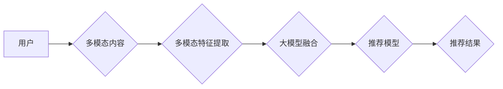

                 

## 大模型驱动的推荐系统多模态内容理解

> 关键词：大模型、推荐系统、多模态理解、内容理解、Transformer、BERT、视觉特征、文本特征、融合策略

## 1. 背景介绍

推荐系统是互联网时代的重要组成部分，其核心目标是根据用户的历史行为、偏好等信息，预测用户对特定内容的兴趣，并推荐最相关的商品、服务或信息。传统的推荐系统主要依赖文本特征，例如用户浏览历史、购买记录、评分等，但随着互联网内容的多样化，文本特征已无法完全满足推荐需求。

多模态内容，例如图像、视频、音频等，蕴含着丰富的语义信息，能够更全面地刻画用户兴趣和内容属性。因此，将多模态内容理解融入推荐系统，能够提升推荐的准确性和个性化程度。

大模型的出现为多模态内容理解提供了强大的工具。大模型，例如BERT、GPT-3等，拥有强大的语义理解能力，能够从文本中提取丰富的语义特征。近年来，一些研究者将大模型应用于多模态内容理解，取得了显著成果。

## 2. 核心概念与联系

**2.1 多模态内容理解**

多模态内容理解是指理解由多种模态数据组成的复合信息，例如图像、文本、音频等。其目标是将不同模态的数据融合，提取出更丰富的语义信息，从而更好地理解内容的含义。

**2.2 大模型**

大模型是指参数量巨大、训练数据海量的人工智能模型。大模型通常具有强大的泛化能力和语义理解能力，能够处理复杂的任务，例如文本生成、机器翻译、问答系统等。

**2.3 推荐系统**

推荐系统是指根据用户的历史行为、偏好等信息，预测用户对特定内容的兴趣，并推荐最相关的商品、服务或信息。

**2.4 融合策略**

融合策略是指将不同模态的数据融合在一起，提取出更丰富的语义信息的方法。常见的融合策略包括：

* **早期融合:** 将不同模态的数据在特征提取阶段融合。
* **晚期融合:** 将不同模态的数据在决策阶段融合。
* **多级融合:** 将不同模态的数据在多个阶段融合。

**2.5 架构图**



## 3. 核心算法原理 & 具体操作步骤

### 3.1 算法原理概述

大模型驱动的推荐系统多模态内容理解的核心算法原理是将大模型应用于多模态特征融合，从而提升推荐的准确性和个性化程度。

具体来说，该算法流程如下：

1. **多模态特征提取:** 对输入的多模态内容进行特征提取，例如使用CNN提取图像特征，使用BERT提取文本特征。
2. **大模型融合:** 将提取出的不同模态特征输入到预训练的大模型中，例如BERT，进行融合。大模型能够学习不同模态之间的语义关系，提取出更丰富的语义信息。
3. **推荐模型:** 将大模型融合后的特征输入到推荐模型中，例如基于用户的协同过滤模型或基于内容的推荐模型，进行最终的推荐。

### 3.2 算法步骤详解

1. **数据预处理:** 对多模态数据进行预处理，例如图像裁剪、文本清洗等。
2. **多模态特征提取:** 使用预训练的模型提取不同模态的特征。例如，使用预训练的CNN模型提取图像特征，使用预训练的BERT模型提取文本特征。
3. **特征融合:** 将提取出的不同模态特征进行融合。可以使用多种融合策略，例如早期融合、晚期融合、多级融合等。
4. **推荐模型训练:** 将融合后的特征作为输入，训练推荐模型。可以使用传统的推荐算法，例如协同过滤、内容推荐等，也可以使用深度学习模型，例如Transformer、Graph Neural Networks等。
5. **推荐结果输出:** 将训练好的推荐模型应用于新的用户和内容，进行推荐。

### 3.3 算法优缺点

**优点:**

* **提升推荐准确性:** 多模态内容理解能够提供更丰富的语义信息，提升推荐的准确性和个性化程度。
* **扩展推荐场景:** 大模型能够处理多种模态数据，扩展了推荐系统的应用场景。
* **降低人工特征工程成本:** 大模型能够自动学习特征，降低了人工特征工程的成本。

**缺点:**

* **数据获取和处理难度:** 多模态数据的获取和处理难度较大，需要整合多种数据源，并进行数据清洗、标注等工作。
* **计算资源需求高:** 大模型训练和推理需要大量的计算资源。
* **模型解释性差:** 大模型的内部机制复杂，难以解释模型的决策过程。

### 3.4 算法应用领域

大模型驱动的推荐系统多模态内容理解算法在以下领域具有广泛的应用前景:

* **电商推荐:** 基于商品图像、描述、用户评论等多模态数据进行商品推荐。
* **视频推荐:** 基于视频内容、用户观看历史、评论等多模态数据进行视频推荐。
* **音乐推荐:** 基于音乐音频、歌词、用户喜好等多模态数据进行音乐推荐。
* **新闻推荐:** 基于新闻标题、内容、用户阅读历史等多模态数据进行新闻推荐。

## 4. 数学模型和公式 & 详细讲解 & 举例说明

### 4.1 数学模型构建

假设我们有用户 $u$ 和商品 $i$，以及用户 $u$ 对商品 $i$ 的评分 $r_{ui}$。我们想要构建一个多模态推荐模型，来预测用户 $u$ 对商品 $i$ 的评分。

我们可以使用以下数学模型来表示：

$$
r_{ui} = f(h_u, h_i)
$$

其中：

* $r_{ui}$ 是用户 $u$ 对商品 $i$ 的评分。
* $h_u$ 是用户 $u$ 的多模态特征向量。
* $h_i$ 是商品 $i$ 的多模态特征向量。
* $f$ 是一个多模态特征融合函数。

### 4.2 公式推导过程

多模态特征融合函数 $f$ 可以使用多种方法实现，例如：

* **加权求和:**

$$
f(h_u, h_i) = \alpha h_u + \beta h_i
$$

其中 $\alpha$ 和 $\beta$ 是权重系数，可以根据不同模态的重要性进行调整。

* **点积:**

$$
f(h_u, h_i) = h_u \cdot h_i
$$

* **神经网络:** 可以使用多层感知机 (MLP) 或 Transformer 等神经网络模型来实现多模态特征融合。

### 4.3 案例分析与讲解

例如，在电商推荐场景中，我们可以使用以下多模态特征：

* **用户特征:** 用户的年龄、性别、购买历史、浏览记录等。
* **商品特征:** 商品的图像、描述、价格、类别等。

我们可以使用加权求和方法将用户特征和商品特征融合，得到最终的推荐评分。

## 5. 项目实践：代码实例和详细解释说明

### 5.1 开发环境搭建

* Python 3.7+
* TensorFlow 2.0+
* PyTorch 1.0+
* CUDA 10.0+ (可选)

### 5.2 源代码详细实现

```python
import tensorflow as tf

# 定义用户特征和商品特征的维度
user_feature_dim = 10
item_feature_dim = 20

# 定义多模态特征融合函数
def fusion_function(user_features, item_features):
  # 使用加权求和方法融合特征
  alpha = 0.7
  beta = 0.3
  fused_features = alpha * user_features + beta * item_features
  return fused_features

# 定义推荐模型
class RecommenderModel(tf.keras.Model):
  def __init__(self):
    super(RecommenderModel, self).__init__()
    self.dense = tf.keras.layers.Dense(1, activation='linear')

  def call(self, inputs):
    fused_features = fusion_function(inputs[0], inputs[1])
    return self.dense(fused_features)

# 实例化推荐模型
model = RecommenderModel()

# 定义损失函数和优化器
loss_fn = tf.keras.losses.MeanSquaredError()
optimizer = tf.keras.optimizers.Adam(learning_rate=0.001)

# 训练模型
# ...

# 预测评分
def predict_rating(user_features, item_features):
  predictions = model([user_features, item_features])
  return predictions

```

### 5.3 代码解读与分析

* `fusion_function` 函数定义了多模态特征融合的方法，这里使用加权求和方法。
* `RecommenderModel` 类定义了推荐模型，包含一个全连接层，用于将融合后的特征映射到评分。
* `predict_rating` 函数用于预测用户对商品的评分。

### 5.4 运行结果展示

* 训练完成后，可以使用测试数据评估模型的性能，例如使用均方误差 (MSE) 来衡量预测评分与真实评分之间的差异。
* 可以将模型应用于新的用户和商品，进行推荐。

## 6. 实际应用场景

### 6.1 电商推荐

大模型驱动的多模态推荐系统可以帮助电商平台更精准地推荐商品，提升用户体验和转化率。例如，可以根据用户的浏览历史、购买记录、点赞记录等多模态数据，推荐用户可能感兴趣的商品。

### 6.2 视频推荐

视频平台可以利用大模型驱动的多模态推荐系统，根据用户的观看历史、点赞记录、评论等多模态数据，推荐用户可能感兴趣的视频。

### 6.3 音乐推荐

音乐平台可以利用大模型驱动的多模态推荐系统，根据用户的播放历史、点赞记录、评论等多模态数据，推荐用户可能喜欢的音乐。

### 6.4 未来应用展望

大模型驱动的多模态推荐系统在未来将有更广泛的应用场景，例如：

* **个性化教育推荐:** 根据学生的学习记录、兴趣爱好等多模态数据，推荐个性化的学习内容。
* **医疗诊断辅助:** 根据患者的病历、影像数据、症状描述等多模态数据，辅助医生进行诊断。
* **智能客服:** 根据用户的聊天记录、语音、表情等多模态数据，提供更智能、更个性化的客服服务。

## 7. 工具和资源推荐

### 7.1 学习资源推荐

* **书籍:**
    * Deep Learning by Ian Goodfellow, Yoshua Bengio, and Aaron Courville
    * Natural Language Processing with Python by Steven Bird, Ewan Klein, and Edward Loper
* **在线课程:**
    * Stanford CS224N: Natural Language Processing with Deep Learning
    * DeepLearning.AI TensorFlow Specialization

### 7.2 开发工具推荐

* **TensorFlow:** 开源深度学习框架，支持多种硬件平台。
* **PyTorch:** 开源深度学习框架，以其灵活性和易用性而闻名。
* **Hugging Face Transformers:** 提供预训练的大模型和工具，方便进行多模态任务。

### 7.3 相关论文推荐

* **BERT: Pre-training of Deep Bidirectional Transformers for Language Understanding**
* **Vision Transformer (ViT)**
* **Multimodal Fusion for Recommender Systems: A Survey**

## 8. 总结：未来发展趋势与挑战

### 8.1 研究成果总结

大模型驱动的推荐系统多模态内容理解取得了显著成果，能够提升推荐的准确性和个性化程度，扩展了推荐系统的应用场景。

### 8.2 未来发展趋势

* **更强大的大模型:** 未来将会有更强大的大模型出现，能够更好地理解多模态内容。
* **更有效的融合策略:** 将会开发出更有效的多模态特征融合策略，提升推荐效果。
* **更个性化的推荐:** 将会更加注重用户个性化需求，提供更精准、更个性化的推荐。

### 8.3 面临的挑战

* **数据获取和处理难度:** 多模态数据的获取和处理难度较大，需要整合多种数据源，并进行数据清洗、标注等工作。
* **计算资源需求高:** 大模型训练和推理需要大量的计算资源。
* **模型解释性差:** 大模型的内部机制复杂，难以解释模型的决策过程。

### 8.4 研究展望

未来研究将重点关注以下几个方面:

* 开发更有效的多模态特征融合方法。
* 研究大模型的 interpretability，提高模型的透明度和可解释性。
* 探索大模型在更多领域的应用，例如个性化教育、医疗诊断等。

## 9. 附录：常见问题与解答

* **Q: 如何选择合适的融合策略？**

A: 不同的融合策略适用于不同的场景，需要根据具体任务和数据特点进行选择。例如，对于文本和图像数据，早期融合通常效果较好；对于文本和音频数据，晚期融合可能更合适。

* **Q: 如何处理多模态数据的缺失？**

A: 可以使用多种方法处理多模态数据的缺失，例如使用平均值填充、使用其他模态数据进行预测等。

* **Q: 如何评估多模态推荐系统的性能？**

A: 可以使用多种指标来评估多模态推荐系统的性能，例如准确率、召回率、NDCG等。


作者：禅与计算机程序设计艺术 / Zen and the Art of Computer Programming 
<end_of_turn>

