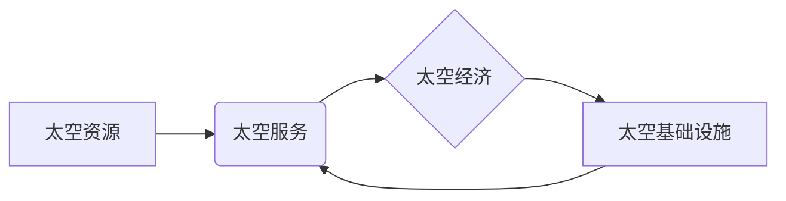

                 

## 2050年的太空旅游：从太空酒店到火星移民的太空经济发展

> 关键词：太空旅游、太空酒店、火星移民、太空经济、人工智能、机器人、太空运输、太空资源开发

### 1. 背景介绍

21世纪初，人类迈出了探索太空的坚实步伐。国际空间站的建造和运营，以及商业航天公司的崛起，标志着太空探索进入了一个新的时代。随着技术的不断进步，太空旅游不再是科幻小说中的幻想，而是越来越接近现实。

2050年，我们预计将目睹太空旅游的蓬勃发展，从最初的短暂太空观光，演变为更长时间的太空度假，甚至包括火星移民。这将带来一场太空经济的革命，涉及到太空酒店、太空运输、太空资源开发等多个领域。

### 2. 核心概念与联系

太空经济的核心概念是将太空视为一个新的经济领域，并利用太空资源和环境来创造价值。

**太空经济的构成要素：**

* **太空资源：** 包括矿产资源、能源资源、空间资源等。
* **太空服务：** 包括太空运输、太空观光、太空通信、太空科学研究等。
* **太空基础设施：** 包括太空站、太空酒店、太空港、地面控制中心等。

**太空经济发展关系图：**



### 3. 核心算法原理 & 具体操作步骤

**3.1  算法原理概述**

太空经济的发展离不开先进的算法和技术支持。例如，在太空资源开发方面，需要利用人工智能和机器学习算法进行资源探测、评估和开采。在太空运输方面，需要采用优化算法进行航线规划和燃料消耗控制。

**3.2  算法步骤详解**

* **资源探测：** 利用遥感数据、卫星图像和人工智能算法，对太空中的矿产资源、能源资源等进行探测和识别。
* **资源评估：** 根据探测数据，利用数学模型和统计分析方法，对太空资源的储量、质量和经济价值进行评估。
* **资源开采：** 设计和开发相应的太空机器人和设备，进行太空资源的开采和运输。

**3.3  算法优缺点**

* **优点：** 提高资源探测和评估的效率，降低开采成本，实现太空资源的有效利用。
* **缺点：** 需要大量的计算资源和数据支持，算法的准确性和可靠性需要不断提高。

**3.4  算法应用领域**

* **太空资源开发：** 矿产资源、能源资源、水资源等。
* **太空环境监测：** 气候变化、环境污染、自然灾害等。
* **太空科学研究：** 天体物理、宇宙学、生命科学等。

### 4. 数学模型和公式 & 详细讲解 & 举例说明

**4.1  数学模型构建**

太空经济发展可以利用数学模型进行预测和分析。例如，可以构建一个太空资源开采成本模型，将开采成本与资源储量、开采技术、运输成本等因素进行关联。

**4.2  公式推导过程**

假设太空资源开采成本模型如下：

$$C = f(R, T, D)$$

其中：

* $C$：开采成本
* $R$：资源储量
* $T$：开采技术水平
* $D$：运输成本

**4.3  案例分析与讲解**

如果资源储量增加，开采成本会相应增加，但开采技术水平提高，则可以降低开采成本。运输成本也会影响开采成本，因此需要选择合适的运输方式和路线。

### 5. 项目实践：代码实例和详细解释说明

**5.1  开发环境搭建**

可以使用Python语言和相关的库进行太空经济模型的开发。例如，可以使用NumPy库进行数值计算，Pandas库进行数据处理，Scikit-learn库进行机器学习算法的实现。

**5.2  源代码详细实现**

```python
import numpy as np
from sklearn.linear_model import LinearRegression

# 假设资源储量、开采技术水平和运输成本的数据
R = np.array([100, 200, 300, 400, 500])
T = np.array([1, 2, 3, 4, 5])
D = np.array([10, 20, 30, 40, 50])
C = np.array([1000, 2000, 3000, 4000, 5000])

# 创建线性回归模型
model = LinearRegression()

# 训练模型
model.fit(np.column_stack((R, T, D)), C)

# 预测新的开采成本
new_R = 600
new_T = 6
new_D = 60
predicted_C = model.predict(np.array([[new_R, new_T, new_D]]))

# 打印预测结果
print(f"预测的开采成本为：{predicted_C[0]}")
```

**5.3  代码解读与分析**

这段代码首先定义了资源储量、开采技术水平、运输成本和开采成本的数据。然后，创建了一个线性回归模型，并使用训练数据训练模型。最后，使用训练好的模型预测新的开采成本。

**5.4  运行结果展示**

运行代码后，会输出预测的开采成本值。

### 6. 实际应用场景

**6.1  太空酒店**

太空酒店将成为未来太空旅游的热门目的地，为游客提供独特的太空体验。

**6.2  太空观光**

太空观光将成为一种大众化的旅游方式，游客可以乘坐太空飞船观赏地球和宇宙的壮丽景色。

**6.3  火星移民**

随着技术的进步，火星移民将成为现实，人类将建立在火星上的永久居住地。

**6.4  未来应用展望**

太空经济的发展将带来更多新的应用场景，例如太空农业、太空制造、太空医疗等。

### 7. 工具和资源推荐

**7.1  学习资源推荐**

* **书籍：**《太空经济学》、《太空资源开发》
* **网站：**NASA官网、SpaceX官网、Blue Origin官网

**7.2  开发工具推荐**

* **编程语言：**Python、C++、Java
* **软件工具：**MATLAB、Simulink、ROS

**7.3  相关论文推荐**

* **太空资源开发：**《太空资源开发的法律和伦理问题》
* **太空经济发展：**《太空经济的未来展望》

### 8. 总结：未来发展趋势与挑战

**8.1  研究成果总结**

太空经济的发展是一个充满机遇和挑战的领域。通过先进的算法、技术和政策支持，人类将能够充分利用太空资源，创造新的价值。

**8.2  未来发展趋势**

* **太空资源开发：** 矿产资源、能源资源、水资源等
* **太空服务：** 太空运输、太空观光、太空通信、太空科学研究等
* **太空基础设施：** 太空站、太空酒店、太空港、地面控制中心等

**8.3  面临的挑战**

* **技术挑战：** 太空环境恶劣，需要开发更先进的太空技术。
* **经济挑战：** 太空经济发展成本高，需要寻找新的商业模式。
* **法律挑战：** 太空资源的开发和利用需要完善的法律法规。

**8.4  研究展望**

未来，需要加强太空经济领域的国际合作，共同推动太空经济的健康发展。


### 9. 附录：常见问题与解答

**9.1  太空旅游安全吗？**

太空旅游的安全性是首要考虑因素。太空旅行公司会采取严格的安全措施，确保游客的安全。

**9.2  太空旅游费用高吗？**

目前，太空旅游的费用仍然较高，但随着技术的进步和市场竞争的加剧，预计未来太空旅游的费用会逐渐降低。

**9.3  太空移民需要哪些条件？**

太空移民需要具备良好的身体素质、心理素质和适应能力。


作者：禅与计算机程序设计艺术 / Zen and the Art of Computer Programming 
<end_of_turn>

