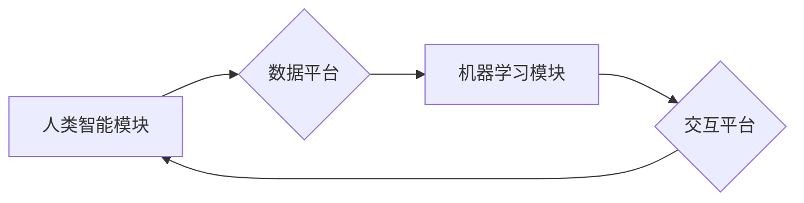

                 

## 应对人类共同挑战：人类计算的使命担当

> 关键词：人类计算、人工智能、大数据、机器学习、深度学习、可解释性、伦理、未来趋势

### 1. 背景介绍

人类正处于一个前所未有的时代。科技进步日新月异，人工智能（AI）等新兴技术正在深刻地改变着我们的生活。从自动驾驶汽车到智能医疗，从个性化教育到精准农业，AI技术的应用潜力无穷。然而，技术的进步也带来了新的挑战。如何确保AI技术安全、可靠、可解释？如何避免AI技术被滥用？如何让AI技术真正造福人类？这些问题迫切需要我们认真思考和解决。

人类计算作为一种新兴的计算范式，旨在将人类的智慧和机器的计算能力有机结合，以应对人类共同面临的挑战。它强调人机协作，强调算法的可解释性和透明性，强调AI技术的伦理和社会责任。

### 2. 核心概念与联系

#### 2.1 人类计算的定义

人类计算是指将人类的智慧和机器的计算能力有机结合起来，共同解决复杂问题的一种计算范式。它强调人机协作，将人类的创造力、洞察力和判断力与机器的计算速度、数据处理能力和逻辑推理能力相结合，以实现超越单一智能的协同效应。

#### 2.2 人类计算的架构

人类计算的架构通常包括以下几个关键要素：

* **人类智能模块:** 包括人类专家、决策者、创意者等，负责提供人类的智慧、经验和判断力。
* **机器学习模块:** 包括各种机器学习算法，负责从数据中学习模式、发现规律和进行预测。
* **数据平台:** 提供海量数据存储、处理和分析的能力，为机器学习模块提供数据支持。
* **交互平台:** 提供人机交互的界面和工具，方便人类与机器进行沟通和协作。

**Mermaid 流程图:**



#### 2.3 人类计算的优势

* **增强人类智能:** 人类计算可以帮助人类更好地理解复杂问题，做出更明智的决策。
* **提高效率和准确性:** 机器学习算法可以自动处理大量数据，提高效率和准确性。
* **促进创新:** 人机协作可以激发新的创意和想法，促进创新发展。
* **解决人类难题:** 人类计算可以帮助人类解决一些人类无法独自解决的难题，例如气候变化、疾病预防等。

### 3. 核心算法原理 & 具体操作步骤

#### 3.1 算法原理概述

人类计算的核心算法原理是基于机器学习和深度学习技术的。机器学习算法可以从数据中学习模式和规律，而深度学习算法则可以模拟人类大脑的神经网络结构，学习更复杂的模式和知识。

#### 3.2 算法步骤详解

1. **数据收集和预处理:** 收集相关数据，并进行清洗、转换和特征工程等预处理操作。
2. **模型选择和训练:** 选择合适的机器学习或深度学习算法，并根据训练数据进行模型训练。
3. **模型评估和优化:** 使用测试数据评估模型的性能，并根据评估结果进行模型优化。
4. **模型部署和应用:** 将训练好的模型部署到实际应用场景中，并进行监控和维护。

#### 3.3 算法优缺点

**优点:**

* 能够从数据中学习，不断提高性能。
* 可以处理复杂的数据模式。
* 能够自动化决策和预测。

**缺点:**

* 需要大量的训练数据。
* 模型训练过程可能耗时和耗能。
* 模型的解释性和透明性较差。

#### 3.4 算法应用领域

* **医疗诊断:** 利用机器学习算法分析患者的医疗影像和病历数据，辅助医生进行诊断。
* **金融风险管理:** 利用机器学习算法分析金融数据，识别和预测金融风险。
* **智能制造:** 利用机器学习算法优化生产流程，提高生产效率。
* **个性化教育:** 利用机器学习算法分析学生的学习数据，提供个性化的学习方案。

### 4. 数学模型和公式 & 详细讲解 & 举例说明

#### 4.1 数学模型构建

在人类计算中，常用的数学模型包括线性回归、逻辑回归、支持向量机、决策树、神经网络等。这些模型都基于一定的数学原理和公式，用于描述数据之间的关系和预测未来事件。

#### 4.2 公式推导过程

例如，线性回归模型的目的是找到一条直线，使得这条直线与数据点之间的距离最小。其目标函数为：

$$
J(\theta) = \frac{1}{2m} \sum_{i=1}^{m} (h_\theta(x^{(i)}) - y^{(i)})^2
$$

其中：

* $J(\theta)$ 是损失函数，表示模型预测值与真实值之间的误差。
* $\theta$ 是模型参数，需要通过梯度下降算法进行优化。
* $m$ 是训练样本的数量。
* $h_\theta(x^{(i)})$ 是模型预测值。
* $y^{(i)}$ 是真实值。

#### 4.3 案例分析与讲解

例如，假设我们想要预测房价，可以使用线性回归模型。我们可以收集房子的面积、房间数量、地理位置等数据，作为模型的输入特征。然后，通过训练模型，找到一条直线，使得这条直线与房价数据之间的距离最小。最终，我们可以使用这条直线来预测新房子的价格。

### 5. 项目实践：代码实例和详细解释说明

#### 5.1 开发环境搭建

* Python 3.x
* TensorFlow 或 PyTorch 等深度学习框架
* Jupyter Notebook 或 VS Code 等代码编辑器

#### 5.2 源代码详细实现

```python
import tensorflow as tf

# 定义模型结构
model = tf.keras.models.Sequential([
    tf.keras.layers.Dense(64, activation='relu', input_shape=(784,)),
    tf.keras.layers.Dense(10, activation='softmax')
])

# 编译模型
model.compile(optimizer='adam',
              loss='sparse_categorical_crossentropy',
              metrics=['accuracy'])

# 训练模型
model.fit(x_train, y_train, epochs=10)

# 评估模型
loss, accuracy = model.evaluate(x_test, y_test)
print('Loss:', loss)
print('Accuracy:', accuracy)
```

#### 5.3 代码解读与分析

这段代码实现了简单的深度学习模型训练。首先，定义了模型结构，包括两个全连接层。然后，编译模型，指定优化器、损失函数和评价指标。最后，使用训练数据训练模型，并使用测试数据评估模型性能。

#### 5.4 运行结果展示

训练完成后，可以查看模型的损失值和准确率。如果模型训练成功，损失值应该逐渐降低，准确率应该逐渐提高。

### 6. 实际应用场景

#### 6.1 智能客服

人类计算可以用于构建智能客服系统，帮助企业自动处理客户咨询和服务请求。例如，可以使用机器学习算法训练一个聊天机器人，能够理解客户的自然语言输入，并提供相应的回复。

#### 6.2 智能推荐

人类计算可以用于构建智能推荐系统，根据用户的兴趣和行为推荐相关商品或服务。例如，电商平台可以使用机器学习算法分析用户的购买历史和浏览记录，推荐用户可能感兴趣的商品。

#### 6.3 智能医疗诊断

人类计算可以用于辅助医生进行医疗诊断。例如，可以使用机器学习算法分析患者的医疗影像和病历数据，识别潜在的疾病风险。

#### 6.4 未来应用展望

随着人工智能技术的不断发展，人类计算将在更多领域得到应用，例如：

* **个性化教育:** 提供个性化的学习方案，帮助学生更好地掌握知识。
* **精准农业:** 利用传感器和机器学习算法，优化农业生产，提高粮食产量。
* **自动驾驶:** 构建更加安全可靠的自动驾驶系统。
* **科学研究:** 加速科学研究，解决一些人类无法独自解决的难题。

### 7. 工具和资源推荐

#### 7.1 学习资源推荐

* **在线课程:** Coursera、edX、Udacity 等平台提供丰富的机器学习和深度学习课程。
* **书籍:** 《深度学习》、《机器学习实战》等书籍是学习人工智能的经典教材。
* **开源项目:** TensorFlow、PyTorch 等开源深度学习框架提供了丰富的学习资源和示例代码。

#### 7.2 开发工具推荐

* **Python:** 人工智能开发的常用编程语言。
* **Jupyter Notebook:** 用于编写和运行Python代码的交互式笔记本环境。
* **VS Code:** 功能强大的代码编辑器，支持Python开发。

#### 7.3 相关论文推荐

* **《ImageNet Classification with Deep Convolutional Neural Networks》:** 提出了AlexNet模型，标志着深度学习的兴起。
* **《Attention Is All You Need》:** 提出了Transformer模型，在自然语言处理领域取得了突破性进展。
* **《BERT: Pre-training of Deep Bidirectional Transformers for Language Understanding》:** 提出了BERT模型，在自然语言理解任务中取得了state-of-the-art性能。

### 8. 总结：未来发展趋势与挑战

#### 8.1 研究成果总结

人类计算作为一种新兴的计算范式，取得了显著的成果。机器学习和深度学习算法在各个领域得到了广泛应用，并取得了令人瞩目的成就。

#### 8.2 未来发展趋势

未来，人类计算将朝着以下几个方向发展：

* **更加智能的算法:** 研究更加智能、高效、可解释的机器学习和深度学习算法。
* **更加广泛的应用场景:** 将人类计算技术应用到更多领域，解决更多人类面临的挑战。
* **更加注重伦理和社会责任:** 确保AI技术安全、可靠、可解释，并避免AI技术被滥用。

#### 8.3 面临的挑战

人类计算也面临着一些挑战：

* **数据安全和隐私保护:** 人类计算需要大量数据进行训练，如何确保数据的安全和隐私保护是一个重要问题。
* **算法可解释性和透明性:** 许多机器学习和深度学习算法的决策过程难以解释，如何提高算法的可解释性和透明性是一个重要的研究方向。
* **伦理和社会责任:** AI技术的快速发展也带来了伦理和社会责任问题，例如算法偏见、工作岗位替代等，需要引起社会广泛关注和讨论。

#### 8.4 研究展望

未来，人类计算的研究将更加注重以下几个方面：

* **发展更加安全、可靠、可解释的AI算法。**
* **探索人类与AI之间的协同合作模式。**
* **构建更加公平、公正、可持续的AI社会。**


### 9. 附录：常见问题与解答

**Q1: 人类计算与传统人工智能有什么区别？**

**A1:** 传统人工智能主要依靠规则和逻辑推理，而人类计算则更加注重数据驱动和学习能力。人类计算强调人机协作，将人类的智慧和机器的计算能力有机结合起来。

**Q2: 人类计算的应用场景有哪些？**

**A2:** 人类计算的应用场景非常广泛，例如智能客服、智能推荐、智能医疗诊断、自动驾驶、个性化教育等。

**Q3: 如何学习人类计算相关知识？**

**A3:** 可以通过在线课程、书籍、开源项目等方式学习人类计算相关知识。

**作者：禅与计算机程序设计艺术 / Zen and the Art of Computer Programming** 


<end_of_turn>

