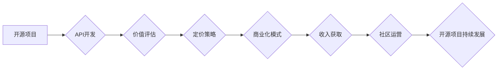

                 

## 开源项目的API商业化：策略和定价模型

> 关键词：开源项目、API商业化、定价策略、价值评估、商业模式、开源许可证、社区运营

## 1. 背景介绍

开源软件在现代科技发展中扮演着越来越重要的角色。其开放的特性促进了技术创新、社区协作和软件生态的繁荣。然而，开源项目本身通常难以直接盈利，开发者和维护者往往依靠捐赠、赞助或兼职工作来维持运营。随着开源软件的成熟和应用范围的扩大，如何将开源项目中的API商业化，并实现可持续发展，成为一个越来越重要的议题。

API（Application Programming Interface，应用程序接口）是软件之间通信和互操作的桥梁，它允许不同的应用程序访问和利用彼此的功能。开源项目的API可以为开发者提供丰富的功能和数据，并为企业提供定制化解决方案和服务。因此，将开源项目的API商业化，可以为开源社区和开发者带来新的收入来源，并推动开源软件的持续发展。

## 2. 核心概念与联系

**2.1 开源项目与API**

开源项目通常是指源代码公开可供他人修改和使用的软件项目。这些项目通常由社区开发者共同维护和改进。API是软件之间通信和互操作的接口，它允许不同的应用程序访问和利用彼此的功能。开源项目的API可以为开发者提供丰富的功能和数据，并为企业提供定制化解决方案和服务。

**2.2 API商业化模式**

API商业化是指通过提供API服务来获取收入的模式。常见的API商业化模式包括：

* **按使用量收费:** 根据API调用次数或数据传输量收取费用。
* **订阅制:** 提供不同级别的API服务套餐，用户根据需求选择订阅。
* **价值付费:** 根据API的使用价值或带来的效益收取费用。

**2.3 价值评估与定价策略**

API商业化的关键在于对API价值的评估和定价策略的制定。需要考虑API的功能、性能、数据量、用户群体、市场竞争等因素，制定合理的收费标准，既能保证开源项目的可持续发展，又能吸引用户使用。

**2.4 社区运营与商业化平衡**

开源项目的API商业化需要与社区运营保持平衡。商业化活动应该尊重开源社区的价值观和原则，并积极维护社区的活跃度和参与度。

**2.5 Mermaid 流程图**



## 3. 核心算法原理 & 具体操作步骤

**3.1 算法原理概述**

API商业化涉及到多个算法和技术，例如：

* **价值评估算法:** 用于评估API的功能、性能、数据量等因素，并将其转化为可量化的价值指标。
* **定价策略算法:** 根据API价值评估结果、市场竞争等因素，制定合理的收费标准。
* **用户行为分析算法:** 用于分析用户对API的使用情况，例如调用频率、数据量、功能使用等，以便优化API服务和定价策略。

**3.2 算法步骤详解**

**价值评估算法:**

1. **功能分析:** 识别API提供的核心功能和特性，并将其与市场需求进行匹配。
2. **性能评估:** 测量API的响应时间、吞吐量、稳定性等性能指标，并将其与竞争对手进行比较。
3. **数据量评估:** 评估API提供的数据的规模、质量、更新频率等，并将其与用户需求进行匹配。
4. **价值指标构建:** 将功能、性能、数据量等因素综合考虑，构建API的价值指标体系。

**定价策略算法:**

1. **成本分析:** 计算API开发、维护、运营等成本。
2. **市场调研:** 分析竞争对手的定价策略和市场价格水平。
3. **用户需求分析:** 了解用户对API的期望价格和支付意愿。
4. **定价模型选择:** 根据成本、市场和用户需求等因素，选择合适的定价模型，例如按使用量收费、订阅制、价值付费等。

**用户行为分析算法:**

1. **数据收集:** 收集用户对API的调用记录、数据传输量、功能使用情况等数据。
2. **数据分析:** 使用统计学、机器学习等方法分析用户行为数据，识别用户群体、使用模式、需求变化等。
3. **行为洞察:** 从用户行为数据中获得洞察，例如哪些功能最受欢迎、哪些用户群体对API的需求最大、哪些用户行为模式需要优化等。

**3.3 算法优缺点**

* **价值评估算法:** 优点是能够量化API的价值，为定价提供依据。缺点是价值评估指标的构建较为复杂，难以完全反映API的实际价值。
* **定价策略算法:** 优点是能够根据市场和用户需求制定合理的收费标准。缺点是定价策略需要不断调整，以适应市场变化和用户需求的变化。
* **用户行为分析算法:** 优点是能够深入了解用户对API的使用情况，为优化服务和定价策略提供数据支持。缺点是需要收集和分析大量用户数据，并保证数据安全和隐私。

**3.4 算法应用领域**

* **API商业化平台:** 用于提供API开发、管理、推广和收费服务。
* **开源项目社区:** 用于评估开源项目的价值，制定开源项目的发展策略。
* **企业内部API管理:** 用于管理企业内部的API，提高API的使用效率和安全性。

## 4. 数学模型和公式 & 详细讲解 & 举例说明

**4.1 数学模型构建**

API价值评估模型可以采用多种数学模型，例如：

* **线性模型:** 将API价值与功能、性能、数据量等因素进行线性加权，计算API的总价值。

$$
V = w_1F + w_2P + w_3D
$$

其中：

* $V$ 为API价值
* $F$ 为API功能得分
* $P$ 为API性能得分
* $D$ 为API数据量得分
* $w_1$, $w_2$, $w_3$ 为权重系数

* **指数模型:** 将API价值与功能、性能、数据量等因素进行指数加权，计算API的总价值。

$$
V = e^{w_1F + w_2P + w_3D}
$$

其中：

* $V$ 为API价值
* $F$ 为API功能得分
* $P$ 为API性能得分
* $D$ 为API数据量得分
* $w_1$, $w_2$, $w_3$ 为权重系数
* $e$ 为自然对数的底数

**4.2 公式推导过程**

线性模型和指数模型的推导过程主要基于以下假设：

* API价值可以由功能、性能、数据量等因素决定。
* 不同因素对API价值的影响程度不同，可以通过权重系数来体现。

**4.3 案例分析与讲解**

假设有一个API提供天气预报服务，其功能包括：

* 查询城市天气预报
* 查询历史天气数据
* 查询天气预报图

其性能指标包括：

* 响应时间：1秒以内
* 吞吐量：每分钟1000次请求

其数据量包括：

* 城市天气预报数据：每天更新一次
* 历史天气数据：可查询过去10年的数据

可以使用线性模型或指数模型对该API进行价值评估。

## 5. 项目实践：代码实例和详细解释说明

**5.1 开发环境搭建**

* **操作系统:** Linux/macOS/Windows
* **编程语言:** Python/Java/Node.js
* **API框架:** Flask/Django/Spring Boot/Express.js
* **数据库:** MySQL/PostgreSQL/MongoDB

**5.2 源代码详细实现**

以下是一个简单的Python Flask API示例：

```python
from flask import Flask, jsonify

app = Flask(__name__)

@app.route('/weather/<city>')
def get_weather(city):
    # 查询天气预报数据
    weather_data = get_weather_data(city)
    return jsonify(weather_data)

if __name__ == '__main__':
    app.run(debug=True)
```

**5.3 代码解读与分析**

* 该代码使用Flask框架构建了一个简单的API。
* `/weather/<city>` 路由用于查询指定城市的 weather 预报数据。
* `get_weather_data()` 函数用于查询天气预报数据，具体实现需要根据实际情况进行编写。
* `jsonify()` 函数将查询结果转换为JSON格式返回给客户端。

**5.4 运行结果展示**

运行该代码后，可以通过浏览器访问 `http://127.0.0.1:5000/weather/北京` 等地址获取北京市的 weather 预报数据。

## 6. 实际应用场景

**6.1 企业内部API**

企业可以将内部系统和服务暴露为API，方便其他部门和应用调用，提高数据共享和业务协作效率。

**6.2 第三方应用开发**

开发者可以利用开源项目的API开发新的应用程序和服务，扩展开源软件的功能和应用场景。

**6.3 数据分析和机器学习**

开源项目的API可以提供丰富的历史数据和实时数据，为数据分析和机器学习任务提供数据支持。

**6.4 社区协作和贡献**

API可以促进开源社区的协作和贡献，鼓励开发者共同维护和改进开源软件。

**6.4 未来应用展望**

随着云计算、大数据、人工智能等技术的快速发展，开源项目的API将发挥越来越重要的作用，例如：

* **微服务架构:** API将成为微服务架构的核心组件，实现不同微服务的通信和协作。
* **边缘计算:** API将帮助将边缘设备和数据与云端平台连接，实现数据分析和决策在边缘端的实时处理。
* **物联网:** API将连接各种物联网设备，实现设备之间的互联互通和数据共享。

## 7. 工具和资源推荐

**7.1 学习资源推荐**

* **书籍:**

    * "API Design Principles" by Robert C. Martin
    * "Building Microservices" by Sam Newman

* **在线课程:**

    * Coursera: "API Design and Development"
    * Udemy: "RESTful API Design"

**7.2 开发工具推荐**

* **API测试工具:** Postman, Insomnia
* **API文档生成工具:** Swagger, OpenAPI Generator
* **API监控工具:** Apigee, Kong

**7.3 相关论文推荐**

* "RESTful Web Services" by Leonard Richardson and Sam Ruby
* "Designing Data-Intensive Applications" by Martin Kleppmann

## 8. 总结：未来发展趋势与挑战

**8.1 研究成果总结**

开源项目的API商业化是一个不断发展和完善的领域。近年来，随着API技术的成熟和应用场景的扩展，API商业化模式和技术手段也取得了显著进展。

**8.2 未来发展趋势**

* **API平台化:** API平台将成为开源项目商业化的重要基础设施，提供API开发、管理、推广和收费等一站式服务。
* **API生态系统:** API生态系统将更加丰富和完善，包括API开发者、API使用者、API服务商等多方参与，形成良性循环。
* **API安全和隐私:** API安全和隐私将成为越来越重要的关注点，需要开发更加安全可靠的API解决方案。

**8.3 面临的挑战**

* **价值评估和定价:** 如何准确评估API的价值，并制定合理的收费标准，仍然是一个挑战。
* **社区运营和商业化平衡:** 如何平衡开源社区的价值观和商业化目标，需要谨慎考虑。
* **技术标准和互操作性:** API技术标准和互操作性需要不断完善，以促进API生态系统的健康发展。

**8.4 研究展望**

未来，开源项目的API商业化研究将继续深入，包括：

* **更精准的价值评估模型:** 开发更精准的API价值评估模型，能够更好地反映API的实际价值。
* **更灵活的定价策略:** 研究更灵活的API定价策略，例如按使用场景收费、按用户群体收费等。
* **更完善的API安全机制:** 开发更完善的API安全机制，保障API的安全性、可靠性和隐私性。


## 9. 附录：常见问题与解答

**9.1 如何评估开源项目的API价值？**

开源项目的API价值可以从以下几个方面进行评估：

* **功能:** API提供的功能是否丰富、是否满足用户需求。
* **性能:** API的响应时间、吞吐量、稳定性等性能指标是否满足用户要求。
* **数据量:** API提供的數據量是否足够大、数据质量是否高。
* **文档和支持:** API的文档是否清晰易懂、社区支持是否活跃。

**9.2 如何制定开源项目的API商业化策略？**

制定开源项目的API商业化策略需要考虑以下因素：

* **目标用户:** 确定目标用户群体，了解他们的需求和支付意愿。
* **市场竞争:** 分析竞争对手的API商业化模式和定价策略。
* **成本分析:** 计算API开发、维护、运营等成本。
* **社区运营:** 保证社区运营的活跃度和参与度。

**9.3 如何平衡开源社区的价值观和商业化目标？**

平衡开源社区的价值观和商业化目标需要遵循以下原则：

* **透明度:** 将商业化计划公开透明地向社区展示。
* **社区参与:** 鼓励社区参与商业化决策和实施。
* **利益共享:** 将商业化收益与社区共享。
* **开源精神:** 保证开源项目的核心代码和功能始终保持开源状态。


作者：禅与计算机程序设计艺术 / Zen and the Art of Computer Programming<end_of_turn>

