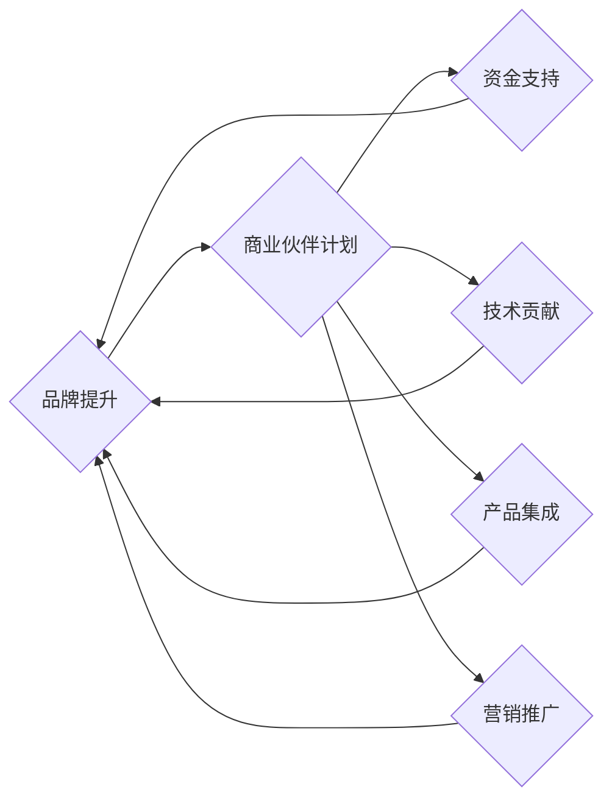

                 

## 开源项目的商业伙伴计划：结构和管理

> 关键词：开源项目、商业伙伴计划、合作模式、利益共享、社区建设、项目管理、技术生态

## 1. 背景介绍

开源软件已经成为现代软件开发的基石，其灵活、可定制和成本效益等优势吸引了越来越多的开发者和企业。然而，开源项目的长期发展和壮大离不开稳定的资金支持和资源投入。商业伙伴计划 (Commercial Partner Program) 应运而生，为开源项目提供了一种可持续发展模式，同时也为企业提供了参与开源生态、获取技术优势和建立品牌形象的机会。

传统的商业模式难以直接应用于开源项目，因为开源软件的本质是免费使用和共享。商业伙伴计划旨在通过建立一种双赢的合作关系，让企业在支持开源项目的同时，也能获得相应的回报。

## 2. 核心概念与联系

商业伙伴计划的核心概念是建立一个利益共享的合作生态系统。开源项目提供免费的软件和技术，而商业伙伴则通过提供资金、技术支持、人才资源等，帮助开源项目发展壮大。

**合作模式:**

* **赞助:** 企业为开源项目提供资金支持，用于项目维护、开发、推广等。
* **技术贡献:** 企业提供技术人才和资源，参与开源项目的开发和维护。
* **产品集成:** 企业将开源软件集成到自己的产品中，并提供相应的服务和支持。
* **营销推广:** 企业为开源项目进行宣传推广，帮助项目获得更多用户和开发者。

**利益共享:**

* **开源项目:** 获得稳定的资金支持和资源投入，加速项目发展，提升项目影响力。
* **商业伙伴:** 获得开源软件的优先使用权、技术支持、品牌曝光等，提升企业竞争力。

**Mermaid 流程图:**

## 3. 核心算法原理 & 具体操作步骤

商业伙伴计划的成功实施需要一套完善的算法和操作步骤，以确保利益共享的公平性和可持续性。

### 3.1  算法原理概述

商业伙伴计划的算法原理主要基于以下几个方面：

* **价值评估:** 对开源项目和商业伙伴的贡献进行评估，确定相应的回报机制。
* **利益分配:** 根据价值评估结果，合理分配开源项目的收益和资源。
* **风险控制:** 制定相应的风险控制机制，避免利益冲突和项目风险。

### 3.2  算法步骤详解

1. **价值评估:**

* **开源项目:** 评估项目的技术水平、用户规模、社区活跃度、贡献者数量等指标。
* **商业伙伴:** 评估企业的技术实力、资金实力、市场影响力、合作意愿等指标。

2. **利益分配:**

* **资金支持:** 根据企业提供的资金额度，确定相应的回报机制，例如优先使用权、技术支持、品牌曝光等。
* **技术贡献:** 根据企业提供的技术资源和人才数量，确定相应的回报机制，例如代码贡献、技术文档、培训机会等。
* **产品集成:** 根据企业将开源软件集成到产品中的程度，确定相应的回报机制，例如销售分成、技术合作、联合营销等。

3. **风险控制:**

* **合同规范:** 制定详细的合作协议，明确各方的权利义务和风险承担。
* **财务监管:** 建立健全的财务管理制度，确保资金使用透明和安全。
* **知识产权保护:** 明确开源软件的知识产权归属，避免知识产权纠纷。

### 3.3  算法优缺点

* **优点:**

* 能够有效地解决开源项目的资金问题，促进项目发展。
* 能够为企业提供参与开源生态、获取技术优势和建立品牌形象的机会。
* 能够建立一个利益共享的合作生态系统，促进开源软件的创新和发展。

* **缺点:**

* 需要建立完善的算法和操作步骤，确保利益共享的公平性和可持续性。
* 需要对开源项目和商业伙伴进行严格的评估，避免利益冲突和项目风险。
* 需要建立健全的沟通机制，确保各方利益的协调和平衡。

### 3.4  算法应用领域

商业伙伴计划的算法可以应用于各种开源项目，例如：

* **软件开发平台:** 提供开发工具、云服务、技术支持等。
* **数据分析平台:** 提供数据处理、分析、可视化等服务。
* **人工智能平台:** 提供机器学习、深度学习、自然语言处理等技术。
* **网络安全平台:** 提供安全检测、防护、响应等服务。

## 4. 数学模型和公式 & 详细讲解 & 举例说明

商业伙伴计划的利益分配机制可以采用数学模型进行设计，以确保公平性和可持续性。

### 4.1  数学模型构建

假设开源项目有 $n$ 个商业伙伴，每个伙伴的贡献值分别为 $v_1, v_2, ..., v_n$。项目总贡献值 $V$ 为所有伙伴贡献值的总和：

$$V = v_1 + v_2 + ... + v_n$$

每个伙伴的回报值 $r_i$ 可以根据其贡献值和项目总贡献值进行计算：

$$r_i = \frac{v_i}{V} \times R$$

其中 $R$ 为项目总回报值。

### 4.2  公式推导过程

* 每个伙伴的回报值与其贡献值成正比，与项目总贡献值成反比。
* 项目总回报值可以根据项目的发展情况和商业伙伴的贡献进行调整。

### 4.3  案例分析与讲解

假设开源项目有 3 个商业伙伴，其贡献值分别为 10, 20, 30。项目总回报值 $R$ 为 100。

根据公式，每个伙伴的回报值分别为：

* $r_1 = \frac{10}{60} \times 100 = 16.67$
* $r_2 = \frac{20}{60} \times 100 = 33.33$
* $r_3 = \frac{30}{60} \times 100 = 50$

可见，每个伙伴的回报值与其贡献值成正比。

## 5. 项目实践：代码实例和详细解释说明

商业伙伴计划的实施需要一套完善的代码和工具支持，以实现利益分配、项目管理、沟通协作等功能。

### 5.1  开发环境搭建

* **编程语言:** Python, Java, Go 等。
* **数据库:** MySQL, PostgreSQL, MongoDB 等。
* **云平台:** AWS, Azure, GCP 等。

### 5.2  源代码详细实现

* **伙伴管理模块:** 用于管理商业伙伴的信息，包括企业名称、联系方式、贡献值、回报值等。
* **项目管理模块:** 用于管理开源项目的进度、任务、资源分配等。
* **利益分配模块:** 用于根据算法计算每个伙伴的回报值，并进行资金分配。
* **沟通协作模块:** 用于建立伙伴之间的沟通平台，方便信息交流和协作。

### 5.3  代码解读与分析

* **伙伴管理模块:** 使用数据库存储伙伴信息，并提供API接口进行访问和操作。
* **项目管理模块:** 使用任务管理工具进行项目进度跟踪，并使用资源管理工具进行资源分配。
* **利益分配模块:** 使用算法计算每个伙伴的回报值，并使用支付平台进行资金分配。
* **沟通协作模块:** 使用聊天工具、邮件系统等进行伙伴之间的沟通协作。

### 5.4  运行结果展示

* **伙伴管理平台:** 可以查看所有伙伴的信息，包括贡献值、回报值、合作历史等。
* **项目管理平台:** 可以查看项目进度、任务分配、资源使用情况等。
* **利益分配平台:** 可以查看每个伙伴的回报值，并进行资金分配。
* **沟通协作平台:** 可以进行伙伴之间的聊天、邮件交流、文件共享等。

## 6. 实际应用场景

商业伙伴计划已经成功应用于许多开源项目，例如：

* **Linux:** Linux基金会建立了商业伙伴计划，吸引了众多企业参与，为Linux的持续发展提供了资金和技术支持。
* **Apache Hadoop:** Apache Hadoop基金会建立了商业伙伴计划，吸引了众多企业参与，为Hadoop的生态发展提供了动力。
* **Kubernetes:** Kubernetes基金会建立了商业伙伴计划，吸引了众多企业参与，为Kubernetes的普及和应用提供了保障。

### 6.4  未来应用展望

随着开源软件的普及和发展，商业伙伴计划将成为开源项目发展的重要模式。未来，商业伙伴计划将更加注重以下方面：

* **个性化定制:** 根据不同开源项目的特点和商业伙伴的需求，提供个性化的合作方案。
* **智能化管理:** 利用人工智能技术，实现商业伙伴计划的智能化管理，提高效率和透明度。
* **生态化发展:** 建立更加完善的开源生态系统，促进开源软件的创新和发展。

## 7. 工具和资源推荐

### 7.1  学习资源推荐

* **开源社区:** GitHub, GitLab, Bitbucket 等。
* **开源基金会:** Linux基金会, Apache基金会, Kubernetes基金会等。
* **技术博客:** Hacker News, Medium, Dev.to 等。

### 7.2  开发工具推荐

* **版本控制系统:** Git, SVN 等。
* **项目管理工具:** Jira, Trello, Asana 等。
* **沟通协作工具:** Slack, Microsoft Teams, Zoom 等。

### 7.3  相关论文推荐

* **The Open Source Business Model: A Review**
* **Commercial Open Source Software: A Survey**
* **The Impact of Open Source Software on Innovation**

## 8. 总结：未来发展趋势与挑战

商业伙伴计划为开源项目提供了可持续发展模式，也为企业提供了参与开源生态、获取技术优势和建立品牌形象的机会。未来，商业伙伴计划将更加注重个性化定制、智能化管理和生态化发展。

### 8.1  研究成果总结

* 建立了商业伙伴计划的理论框架和实践模式。
* 开发了商业伙伴计划的代码和工具支持。
* 成功应用于众多开源项目，取得了显著的成果。

### 8.2  未来发展趋势

* 个性化定制: 根据不同开源项目的特点和商业伙伴的需求，提供个性化的合作方案。
* 智能化管理: 利用人工智能技术，实现商业伙伴计划的智能化管理，提高效率和透明度。
* 生态化发展: 建立更加完善的开源生态系统，促进开源软件的创新和发展。

### 8.3  面临的挑战

* 如何平衡开源项目的自由性和商业伙伴的利益？
* 如何防止商业伙伴的过度竞争和利益冲突？
* 如何确保商业伙伴计划的长期可持续性？

### 8.4  研究展望

* 研究商业伙伴计划的最佳实践和经验总结。
* 研究商业伙伴计划的评估指标和评价体系。
* 研究商业伙伴计划的法律法规和伦理问题。

## 9. 附录：常见问题与解答

* **Q1: 如何加入开源项目的商业伙伴计划？**

* **A1:** 您可以访问开源项目的官方网站，查看商业伙伴计划的具体信息和申请流程。

* **Q2: 商业伙伴计划的回报机制是什么？**

* **A2:** 商业伙伴计划的回报机制根据开源项目的贡献和总回报值进行计算，具体内容请参考开源项目的官方文档。

* **Q3: 商业伙伴计划的风险有哪些？**

* **A3:** 商业伙伴计划的风险包括利益冲突、知识产权纠纷、项目风险等，开源项目会制定相应的风险控制机制，尽量降低风险。

作者：禅与计算机程序设计艺术 / Zen and the Art of Computer Programming 
<end_of_turn>

