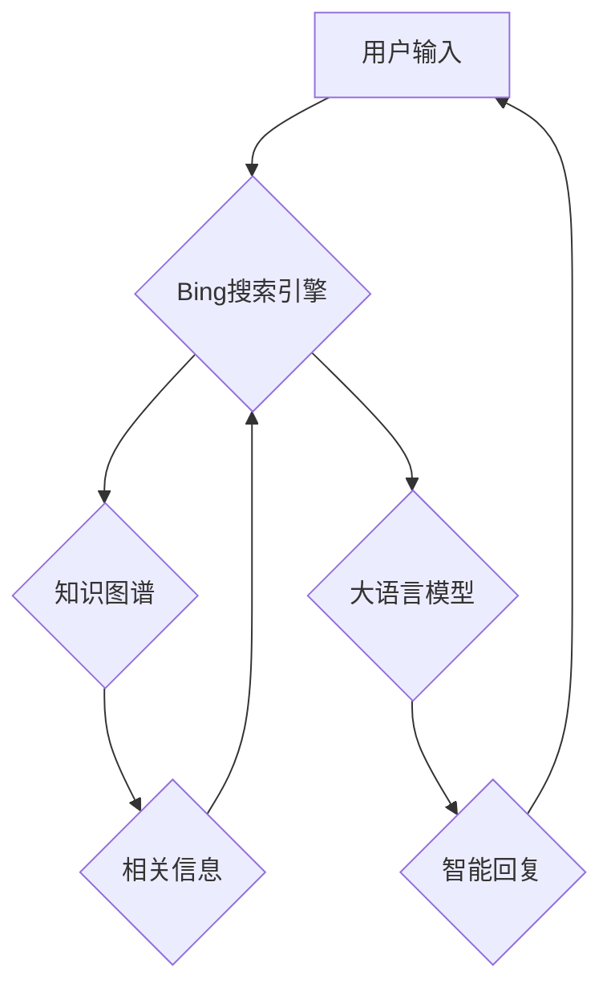

                 

## 微软AI战略：Bing升级

> 关键词：人工智能、大语言模型、搜索引擎、Bing、OpenAI、ChatGPT、自然语言处理、知识图谱

## 1. 背景介绍

在科技发展日新月异的今天，人工智能（AI）已成为引领未来发展的核心力量。作为科技巨头，微软深知AI的巨大潜力，并将其作为公司战略的核心。近年来，微软在AI领域取得了显著进展，尤其是在大语言模型（LLM）领域，与OpenAI的合作更是推动了其AI战略的加速发展。

Bing，微软旗下的搜索引擎，一直以来都处于谷歌搜索的阴影下。然而，随着AI技术的快速发展，微软看到了改变现状的机会。2023年，微软宣布将OpenAI的ChatGPT技术整合到Bing中，标志着Bing迈向全新时代的开始。

## 2. 核心概念与联系

Bing的升级的核心在于将大语言模型技术融入搜索引擎，从而实现更智能、更人性化的搜索体验。

**2.1 核心概念**

* **搜索引擎:**  通过索引网页内容，根据用户查询关键词返回相关结果的系统。传统搜索引擎主要依靠关键词匹配和网页排名算法。
* **大语言模型 (LLM):**  一种能够理解和生成人类语言的深度学习模型。通过训练海量文本数据，LLM可以完成各种自然语言处理任务，例如文本生成、翻译、问答等。
* **自然语言处理 (NLP):**  计算机科学的一个分支，致力于使计算机能够理解、处理和生成人类语言。

**2.2 架构关系**



**2.3 核心联系**

Bing升级后，用户输入的查询不再仅仅被视为关键词，而是被视为一个完整的自然语言请求。Bing会首先利用知识图谱获取相关背景信息，然后将请求传递给大语言模型进行理解和分析。大语言模型会根据用户意图，从海量知识库中检索信息，并生成更精准、更全面的智能回复。

## 3. 核心算法原理 & 具体操作步骤

**3.1 算法原理概述**

Bing升级的核心算法原理是基于Transformer架构的深度学习模型，结合了自然语言理解、知识图谱检索和文本生成等技术。

* **Transformer:**  一种新型的神经网络架构，能够有效处理序列数据，例如文本。Transformer模型通过自注意力机制，能够捕捉文本中的长距离依赖关系，从而实现更精准的理解和生成。
* **知识图谱检索:**  利用知识图谱中的结构化数据，快速定位和检索与用户查询相关的关键信息。
* **文本生成:**  基于训练数据，生成流畅、自然、符合语境的文本回复。

**3.2 算法步骤详解**

1. **用户输入预处理:** 将用户输入的自然语言文本进行清洗、分词、词性标注等预处理操作，使其能够被模型理解。
2. **知识图谱查询:** 根据预处理后的文本，查询知识图谱，获取与用户查询相关的实体、关系和属性信息。
3. **Transformer模型编码:** 将预处理后的文本和知识图谱信息作为输入，输入到Transformer模型中进行编码，提取文本的语义特征和上下文关系。
4. **解码生成回复:**  根据Transformer模型的输出，利用文本生成模型解码，生成符合语境的智能回复。
5. **回复输出:** 将生成的智能回复输出给用户。

**3.3 算法优缺点**

* **优点:** 
    * 能够理解和处理更复杂的自然语言查询。
    * 能够提供更精准、更全面的搜索结果。
    * 能够生成更自然、更人性化的智能回复。
* **缺点:** 
    * 模型训练需要海量数据和计算资源。
    * 模型可能存在偏见或错误，需要不断进行优化和改进。

**3.4 算法应用领域**

* 搜索引擎优化
* 智能客服
* 内容创作
* 教育培训
* 人机交互

## 4. 数学模型和公式 & 详细讲解 & 举例说明

**4.1 数学模型构建**

Bing升级的核心算法基于Transformer架构，其数学模型主要包括以下几个部分：

* **词嵌入:** 将单词映射到低维向量空间，捕捉单词之间的语义关系。常用的词嵌入方法包括Word2Vec和GloVe。
* **自注意力机制:**  允许模型关注文本中的不同部分，捕捉长距离依赖关系。自注意力机制的计算公式如下：

$$
Attention(Q, K, V) = \frac{exp(Q \cdot K^T / \sqrt{d_k})}{exp(Q \cdot K^T / \sqrt{d_k})} \cdot V
$$

其中，Q、K、V分别代表查询矩阵、键矩阵和值矩阵，$d_k$代表键向量的维度。

* **多头注意力:**  使用多个自注意力头，并行处理文本信息，提高模型的表达能力。
* **前馈神经网络:**  对每个词的嵌入向量进行非线性变换，进一步提取语义特征。

**4.2 公式推导过程**

Transformer模型的训练目标是最大化预测下一个词的概率。具体来说，模型会使用交叉熵损失函数，计算预测结果与真实结果之间的差异。

**4.3 案例分析与讲解**

例如，用户输入查询“苹果公司总部在哪里？”，模型会首先使用词嵌入将查询词映射到向量空间。然后，模型会利用自注意力机制捕捉“苹果公司”和“总部”之间的关系，并结合知识图谱信息，定位到苹果公司的总部位于加州库比蒂诺。最后，模型会生成智能回复“苹果公司的总部位于加州库比蒂诺”。

## 5. 项目实践：代码实例和详细解释说明

**5.1 开发环境搭建**

* Python 3.7+
* TensorFlow 或 PyTorch 深度学习框架
* CUDA 和 cuDNN (可选，用于GPU加速)

**5.2 源代码详细实现**

由于篇幅限制，这里只提供代码框架示例，具体实现细节请参考相关开源项目或文档。

```python
# 导入必要的库
import tensorflow as tf

# 定义Transformer模型
class Transformer(tf.keras.Model):
    def __init__(self, vocab_size, embedding_dim, num_heads, num_layers):
        super(Transformer, self).__init__()
        # ... 模型结构定义 ...

    def call(self, inputs):
        # ... 模型前向传播过程 ...

# 训练模型
model = Transformer(vocab_size=..., embedding_dim=..., num_heads=..., num_layers=...)
model.compile(optimizer='adam', loss='categorical_crossentropy', metrics=['accuracy'])
model.fit(train_data, train_labels, epochs=10)

# 预测结果
predictions = model.predict(test_data)
```

**5.3 代码解读与分析**

* Transformer模型的结构定义包括词嵌入层、多头注意力层、前馈神经网络层等。
* 模型的训练过程使用交叉熵损失函数和Adam优化器。
* 模型的预测过程将输入文本转换为向量表示，并通过模型进行前向传播，得到输出结果。

**5.4 运行结果展示**

训练完成后，模型可以用于预测下一个词、翻译文本、生成文本等任务。运行结果展示可以包括预测准确率、BLEU分数等指标。

## 6. 实际应用场景

Bing升级后的AI能力可以应用于多种场景，例如：

* **更智能的搜索体验:**  用户可以进行更自然、更复杂的查询，例如“给我推荐一些关于人工智能的最新论文”，Bing可以理解用户意图，并提供相关论文链接。
* **个性化搜索结果:**  Bing可以根据用户的搜索历史、兴趣爱好等信息，提供更个性化的搜索结果。
* **对话式搜索:**  用户可以与Bing进行对话式交互，例如“我正在寻找一家附近的餐厅，可以推荐一些吗？”，Bing可以根据用户的地理位置和口味偏好，推荐合适的餐厅。

**6.4 未来应用展望**

未来，Bing的AI能力将进一步增强，例如：

* **多模态搜索:**  支持图像、音频等多模态数据的搜索。
* **实时信息更新:**  能够实时获取和更新信息，提供更及时准确的搜索结果。
* **更深入的理解:**  能够更深入地理解用户的意图，提供更精准、更全面的服务。

## 7. 工具和资源推荐

**7.1 学习资源推荐**

* **书籍:**
    * 《深度学习》
    * 《自然语言处理》
    * 《Transformer模型详解》
* **在线课程:**
    * Coursera: 深度学习
    * edX: 自然语言处理
    * fast.ai: 深度学习课程

**7.2 开发工具推荐**

* **TensorFlow:**  开源深度学习框架
* **PyTorch:**  开源深度学习框架
* **Hugging Face Transformers:**  提供预训练Transformer模型和工具

**7.3 相关论文推荐**

* 《Attention Is All You Need》
* 《BERT: Pre-training of Deep Bidirectional Transformers for Language Understanding》
* 《GPT-3: Language Models are Few-Shot Learners》

## 8. 总结：未来发展趋势与挑战

**8.1 研究成果总结**

Bing的升级标志着搜索引擎领域迈向AI时代的重要一步。通过将大语言模型技术融入搜索引擎，Bing能够提供更智能、更人性化的搜索体验。

**8.2 未来发展趋势**

未来，搜索引擎将更加智能化、个性化、多模态化。AI技术将继续推动搜索引擎的发展，例如：

* **更强大的语言理解能力:**  能够理解更复杂的自然语言查询，并提供更精准的搜索结果。
* **更个性化的搜索体验:**  能够根据用户的搜索历史、兴趣爱好等信息，提供更个性化的搜索结果。
* **多模态搜索:**  支持图像、音频等多模态数据的搜索。

**8.3 面临的挑战**

* **数据安全和隐私:**  搜索引擎需要处理大量用户数据，如何保障数据安全和隐私是一个重要的挑战。
* **算法偏见:**  AI模型可能存在偏见，需要不断进行优化和改进，确保搜索结果公平公正。
* **可解释性:**  AI模型的决策过程往往难以理解，如何提高模型的可解释性是一个重要的研究方向。

**8.4 研究展望**

未来，搜索引擎将继续朝着更智能、更人性化、更安全的方向发展。AI技术将继续推动搜索引擎的创新，为用户提供更便捷、更丰富的搜索体验。

## 9. 附录：常见问题与解答

* **Bing升级后的搜索结果会更加准确吗？**

是的，Bing升级后的搜索结果会更加准确，因为模型能够更好地理解用户的意图，并从海量知识库中检索更相关的信息。

* **Bing升级后会取代传统的搜索引擎吗？**

Bing升级是搜索引擎领域的重要发展，但传统的搜索引擎仍然发挥着重要作用。未来，搜索引擎将更加多样化，不同类型的搜索引擎将满足不同用户的需求。

* **Bing升级对用户隐私有什么影响？**

微软致力于保护用户隐私，Bing升级后的数据收集和使用将遵循微软的隐私政策。

作者：禅与计算机程序设计艺术 / Zen and the Art of Computer Programming


<end_of_turn>

