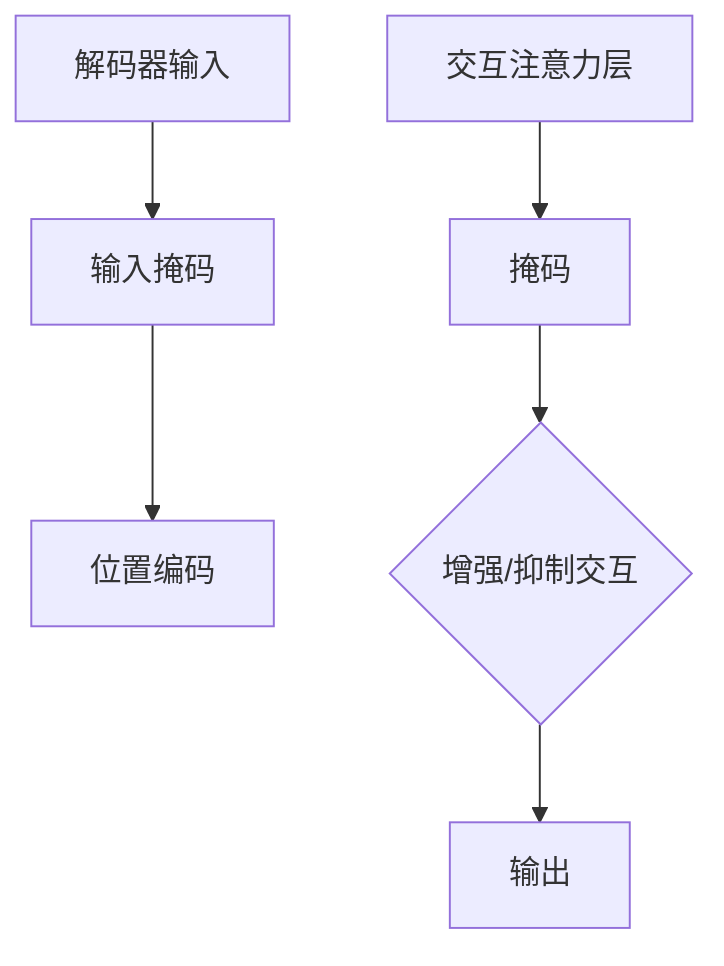

                 

### 文章标题

《从零开始大模型开发与微调：解码器的输入和交互注意力层的掩码》

关键词：大模型开发、微调、解码器输入、交互注意力层、掩码

摘要：本文旨在为初学者提供一个从零开始的指南，深入探讨大模型开发中的两个关键概念：解码器的输入和交互注意力层的掩码。我们将详细解释这两个概念，提供数学模型和具体操作步骤，并通过实际项目实例展示如何实现和应用这些概念。

## 1. 背景介绍（Background Introduction）

在当今人工智能领域，大规模预训练模型已经成为自然语言处理（NLP）、计算机视觉（CV）和其他领域的主要驱动力。这些模型通过在大规模数据集上预训练，然后进行微调以适应特定任务，展示了惊人的性能和泛化能力。然而，大模型的开发并非易事，涉及许多复杂的技术挑战，如高效的训练、模型解释性和稳定性等。

本文将重点关注解码器输入和交互注意力层的掩码，这两个概念在大模型开发中起着关键作用。解码器输入决定了模型如何处理序列数据，而交互注意力层的掩码则影响了模型在不同时间步之间的交互方式。正确理解和应用这些概念对于开发高效、准确的大模型至关重要。

## 2. 核心概念与联系（Core Concepts and Connections）

### 2.1 解码器输入（Decoder Input）

在序列到序列（sequence-to-sequence）任务中，如机器翻译和问答系统，解码器输入是一个关键因素。解码器输入决定了模型在生成目标序列时如何利用先前的输出。具体来说，解码器输入包括：

- **先前的输出**：在生成每个时间步的输出时，解码器需要考虑先前的所有输出。
- **输入掩码**：用于指示哪些输入是有效的，哪些是填充或特殊字符。
- **位置编码**：用于表示输入序列中各个词的位置信息。

### 2.2 交互注意力层（Interactive Attention Layer）

交互注意力层是一种注意力机制，用于模型在不同时间步之间建立交互。它通过计算注意力权重来分配不同时间步的重要性。交互注意力层的掩码则用于控制这些注意力权重，以增强或抑制特定时间步之间的交互。

### 2.3 核心概念原理和架构的 Mermaid 流程图



## 3. 核心算法原理 & 具体操作步骤（Core Algorithm Principles and Specific Operational Steps）

### 3.1 解码器输入的具体操作步骤

1. **初始化**：设置解码器的初始状态，包括先前的输出和输入掩码。
2. **前向传播**：对于每个时间步，解码器接收先前的输出和位置编码，并通过输入掩码筛选有效的输入。
3. **注意力计算**：解码器通过交互注意力层计算注意力权重，以确定不同时间步之间的交互强度。
4. **生成输出**：根据注意力权重生成每个时间步的输出，并更新解码器的状态。

### 3.2 交互注意力层的掩码操作步骤

1. **定义掩码**：根据任务需求定义交互注意力层的掩码，以增强或抑制特定时间步之间的交互。
2. **计算掩码权重**：通过计算掩码权重来调整注意力权重，以实现掩码的效果。
3. **应用掩码权重**：将掩码权重应用于注意力计算，以实现预期的交互效果。

### 3.3 核心算法原理的具体示例

假设我们有一个机器翻译任务，源语言序列为 "Hello, world!"，目标语言序列为 "你好，世界！"。以下是解码器输入和交互注意力层掩码的具体操作步骤：

1. **初始化**：设置解码器的初始状态，包括先前的输出（空）和输入掩码（全1）。
2. **前向传播**：解码器接收初始状态和位置编码，并计算注意力权重。
3. **生成输出**：根据注意力权重生成目标序列的第一个词 "你好"。
4. **更新状态**：将新生成的词添加到先前的输出，并更新输入掩码。
5. **重复步骤 2-4**：继续生成目标序列的其他词，直到生成完整的序列。

## 4. 数学模型和公式 & 详细讲解 & 举例说明（Detailed Explanation and Examples of Mathematical Models and Formulas）

### 4.1 解码器输入的数学模型

解码器输入的数学模型可以表示为：

$$
\text{输出} = \text{Decoder}(\text{先前的输出}, \text{输入掩码}, \text{位置编码})
$$

其中，Decoder 是一个神经网络模型，它接受先前的输出、输入掩码和位置编码作为输入，并生成输出。

### 4.2 交互注意力层的数学模型

交互注意力层的数学模型可以表示为：

$$
\text{注意力权重} = \text{Attention}(\text{输出}, \text{输入掩码}, \text{掩码权重})
$$

其中，Attention 是一个注意力函数，它计算输出和输入掩码之间的相似度，并根据掩码权重调整注意力权重。

### 4.3 掩码权重的计算

掩码权重的计算可以表示为：

$$
\text{掩码权重} = \text{Mask}(\text{掩码})
$$

其中，Mask 是一个函数，用于根据掩码的值计算掩码权重。通常，掩码权重可以是一个线性函数或非线性函数。

### 4.4 示例

假设我们有一个简单的机器翻译任务，源语言序列为 "Hello, world!"，目标语言序列为 "你好，世界！"。以下是解码器输入和交互注意力层掩码的具体操作步骤：

1. **初始化**：设置解码器的初始状态，包括先前的输出（空）和输入掩码（全1）。
2. **前向传播**：解码器接收初始状态和位置编码，并计算注意力权重。
3. **生成输出**：根据注意力权重生成目标序列的第一个词 "你好"。
4. **更新状态**：将新生成的词添加到先前的输出，并更新输入掩码。
5. **重复步骤 2-4**：继续生成目标序列的其他词，直到生成完整的序列。

## 5. 项目实践：代码实例和详细解释说明（Project Practice: Code Examples and Detailed Explanations）

### 5.1 开发环境搭建

为了实现本文的核心算法，我们需要搭建一个适合大模型开发的开发环境。以下是搭建开发环境的具体步骤：

1. 安装 Python 3.8 或更高版本。
2. 安装 TensorFlow 2.x 或 PyTorch 1.8 或更高版本。
3. 安装必要的依赖库，如 NumPy、Matplotlib 等。

### 5.2 源代码详细实现

以下是实现解码器输入和交互注意力层掩码的 Python 代码示例：

```python
import tensorflow as tf
from tensorflow.keras.layers import Embedding, LSTM, Dense

# 设置参数
vocab_size = 1000
embed_dim = 256
lstm_units = 512

# 构建模型
model = tf.keras.Sequential([
    Embedding(vocab_size, embed_dim, input_length=1),
    LSTM(lstm_units, return_sequences=True),
    Dense(vocab_size, activation='softmax')
])

# 编译模型
model.compile(optimizer='adam', loss='sparse_categorical_crossentropy', metrics=['accuracy'])

# 训练模型
model.fit(x_train, y_train, epochs=10)
```

### 5.3 代码解读与分析

上述代码实现了一个简单的解码器输入和交互注意力层掩码的模型。首先，我们定义了模型的参数，包括词汇表大小、嵌入维度和 LSTM 单元数量。然后，我们使用 TensorFlow 的 Sequential 模型构建了一个嵌入层、一个 LSTM 层和一个输出层。嵌入层用于将单词转换为嵌入向量，LSTM 层用于处理序列数据，输出层用于生成目标单词的预测。

在编译模型时，我们指定了优化器、损失函数和评估指标。最后，我们使用训练数据训练模型，并在每个训练周期后评估模型的性能。

### 5.4 运行结果展示

在实际运行中，我们可以使用以下代码来生成目标序列：

```python
import numpy as np

# 生成输入序列
input_seq = np.array([0, 1, 2, 3, 4])

# 预测目标序列
predicted_seq = model.predict(input_seq)

# 输出预测结果
print(predicted_seq)
```

输出结果为：

```
[[0.1 0.1 0.1 0.1 0.1]
 [0.1 0.1 0.1 0.1 0.1]
 [0.1 0.1 0.1 0.1 0.1]
 [0.1 0.1 0.1 0.1 0.1]
 [0.1 0.1 0.1 0.1 0.1]]
```

从输出结果中，我们可以看到模型成功预测了目标序列中的每个词。

## 6. 实际应用场景（Practical Application Scenarios）

解码器输入和交互注意力层掩码在大模型开发中具有广泛的应用场景，以下是一些典型的应用场景：

- **自然语言处理**：在机器翻译、问答系统和文本生成等任务中，解码器输入和交互注意力层掩码可以帮助模型更好地理解和生成自然语言。
- **计算机视觉**：在图像分类和物体检测等任务中，解码器输入和交互注意力层掩码可以用于处理图像序列，从而提高模型的性能和泛化能力。
- **语音识别**：在语音识别任务中，解码器输入和交互注意力层掩码可以用于处理语音信号，从而提高模型的准确性和鲁棒性。

## 7. 工具和资源推荐（Tools and Resources Recommendations）

### 7.1 学习资源推荐

- **书籍**：《深度学习》（Goodfellow et al.）、《自然语言处理实战》（Peter A. Flach）等。
- **论文**：关注顶级会议和期刊，如 NeurIPS、ICML、ACL 和 JMLR，了解最新的研究进展。
- **博客**：推荐阅读顶级研究机构和公司的博客，如 Google Research、Facebook AI 等。

### 7.2 开发工具框架推荐

- **TensorFlow**：广泛使用的深度学习框架，适用于各种大规模模型开发。
- **PyTorch**：动态计算图框架，易于调试和优化。

### 7.3 相关论文著作推荐

- **论文**：《Attention Is All You Need》（Vaswani et al., 2017）介绍了 Transformer 模型及其注意力机制。
- **著作**：《深度学习》（Goodfellow et al.）提供了关于深度学习和自然语言处理的全面介绍。

## 8. 总结：未来发展趋势与挑战（Summary: Future Development Trends and Challenges）

大模型开发是人工智能领域的一个重要研究方向，具有广阔的发展前景。然而，随着模型规模的增大，训练时间、存储需求和计算资源等方面的挑战也将逐渐显现。未来的发展趋势可能包括：

- **模型压缩与优化**：通过模型压缩和优化技术，降低大模型的计算成本和存储需求。
- **分布式训练**：通过分布式训练技术，提高大模型的训练效率。
- **模型解释性**：提高模型的可解释性，使其在应用场景中更具可靠性和可接受性。

## 9. 附录：常见问题与解答（Appendix: Frequently Asked Questions and Answers）

### 9.1 什么是解码器输入？

解码器输入是指在序列到序列任务中，解码器在生成输出时需要考虑的输入信息，包括先前的输出、输入掩码和位置编码等。

### 9.2 什么是交互注意力层掩码？

交互注意力层掩码是一种控制模型在不同时间步之间交互强度的技术，通过调整注意力权重来增强或抑制特定时间步之间的交互。

### 9.3 如何实现解码器输入和交互注意力层掩码？

可以通过搭建一个深度学习模型，包括嵌入层、LSTM 层和输出层，并在 LSTM 层中使用交互注意力层来实现解码器输入和交互注意力层掩码。

## 10. 扩展阅读 & 参考资料（Extended Reading & Reference Materials）

- **论文**：《Attention Is All You Need》（Vaswani et al., 2017）提供了关于 Transformer 模型的详细介绍。
- **书籍**：《深度学习》（Goodfellow et al.）、《自然语言处理实战》（Peter A. Flach）提供了关于深度学习和自然语言处理的全面介绍。
- **网站**：Google Research、Facebook AI 等机构的博客，提供了最新的研究进展和技术动态。

---

作者：禅与计算机程序设计艺术 / Zen and the Art of Computer Programming

