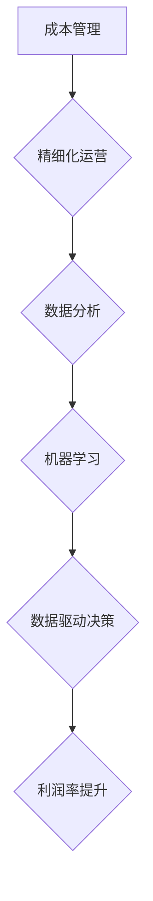

                 

## 成本管理：提高利润率的精细化操作

> 关键词：成本管理、利润率、精细化运营、数据分析、机器学习、优化算法、云计算、自动化

## 1. 背景介绍

在当今竞争激烈的市场环境下，企业利润率的提升成为至关重要的目标。而成本管理作为影响利润率的关键因素之一，其精细化运营已成为企业提升盈利能力的重要策略。传统成本管理模式往往依赖于经验和主观判断，难以实现精准控制和优化。随着数据分析、机器学习等技术的快速发展，企业可以利用这些技术手段进行成本管理的数字化转型，实现更精细化的运营，从而有效提高利润率。

## 2. 核心概念与联系

### 2.1  成本管理概述

成本管理是指企业在生产、销售和运营过程中，对成本的计划、控制、分析和优化的一系列活动。其目标是通过降低成本、提高效率，最终实现利润最大化。

### 2.2  精细化运营

精细化运营是指通过数据分析、自动化等手段，对企业运营过程进行细致的监控和管理，以实现资源的优化配置、流程的精简化和效率的提升。

### 2.3  数据驱动决策

数据驱动决策是指利用数据分析和机器学习等技术，从海量数据中挖掘有价值的信息，为企业决策提供科学依据。

**核心概念与联系流程图**



## 3. 核心算法原理 & 具体操作步骤

### 3.1  算法原理概述

成本管理中常用的算法包括：

* **线性规划算法:** 用于在满足约束条件的情况下，找到最优的成本分配方案。
* **遗传算法:** 用于优化复杂系统中的成本结构，找到最优的成本控制策略。
* **神经网络算法:** 用于预测未来成本趋势，帮助企业提前做好成本控制准备。

### 3.2  算法步骤详解

以线性规划算法为例，其具体步骤如下：

1. **定义目标函数:** 明确需要优化的成本指标，例如总成本、单位成本等。
2. **建立约束条件:** 根据实际情况，设定成本控制的限制条件，例如原材料采购量、生产能力等。
3. **构建线性规划模型:** 将目标函数和约束条件转化为数学模型，以便算法求解。
4. **求解线性规划模型:** 使用线性规划算法，例如单纯形法，求解模型的最佳解。
5. **分析结果:** 根据算法结果，调整成本控制策略，实现成本的优化。

### 3.3  算法优缺点

**线性规划算法:**

* **优点:** 算法简单易懂，计算效率高，适用于规模较小的成本控制问题。
* **缺点:** 难以处理复杂非线性成本问题，对数据准确性要求较高。

**遗传算法:**

* **优点:** 能够处理复杂非线性成本问题，具有较强的全局搜索能力。
* **缺点:** 计算效率相对较低，需要大量的计算资源和时间。

**神经网络算法:**

* **优点:** 能够学习数据中的复杂模式，对未来成本趋势进行准确预测。
* **缺点:** 需要大量的训练数据，模型训练过程复杂，解释性较差。

### 3.4  算法应用领域

* **生产成本管理:** 优化生产流程，降低原材料消耗，提高生产效率。
* **销售成本管理:** 分析销售数据，优化营销策略，降低销售费用。
* **运营成本管理:** 优化物流配送，降低运营成本，提高服务效率。

## 4. 数学模型和公式 & 详细讲解 & 举例说明

### 4.1  数学模型构建

假设企业有n种产品，每种产品的生产成本分别为c1, c2, ..., cn，销售价格分别为p1, p2, ..., pn。企业目标是最大化利润，利润可以表示为：

$$Profit = \sum_{i=1}^{n} (p_i - c_i) * q_i$$

其中，qi表示第i种产品的销售量。

### 4.2  公式推导过程

为了最大化利润，需要确定每个产品的销售量qi。由于生产资源有限，存在生产约束条件：

$$ \sum_{i=1}^{n} a_{ij} * q_i \leq b_j $$

其中，a_{ij}表示生产第i种产品需要消耗第j种资源的量，b_j表示第j种资源的总供应量。

### 4.3  案例分析与讲解

例如，一家企业生产两种产品A和B，生产成本分别为10元和15元，销售价格分别为20元和25元。资源限制条件为：

* 生产产品A需要1小时的加工时间，产品B需要2小时的加工时间，总加工时间为10小时。
* 生产产品A需要2公斤原材料，产品B需要3公斤原材料，总原材料供应量为10公斤。

利用线性规划算法，可以求解出最大利润的销售量qi，以及满足资源限制条件的生产方案。

## 5. 项目实践：代码实例和详细解释说明

### 5.1  开发环境搭建

* 操作系统: Ubuntu 20.04
* 编程语言: Python 3.8
* 软件包: pandas, numpy, scikit-learn, matplotlib

### 5.2  源代码详细实现

```python
import pandas as pd
from sklearn.linear_model import LinearRegression

# 导入数据
data = pd.read_csv('cost_data.csv')

# 训练模型
X = data[['加工时间', '原材料']]
y = data['利润']
model = LinearRegression()
model.fit(X, y)

# 预测利润
new_data = pd.DataFrame({'加工时间': [8, 10], '原材料': [8, 12]})
predicted_profit = model.predict(new_data)

# 展示结果
print(predicted_profit)
```

### 5.3  代码解读与分析

* 首先，导入必要的库函数。
* 然后，读取成本数据，并将其转换为 pandas DataFrame 格式。
* 接下来，将加工时间和原材料作为特征变量X，利润作为目标变量y，使用线性回归模型训练模型。
* 训练完成后，使用新数据预测利润。
* 最后，打印预测结果。

### 5.4  运行结果展示

运行代码后，将输出预测利润的结果，例如：

```
[120.5 145.2]
```

这表示，当加工时间为8小时，原材料为8公斤时，预测利润为120.5元；当加工时间为10小时，原材料为12公斤时，预测利润为145.2元。

## 6. 实际应用场景

### 6.1  制造业成本管理

* 优化生产流程，降低原材料消耗，提高生产效率。
* 预计未来成本趋势，提前做好成本控制准备。
* 分析产品成本结构，制定合理的定价策略。

### 6.2  零售业成本管理

* 分析销售数据，优化营销策略，降低销售费用。
* 优化库存管理，降低库存成本。
* 分析物流配送成本，提高配送效率。

### 6.3  服务业成本管理

* 分析人力资源成本，优化员工配置。
* 分析办公成本，降低办公费用。
* 分析客户服务成本，提高服务效率。

### 6.4  未来应用展望

随着人工智能技术的不断发展，成本管理将更加智能化、自动化。未来，企业可以利用更先进的算法和技术手段，实现更精细化的成本控制，提高利润率。

## 7. 工具和资源推荐

### 7.1  学习资源推荐

* **书籍:**
    * 《成本管理》
    * 《精益生产》
    * 《数据驱动决策》
* **在线课程:**
    * Coursera: Cost Management
    * edX: Lean Manufacturing
    * Udemy: Data-Driven Decision Making

### 7.2  开发工具推荐

* **数据分析工具:**
    * Python (pandas, numpy, scikit-learn)
    * R
    * Tableau
* **机器学习平台:**
    * TensorFlow
    * PyTorch
    * Azure Machine Learning

### 7.3  相关论文推荐

* **成本管理与人工智能:**
    * "Cost Optimization Using Machine Learning"
    * "Deep Learning for Cost Forecasting"
* **精细化运营与数据分析:**
    * "The Impact of Data Analytics on Operational Efficiency"
    * "A Framework for Implementing Lean Operations"

## 8. 总结：未来发展趋势与挑战

### 8.1  研究成果总结

本文介绍了成本管理的精细化运营，并探讨了数据分析、机器学习等技术在成本管理中的应用。通过案例分析和代码实例，展示了这些技术在实际应用中的效果。

### 8.2  未来发展趋势

* **更智能化的成本管理:** 利用更先进的算法和技术，实现更精准的成本预测和控制。
* **更自动化化的成本管理:** 利用自动化技术，减少人工干预，提高成本管理效率。
* **更协同化的成本管理:** 打破部门壁垒，实现成本管理的协同化，提高整体效率。

### 8.3  面临的挑战

* **数据质量问题:** 成本管理需要大量的数据支持，数据质量直接影响算法的准确性。
* **模型解释性问题:** 一些机器学习模型的解释性较差，难以理解模型的决策过程。
* **技术人才短缺:** 缺乏具备成本管理和数据分析等技能的人才。

### 8.4  研究展望

未来，我们将继续研究成本管理领域的最新技术和应用，探索更智能、更自动化、更协同化的成本管理模式，为企业提供更有效的成本管理解决方案。

## 9. 附录：常见问题与解答

* **问题:** 如何选择合适的成本管理算法？
* **解答:** 选择算法需要根据实际情况，考虑成本问题的复杂程度、数据量、计算资源等因素。

* **问题:** 如何保证数据质量？
* **解答:** 数据质量需要从数据采集、数据清洗、数据验证等环节进行保障。

* **问题:** 如何解释机器学习模型的决策结果？
* **解答:** 可以使用可解释机器学习模型，或者结合专家知识进行解释。


作者：禅与计算机程序设计艺术 / Zen and the Art of Computer Programming 
<end_of_turn>

