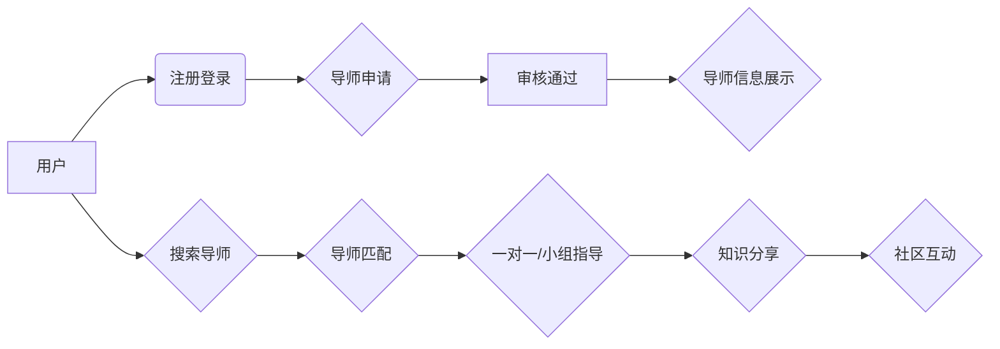

                 

## 技术mentoring：线上 的平台搭建与运营

> 关键词：技术mentoring, 在线平台, 社区建设, 知识共享, 人工智能, 匹配算法, 用户体验

## 1. 背景介绍

在当今数字化时代，知识和技能的获取变得越来越重要。技术领域更是如此，随着科技的飞速发展，新技术和新知识层出不穷，学习者需要不断更新自己的技能以保持竞争力。传统的线下技术培训模式面临着时间、地域和成本等方面的限制，而线上技术mentoring平台则 emerged 作为一种更灵活、高效、便捷的学习方式。

技术mentoring平台旨在连接技术领域的经验丰富的导师和渴望学习的新手，通过一对一或小组化的指导方式，帮助新手提升技术技能、解决学习难题、获得职业发展建议。这种模式能够提供更个性化的学习体验，并促进知识的共享和传播。

## 2. 核心概念与联系

**2.1 核心概念**

* **技术mentoring:** 指的是经验丰富的技术专家（导师）为技术新手提供一对一或小组化的指导和帮助，帮助他们提升技术技能、解决学习难题、获得职业发展建议。
* **线上平台:** 指的是搭建在互联网上的软件系统，用于连接导师和新手，提供沟通、学习和资源共享等功能。
* **社区建设:** 指的是围绕技术mentoring平台构建一个活跃的学习社区，鼓励用户之间进行交流、分享和协作。

**2.2 架构关系**



**2.3 核心联系**

技术mentoring平台的核心在于连接导师和新手，并提供一个高效、便捷的学习环境。平台需要具备以下核心功能：

* **用户注册和认证:** 确保平台用户真实有效。
* **导师信息展示:**  清晰展示导师的技能、经验、评价等信息，帮助用户选择合适的导师。
* **导师匹配算法:** 根据用户的需求和导师的技能进行匹配，提高指导效率。
* **沟通工具:** 提供多种沟通方式，例如文字聊天、语音通话、视频会议等，方便导师和新手进行交流。
* **学习资源共享:** 提供学习资料、代码示例、案例分析等资源，丰富用户的学习体验。
* **社区建设:** 鼓励用户之间进行交流、分享和协作，形成一个活跃的学习社区。

## 3. 核心算法原理 & 具体操作步骤

**3.1 算法原理概述**

导师匹配算法是技术mentoring平台的核心功能之一，其目的是根据用户的需求和导师的技能进行匹配，提高指导效率。常见的导师匹配算法包括：

* **基于规则的匹配:**  根据预设的规则，例如导师的技能、经验、评价等信息，进行匹配。
* **基于机器学习的匹配:** 利用机器学习算法，例如协同过滤、内容过滤等，根据用户的历史行为和导师的特征进行匹配。

**3.2 算法步骤详解**

以基于机器学习的匹配算法为例，其具体步骤如下：

1. **数据收集:** 收集用户和导师的各种信息，例如用户学习目标、导师技能、评价等。
2. **数据预处理:** 对收集到的数据进行清洗、转换和特征提取，以便于算法训练。
3. **模型训练:** 利用机器学习算法，例如协同过滤、内容过滤等，对用户和导师的数据进行训练，建立匹配模型。
4. **匹配预测:** 当用户提出匹配请求时，模型会根据用户的需求和导师的特征进行预测，推荐合适的导师。
5. **结果展示:** 将匹配结果展示给用户，并提供导师的详细信息供用户选择。

**3.3 算法优缺点**

* **优点:** 能够根据用户的具体需求进行匹配，提高匹配效率和准确率。
* **缺点:** 需要大量的训练数据，算法训练过程复杂，需要专业的技术人员进行维护。

**3.4 算法应用领域**

* **技术mentoring平台:** 匹配导师和新手，提高指导效率。
* **在线教育平台:** 匹配学生和老师，提高学习效果。
* **招聘平台:** 匹配求职者和招聘单位，提高招聘效率。

## 4. 数学模型和公式 & 详细讲解 & 举例说明

**4.1 数学模型构建**

基于协同过滤的导师匹配算法可以构建如下数学模型：

* **用户评分矩阵:**  $R \in R^{m \times n}$，其中m表示用户数量，n表示导师数量，$R_{ij}$表示用户i对导师j的评分。
* **隐向量模型:**  $U \in R^{m \times k}$，$V \in R^{n \times k}$，其中k表示隐向量的维度。$U_{i}$表示用户i的隐向量，$V_{j}$表示导师j的隐向量。

**4.2 公式推导过程**

目标函数为最小化用户评分与预测评分之间的误差:

$$
\min_{U,V} \frac{1}{2} \sum_{i=1}^{m} \sum_{j=1}^{n} (R_{ij} - U_{i} \cdot V_{j})^2
$$

使用梯度下降算法进行优化，更新隐向量:

$$
U_{i} = U_{i} - \alpha \frac{\partial}{\partial U_{i}} \sum_{j=1}^{n} (R_{ij} - U_{i} \cdot V_{j})^2
$$

$$
V_{j} = V_{j} - \alpha \frac{\partial}{\partial V_{j}} \sum_{i=1}^{m} (R_{ij} - U_{i} \cdot V_{j})^2
$$

其中$\alpha$为学习率。

**4.3 案例分析与讲解**

假设有一个技术mentoring平台，有100个用户和50个导师。用户对导师的评分数据如下：

```
R = [
    [5, 4, 3, ..., 2],
    [4, 5, 2, ..., 3],
    [3, 2, 4, ..., 1],
    ...,
    [2, 3, 1, ..., 5]
]
```

通过训练隐向量模型，可以得到每个用户和导师的隐向量表示。例如，用户1的隐向量为$U_1 = [0.8, 0.2, 0.1, ..., 0.5]$，导师1的隐向量为$V_1 = [0.6, 0.3, 0.1, ..., 0.4]$。

当用户1需要寻找导师时，可以根据$U_1$和$V_j$的内积进行匹配，选择与$U_1$最接近的导师。

## 5. 项目实践：代码实例和详细解释说明

**5.1 开发环境搭建**

* **操作系统:** Linux/macOS/Windows
* **编程语言:** Python
* **框架:** Flask/Django
* **数据库:** MySQL/PostgreSQL
* **工具:** Git、Docker

**5.2 源代码详细实现**

```python
# Flask 框架示例

from flask import Flask, render_template, request

app = Flask(__name__)

# 模拟用户和导师数据
users = [
    {'id': 1, 'name': '用户1', 'skills': ['Python', 'Java']},
    {'id': 2, 'name': '用户2', 'skills': ['C++', 'JavaScript']},
    # ...
]

mentors = [
    {'id': 1, 'name': '导师1', 'skills': ['Python', 'Machine Learning']},
    {'id': 2, 'name': '导师2', 'skills': ['Java', 'Web Development']},
    # ...
]

@app.route('/')
def index():
    return render_template('index.html')

@app.route('/search_mentor', methods=['POST'])
def search_mentor():
    user_skills = request.form.get('skills').split(',')
    matched_mentors = []
    for mentor in mentors:
        if any(skill in mentor['skills'] for skill in user_skills):
            matched_mentors.append(mentor)
    return render_template('results.html', mentors=matched_mentors)

if __name__ == '__main__':
    app.run(debug=True)
```

**5.3 代码解读与分析**

* **Flask 框架:** 使用 Flask 框架构建简单的 Web 应用。
* **用户和导师数据:** 模拟用户和导师数据，包含id、姓名和技能等信息。
* **搜索导师功能:** 提供一个搜索导师的功能，用户可以输入自己的技能需求，系统会根据技能匹配推荐合适的导师。
* **模板渲染:** 使用 Jinja2 模板引擎渲染 HTML 页面。

**5.4 运行结果展示**

运行代码后，访问 http://127.0.0.1:5000/，即可看到首页。点击搜索导师按钮，输入自己的技能需求，系统会根据技能匹配推荐合适的导师。

## 6. 实际应用场景

**6.1 在线教育平台**

技术mentoring平台可以集成到在线教育平台中，为学生提供一对一或小组化的技术指导，帮助他们更好地理解课程内容，解决学习难题。

**6.2 企业内部培训**

企业可以搭建内部技术mentoring平台，连接经验丰富的技术人员和新员工，帮助新员工快速融入团队，提升工作效率。

**6.3 开源社区**

开源社区可以利用技术mentoring平台，连接经验丰富的开发者和贡献者，促进开源项目的开发和维护。

**6.4 未来应用展望**

随着人工智能技术的不断发展，技术mentoring平台将更加智能化和个性化。例如，可以利用机器学习算法，根据用户的学习风格和需求，推荐更合适的导师和学习资源。

## 7. 工具和资源推荐

**7.1 学习资源推荐**

* **书籍:**
    * 《The Lean Startup》 by Eric Ries
    * 《Zero to One》 by Peter Thiel
    * 《The Innovator's Dilemma》 by Clayton M. Christensen
* **在线课程:**
    * Coursera
    * edX
    * Udacity

**7.2 开发工具推荐**

* **编程语言:** Python, JavaScript, Java
* **框架:** Flask, Django, React, Angular
* **数据库:** MySQL, PostgreSQL, MongoDB
* **云平台:** AWS, Azure, Google Cloud

**7.3 相关论文推荐**

* **协同过滤算法:**
    * "Collaborative Filtering: A User-Based Approach" by Goldberg et al. (1992)
    * "Item-Based Collaborative Filtering Recommendation Algorithms" by Sarwar et al. (2001)
* **机器学习算法:**
    * "Machine Learning: A Probabilistic Perspective" by Kevin P. Murphy (2012)
    * "Deep Learning" by Ian Goodfellow et al. (2016)

## 8. 总结：未来发展趋势与挑战

**8.1 研究成果总结**

技术mentoring平台已经取得了显著的成果，为技术学习和职业发展提供了新的途径。基于机器学习的导师匹配算法能够提高匹配效率和准确率，为用户提供更个性化的学习体验。

**8.2 未来发展趋势**

* **人工智能驱动:** 利用人工智能技术，例如自然语言处理、机器学习等，进一步智能化和个性化技术mentoring平台。
* **虚拟现实/增强现实:**  利用 VR/AR 技术，打造沉浸式的技术mentoring体验，例如虚拟实验室、模拟场景等。
* **跨语言支持:** 支持多种语言，打破语言障碍，促进全球技术交流和合作。

**8.3 面临的挑战**

* **数据质量:**  技术mentoring平台需要大量高质量的数据进行训练和维护，数据收集和清洗是一个挑战。
* **算法公平性:**  算法需要保证公平性和透明性，避免出现偏见和歧视。
* **用户隐私保护:**  需要妥善处理用户数据，保障用户隐私安全。

**8.4 研究展望**

未来，技术mentoring平台将朝着更加智能化、个性化、全球化的方向发展，为技术学习和职业发展提供更便捷、高效、优质的服务。


## 9. 附录：常见问题与解答

**9.1 如何选择合适的导师？**

* 了解导师的技能和经验，确保与你的学习目标相符。
* 阅读导师的评价和反馈，了解其他用户的体验。
* 与导师进行沟通，了解他们的教学风格和辅导方式。

**9.2 如何进行线上指导？**

* 利用平台提供的沟通工具，例如文字聊天、语音通话、视频会议等。
* 制定学习计划，明确学习目标和进度。
* 及时反馈学习情况，与导师进行沟通和交流。

**9.3 平台是否安全可靠？**

* 平台采用安全加密技术，保护用户数据安全。
* 平台拥有完善的审核机制，确保导师的真实性和可靠性。
* 平台提供用户反馈机制，及时处理用户问题和投诉。


作者：禅与计算机程序设计艺术 / Zen and the Art of Computer Programming 
<end_of_turn>

