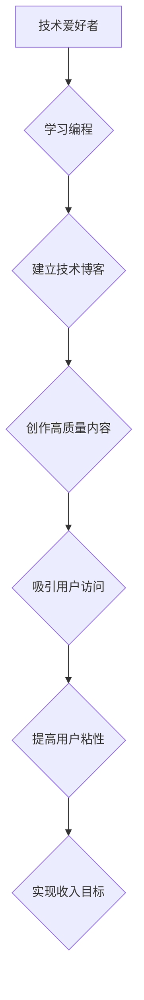

                 

## 技术博客：从爱好到主要收入来源

> 关键词：编程、软件开发、副业、开源、技术博客、收入来源、技术写作、技术社区

### 1. 背景介绍

在当今数字时代，技术日新月异，编程和软件开发已成为不可或缺的技能。越来越多的人开始学习编程，将其作为副业或甚至主要收入来源。技术博客作为一种分享知识、交流经验和展示技能的平台，为技术爱好者提供了展示自我、建立个人品牌和获得经济回报的机会。

### 2. 核心概念与联系

**2.1 技术博客的本质**

技术博客本质上是一种在线平台，用于发布技术相关的文章、代码、教程、评论和见解。它可以帮助技术人员记录学习过程、分享经验、建立个人品牌，并与其他技术爱好者进行交流。

**2.2 技术博客与收入来源的联系**

技术博客可以成为重要的收入来源，主要通过以下几种方式：

* **广告收入:** 通过在博客上展示广告，获得广告商支付的费用。
* **赞助文章:** 与相关公司合作，撰写赞助文章，获得报酬。
* **会员订阅:** 提供付费会员服务，例如独家内容、在线课程、社区论坛等。
* **电子书和课程销售:** 将博客文章或知识整理成电子书或在线课程，进行销售。
* **开源软件捐赠:** 开发开源软件并通过博客宣传，获得用户捐赠。

**2.3 技术博客的价值链**

技术博客的价值链可以概括为以下几个环节：

* **内容创作:** 撰写高质量的技术文章、代码、教程等内容。
* **平台建设:** 选择合适的博客平台，进行网站搭建和维护。
* **用户获取:** 通过搜索引擎优化、社交媒体推广等方式吸引用户访问博客。
* **用户粘性:** 提供优质的内容和互动体验，提高用户粘性。
* **变现模式:** 选择合适的变现模式，实现收入目标。

**2.4 Mermaid 流程图**



### 3. 核心算法原理 & 具体操作步骤

**3.1 算法原理概述**

技术博客的成功离不开算法的支撑。例如，搜索引擎优化 (SEO) 算法可以帮助博客在搜索结果中排名靠前，吸引更多用户访问。推荐算法可以根据用户的阅读历史和兴趣推荐相关内容，提高用户粘性。

**3.2 算法步骤详解**

* **SEO 算法:**

    1. **关键词研究:** 分析目标用户搜索的关键词，并将其融入博客文章标题、内容和元数据中。
    2. **内容优化:** 撰写高质量、原创、有价值的内容，并使用合适的标题、段落和图片等格式。
    3. **链接建设:** 构建高质量的外部链接和内部链接，提高博客的权威性和可信度。
    4. **网站结构优化:** 确保博客网站结构清晰、易于导航，并使用友好的用户界面。

* **推荐算法:**

    1. **用户数据收集:** 收集用户的阅读历史、点赞、评论等数据。
    2. **用户画像构建:** 根据用户数据，构建用户画像，分析用户的兴趣和偏好。
    3. **内容相似度计算:** 计算不同内容之间的相似度，例如主题、关键词、作者等。
    4. **推荐策略:** 根据用户的兴趣和内容相似度，制定推荐策略，推荐相关内容。

**3.3 算法优缺点**

* **SEO 算法:**

    * **优点:** 可以有效提高博客在搜索结果中的排名，吸引更多用户访问。
    * **缺点:** 需要持续投入时间和精力进行优化，算法规则不断变化，需要及时调整策略。

* **推荐算法:**

    * **优点:** 可以根据用户的兴趣推荐相关内容，提高用户粘性。
    * **缺点:** 需要收集和分析大量用户数据，算法需要不断迭代优化，避免推荐偏差。

**3.4 算法应用领域**

* **SEO 算法:** 应用于搜索引擎优化、网站排名、内容营销等领域。
* **推荐算法:** 应用于电商推荐、内容推荐、社交媒体推荐等领域。

### 4. 数学模型和公式 & 详细讲解 & 举例说明

**4.1 数学模型构建**

SEO 算法的数学模型可以概括为以下公式：

$$
Rank(Page) = \sum_{i=1}^{n} \frac{Weight(Link_i) * TF-IDF(Keyword_i)}{Number of Links}
$$

其中：

* $Rank(Page)$: 页面排名
* $Weight(Link_i)$: 链接的权重
* $TF-IDF(Keyword_i)$: 关键词的TF-IDF值
* $Number of Links$: 页面链接的数量

**4.2 公式推导过程**

该公式基于以下假设：

* 链接权重越高，页面排名越高。
* 关键词的TF-IDF值越高，页面排名越高。
* 页面链接数量越多，页面排名越低。

**4.3 案例分析与讲解**

假设有两个页面A和B，页面A拥有来自多个权威网站的链接，而页面B则来自一些小网站的链接。根据公式，页面A的排名会高于页面B，因为链接权重更高。

### 5. 项目实践：代码实例和详细解释说明

**5.1 开发环境搭建**

* 操作系统: Windows/macOS/Linux
* 代码编辑器: VS Code/Sublime Text/Atom
* 博客平台: WordPress/Ghost/Medium

**5.2 源代码详细实现**

以下是一个简单的Python代码示例，用于计算TF-IDF值:

```python
from sklearn.feature_extraction.text import TfidfVectorizer

# 文本数据
documents = [
    "This is the first document.",
    "This document is the second document.",
    "And this is the third one.",
    "Is this the first document?"
]

# 创建TF-IDF向量化器
vectorizer = TfidfVectorizer()

# 计算TF-IDF矩阵
tfidf_matrix = vectorizer.fit_transform(documents)

# 打印TF-IDF矩阵
print(tfidf_matrix.toarray())
```

**5.3 代码解读与分析**

该代码使用Scikit-learn库中的TfidfVectorizer类计算TF-IDF值。

* `fit_transform()`方法用于同时对文本数据进行拟合和转换，计算TF-IDF矩阵。
* `toarray()`方法将TF-IDF矩阵转换为NumPy数组，方便打印和分析。

**5.4 运行结果展示**

运行该代码后，会输出一个TF-IDF矩阵，其中每个元素代表一个文档中某个关键词的TF-IDF值。

### 6. 实际应用场景

技术博客可以应用于各种场景，例如：

* **个人品牌建设:** 技术人员可以通过博客分享自己的技术经验和见解，建立个人品牌，提升行业影响力。
* **知识传播:** 博客可以作为一种平台，传播技术知识，帮助其他人学习和成长。
* **社区建设:** 博客可以作为技术社区的中心，聚集技术爱好者，促进交流和合作。
* **商业推广:** 公司可以利用博客进行技术推广，宣传产品和服务。

**6.4 未来应用展望**

随着人工智能和区块链技术的不断发展，技术博客将迎来更多新的应用场景和发展方向。例如：

* **个性化内容推荐:** 利用人工智能算法，为用户推荐个性化的技术内容。
* **智能写作辅助:** 利用人工智能技术，辅助用户撰写高质量的技术文章。
* **去中心化技术社区:** 利用区块链技术，构建去中心化的技术社区，促进用户自主参与和贡献。

### 7. 工具和资源推荐

**7.1 学习资源推荐**

* **在线课程:** Coursera、Udemy、edX等平台提供丰富的技术课程。
* **技术博客:** Hacker News、Medium、Dev.to等平台汇聚了大量技术博客。
* **开源社区:** GitHub、Stack Overflow等平台提供开源代码和技术支持。

**7.2 开发工具推荐**

* **代码编辑器:** VS Code、Sublime Text、Atom等。
* **博客平台:** WordPress、Ghost、Medium等。
* **版本控制系统:** Git、GitHub等。

**7.3 相关论文推荐**

* **SEO 算法:**
    * PageRank: The Anatomy of a Large-Scale Hypertextual Web Search Engine
* **推荐算法:**
    * Collaborative Filtering for Implicit Feedback Datasets
    * Matrix Factorization Techniques for Recommender Systems

### 8. 总结：未来发展趋势与挑战

**8.1 研究成果总结**

技术博客已经成为技术人员分享知识、建立个人品牌和获得经济回报的重要平台。SEO 算法和推荐算法等技术为技术博客的发展提供了重要的支撑。

**8.2 未来发展趋势**

未来，技术博客将更加个性化、智能化和去中心化。人工智能和区块链技术将推动技术博客的发展，带来更多新的应用场景和发展方向。

**8.3 面临的挑战**

技术博客的发展也面临着一些挑战，例如：

* **内容质量竞争:** 技术博客内容竞争日益激烈，需要不断提升内容质量和原创性。
* **用户粘性维护:** 需要不断创新内容形式和互动方式，提高用户粘性。
* **变现模式探索:** 需要探索新的变现模式，实现可持续发展。

**8.4 研究展望**

未来研究方向包括：

* **个性化内容推荐算法:** 开发更精准、更个性化的内容推荐算法。
* **智能写作辅助工具:** 开发更智能、更便捷的写作辅助工具。
* **去中心化技术社区建设:** 研究构建去中心化技术社区的机制和技术方案。

### 9. 附录：常见问题与解答

**9.1 如何选择合适的博客平台？**

选择博客平台需要根据自己的需求和技术水平进行考虑。

* **WordPress:** 功能强大、可定制性强，适合技术人员和企业使用。
* **Ghost:** 轻量级、易于使用，适合个人博客和小型团队使用。
* **Medium:** 平台自带流量，适合初学者和内容创作者使用。

**9.2 如何提高博客的排名？**

提高博客排名需要进行SEO优化，包括关键词研究、内容优化、链接建设等。

**9.3 如何获得博客收入？**

博客收入可以通过广告收入、赞助文章、会员订阅、电子书和课程销售等方式获得。


作者：禅与计算机程序设计艺术 / Zen and the Art of Computer Programming 
<end_of_turn>

