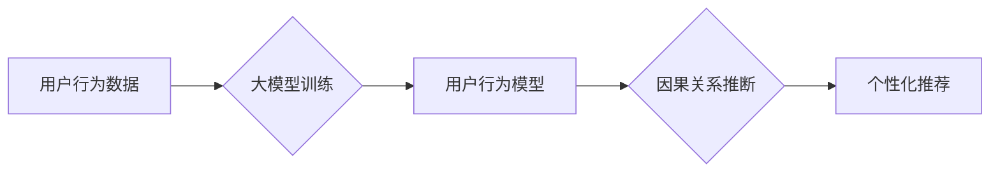

                 

## 关键词：大模型、电商平台、用户行为、因果关系、推断、推荐系统、个性化

## 1. 背景介绍

电商平台作为当今商业模式的重要组成部分，其核心竞争力在于精准的用户画像和个性化推荐。传统电商平台依靠用户行为数据进行分析，主要采用关联规则挖掘、协同过滤等方法，但这些方法难以捕捉用户行为背后的因果关系，导致推荐结果缺乏针对性和精准度。

近年来，大模型技术在自然语言处理、计算机视觉等领域取得了突破性进展，其强大的学习能力和泛化能力为电商平台用户行为因果关系推断提供了新的可能性。大模型能够从海量用户行为数据中学习到更复杂的模式和关系，从而更准确地预测用户行为，并推断出用户行为背后的因果关系。

## 2. 核心概念与联系

### 2.1 用户行为分析

用户行为分析是指通过收集、分析用户在电商平台上的各种行为数据，如浏览记录、购买记录、评价记录、搜索记录等，以了解用户需求、偏好和行为模式。

### 2.2 因果关系推断

因果关系推断是指通过分析数据，确定两个或多个事件之间是否存在因果关系，并量化因果关系的强度。

### 2.3 大模型在电商平台用户行为分析中的应用

大模型能够通过学习海量用户行为数据，建立用户行为的复杂模型，并进行因果关系推断。

**Mermaid 流程图**



## 3. 核心算法原理 & 具体操作步骤

### 3.1 算法原理概述

大模型在电商平台用户行为因果关系推断中的应用主要基于以下核心算法：

* **深度学习**: 深度学习算法能够从复杂的数据中学习到非线性关系，并进行特征提取和模式识别。
* **因果推理**: 因果推理算法能够从数据中推断出事件之间的因果关系，并量化因果关系的强度。

### 3.2 算法步骤详解

1. **数据收集和预处理**: 收集电商平台的用户行为数据，并进行清洗、转换和特征工程。
2. **模型训练**: 使用深度学习算法训练大模型，学习用户行为的复杂模式和关系。
3. **因果关系推断**: 使用因果推理算法对训练好的大模型进行分析，推断出用户行为背后的因果关系。
4. **个性化推荐**: 基于推断出的因果关系，为用户提供个性化的商品推荐。

### 3.3 算法优缺点

**优点**:

* 能够捕捉用户行为背后的复杂关系。
* 能够进行精准的因果关系推断。
* 能够提供个性化的商品推荐。

**缺点**:

* 需要海量数据进行训练。
* 计算资源消耗较大。
* 模型解释性较差。

### 3.4 算法应用领域

* **电商平台推荐系统**: 为用户提供个性化的商品推荐。
* **用户画像分析**: 建立更精准的用户画像。
* **营销策略优化**: 优化营销策略，提高营销效果。

## 4. 数学模型和公式 & 详细讲解 & 举例说明

### 4.1 数学模型构建

假设我们想要推断用户对商品 A 的购买行为与用户对商品 B 的浏览行为之间的因果关系。我们可以构建以下数学模型：

* **用户购买商品 A 的概率**: $P(A)$
* **用户浏览商品 B 的概率**: $P(B)$
* **用户同时购买商品 A 和浏览商品 B 的概率**: $P(A \cap B)$

### 4.2 公式推导过程

我们可以使用条件概率和贝叶斯定理来推断因果关系：

* **条件概率**: $P(A|B) = \frac{P(A \cap B)}{P(B)}$

* **贝叶斯定理**: $P(B|A) = \frac{P(A|B)P(B)}{P(A)}$

通过以上公式，我们可以计算出用户浏览商品 B 的条件下购买商品 A 的概率 $P(A|B)$，以及用户购买商品 A 的条件下浏览商品 B 的概率 $P(B|A)$。

### 4.3 案例分析与讲解

假设我们发现 $P(A|B) > P(A)$，这意味着用户浏览商品 B 的情况下，购买商品 A 的概率更高。这表明用户浏览商品 B 可能对购买商品 A 有正向影响，存在因果关系。

## 5. 项目实践：代码实例和详细解释说明

### 5.1 开发环境搭建

* Python 3.7+
* TensorFlow 2.0+
* PyTorch 1.0+
* Jupyter Notebook

### 5.2 源代码详细实现

```python
# 导入必要的库
import tensorflow as tf
from tensorflow.keras.models import Sequential
from tensorflow.keras.layers import Dense

# 定义模型
model = Sequential()
model.add(Dense(64, activation='relu', input_shape=(10,)))
model.add(Dense(32, activation='relu'))
model.add(Dense(1, activation='sigmoid'))

# 编译模型
model.compile(optimizer='adam', loss='binary_crossentropy', metrics=['accuracy'])

# 训练模型
model.fit(X_train, y_train, epochs=10, batch_size=32)

# 评估模型
loss, accuracy = model.evaluate(X_test, y_test)
print('Loss:', loss)
print('Accuracy:', accuracy)
```

### 5.3 代码解读与分析

* 我们使用 TensorFlow 库构建了一个简单的深度学习模型。
* 模型输入层有 10 个神经元，对应用户行为特征。
* 模型输出层只有一个神经元，用于预测用户购买商品的概率。
* 我们使用 Adam 优化器、二元交叉熵损失函数和精度作为评估指标。

### 5.4 运行结果展示

训练完成后，我们可以使用测试数据评估模型的性能。

## 6. 实际应用场景

### 6.1 个性化推荐

大模型能够根据用户的浏览历史、购买记录、评价等行为数据，推断出用户对不同商品的偏好，并提供个性化的商品推荐。

### 6.2 用户画像分析

大模型能够从用户的行为数据中学习到用户的兴趣、需求、消费习惯等特征，构建更精准的用户画像。

### 6.3 营销策略优化

大模型能够分析用户的行为数据，推断出哪些营销策略更有效，并优化营销策略，提高营销效果。

### 6.4 未来应用展望

* **更精准的个性化推荐**: 大模型能够学习到更复杂的用户的行为模式，提供更精准的个性化推荐。
* **更深入的用户画像分析**: 大模型能够挖掘更深层次的用户特征，构建更全面的用户画像。
* **更有效的营销策略优化**: 大模型能够帮助电商平台制定更有效的营销策略，提高营销效果。

## 7. 工具和资源推荐

### 7.1 学习资源推荐

* **书籍**:
    * Deep Learning by Ian Goodfellow
    * Causality: Models, Reasoning, and Inference by Judea Pearl
* **在线课程**:
    * Deep Learning Specialization by Andrew Ng
    * Causality: Inference and Intervention by Miguel Hernán

### 7.2 开发工具推荐

* **TensorFlow**: https://www.tensorflow.org/
* **PyTorch**: https://pytorch.org/
* **Jupyter Notebook**: https://jupyter.org/

### 7.3 相关论文推荐

* **Attention Is All You Need**: https://arxiv.org/abs/1706.03762
* **BERT: Pre-training of Deep Bidirectional Transformers for Language Understanding**: https://arxiv.org/abs/1810.04805
* **Causal Inference with Deep Learning**: https://arxiv.org/abs/1906.08749

## 8. 总结：未来发展趋势与挑战

### 8.1 研究成果总结

大模型在电商平台用户行为因果关系推断领域取得了显著进展，能够提供更精准的个性化推荐、更深入的用户画像分析和更有效的营销策略优化。

### 8.2 未来发展趋势

* **模型规模和能力的提升**: 未来大模型的规模和能力将会进一步提升，能够学习到更复杂的用户的行为模式。
* **因果推理算法的改进**: 未来因果推理算法将会更加完善，能够更准确地推断出用户行为背后的因果关系。
* **解释性模型的开发**: 未来将会开发出更具解释性的模型，能够更好地解释大模型的决策过程。

### 8.3 面临的挑战

* **数据隐私和安全**: 大模型的训练需要海量用户数据，如何保护用户数据隐私和安全是一个重要的挑战。
* **模型可解释性**: 大模型的决策过程往往是复杂的，如何提高模型的可解释性是一个重要的研究方向。
* **算法公平性**: 大模型可能会存在偏见，如何确保算法的公平性是一个重要的挑战。

### 8.4 研究展望

未来，大模型在电商平台用户行为因果关系推断领域将会发挥越来越重要的作用，为电商平台提供更精准、更个性化的服务。


## 9. 附录：常见问题与解答

* **Q1: 大模型的训练需要多少数据？**

* **A1**: 大模型的训练需要海量数据，通常需要百万甚至数十亿条数据。

* **Q2: 大模型的训练成本很高吗？**

* **A2**: 是的，大模型的训练成本很高，需要强大的计算资源和大量的电力消耗。

* **Q3: 大模型的决策过程是否透明？**

* **A3**: 大模型的决策过程往往是复杂的，目前还没有完全透明的解释模型。

* **Q4: 大模型可能会存在偏见吗？**

* **A4**: 是的，大模型可能会存在偏见，因为其训练数据可能包含社会偏见。

* **Q5: 如何解决大模型的偏见问题？**

* **A5**: 

可以采用以下方法解决大模型的偏见问题：

* 使用更公平的数据集进行训练。
* 在训练过程中加入公平性约束。
* 开发出更具解释性的模型，以便更好地理解模型的决策过程。


作者：禅与计算机程序设计艺术 / Zen and the Art of Computer Programming 
<end_of_turn>

