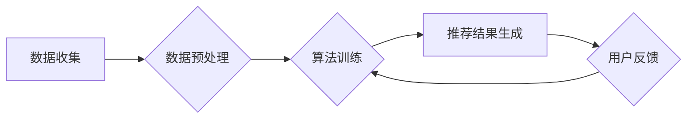

                 

## 推荐系统中的公平性与偏见消除

> 关键词：推荐系统、公平性、偏见、算法、数据、模型、评估、缓解

### 1. 背景介绍

推荐系统作为现代互联网的重要组成部分，广泛应用于电商、社交媒体、音乐流媒体等领域，为用户提供个性化服务，提升用户体验。然而，随着推荐系统的规模和复杂度不断提升，其潜在的公平性问题也日益凸显。

推荐系统中的公平性问题是指推荐结果可能存在对特定用户群体的歧视或偏袒，导致不同用户群体获得不平等的推荐体验。这种偏见可能源于多种因素，包括：

* **数据偏差:** 训练推荐系统的原始数据可能本身就存在偏见，例如性别、种族、地域等方面的代表性不足，导致模型学习到这些偏见。
* **算法设计:** 一些推荐算法的设计本身就可能导致公平性问题，例如基于用户的协同过滤算法，如果用户数据分布不均匀，可能会导致某些用户群体获得更少的推荐机会。
* **反馈机制:** 推荐系统的反馈机制，例如用户点击、评分等，也可能存在偏见，例如某些用户群体更倾向于点击或评分某些类型的推荐，导致模型偏向推荐这类内容。

这些公平性问题不仅会损害用户的体验，还会加剧社会分化，甚至可能导致歧视和不公正的现象。因此，消除推荐系统中的公平性问题，构建更加公平、公正的推荐系统，是当前研究的重要课题。

### 2. 核心概念与联系

**2.1  公平性与偏见**

* **公平性:** 指推荐系统对所有用户群体提供平等的机会和体验，不进行任何歧视或偏袒。
* **偏见:** 指推荐系统在推荐结果中对特定用户群体进行歧视或偏袒，导致不同用户群体获得不平等的推荐体验。

**2.2  推荐系统中的公平性问题类型**

* **识别偏见:** 识别推荐系统中是否存在对特定用户群体的歧视或偏袒。
* **衡量公平性:** 使用定量指标来衡量推荐系统的公平性，例如均等机会、公平性损失等。
* **缓解偏见:** 设计和开发算法和技术来减少或消除推荐系统中的偏见。

**2.3  公平性与推荐算法的关系**

推荐算法是推荐系统的核心，其设计和实现直接影响推荐系统的公平性。一些常见的推荐算法，例如协同过滤、内容过滤、基于知识的推荐等，都可能存在公平性问题。

**2.4  公平性与数据的关系**

推荐系统的训练数据是算法学习的基础，数据中的偏差会直接影响推荐结果的公平性。因此，确保训练数据的质量和代表性至关重要。

**Mermaid 流程图**



### 3. 核心算法原理 & 具体操作步骤

**3.1  算法原理概述**

为了缓解推荐系统中的公平性问题，研究者们提出了多种算法和技术，例如：

* **公平性约束优化:** 在推荐算法的优化目标中加入公平性约束，例如最大化所有用户群体的推荐质量，或者最小化不同用户群体之间推荐质量的差距。
* **对抗训练:** 使用对抗样本训练推荐模型，使得模型能够识别和抵抗数据中的偏见。
* **群体公平性算法:** 设计专门针对群体公平性的推荐算法，例如基于群体特征的推荐算法，或者基于群体平衡的推荐算法。

**3.2  算法步骤详解**

以公平性约束优化为例，其具体操作步骤如下：

1. **定义公平性指标:** 选择合适的公平性指标来衡量推荐系统的公平性，例如均等机会、公平性损失等。
2. **构建优化目标:** 将公平性指标纳入推荐算法的优化目标中，例如最大化所有用户群体的推荐质量，或者最小化不同用户群体之间推荐质量的差距。
3. **训练推荐模型:** 使用优化目标训练推荐模型，使得模型能够在满足公平性约束的同时，尽可能提高推荐质量。
4. **评估公平性:** 使用选择的公平性指标评估推荐系统的公平性，并根据评估结果进行调整和优化。

**3.3  算法优缺点**

* **优点:** 可以有效地缓解推荐系统中的公平性问题，提高推荐系统的公平性。
* **缺点:** 需要选择合适的公平性指标和优化目标，并且需要对算法进行调整和优化，才能达到最佳效果。

**3.4  算法应用领域**

* **电商推荐:** 避免对特定用户群体进行歧视性推荐，例如性别、年龄、收入等方面的偏见。
* **社交媒体推荐:** 避免对特定用户群体进行过滤或屏蔽，例如政治观点、宗教信仰等方面的偏见。
* **教育推荐:** 避免对特定用户群体进行不公平的资源分配，例如学习能力、经济条件等方面的偏见。

### 4. 数学模型和公式 & 详细讲解 & 举例说明

**4.1  数学模型构建**

假设我们有一个推荐系统，包含 $N$ 个用户和 $M$ 个物品。每个用户 $u$ 对每个物品 $i$ 的评分用 $r_{ui}$ 表示。我们的目标是构建一个推荐模型，能够预测用户 $u$ 对物品 $i$ 的评分。

我们可以使用以下数学模型来表示推荐系统的公平性问题：

$$
\text{公平性损失} = \sum_{u \in U} \sum_{i \in I} \left| r_{ui} - \hat{r}_{ui} \right|
$$

其中，$\hat{r}_{ui}$ 是推荐模型预测的用户 $u$ 对物品 $i$ 的评分。

**4.2  公式推导过程**

公平性损失的计算方法是将所有用户对所有物品的评分与推荐模型预测的评分之间的绝对差值进行求和。

**4.3  案例分析与讲解**

假设我们有一个推荐系统，用于推荐电影给用户。我们发现，该推荐系统对女性用户推荐的电影类型偏向于爱情片，而对男性用户推荐的电影类型偏向于动作片。

我们可以使用公平性损失来衡量该推荐系统的公平性问题。如果女性用户对爱情片的评分较高，而男性用户对动作片的评分较高，那么公平性损失将会较高。

### 5. 项目实践：代码实例和详细解释说明

**5.1  开发环境搭建**

* Python 3.x
* TensorFlow 或 PyTorch
* Jupyter Notebook

**5.2  源代码详细实现**

```python
import tensorflow as tf

# 定义公平性约束
def fairness_loss(y_true, y_pred):
  # 计算公平性损失
  return tf.reduce_mean(tf.abs(y_true - y_pred))

# 定义推荐模型
model = tf.keras.Sequential([
  tf.keras.layers.Dense(64, activation='relu'),
  tf.keras.layers.Dense(16, activation='relu'),
  tf.keras.layers.Dense(1)
])

# 编译模型
model.compile(optimizer='adam', loss=fairness_loss)

# 训练模型
model.fit(X_train, y_train, epochs=10)

# 评估模型
loss = model.evaluate(X_test, y_test)
print('Loss:', loss)
```

**5.3  代码解读与分析**

* `fairness_loss` 函数定义了公平性损失函数，计算了真实评分与预测评分之间的绝对差值。
* `model` 定义了推荐模型，使用多层感知机 (MLP) 作为示例。
* `model.compile` 方法编译了模型，指定了优化器、损失函数和指标。
* `model.fit` 方法训练了模型，使用训练数据进行训练。
* `model.evaluate` 方法评估了模型，使用测试数据计算损失值。

**5.4  运行结果展示**

运行代码后，会输出模型的损失值。损失值越低，模型的公平性越好。

### 6. 实际应用场景

**6.1  电商推荐**

* 避免对特定用户群体进行歧视性推荐，例如性别、年龄、收入等方面的偏见。
* 确保所有用户都能获得公平的机会，例如推荐商品的种类、价格等方面。

**6.2  社交媒体推荐**

* 避免对特定用户群体进行过滤或屏蔽，例如政治观点、宗教信仰等方面的偏见。
* 确保所有用户都能获得公平的推荐内容，例如新闻、视频、帖子等方面。

**6.3  教育推荐**

* 避免对特定用户群体进行不公平的资源分配，例如学习能力、经济条件等方面的偏见。
* 确保所有用户都能获得公平的学习机会，例如推荐课程、学习资料等方面。

**6.4  未来应用展望**

随着人工智能技术的不断发展，推荐系统中的公平性问题将得到越来越多的关注。未来，我们将看到更多针对公平性问题的算法和技术被开发出来，使得推荐系统更加公平、公正。

### 7. 工具和资源推荐

**7.1  学习资源推荐**

* **书籍:**

    * Fairness in Machine Learning by  Marco Tulio Ribeiro, Sameer Singh, and Carlos Guestrin
    * Algorithmic Fairness by  Virginia Eubanks

* **论文:**

    * On the Dangers of Stochastic Parrots: Can Language Models Be Too Big?
    * Mitigating Bias in Machine Learning

* **在线课程:**

    * Fairness in Machine Learning by Stanford University
    * Algorithmic Fairness by Google AI

**7.2  开发工具推荐**

* **TensorFlow:** 开源机器学习框架，支持公平性约束优化等算法。
* **PyTorch:** 开源机器学习框架，支持公平性约束优化等算法。
* **Scikit-learn:** Python机器学习库，提供一些公平性评估指标。

**7.3  相关论文推荐**

* **Fairness through Awareness**
* **A Survey on Fairness in Machine Learning**
* **Towards a Rigorous Science of Algorithmic Fairness**

### 8. 总结：未来发展趋势与挑战

**8.1  研究成果总结**

近年来，在推荐系统公平性领域取得了显著进展，包括：

* 提出了一系列公平性指标和评估方法。
* 开发了多种公平性约束优化算法和技术。
* 对推荐系统公平性问题进行了深入的理论研究。

**8.2  未来发展趋势**

* **更加细粒度的公平性分析:** 

    研究更细粒度的公平性问题，例如不同用户群体的不同需求和偏好。
* **更有效的公平性缓解方法:** 

    开发更有效的公平性缓解方法，例如对抗训练、群体公平性算法等。
* **公平性可解释性:** 

    提高推荐系统公平性的可解释性，使得用户能够理解推荐结果背后的公平性机制。

**8.3  面临的挑战**

* **数据偏差:** 

    推荐系统训练数据中的偏差是导致公平性问题的根源，如何获取更加公平、代表性的数据是一个挑战。
* **公平性定义:** 

    公平性的定义本身就存在争议，如何制定一个通用的公平性标准是一个难题。
* **公平性与效率的权衡:** 

    一些公平性缓解方法可能会降低推荐系统的效率，如何平衡公平性和效率是一个需要解决的问题。

**8.4  研究展望**

未来，我们将继续致力于研究推荐系统中的公平性问题，开发更加公平、公正的推荐系统，为用户提供更加优质的体验。

### 9. 附录：常见问题与解答

**9.1  什么是公平性？**

公平性是指推荐系统对所有用户群体提供平等的机会和体验，不进行任何歧视或偏袒。

**9.2  如何衡量推荐系统的公平性？**

可以使用多种公平性指标来衡量推荐系统的公平性，例如均等机会、公平性损失等。

**9.3  如何缓解推荐系统中的公平性问题？**

可以使用多种算法和技术来缓解推荐系统中的公平性问题，例如公平性约束优化、对抗训练、群体公平性算法等。


作者：禅与计算机程序设计艺术 / Zen and the Art of Computer Programming 
<end_of_turn>

