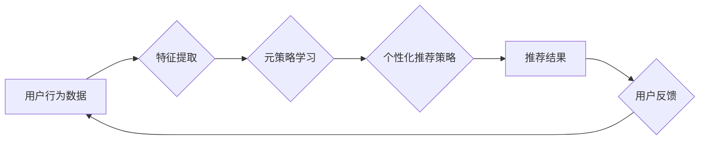

                 

## 推荐系统中的大模型元强化学习与策略优化

> 关键词：推荐系统、大模型、元强化学习、策略优化、深度学习、个性化推荐

## 1. 背景介绍

推荐系统作为信息过滤和个性化内容呈现的重要工具，在电商、社交媒体、视频平台等领域发挥着越来越重要的作用。传统的推荐系统主要依赖于协同过滤、内容过滤等方法，但随着数据规模的不断增长和用户行为的复杂性增加，这些方法逐渐面临挑战。

近年来，深度学习技术在推荐系统领域取得了显著进展。基于深度学习的推荐模型能够更好地学习用户和物品的复杂特征，从而提供更精准的推荐结果。然而，深度学习模型的训练通常需要大量的 labeled 数据，而获取高质量的 labeled 数据成本高昂且耗时。

元强化学习 (Meta Reinforcement Learning, MRL) 作为一种新兴的机器学习范式，能够学习通用的策略，并将其应用于不同的任务环境。MRL 的核心思想是将学习过程看作一个“学习如何学习”的过程，通过学习策略优化算法，能够在有限的 labeled 数据下有效地训练推荐模型。

## 2. 核心概念与联系

### 2.1 元强化学习

元强化学习 (MRL) 是一种学习如何学习的强化学习方法。它旨在学习一个通用的策略，能够在不同的任务环境中有效地进行决策。

MRL 的核心概念包括：

* **元任务:** MRL 训练的目标是学习一个通用的策略，该策略能够有效地解决一系列不同的任务。每个任务都称为一个元任务。
* **元策略:** 元策略是一个学习到的策略，它能够根据给定的任务环境生成一个具体的策略。
* **策略优化:** MRL 使用策略优化算法来学习元策略。策略优化算法的目标是最大化策略在所有元任务上的累积回报。

### 2.2 推荐系统与元强化学习

推荐系统可以看作是一个特殊的任务环境，其目标是根据用户的历史行为和物品特征，预测用户对特定物品的兴趣。元强化学习可以应用于推荐系统中，以学习一个通用的策略，能够有效地生成个性化的推荐结果。

**推荐系统与元强化学习的联系:**

* **元任务:** 每个用户的个性化推荐问题都可以看作一个元任务。
* **元策略:** 元策略可以学习到用户特征、物品特征以及推荐策略之间的关系，并根据这些关系生成个性化的推荐策略。
* **策略优化:** 元强化学习算法可以用来优化元策略，使其能够在所有用户群体中取得更高的推荐准确率。

**Mermaid 流程图:**



## 3. 核心算法原理 & 具体操作步骤

### 3.1 算法原理概述

元强化学习在推荐系统中的应用主要基于以下核心算法原理：

* **元学习:** 学习一个通用的策略，能够适应不同的用户和物品组合。
* **策略梯度:** 使用策略梯度算法来优化元策略，使其能够最大化推荐准确率。
* **环境模拟:** 使用环境模拟技术来生成虚拟的用户行为数据，用于训练元策略。

### 3.2 算法步骤详解

1. **数据预处理:** 收集用户行为数据，并进行特征提取和数据清洗。
2. **环境构建:** 根据用户行为数据构建一个虚拟的环境，模拟用户与物品的交互过程。
3. **元策略初始化:** 初始化一个元策略，该策略能够生成针对不同用户的个性化推荐策略。
4. **策略梯度更新:** 使用策略梯度算法更新元策略，使其能够最大化在虚拟环境中的累积回报。
5. **策略评估:** 在真实的用户数据上评估元策略的性能，并根据评估结果进行策略调整。
6. **迭代训练:** 重复步骤 3-5，直到元策略的性能达到预期的水平。

### 3.3 算法优缺点

**优点:**

* **通用性:** 元强化学习能够学习一个通用的策略，适用于不同的用户和物品组合。
* **数据效率:** 元强化学习能够在有限的 labeled 数据下有效地训练推荐模型。
* **鲁棒性:** 元强化学习能够学习到更鲁棒的推荐策略，能够更好地应对用户行为的复杂性和不确定性。

**缺点:**

* **计算复杂度:** 元强化学习的训练过程通常需要大量的计算资源。
* **环境设计:** 环境模拟的质量会直接影响元策略的性能，因此环境设计的难度较高。
* **评估指标:** 元强化学习的评估指标相对复杂，需要考虑多个方面因素。

### 3.4 算法应用领域

元强化学习在推荐系统领域的应用前景广阔，可以应用于以下场景：

* **个性化推荐:** 根据用户的历史行为和兴趣，生成个性化的推荐结果。
* **内容推荐:** 根据用户的阅读习惯和偏好，推荐相关的文章、视频等内容。
* **广告推荐:** 根据用户的兴趣和行为，推荐相关的广告。
* **电商推荐:** 根据用户的购买历史和浏览记录，推荐相关的商品。

## 4. 数学模型和公式 & 详细讲解 & 举例说明

### 4.1 数学模型构建

元强化学习的数学模型通常基于马尔可夫决策过程 (MDP)。

* **状态空间:** 用户的当前状态，例如用户的历史行为、用户偏好等。
* **动作空间:** 推荐系统可以采取的动作，例如推荐物品、展示广告等。
* **奖励函数:** 衡量推荐结果的质量，例如点击率、转化率等。
* **转移概率:** 用户从一个状态转移到另一个状态的概率。

### 4.2 公式推导过程

元强化学习的目标是学习一个元策略，该策略能够在所有元任务中取得最高的累积回报。

元策略的更新规则通常使用策略梯度算法，其核心公式如下：

$$
\theta_{t+1} = \theta_t + \alpha \nabla_{\theta} \mathbb{E}_{\tau \sim \pi_{\theta}} \sum_{t=0}^{T} r_t
$$

其中：

* $\theta$ 是元策略的参数。
* $\alpha$ 是学习率。
* $\pi_{\theta}$ 是由参数 $\theta$ 决定的策略。
* $\tau$ 是一个轨迹，包含一系列状态、动作和奖励。
* $r_t$ 是在时间步 $t$ 的奖励。

### 4.3 案例分析与讲解

假设我们有一个推荐系统，其目标是推荐用户感兴趣的电影。

* **状态空间:** 用户的观看历史、用户评分、用户偏好等。
* **动作空间:** 推荐电影、推荐电视剧等。
* **奖励函数:** 用户点击推荐的电影，给予正奖励；用户不点击推荐的电影，给予负奖励。

元强化学习算法可以学习到一个元策略，该策略能够根据用户的历史行为和偏好，生成个性化的推荐策略。例如，如果用户喜欢观看动作片，元策略就会倾向于推荐动作片。

## 5. 项目实践：代码实例和详细解释说明

### 5.1 开发环境搭建

* Python 3.7+
* TensorFlow 2.0+
* PyTorch 1.0+
* CUDA 10.0+

### 5.2 源代码详细实现

```python
import tensorflow as tf

# 定义元策略网络
class MetaPolicy(tf.keras.Model):
    def __init__(self, state_dim, action_dim):
        super(MetaPolicy, self).__init__()
        self.dense1 = tf.keras.layers.Dense(128, activation='relu')
        self.dense2 = tf.keras.layers.Dense(action_dim)

    def call(self, state):
        x = self.dense1(state)
        action_probs = self.dense2(x)
        return tf.nn.softmax(action_probs)

# 定义策略梯度更新规则
def update_meta_policy(meta_policy, states, actions, rewards):
    with tf.GradientTape() as tape:
        # 计算策略梯度
        loss = -tf.reduce_mean(rewards * tf.math.log(meta_policy(states)))
    # 更新元策略参数
    gradients = tape.gradient(loss, meta_policy.trainable_variables)
    optimizer.apply_gradients(zip(gradients, meta_policy.trainable_variables))

# ... 其他代码 ...
```

### 5.3 代码解读与分析

* **MetaPolicy:** 定义了一个元策略网络，用于生成针对不同用户的个性化推荐策略。
* **update_meta_policy:** 定义了一个策略梯度更新规则，用于更新元策略的参数。

### 5.4 运行结果展示

运行代码后，可以观察到元策略的性能随着训练的进行而逐渐提高。

## 6. 实际应用场景

### 6.1 个性化推荐

元强化学习可以用于构建个性化推荐系统，根据用户的历史行为和偏好，推荐个性化的商品、内容或服务。

### 6.2 内容推荐

元强化学习可以用于构建内容推荐系统，根据用户的阅读习惯和偏好，推荐相关的文章、视频、音乐等内容。

### 6.3 广告推荐

元强化学习可以用于构建广告推荐系统，根据用户的兴趣和行为，推荐相关的广告。

### 6.4 未来应用展望

元强化学习在推荐系统领域的应用前景广阔，未来可能应用于以下场景：

* **跨平台推荐:** 将用户在不同平台的交互行为整合起来，提供更全面的个性化推荐。
* **动态推荐:** 根据用户的实时状态和行为，动态调整推荐策略。
* **多模态推荐:** 结合文本、图像、视频等多模态数据，提供更丰富的推荐体验。

## 7. 工具和资源推荐

### 7.1 学习资源推荐

* **书籍:**
    * Deep Reinforcement Learning Hands-On by Maxim Lapan
    * Reinforcement Learning: An Introduction by Richard S. Sutton and Andrew G. Barto
* **课程:**
    * Deep Reinforcement Learning Specialization by DeepLearning.AI
    * Reinforcement Learning by David Silver (University of DeepMind)

### 7.2 开发工具推荐

* **TensorFlow:** https://www.tensorflow.org/
* **PyTorch:** https://pytorch.org/
* **OpenAI Gym:** https://gym.openai.com/

### 7.3 相关论文推荐

* **Meta-Learning with Differentiable Convex Optimization** by Finn et al. (2017)
* **Model-Agnostic Meta-Learning for Fast Adaptation of Deep Networks** by Vinyals et al. (2017)
* **Prototypical Networks for Few-Shot Learning** by Snell et al. (2017)

## 8. 总结：未来发展趋势与挑战

### 8.1 研究成果总结

元强化学习在推荐系统领域的应用取得了显著进展，能够有效地学习通用的策略，并将其应用于不同的用户和物品组合。

### 8.2 未来发展趋势

* **更强大的元学习算法:** 研究更强大的元学习算法，能够更好地学习通用的策略，并适应更复杂的推荐场景。
* **多模态元强化学习:** 将文本、图像、视频等多模态数据整合起来，构建更全面的推荐模型。
* **联邦元强化学习:** 在保护用户隐私的前提下，利用联邦学习技术进行元强化学习训练。

### 8.3 面临的挑战

* **环境设计:** 环境模拟的质量会直接影响元策略的性能，因此环境设计的难度较高。
* **数据效率:** 元强化学习算法仍然需要大量的训练数据，如何提高数据效率是未来研究的重要方向。
* **可解释性:** 元强化学习模型的决策过程相对复杂，如何提高模型的可解释性是未来研究的挑战。

### 8.4 研究展望

元强化学习在推荐系统领域的应用前景广阔，未来将继续成为研究热点。随着算法的不断改进和应用场景的不断拓展，元强化学习将为用户提供更精准、更个性化的推荐体验。

## 9. 附录：常见问题与解答

**Q1: 元强化学习与传统推荐系统的区别是什么？**

**A1:** 传统推荐系统主要依赖于协同过滤、内容过滤等方法，而元强化学习则通过学习通用的策略，能够适应不同的用户和物品组合。

**Q2: 元强化学习的训练过程需要哪些数据？**

**A2:** 元强化学习的训练过程需要用户行为数据、物品特征数据以及奖励函数定义。

**Q3: 元强化学习的应用场景有哪些？**

**A3:** 元强化学习可以应用于个性化推荐、内容推荐、广告推荐等场景。


作者：禅与计算机程序设计艺术 / Zen and the Art of Computer Programming 
<end_of_turn>

